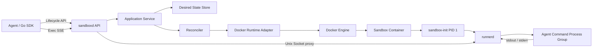
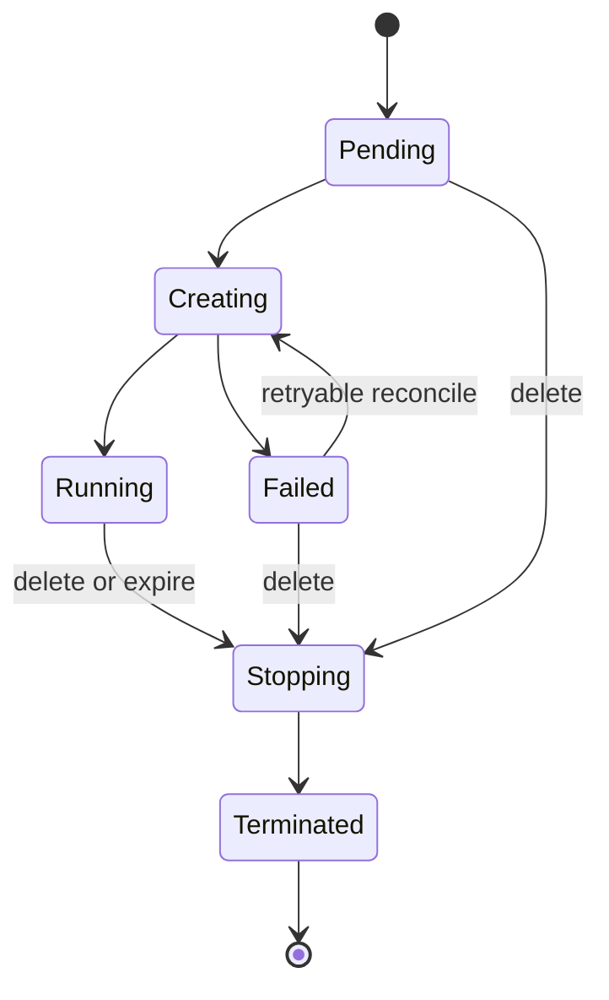
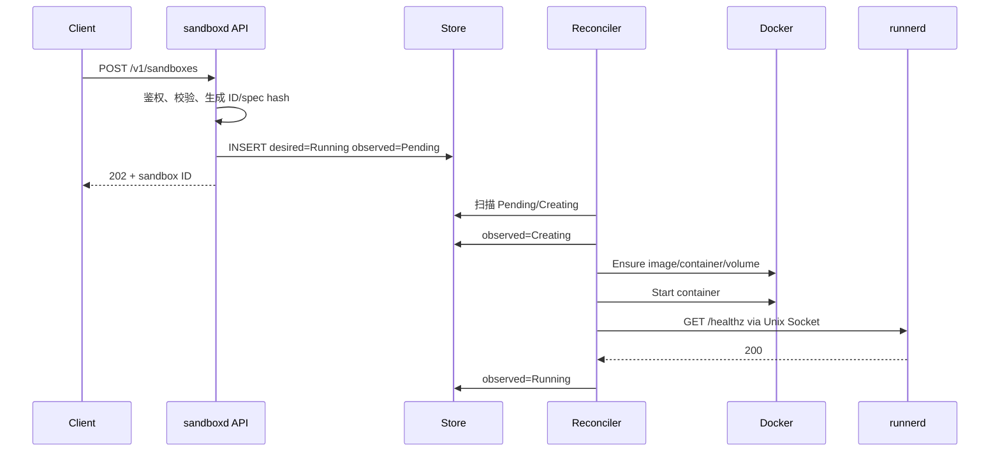

# 全 Go Agent Sandbox Runtime 设计文档

> 状态：Draft v0.1  
> 目标读者：准备实现单机版 Agent Sandbox Runtime 的开发者  
> 参考项目：本地 OpenSandbox `d4b2905f`  
> 首个运行时：Linux + Docker Engine

## 1. 摘要

本方案使用 Go 实现完整的 Agent Sandbox 核心链路：

```text
Agent / SDK
    ↓ HTTP + SSE
sandboxd（宿主机控制面）
    ↓ Docker Engine API
Sandbox Container
    ↓
runnerd（容器内执行数据面）
```

核心由三个 Go 二进制组成：

- `sandboxd`：提供生命周期 API、操作 Docker、维护状态、执行 TTL 和重启恢复，并代理命令流量。
- `sandbox-init`：作为 sandbox 容器的 PID 1，只负责信号转发和孤儿进程回收。
- `runnerd`：执行命令、管理进程组、流式输出和处理取消。

第一版采用“模块化单体 + 独立容器内代理”，不引入 TypeScript、Python、Kubernetes、消息队列和微服务拆分。Docker 是实际运行状态的事实源，SQLite 保存期望状态、幂等记录和业务元数据；两者由 reconcile loop 持续校准。

### 1.1 最重要的设计决定

1. 生命周期控制面和容器内执行数据面分离。
2. 所有核心组件都使用 Go，但通过稳定 HTTP/SSE 协议解耦。
3. `sandboxd` 不直接在宿主机执行用户命令。
4. `runnerd` 不访问 Docker socket，也不能管理其他 sandbox。
5. 创建和删除采用期望状态 + reconcile，所有操作幂等。
6. Docker labels 保存安全、可重建的运行时标识；秘密不写入 labels。
7. runner 默认通过每个 sandbox 独立的 Unix Socket 与宿主机通信，不暴露公网端口。
8. 超时和取消必须终止完整进程组，而不只是 shell 主进程。
9. 第一版依赖容器边界，不启用需要额外特权的 nested bubblewrap。
10. 第一版优先保证清理、恢复和故障语义，再增加 Pool、快照和 Kubernetes。

## 2. 目标和非目标

### 2.1 目标

第一版需要支持：

- 从 OCI/Docker 镜像创建一个 sandbox。
- 查询、列出、删除和续期 sandbox。
- 设置 CPU、内存和 PID 限制。
- 为每个 sandbox 创建受控 workspace。
- 在 sandbox 内以前台或后台方式执行命令。
- SSE 流式返回 stdout、stderr 和退出状态。
- 超时、显式取消和客户端断开策略。
- `sandboxd` 重启后恢复已有容器和 TTL。
- 创建失败、删除失败和孤儿资源的自动补偿。
- API Key、请求 ID、结构化日志和基本指标。
- 清晰的公共错误码与状态机。

### 2.2 非目标

第一版不实现：

- Kubernetes、CRD 和 Operator。
-多节点调度与预热 Pool。
-暂停、恢复和 rootfs 快照。
-Jupyter Code Interpreter。
-浏览器、桌面、VNC。
-PTY 和交互式 TUI。
-FQDN egress sidecar。
-Credential Vault。
-GPU。
-Windows sandbox。
-容器内再次使用 bubblewrap 创建子隔离环境。
-完全兼容 OpenSandbox 的全部 API。

### 2.3 运行环境假设

- 宿主机为 Linux。
- Docker Engine 可通过 Unix Socket 访问。
- `sandboxd` 与 Docker daemon 在同一主机。
- 首版 runner 构建目标固定为 `linux/amd64`。
-用户代码不可信，但第一版不是面向强对抗多租户的最终安全方案。
-调用方通过可信内网、loopback 或受保护的 API Gateway 访问 `sandboxd`。

## 3. 总体架构



### 3.1 组件职责

| 组件 | 职责 |
|---|---|
| `sandboxd/api` | HTTP decode、鉴权、请求 ID、响应和错误映射 |
| `sandboxd/service` | 用例编排、幂等、期望状态写入、权限与配额检查 |
| `sandboxd/reconciler` | 将期望状态收敛成 Docker 实际状态 |
| `runtime/docker` | 镜像、容器、网络、卷、labels、runner 注入 |
| `store` | sandbox 期望状态、幂等键、操作记录 |
| `runnerclient` | 通过 Unix Socket 调用 runnerd |
| `sandbox-init` | 容器 PID 1、信号转发、孤儿进程回收 |
| `runnerd` | 命令执行、进程组、SSE、后台任务、健康检查 |
| `sdk/go` | 创建、等待 Running、执行、续期和删除 |

### 3.2 为什么控制面和容器内组件分进程

即使全部使用 Go，也不应把控制面和执行数据面做成一个进程：

- `sandboxd` 拥有 Docker socket，权限很高；
- `runnerd` 位于不可信容器内部，只能影响当前 sandbox；
-命令输出不需要经过 Docker exec attach 的全部复杂状态；
-将来 Docker、Kubernetes 都可以注入相同 runner；
-runner 可以独立演进文件、PTY 和 metrics API。

## 4. 仓库与包结构

```text
mini-sandbox/
  cmd/
    sandboxd/
      main.go
    runnerd/
      main.go
    sandbox-init/
      main.go
  api/
    lifecycle.openapi.yaml
    runner.openapi.yaml
  internal/
    api/
      router.go
      middleware.go
      lifecycle_handler.go
      execution_handler.go
      error_response.go
    application/
      sandbox_service.go
      execution_service.go
      commands.go
    domain/
      sandbox.go
      sandbox_state.go
      execution.go
      errors.go
      events.go
    runtime/
      runtime.go
      types.go
      docker/
        runtime.go
        image.go
        create.go
        inspect.go
        delete.go
        labels.go
        resources.go
        workspace.go
        injector.go
    reconcile/
      reconciler.go
      scheduler.go
      keyed_lock.go
      ttl.go
    store/
      store.go
      sqlite/
        store.go
        migrations.go
    runnerclient/
      client.go
      transport_unix.go
      stream.go
    runner/
      server.go
      auth.go
      manager.go
      process_unix.go
      reaper_unix.go
      output.go
      background.go
    embedded/
      assets.go
      artifacts/
        linux_amd64/
          runnerd
          sandbox-init
  pkg/
    protocol/
      lifecycle.go
      runner.go
      events.go
  sdk/
    go/
      client.go
      sandbox.go
      execution.go
  tests/
    contract/
    integration/
    security/
  configs/
    sandboxd.example.yaml
  Dockerfile
  Makefile
  go.mod
```

### 4.1 包依赖规则

```text
api → application → domain
                  → runtime interface
                  → store interface

runtime/docker → runtime interface + domain
store/sqlite   → store interface + domain
runnerclient   → protocol
runner         → protocol
```

必须遵守：

- `domain` 不 import HTTP、Docker 或 SQLite。
- handler 不直接 import Docker adapter。
- Docker adapter 不决定租户、配额和鉴权策略。
- runner 不 import Docker SDK。
-公共 wire model 放在 `pkg/protocol`，领域对象不直接等同于 wire model。

## 5. 领域模型

### 5.1 Sandbox 状态

```go
type SandboxState string

const (
    StatePending    SandboxState = "Pending"
    StateCreating   SandboxState = "Creating"
    StateRunning    SandboxState = "Running"
    StateStopping   SandboxState = "Stopping"
    StateTerminated SandboxState = "Terminated"
    StateFailed     SandboxState = "Failed"
)

type DesiredState string

const (
    DesiredRunning    DesiredState = "Running"
    DesiredTerminated DesiredState = "Terminated"
)
```

状态含义：

| 状态 | 含义 |
|---|---|
| `Pending` | 已接受请求，等待 worker |
| `Creating` | 正在拉取镜像、创建容器或等待 runner |
| `Running` | 容器运行且 runner health 成功 |
| `Stopping` | 已收到删除或到期意图，正在清理 |
| `Terminated` | 运行时资源已确认不存在 |
| `Failed` | 当前创建或恢复失败，包含可诊断 reason |

状态转换：



### 5.2 Sandbox 记录

```go
type Sandbox struct {
    ID              string
    Spec            SandboxSpec
    DesiredState    DesiredState
    ObservedState   SandboxState
    Reason          string
    Message         string
    RuntimeID       string
    SpecHash        string
    Revision        int64
    CreatedAt       time.Time
    UpdatedAt       time.Time
    LastTransition  time.Time
    ExpiresAt       *time.Time
}

type SandboxSpec struct {
    Image       string
    Startup     *StartupSpec
    Env         map[string]string
    Resources   ResourceLimits
    Workspace   WorkspaceSpec
    Network     NetworkSpec
    Metadata    map[string]string
}
```

### 5.3 资源模型

第一版使用强类型资源字段：

```go
type ResourceLimits struct {
    CPUQuotaMillis int64 // 500 表示 0.5 CPU
    MemoryMiB      int64
    PIDs           int64
}
```

不要在第一版使用通用 `map[string]string`。强类型更容易：

-设置上下限；
-转换为 Docker `NanoCPUs` 和 bytes；
-生成稳定 spec hash；
-避免 `"500m"` 与 `"0.5"` 两套解析路径。

### 5.4 Startup 模型

```go
type StartupSpec struct {
    Argv       []string
    Cwd        string
    ExitPolicy string // keep | stop
}
```

默认没有 startup process。`runnerd` 自身让容器保持运行。需要启动 Jupyter、开发服务器等进程时再提供 `StartupSpec`。

- `keep`：startup 退出后 sandbox 保持 Running，状态中记录 startup exit。
- `stop`：startup 退出时 runnerd 退出，容器终止。

### 5.5 Workspace 模型

```go
type WorkspaceSpec struct {
    MountPath   string // 首版固定 /workspace
    Persistent  bool
}
```

第一版使用 Docker named volume：

```text
minisandbox-workspace-<sandbox-id> → /workspace
```

不允许用户直接传宿主机路径。`Persistent=false` 时随 sandbox 删除；持久卷语义以后再扩展。

## 6. 外部生命周期 API

### 6.1 创建

```http
POST /v1/sandboxes
Idempotency-Key: <optional-key>
Authorization: Bearer <api-key>
```

```json
{
  "image": "golang:1.24",
  "timeoutSeconds": 1800,
  "resources": {
    "cpuMillis": 1000,
    "memoryMiB": 1024,
    "pids": 256
  },
  "workspace": {
    "persistent": false
  },
  "network": {
    "outbound": true
  },
  "env": {
    "CI": "true"
  },
  "metadata": {
    "agent": "coder"
  }
}
```

响应使用真正的异步语义：

```http
HTTP/1.1 202 Accepted
Location: /v1/sandboxes/8c63...
```

```json
{
  "id": "8c63...",
  "status": {
    "state": "Pending",
    "reason": "CREATE_ACCEPTED",
    "message": "Sandbox creation has been accepted."
  },
  "createdAt": "2026-07-23T15:00:00Z",
  "expiresAt": "2026-07-23T15:30:00Z"
}
```

### 6.2 查询、列表、删除、续期

```text
GET    /v1/sandboxes/{id}
GET    /v1/sandboxes?state=Running&page=1&pageSize=50
DELETE /v1/sandboxes/{id}
POST   /v1/sandboxes/{id}/renew
```

续期请求：

```json
{
  "expiresAt": "2026-07-23T16:00:00Z"
}
```

删除语义：

- 第一次调用设置 `DesiredTerminated`，返回 `202`。
- 已处于 `Stopping` 或 `Terminated` 时仍返回成功。
- 容器已经被外部删除时，reconcile 将状态收敛为 `Terminated`。

### 6.3 健康接口

```text
GET /healthz   # 进程活着
GET /readyz    # Store 和 Docker 可访问，reconciler 已启动
```

## 7. 执行 API

### 7.1 前台执行

```http
POST /v1/sandboxes/{id}/executions
Accept: text/event-stream
```

优先使用 argv：

```json
{
  "argv": ["go", "test", "./..."],
  "cwd": "/workspace",
  "env": {
    "CI": "true"
  },
  "timeoutSeconds": 120,
  "background": false
}
```

需要 shell 功能时显式使用：

```json
{
  "shell": "go test ./... && echo done",
  "cwd": "/workspace",
  "timeoutSeconds": 120
}
```

`argv` 与 `shell` 必须且只能出现一个。

### 7.2 SSE 事件

每个事件都包含：

- `executionId`；
-单调递增 `sequence`；
- `timestamp`；
-事件类型。

```text
event: started
data: {"executionId":"e1","sequence":1,"timestamp":"..."}

event: stdout
data: {"executionId":"e1","sequence":2,"data":"ok\\n","timestamp":"..."}

event: stderr
data: {"executionId":"e1","sequence":3,"data":"warning\\n","timestamp":"..."}

event: exited
data: {"executionId":"e1","sequence":4,"exitCode":0,"durationMs":823,"timestamp":"..."}

```

终止事件只能出现一个：

- `exited`；
- `failed`；
- `cancelled`；
- `timed_out`。

非零退出码使用 `exited`，不等同于系统错误。

### 7.3 取消和状态

```text
GET    /v1/sandboxes/{id}/executions/{executionId}
DELETE /v1/sandboxes/{id}/executions/{executionId}
GET    /v1/sandboxes/{id}/executions/{executionId}/logs?cursor=123
```

取消顺序：

1. 对进程组发送 `SIGTERM`；
2. 等待配置的 grace period；
3. 对仍存活的进程组发送 `SIGKILL`；
4. 发送唯一 `cancelled` 终止事件。

### 7.4 客户端断开策略

默认行为：

- 前台执行：客户端断开即取消。
- 后台执行：客户端断开不取消。

该语义必须由请求中的 `background` 明确决定，不能根据实现偶然行为变化。

## 8. Runner 内部 API

`sandboxd` 通过每个 sandbox 独立 Unix Socket 调用：

```text
/var/lib/minisandbox/run/<sandbox-id>/runner.sock
```

容器内挂载为：

```text
/run/minisandbox/runner.sock
```

内部 API：

```text
GET    /healthz
POST   /v1/executions
GET    /v1/executions/{id}
DELETE /v1/executions/{id}
GET    /v1/executions/{id}/logs
```

外部 API 不暴露 runner 地址。`sandboxd` 只代理允许的 runner endpoint，不提供任意路径反向代理。

### 8.1 Unix Socket 的优势

- 不占用 host port。
- 不暴露局域网入口。
- 不依赖容器 IP。
- `sandboxd` 重启后 socket 路径稳定。
- 可以使用宿主机目录权限限制访问。

运行目录由 `sandboxd` 创建：

```text
/var/lib/minisandbox/run/<id>   mode 0700
```

删除 sandbox 后必须清理该目录。

### 8.2 内部鉴权

Unix Socket 权限是第一层保护。还可使用派生 token：

```text
runnerToken = HMAC-SHA256(masterKey, sandboxID)
```

runner 启动时获得 token，`sandboxd` 可在重启后重新派生。runner 创建子进程时必须过滤自己的配置环境变量，避免普通命令继承。

这不是容器内对 root 用户的强安全边界；它主要防止宿主机上其他普通进程误用 socket。

## 9. Runner 注入与容器启动

### 9.1 构建方式

`runnerd` 和 `sandbox-init` 都构建为静态二进制：

```text
CGO_ENABLED=0 GOOS=linux GOARCH=amd64
```

构建产物放在负责嵌入资源的 Go package 内：

```text
internal/embedded/artifacts/linux_amd64/runnerd
internal/embedded/artifacts/linux_amd64/sandbox-init
```

`internal/embedded/assets.go` 使用 `go:embed` 嵌入两个产物。`go:embed` 不能引用 package 目录之外的 `..` 路径，因此 artifact 必须位于该 package 的子目录：

```go
//go:embed artifacts/linux_amd64/runnerd
var runnerBinary []byte

//go:embed artifacts/linux_amd64/sandbox-init
var initBinary []byte
```

首版只支持与嵌入产物匹配的 sandbox platform。未来支持多架构时，按 `os/arch` 选择不同 artifact，或像 OpenSandbox 一样从 runner image 抽取。

### 9.2 注入流程

1. Docker 创建停止状态的容器。
2. 将 `sandbox-init` 和 runner 二进制打成 tar archive。
3. 通过 Docker Copy API 写入：

```text
/opt/minisandbox/runnerd
```

```text
/opt/minisandbox/sandbox-init
```

4. 两个文件的 mode 设置为 `0755`。
5. 容器 entrypoint 设置为：

```text
/opt/minisandbox/sandbox-init -- /opt/minisandbox/runnerd serve
```

6. 启动容器。

将文件复制到未启动容器的方式避免：

-要求用户镜像预装 runner；
-挂载宿主机可执行文件路径；
-要求用户镜像拥有 shell。

### 9.3 Sandbox-init 作为 PID 1

第一版不依赖 shell bootstrap 或外部 `tini`，而是提供一个很小的 Go `sandbox-init`：

-启动 runnerd；
-将 SIGTERM/SIGINT 转发给 runnerd 进程组；
-等待 runnerd；
-回收被重新托管给 PID 1 的孤儿后代；
-runnerd 退出后返回对应退出状态。

`sandbox-init` 集中执行 `wait4`，但不会与 runnerd 对其直接子进程执行的 `Cmd.Wait` 竞争：runnerd 的直接子进程仍由 runnerd 等待，只有失去父进程后重新托管给 PID 1 的进程才由 `sandbox-init` 回收。

这比让 runnerd 同时执行通用 `wait4(-1)` 和 Go `Cmd.Wait` 更容易证明正确，也能保持 runner 的 HTTP/执行逻辑简单。

## 10. Docker Runtime 设计

### 10.1 Runtime 接口

接口应围绕 reconcile 的幂等语义设计，而不是只提供一次性 Create：

```go
type Runtime interface {
    Ensure(ctx context.Context, sandbox domain.Sandbox) (RuntimeSandbox, error)
    Inspect(ctx context.Context, sandboxID string) (RuntimeSandbox, error)
    Delete(ctx context.Context, sandboxID string) error
    ListManaged(ctx context.Context) ([]RuntimeSandbox, error)
}
```

`Ensure` 必须满足：

-相同 sandbox ID 重试不会创建第二个容器；
-已存在且 spec hash 相同则返回当前状态；
-已存在但 spec hash 不同则返回明确 drift/conflict；
-中途失败留下的容器可被下一次 reconcile 接管或删除。

### 10.2 Docker labels

每个容器至少包含：

```text
minisandbox.io/managed=true
minisandbox.io/id=<sandbox-id>
minisandbox.io/schema-version=1
minisandbox.io/spec-hash=<sha256>
minisandbox.io/expires-at=<RFC3339 or empty>
minisandbox.io/workspace=<volume-name>
```

不允许写入 labels：

-环境变量值；
-API Key；
-runner token；
-registry password；
-用户代码；
-命令内容。

### 10.3 容器安全配置

默认 profile：

```text
Privileged=false
NetworkMode=minisandbox-bridge
CapDrop=ALL
NoNewPrivileges=true
DockerDefaultSeccomp=true
PIDsLimit=<request bounded by server max>
Memory=<request bounded by server max>
NanoCPUs=<request bounded by server max>
ReadonlyRootfs=false
User=0:0（仅启动 init/runner）
CapAdd=CHOWN,SETUID,SETGID,KILL
```

说明：

- Agent 经常需要安装依赖和修改根文件系统，因此首版不强制只读 rootfs。
- `sandbox-init` 以 root 启动并保持极小职责。
- runner 先绑定 socket、创建运行目录并初始化 workspace ownership，再调用 setgroups/setgid/setuid 切换到固定非 root UID/GID。
- runner 切换身份后必须验证实际 UID/GID，并确认能力已经清空；失败则立即退出。
-所有普通 startup 和 execution 默认使用该非 root 身份。
-确需 root 的镜像只能通过受管理员控制的 compatibility profile 开启。
- profile 由服务端配置选择，不能允许普通请求直接透传任意 Docker security option。

明确禁止：

- Docker socket；
- host network；
- host PID/IPC namespace；
- privileged；
-任意 device；
-任意宿主机 bind mount；
-客户端自定义 capability；
-客户端原样传入 Docker `HostConfig`。

### 10.4 网络

创建专用 bridge：

```text
minisandbox
```

第一版只支持：

- `outbound=true`：使用普通 bridge 出站。
- `outbound=false`：Docker network disabled。

runner 通信走 Unix Socket，不发布端口。

FQDN allowlist、代理和透明网络策略不进入第一版。

### 10.5 镜像

创建前：

1. 校验镜像 URI。
2. 应用 registry allowlist/denylist。
3. 优先支持 digest pinning。
4. 私有仓库凭证只传给 pull 调用，不持久化到 labels。
5. inspect 镜像平台是否与 runner artifact 兼容。

应对镜像拉取时间长：

-创建 API 已经是异步，不占用 HTTP 长连接；
-worker 使用独立 context timeout；
-状态更新为 `Creating/PULLING_IMAGE`；
-失败时记录可重试与不可重试 reason。

## 11. 创建与 Reconcile

### 11.1 创建请求流程



### 11.2 Reconciler 原则

- Store 中的 desired state 是“用户希望什么”。
- Docker 是“实际存在什么”的事实源。
- observed state 是最近一次 reconcile 的解释。
-内存 channel 只是唤醒优化，不是任务事实源。
-周期扫描保证丢失 channel 消息或进程重启后仍能继续。
-每个 sandbox 使用 keyed lock，避免 create/delete/renew 同时修改。
-每次操作都有 context timeout。

### 11.3 创建补偿

创建产生的副作用按顺序记录：

```text
runtime dir
workspace volume
container
runner socket
TTL schedule
```

失败后逆序补偿：

```text
remove container
remove non-persistent volume
remove runtime dir
clear schedule
```

如果补偿失败：

-状态标记为 `Failed/CLEANUP_PENDING`；
-保留足够标识供下一次 reconcile 重试；
-不得因为一次删除错误而忘记资源。

### 11.4 Idempotency-Key

Store 保存：

```text
tenant + idempotency-key
request-hash
sandbox-id
response
expires-at
```

规则：

-相同 key + 相同 request hash：返回同一 sandbox。
-相同 key + 不同 request hash：返回 `409 IDEMPOTENCY_CONFLICT`。
-没有 key：每次请求都创建新 sandbox。

## 12. TTL、续期与重启恢复

### 12.1 TTL 真相

到期时间同时存在：

- Store：权威期望记录；
- Docker label：重建兜底；
-内存最小堆/timer：唤醒优化。

删除判断不能只相信旧 timer。timer 触发时必须重新读取当前 record revision 和 `ExpiresAt`。

### 12.2 续期

续期事务：

1. 校验新时间在允许范围内。
2. Store 使用乐观锁更新 `ExpiresAt` 和 revision。
3. 唤醒 reconciler。
4. reconciler 更新 Docker label。
5.重建内存 schedule。

旧 timer 带有旧 revision，触发后发现 revision 不匹配即失效。

### 12.3 启动恢复

`sandboxd` 启动时：

1. 打开并迁移 Store。
2. 连接 Docker。
3. 扫描 `minisandbox.io/managed=true` 容器。
4. 与 Store 记录对账。
5. 恢复缺失的 runtime ID 和 observed state。
6. 标记 Store 中存在但 Docker 不存在的记录。
7. 对 Docker 中存在但 Store 不存在的资源进入 orphan 策略。
8. 恢复 TTL schedule。
9. 启动周期 reconciler。
10. 设置 `/readyz` 为 ready。

默认 orphan 策略：

- labels 完整且 schema 可识别：导入为托管记录。
- labels 不完整：隔离并告警，不立即删除。
-明确过期：删除。

## 13. Runner 执行引擎

### 13.1 Execution 状态

```go
type ExecutionState string

const (
    ExecPending   ExecutionState = "Pending"
    ExecRunning   ExecutionState = "Running"
    ExecExited    ExecutionState = "Exited"
    ExecFailed    ExecutionState = "Failed"
    ExecCancelled ExecutionState = "Cancelled"
    ExecTimedOut  ExecutionState = "TimedOut"
)
```

### 13.2 进程启动

argv 模式：

```go
cmd := exec.CommandContext(ctx, req.Argv[0], req.Argv[1:]...)
```

shell 模式：

```go
shell := detectShell() // bash → sh
cmd := exec.CommandContext(ctx, shell, "-c", req.Shell)
```

Unix process group：

```go
cmd.SysProcAttr = &syscall.SysProcAttr{Setpgid: true}
```

取消完整进程组：

```go
_ = syscall.Kill(-cmd.Process.Pid, syscall.SIGTERM)
// grace period
_ = syscall.Kill(-cmd.Process.Pid, syscall.SIGKILL)
```

### 13.3 环境变量

最终环境：

```text
sanitized image env
+ sandbox base env
+ execution env
- runner internal env
- server-defined denylist
```

规则：

- execution env 覆盖 base env。
- key、value 长度和总数量有限制。
- runner token、socket 配置和内部路径不能传给子进程。
-日志只记录 env key，不记录 value。

### 13.4 CWD 和路径

默认 cwd：

```text
/workspace
```

第一版要求 cwd：

-必须是绝对路径；
-clean 后仍位于允许目录；
-默认只允许 `/workspace` 子路径；
-目录必须存在。

禁止通过 `..` 或 symlink 绕过。校验时使用真实路径，并明确 symlink 策略。

### 13.5 输出与背压

每个 execution：

- stdout、stderr 使用独立 pipe；
-读取 goroutine 不因慢客户端永久阻塞；
-写入有界 ring buffer 或滚动日志文件；
-SSE subscriber 从 buffer 消费；
-单次 execution 有最大输出字节数；
-超过限制发送 `OUTPUT_LIMIT_REACHED`，然后按策略截断或取消。

推荐首版策略：

-继续执行命令；
-停止保存超过上限的输出；
-终止事件带 `outputTruncated=true`。

### 13.6 后台任务

后台任务输出写入：

```text
/var/lib/minisandbox/executions/<execution-id>.log
```

但该目录应位于容器自身可控数据目录或 workspace，不应写宿主机任意位置。日志提供 cursor 读取，并设置：

-单文件上限；
-execution 数量上限；
-完成后保留时间；
-周期 GC。

## 14. Store 设计

### 14.1 Store 接口

```go
type SandboxStore interface {
    Create(ctx context.Context, sb Sandbox, key *IdempotencyRecord) error
    Get(ctx context.Context, id string) (Sandbox, error)
    List(ctx context.Context, filter Filter) ([]Sandbox, error)
    UpdateDesired(ctx context.Context, id string, desired DesiredState, revision int64) error
    UpdateObserved(ctx context.Context, update ObservedUpdate) error
    Renew(ctx context.Context, id string, expiresAt time.Time, revision int64) error
    ListReconcileCandidates(ctx context.Context, limit int) ([]Sandbox, error)
}
```

### 14.2 SQLite 职责

SQLite 保存：

- sandbox spec；
- desired/observed state；
- runtime ID；
- timestamps、revision；
-幂等键；
-最后一次错误；
-安全的用户 metadata。

SQLite 不保存：

-执行 stdout/stderr 大对象；
-镜像 registry 密码；
-API Key 明文；
-runner token；
-无限期历史事件。

### 14.3 Secret 与环境变量

异步创建需要在创建 worker 运行前保存 spec。如果 env 中允许 secret，则必须：

-使用持久化 master key 做 authenticated encryption；
-数据库只保存密文；
-解密只发生在创建容器前；
-日志和错误中不包含值；
-支持密钥轮换版本。

更简单的首版选择是：只允许非敏感 env，并将 secret 功能明确列为未支持。不能默默把用户 token 以明文写入数据库。

## 15. 错误模型

公共错误：

```json
{
  "error": {
    "code": "SANDBOX_IMAGE_PULL_FAILED",
    "message": "Failed to pull sandbox image.",
    "requestId": "req-...",
    "retryable": true
  }
}
```

推荐错误码：

| Code | HTTP | Retryable |
|---|---:|---:|
| `INVALID_REQUEST` | 400 | false |
| `UNAUTHORIZED` | 401 | false |
| `FORBIDDEN` | 403 | false |
| `SANDBOX_NOT_FOUND` | 404 | false |
| `SANDBOX_NOT_RUNNING` | 409 | true |
| `IDEMPOTENCY_CONFLICT` | 409 | false |
| `RESOURCE_LIMIT_EXCEEDED` | 422 | false |
| `SANDBOX_IMAGE_PULL_FAILED` | 502 | true/false |
| `RUNTIME_UNAVAILABLE` | 503 | true |
| `RUNNER_UNHEALTHY` | 503 | true |
| `EXECUTION_TIMEOUT` | 504 | false |
| `INTERNAL_ERROR` | 500 | true |

内部错误保留 cause，但公共响应不泄露：

- Docker socket 路径；
-宿主机绝对路径；
-registry credential；
-环境变量；
-内部堆栈。

## 16. 并发控制

### 16.1 每 Sandbox 串行

同一 sandbox 的以下操作必须串行：

- Ensure/Create；
- Delete；
- Renew；
- runtime metadata 更新；
-启动恢复。

不同 sandbox 可并发。

### 16.2 全局限制

配置：

```text
maxConcurrentCreates
maxConcurrentImagePulls
maxConcurrentDeletes
maxSandboxes
maxExecutionsPerSandbox
maxTotalExecutions
```

避免大量 Agent 同时拉镜像导致宿主机磁盘和网络耗尽。

### 16.3 乐观锁

Store 更新带 revision：

```sql
UPDATE sandboxes
SET ..., revision = revision + 1
WHERE id = ? AND revision = ?;
```

受影响行数为 0 表示并发冲突，重新读取并 reconcile。

## 17. 安全设计

### 17.1 威胁模型

假定攻击者能够：

-提交任意命令和代码；
-读取 sandbox 内可访问文件；
-持续生成进程和输出；
-尝试访问网络；
-尝试利用内核或容器运行时漏洞；
-尝试窃取同宿主机其他 sandbox 数据。

不假定 Docker 普通容器足以抵御最高强度的恶意多租户。生产强隔离阶段应增加 gVisor、Kata 或独立 VM/节点。

### 17.2 控制面

- `sandboxd` 不直接暴露 Docker API。
- API 有认证、授权和请求限流。
- body、header 和上传大小有限制。
- Docker 配置由服务端构造，不透传。
-生产环境限制 Docker socket 权限。
- master key 文件权限至少 `0600`。
-所有敏感配置支持从 secret file 读取。

### 17.3 Sandbox

-禁止 privileged。
-禁止 host namespace。
-禁止 Docker socket。
-禁止用户提供 host bind。
-默认非 root。
-drop capabilities。
-启用 no-new-privileges。
-使用 Docker 默认 seccomp。
-设置 CPU、memory、PIDs 和 execution 并发限制。
-workspace 按 sandbox 独立。
-runtime socket 目录按 sandbox 独立。
-删除后清理 volume 和 runtime dir。

### 17.4 Runner

-只监听 Unix Socket。
-请求和 command body 有大小限制。
-过滤内部 env。
-cwd 有 allowlist。
-日志做命令长度限制和敏感信息处理。
-不提供任意宿主机路径参数。
-不提供 Docker、mount、namespace 操作 API。
-停止时杀死全部托管进程组。

## 18. 可观测性

### 18.1 日志

统一 JSON 字段：

```text
timestamp
level
component
request_id
sandbox_id
execution_id
operation
duration_ms
error_code
```

命令内容默认不完整记录，只记录：

- argv[0]；
-参数数量；
-内容 hash；
-截断后的安全摘要。

### 18.2 指标

至少提供：

```text
sandbox_create_total{result}
sandbox_create_duration_seconds
sandbox_state_count{state}
sandbox_reconcile_total{result}
sandbox_cleanup_pending
sandbox_expired_total
execution_total{result}
execution_duration_seconds
execution_output_bytes{stream}
runtime_docker_errors_total{operation}
```

### 18.3 诊断接口

管理员接口：

```text
GET /v1/admin/sandboxes/{id}/diagnostics
```

返回经过清洗的：

- Store 状态；
- Docker 状态；
-最近 reconcile 错误；
- runner health；
-资源限制；
-容器最近日志。

## 19. 配置

示例：

```yaml
server:
  listen: "127.0.0.1:8080"
  apiKeyFile: "/etc/minisandbox/api-key"
  requestTimeout: "30s"

runtime:
  type: "docker"
  dockerHost: "unix:///var/run/docker.sock"
  networkName: "minisandbox"
  dataDir: "/var/lib/minisandbox"
  createTimeout: "10m"
  runnerReadyTimeout: "30s"

limits:
  maxSandboxes: 100
  maxConcurrentCreates: 4
  maxConcurrentImagePulls: 2
  maxExecutionsPerSandbox: 8
  maxCPUPerSandboxMillis: 4000
  maxMemoryPerSandboxMiB: 8192
  maxPIDsPerSandbox: 1024
  maxTimeout: "24h"
  maxExecutionTimeout: "1h"
  maxExecutionOutputBytes: 10485760

security:
  defaultUser: "1000:1000"
  allowRootProfile: false
  imageAllowlist:
    - "docker.io/library/*"
    - "ghcr.io/my-org/*"

reconcile:
  interval: "10s"
  retryMin: "1s"
  retryMax: "1m"
```

配置启动时一次性验证。无效安全配置必须阻止服务启动，不能静默退回宽松模式。

## 20. 测试策略

### 20.1 单元测试

-状态转换；
-spec 校验和 hash；
-资源转换；
-label 编解码；
-错误映射；
-idempotency key；
-revision 乐观锁；
-TTL 旧 revision 失效；
-cwd 和 symlink 路径校验；
-env 过滤；
-SSE 序列与唯一终止事件；
-输出截断；
-process cancellation state。

### 20.2 Contract Test

使用同一组 fixtures 验证：

-外部 OpenAPI request/response；
-runner 内部协议；
-错误码；
-SSE event schema；
-Go SDK 兼容性。

### 20.3 Docker 集成测试

-创建 → Running → exec → delete；
-镜像拉取失败；
-runner 注入失败；
-runner 架构错误；
-runner readiness 超时；
-无 startup process；
-startup keep/stop；
-CPU、memory 和 PID 限制；
-前台断开取消；
-后台断开继续；
-超时杀死子孙进程；
-大 stdout/stderr；
-删除幂等；
-续期后旧 timer 不删除；
-`sandboxd` 重启恢复；
-外部删除容器后的 reconcile；
-创建中途杀死 `sandboxd` 后恢复；
-workspace 不串数据；
-runtime socket 不跨 sandbox。

### 20.4 安全测试

-容器内不存在 Docker socket；
-无法使用 privileged/capability；
-无法请求 host network；
-无法挂载任意宿主机目录；
-runner 内部 env 不传给命令；
-cwd 不能逃逸 allowlist；
-API body、输出和并发限制生效；
-host 上其他普通用户无法访问 runtime socket；
-日志不出现 API Key、runner token 和 env value。

### 20.5 Go 工程检查

```text
go test ./...
go test -race ./...
go vet ./...
staticcheck ./...
```

涉及 PID、signal 和 Docker 的行为必须有真实 Linux 集成测试，不能只依赖 mock。

## 21. 开发阶段与验收

### Phase 0：协议与骨架

完成：

- domain model；
- OpenAPI；
- Runtime/Store interface；
- fake runtime；
- handler contract test。

验收：

- handler 不 import Docker；
-错误码和 SSE schema 固定；
- `go test ./...` 通过。

### Phase 1：Docker 生命周期

完成：

- Store；
-异步 create；
- Docker Ensure/Inspect/Delete；
- labels；
- workspace volume；
- runner artifact 注入；
- health check。

验收：

-创建最终进入 Running；
-失败无孤儿容器和卷；
-删除幂等；
-进程重启能发现已有容器。

### Phase 2：Init 与 Runner 执行

完成：

- `sandbox-init` PID 1、信号转发和孤儿回收；
- runner 身份切换；
- argv/shell；
- SSE；
- timeout/cancel；
-进程组；
-输出限制；
-后台命令。

验收：

-可以完成一个 coding agent 的 clone/build/test 流程；
-超时后无残留子孙进程；
-SSE 终止事件恰好一次。

### Phase 3：可靠性

完成：

- periodic reconcile；
- TTL/renew revision；
- idempotency；
-失败补偿；
- orphan 策略；
- metrics 和 diagnostics。

验收：

-在 create、start、ready、delete 任一点杀死 `sandboxd`，重启后都能收敛；
-并发 create/delete/renew 通过 race test；
-到期资源最终全部回收。

### Phase 4：Agent 体验

按需要增加：

-文件上传下载；
-目录 API；
-端口代理；
-PTY；
-Go/TypeScript/Python SDK；
-镜像预拉取。

核心服务仍保持全 Go；TypeScript 可以作为 SDK 或 Web Console 使用，但不进入 runtime 核心。

### Phase 5：集群化

增加 Kubernetes 时：

-保留公共 lifecycle 和 runner 协议；
-新增 Go `runtime/kubernetes`；
-简单模式直接创建 Pod；
-需要 Pool、快照和复杂调度时再引入 Go Operator/CRD；
-使用 RuntimeClass 接入 gVisor/Kata。

## 22. 从 OpenSandbox 借鉴与简化

| OpenSandbox | 本设计 |
|---|---|
| Python FastAPI lifecycle server | Go `sandboxd` |
| Python `SandboxService` | Go 小接口 `Runtime`、`Store` |
| Python Docker service/mixins | Go `runtime/docker` 显式组合 |
| Go `execd` | 简化 Go `runnerd` |
| execd image 抽取注入 | 首版 `go:embed` + CopyToContainer |
| TCP execd endpoint | 单机 Unix Socket |
| Docker/Kubernetes 双后端 | 首版仅 Docker |
| Jupyter、PTY、files、metrics | 首版仅 command + health |
| Docker labels 恢复 | 保留 |
| SDK 两级 readiness | 保留 |
| SSE、进程组取消 | 保留 |
| egress sidecar | 延后 |
| nested bubblewrap | 延后并单独威胁建模 |
| Pool、snapshot | 延后 |

最重要的不是逐行翻译 OpenSandbox Python 代码，而是保留它的边界：

```text
公共协议
→ 生命周期编排
→ Runtime Provider
→ 容器
→ 容器内 Runner
```

## 23. 关键风险

### 23.1 Docker 不是最终强隔离

普通 Docker 容器共享宿主机内核。面对真正恶意、多租户代码，需要：

-专用节点；
- gVisor；
- Kata Containers；
- microVM；
-更严格的网络与凭证模型。

### 23.2 自研 Sandbox-init

自己实现 PID 1、reaper 和信号处理容易出现：

-僵尸进程；
-服务退出时子进程残留；
-PID 复用后误杀；
-并发 Wait 竞态。

必须用 Linux 集成测试覆盖。

### 23.3 Store 与 Docker 双状态

不能简单地认为数据库或 Docker 单方面总是正确：

- Store 表达 desired state；
- Docker 表达 actual resources；
- Reconciler 负责收敛；
-所有变更必须幂等。

### 23.4 异步创建与 secret

异步创建要求持久化请求。若允许环境变量携带 secret，就必须加密或改成 secret reference；不能以“先做 MVP”为理由写明文。

### 23.5 跨架构

嵌入的 runner 只能在匹配架构运行。创建前必须检查镜像 platform，不能等容器启动后才以 `exec format error` 失败。

## 24. 最终实现原则

实现过程中始终坚持：

1. `sandboxd` 永远不在宿主机执行用户命令。
2. `runnerd` 永远拿不到 Docker socket。
3. Docker adapter 的所有公开操作都幂等。
4. 删除、取消和超时覆盖完整资源或进程树。
5. 内存 timer、channel 和 map 都不是唯一事实源。
6. Store desired state 与 Docker actual state 通过 reconcile 连接。
7. 所有失败都有稳定 code、reason、message 和 request ID。
8. 安全配置由服务端决定，客户端不能透传底层运行时参数。
9. 先验证恢复和清理，再实现高级功能。
10. 公共协议先于 SDK 和第二运行时后端。

该方案适合从单机 coding agent sandbox 开始，并为后续 Kubernetes、强隔离、文件 API、端口代理和多语言 SDK 保留清晰扩展点。
