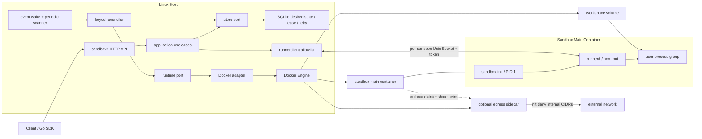

# MiniSandbox 面试技术亮点与深挖指南

本文面向准备使用 MiniSandbox 参加 Go、后端、云原生、基础设施或平台工程岗位面试的开发者。目标不是罗列仓库中的所有功能，而是选出最能体现系统设计、Linux 进程语义、并发正确性、崩溃一致性和安全边界意识的部分，并说明如何用代码和测试支撑这些表述。

文中的表述必须以当前代码为准。面试时应主动区分“已经实现并测试”“设计上预留”和“尚未实现”，不要把普通 Docker 容器描述成 microVM，也不要把单机 SQLite 控制面描述成分布式高可用系统。

## 1. 一句话介绍项目

MiniSandbox 是一个全 Go、Docker-first 的单机 Agent Sandbox Runtime：宿主机控制面通过“持久化期望状态 + 幂等 reconcile”管理 sandbox 生命周期，容器内非 root runner 通过 Unix Socket 执行命令；系统还实现了进程组终止、SSE 事件、受控 outbound、TTL、幂等创建、崩溃恢复、资源对账和安全可观测性。

面试时可以进一步补一句边界：

> 它的重点不是再封装一层 `docker run`，而是处理 Docker、SQLite、Linux 进程和网络命名空间之间无法原子提交时，系统如何在重试、并发、进程崩溃和资源漂移下仍然收敛到正确状态。

## 2. 最值得讲的技术亮点

建议不要平均介绍所有模块。面试时间有限时，按以下优先级选择：

| 优先级 | 技术主题 | 最能体现的能力 | 推荐程度 |
|---|---|---|---|
| S | SQLite 与 Docker 双状态下的可收敛控制器 | 分布式系统思维、幂等、故障恢复、状态机 | 主讲 |
| S | Linux 命令执行与唯一终态 | 进程组、PID 1、并发仲裁、流式协议、背压 | 主讲 |
| S | 每 sandbox egress sidecar 网络隔离 | namespace、nftables、最小权限、安全语义 | 主讲或按岗位选择 |
| A | Idempotency-Key 与 quota 原子准入 | 事务边界、响应丢失、并发正确性 | 后端岗位重点 |
| A | TTL、renew 与旧 timer 失效 | 时间系统、CAS、权威事实源、缓存一致性 | 后端/基础设施重点 |
| A | Trusted orphan、anomaly 与 Running 恢复 | 恢复信任模型、fail-closed、安全自愈 | 平台岗位重点 |
| B | 不反向伤害控制面的可观测性 | 低基数指标、snapshot、秘密治理、readiness | SRE/平台岗位重点 |
| B | 真实跨进程 crashpoint 验收 | 可测试性设计、故障注入、工程质量 | 所有岗位的证据 |

最推荐的叙事结构是：

1. 以“双状态无法原子提交”为主问题；
2. 说明如何用 Store 事实源、reconcile、CAS、周期扫描和持久 retry 解决；
3. 再选择 Linux execution 或 outbound isolation 作为第二个深挖点；
4. 最后用真实 `SIGKILL`、Docker integration 和 race 测试证明方案不是纸面设计。

## 3. 架构全景

这套架构有三个重要边界：

- `sandboxd` 可以管理 Docker，但绝不在宿主机直接执行用户命令；
- `runnerd` 可以执行当前 sandbox 的命令，但看不到 Docker socket，也不能管理其他 sandbox；
- outbound 网络能力由独立 sidecar 持有的 network namespace 提供，主容器不能自行修改 nft 规则。

代码入口：

- [总体设计](../all-go-agent-sandbox-runtime-design.md)
- [领域状态](../../internal/domain/sandbox.go)
- [生命周期应用层](../../internal/application/sandbox_service.go)
- [Reconciler](../../internal/reconcile/reconciler.go)
- [Docker adapter](../../internal/runtime/docker/runtime.go)
- [Runner](../../internal/runner/manager.go)

## 4. 深挖一：SQLite 与 Docker 双状态下的可收敛控制器

### 4.1 真正困难的问题

创建一个 sandbox 至少涉及：

1. 写入 SQLite；
2. 创建 runtime directory；
3. 创建 workspace volume；
4. 创建并启动容器；
5. 注入 runner/init artifact；
6. 等待 runner ready；
7. 回写 Running 状态。

SQLite transaction 无法覆盖 Docker API 和文件系统。如果进程在任意两步之间崩溃，就可能出现“Store 有记录但资源不完整”“Docker 已创建但 Store 未更新”“删除了一半”或“通知尚未发送”等状态。

项目没有尝试伪造跨 SQLite、Docker 和文件系统的分布式事务，而是采用控制器模型：

- API 只提交 `DesiredState`；
- Reconciler 从 Store 重读最新事实，幂等地推动 `ObservedState`；
- Docker `Ensure` 和 `Delete` 可以重复执行；
- 内存 wake 只用于降低延迟，不承担事实持久化；
- 周期 scanner 会找回丢失的 wake；
- retry attempt 和绝对 `next_reconcile_at` 写入 SQLite；
- 同一 sandbox 由 keyed lock 串行处理，不同 sandbox 可由 worker pool 并行处理；
- Store 更新通过 revision CAS 防止旧观察覆盖新意图。

最适合面试的一句话是：

> 我没有试图让 SQLite 和 Docker 形成一个不现实的原子事务，而是把每个跨边界操作设计成可重放步骤，并让持久化意图、幂等 runtime 和周期 reconcile 共同保证最终收敛。

### 4.2 核心不变量

- SQLite 中的期望状态是控制面事实源，队列消息不是事实源；
- 任意 wake 都允许重复或丢失；
- 任意 reconcile 都允许在完成前崩溃，并在重启后再次执行；
- 同一 sandbox 的决策必须串行，不同 sandbox 可以并发；
- 删除意图优先，终态资源不能被旧创建流程复活；
- 清理不完整时进入 `CLEANUP_PENDING` 并持久重试，不能假装删除成功；
- retryable 与 non-retryable 错误必须分类，避免永久错误无限重试；
- 内存状态只能作为加速结构，不能成为重启后的唯一依据。

### 4.3 值得展示的实现

- [Reconcile 主循环](../../internal/reconcile/reconciler.go)：keyed lock 后重新读取 Store，再决定 create、health 或 delete。
- [合并唤醒队列](../../internal/reconcile/queue.go)：`pending / processing / requeue` 三态避免高频 wake 放大，同时不会漏掉处理期间的新意图。
- [周期候选扫描](../../internal/reconcile/candidate_scanner.go)：对 due record 进行分页扫描。
- [持久化 retry](../../internal/reconcile/retry_policy.go)：使用 capped exponential full-jitter backoff。
- [SQLite Store](../../internal/store/sqlite/store.go)：WAL、foreign keys、busy timeout、单 writer 连接与 CAS 更新。
- [创建和删除 crash matrix](../../tests/integration/create_crash_matrix_test.go)：在真实进程边界验证重启收敛。

### 4.4 常见追问

为什么还需要周期扫描，不能只用队列？

> Store commit 和发送 wake 之间无法原子化，进程可能刚提交就崩溃；队列也可能因关闭、内存丢失或瞬时错误漏掉通知。周期扫描从权威 Store 重新发现 due record，解决的是可靠性，不只是定时任务。

为什么 SQLite 连接池固定为一个连接？

> 当前是单机控制面，SQLite 同一时刻只有一个 writer。固定单连接可以避免池内连接互相制造 `SQLITE_BUSY`，配合 WAL 和 busy timeout 获得简单、可预测的事务语义。代价是吞吐上限较低，所以 metrics scrape 不允许直接占用该连接。

这是不是 exactly-once？

> 不是。跨 Docker 与 SQLite 无法提供通用 exactly-once。项目提供的是持久化意图、幂等重放和最终收敛；Idempotency-Key 只保证同一请求身份不会创建多条 sandbox 记录和重复业务结果。

## 5. 深挖二：Linux 命令执行与唯一终态

简单调用 `exec.CommandContext` 并不足以实现可靠 runner。难点包括：shell 可能继续派生子进程、取消和超时可能同时发生、stdout/stderr 并发到达、客户端可能断开、输出可能超过预算，而任何路径都必须产生且只产生一个终态事件。

### 5.1 进程生命周期

- 每条命令在独立 Linux process group 中启动；
- cancel、timeout、前台断开和 runner shutdown 复用同一套终止器；
- 先向负 PGID 发送 `SIGTERM`，等待 grace period，再发送 `SIGKILL`；
- 终止器继续探测进程组，避免只杀 shell 主进程而留下孙进程；
- `sandbox-init` 作为容器 PID 1，负责信号转发和孤儿回收；
- runner 等待自己创建的直接子进程，避免通用 `wait4(-1)` 与 `exec.Cmd.Wait` 竞争。

关键代码：

- [Linux 进程启动](../../internal/runner/process_starter_linux.go)
- [完整进程组终止](../../internal/runner/process_terminator_linux.go)
- [sandbox-init](../../cmd/sandbox-init/main.go)
- [取消后代 integration test](../../tests/integration/execution_cancel_tree_test.go)
- [超时后代 integration test](../../tests/integration/execution_timeout_tree_test.go)

### 5.2 唯一终态与事件顺序

命令自然退出、启动失败、timeout、cancel 和客户端断开可能并发竞争。项目通过两个串行化组件消除竞态：

- `EventSequencer` 为所有事件分配单调递增 sequence 和服务端 UTC timestamp；
- `TerminalArbiter` 接收多个终态候选，只允许第一个有效候选赢得裁决并发布唯一终态。

因此，SSE 或后台日志消费者可以依赖：

- execution ID 固定；
- sequence 单调递增；
- stdout 与 stderr 保持可区分；
- exactly one terminal event；
- 非零退出属于正常 `exited`，而不是协议失败；
- cancel、timeout 和 failed 有明确不同的终态语义。

关键代码：

- [EventSequencer](../../internal/runner/event_sequencer.go)
- [TerminalArbiter](../../internal/runner/terminal_arbiter.go)
- [SSE encoder](../../internal/runner/sse_encoder.go)
- [前台流](../../internal/runner/foreground_stream.go)

### 5.3 背压和输出预算

达到输出预算后不能停止读取 pipe，否则子进程可能因为 stdout/stderr 写满而永远无法退出。项目在预算耗尽后：

- 停止保存额外用户输出；
- 只发布一次截断事件；
- 继续排空 stdout/stderr；
- 最终仍等待并发布真实终态。

这是一个很适合面试展示的细节，因为它同时涉及 OS pipe 背压、内存边界和协议完整性。

## 6. 深挖三：每个 Sandbox 一个 Egress Sidecar

### 6.1 为什么不是直接把主容器接到 bridge

如果主容器直接拥有普通出站网络，它就与宿主机内部网络、Docker 网段、其他容器和公网目标共享同一可达面；同时，主容器内的用户代码不应获得修改网络策略的能力。

项目选择：

- 默认 `network=none`；
- 只有服务端允许且请求显式 `network.outbound=true` 时才启用 outbound；
- 每个 sandbox 创建一个 egress sidecar，由 sidecar 持有独立 network namespace；
- 主容器加入 sidecar 的 namespace；
- sidecar 在启动阶段安装 nftables 规则；
- 规则就绪并回验后永久降为非 root，capability 清零；
- main container 从始至终不持有 `NET_ADMIN`。

### 6.2 策略不是简单配置列表

deny set 由三部分组成：

1. 代码内置的 IPv4/IPv6 内部、保留、loopback 和 link-local CIDR；
2. 运维只能追加、不能删除的 deny CIDR；
3. Docker 实际分配的 subnet 和 gateway。

策略经过 canonicalize、排序、去重、CIDR 折叠和稳定 hash，再编译为 nft ruleset。sidecar 返回包含 protocol version、rule schema、policy hash、image digest 和 network namespace identity 的 attestation；控制面只有在这些身份全部匹配后才允许 main attach。

关键代码：

- [Egress policy](../../internal/egresspolicy/policy.go)
- [nft compiler](../../internal/egressnft/compiler.go)
- [Sidecar 创建与回验](../../internal/runtime/docker/egress_sidecar.go)
- [主容器 attach](../../internal/runtime/docker/egress_attach.go)
- [CIDR 安全测试](../../tests/integration/egress_cidr_security_test.go)
- [拓扑与权限测试](../../tests/integration/egress_topology_security_test.go)

### 6.3 体现技术判断的地方

- 网络策略和 Docker 编排分包，policy 本身可确定性测试；
- 内部 CIDR 是代码基线，不能被配置覆盖；
- 使用实际 Docker subnet/gateway，避免只维护静态私网表；
- sidecar 没有 Docker socket、host mount、公开端口、restart policy 或 Docker log；
- 镜像要求精确 OCI digest，并校验 artifact contract；
- outbound 故障按 main、sidecar、netns 和 gate 的聚合语义处理，不把它当成一个普通辅助容器。

### 6.4 必须主动承认的边界

这是 deny-CIDR 模型，不是 FQDN、端口或应用协议 allowlist；它也不等价于 service mesh 或企业级 egress proxy。普通 Docker container 仍是隔离基础，不能宣称达到 gVisor、Kata 或 microVM 的强隔离等级。

## 7. 深挖四：Idempotency-Key、响应丢失与 Quota

### 7.1 请求身份

项目先把 create request 转换为稳定 canonical model，再计算 SHA-256 request hash。这里有一个容易被忽略的细节：显式传入默认 TTL 与省略 TTL 的字段 presence 不应被随意合并，因为将来服务端默认值改变时，它们可能代表不同请求身份。

### 7.2 原子事务

同一个 SQLite transaction 内完成：

- 检查已有 idempotency record；
- 判断相同 key 是否为相同 request hash；
- 执行 active sandbox quota admission；
- 插入 sandbox record；
- 插入可安全重放的 response envelope；
- commit。

如果第一次 HTTP 响应在 commit 后丢失，重试会直接返回已保存的 `202`、`Location` 和响应正文，不会创建第二个 sandbox。

Replay 必须先于 quota：系统当前已经满额时，历史请求的可靠重放仍然成功，否则客户端无法判断第一次请求到底有没有提交。

关键代码：

- [Create canonical model](../../internal/application/idempotency_canonical.go)
- [稳定 request hash](../../internal/application/idempotency_hash.go)
- [可靠创建编排](../../internal/application/reliable_create.go)
- [SQLite 原子创建](../../internal/store/sqlite/store.go)
- [并发 idempotency test](../../internal/store/sqlite/store_idempotency_concurrency_test.go)
- [响应丢失 integration test](../../tests/integration/idempotency_lost_response_test.go)

面试表达：

> 我把幂等性当成数据库事务协议，而不是在 handler 里放一个内存 map。真正需要解决的是并发请求、服务重启和 commit 后响应丢失，所以 request identity、业务记录和 replay envelope 必须一起持久化。

## 8. 深挖五：TTL、Renew 与旧 Timer

TTL 系统最危险的竞态是：旧 timer 已经进入回调，同时客户端刚刚成功续期。如果 timer 只相信自己的内存 expiry，就会删除已经续期的 sandbox。

项目采用以下层次：

- SQLite `expires_at` 是唯一权威租约；
- TTL heap 只是内存加速索引；
- timer entry 携带预期 expiry；
- callback 触发后必须重读 Store；
- Store 中 expiry 已改变时，旧 entry 失效并把新 expiry 放回 heap；
- 真正到期时通过 expected revision + expected expiry 提交删除意图；
- 周期扫描兜底 heap、timer 或 wake 丢失；
- 重启时从 SQLite 分页恢复 active lease；
- `lease.json` 是原子写入的 runtime 投影，不反向覆盖 Store；
- Docker label 只保留创建时快照，renew 不改 mutable label。

Renew 使用有界 CAS 循环：发生 revision 冲突后重新读取，不能用旧 revision 覆盖竞争者已经提交的更晚 expiry；相同 expiry 是无 revision 变化的 no-op，删除意图始终优先。

关键代码：

- [Renew CAS](../../internal/application/renew.go)
- [TTL heap](../../internal/reconcile/ttl_heap.go)
- [旧 timer 复核](../../internal/reconcile/ttl_due_validator.go)
- [TTL recovery](../../internal/reconcile/ttl_recovery.go)
- [Lease manifest](../../internal/runtime/lease_manifest.go)
- [TTL/renew/restart test](../../internal/reconcile/ttl_renew_restart_integration_test.go)

面试表达：

> Timer 只负责唤醒，不能负责决定删除。删除前必须回到持久化事实源复核租约身份，否则 renew 与旧 callback 的竞争一定会产生误删窗口。

## 9. 深挖六：Trusted Orphan、Anomaly 与 Running 恢复

### 9.1 恢复不是“看到多余容器就删掉”

启动时系统同时盘点：

- SQLite sandbox records；
- main 和 egress containers；
- workspace volumes；
- runtime directories 与 `lease.json`。

然后将 Store 与实际资源聚合成 snapshot，通过有限决策矩阵输出：

- `NO_OP`
- `WAKE`
- `REPAIR_METADATA`
- `IMPORT`
- `RECORD_ANOMALY`

只有 schema、身份、spec hash、lease 和完整资源 bundle 都可信时才导入 orphan。unknown schema、partial bundle、identity conflict、spec drift、危险 symlink 等情况只记录安全 anomaly，不自动停止、删除、改标签或接管。

这种策略体现的是恢复系统的信任边界：误删一个来源不明的容器通常比暂时留下并报警更危险。

### 9.2 Running 自动恢复

对于 Store 中稳定 Running 的 sandbox：

- `network=none` 且 main 缺失或停止时，可通过幂等 Ensure 恢复；
- outbound 任一聚合成员或 egress gate 异常时，替换完整 compute aggregate；
- runner probe 连续失败达到阈值后才替换，避免瞬时抖动；
- `ReplaceCompute` 删除 main、sidecar、socket 和临时 bootstrap 文件，但保留 workspace volume 与 `lease.json`；
- replacement 前重新读取 Store，并让并发 DELETE 优先；
- spec hash drift 进入 `Failed/SPEC_DRIFT`，不会用错误规格透明覆盖。

关键代码：

- [资源聚合](../../internal/reconcile/actual_inventory.go)
- [恢复决策矩阵](../../internal/reconcile/recovery_plan.go)
- [Trusted orphan 导入](../../internal/reconcile/orphan_import.go)
- [Anomaly 持久化](../../internal/store/sqlite/runtime_anomaly.go)
- [Running recovery](../../internal/reconcile/running_recovery.go)
- [ReplaceCompute](../../internal/runtime/docker/replace_compute.go)

面试表达：

> 自动恢复不是越积极越好。只有证据完整时才能修改实际资源；证据不完整时 fail closed，并把有限、安全的 anomaly 持久化给运维判断。

## 10. 深挖七：不会反向伤害控制面的可观测性

### 10.1 Metrics snapshot

SQLite 当前使用单连接。如果每次 `/metrics` scrape 都查询 Store，监控系统就可能占用唯一数据库连接并反向影响生命周期请求。

项目使用后台 sampler：

- 在独立 timeout 内读取 Store；
- 对最大行数设置硬限制；
- 构造不可变 snapshot；
- 使用 `atomic.Pointer` 发布；
- scrape 只读取内存；
- 采样失败时保留上次成功值，并通过 snapshot age 暴露陈旧度。

这是一个很好的 SRE 面试点：可观测性也必须受资源和失败模型约束。

### 10.2 Secret 与 cardinality

- 日志只接受固定 operation、result、error code 和安全 ID；
- metrics 不使用 sandbox ID、execution ID、request ID、命令或错误原文作为 label；
- diagnostics 只返回有界、类型化摘要，不暴露 Docker inspect、日志、命令、环境或宿主机路径；
- admin 默认关闭，关闭时既不读 token 文件，也不注册管理路由；
- token 文件必须是 non-symlink、权限不宽于 `0600`、owner 匹配，并包含可解码为 32 字节的无 padding base64url；
- Bearer token 使用恒时比较，所有鉴权失败保持统一语义。

关键代码：

- [安全结构化日志](../../internal/observability/logging/logging.go)
- [Snapshot gauges](../../internal/observability/metrics/gauges.go)
- [Admin token](../../internal/adminauth/token.go)
- [Diagnostics service](../../internal/application/diagnostics.go)
- [跨观察面秘密测试](../../internal/api/observability_security_acceptance_test.go)

## 11. 深挖八：真实 Crashpoint 与测试体系

很多系统只证明“函数返回错误后可以重试”，但这不等价于进程在任意副作用边界被 `SIGKILL` 后仍能恢复。

Phase 3 的 crash harness：

- 显式使用 `integration` build tag 构建专用 `sandboxd`；
- 生产 binary 不包含 crashpoint IPC；
- 测试通过受限 Unix Socket 等待指定 crashpoint；
- 命中后强杀外部 `sandboxd` 进程；
- 使用相同 SQLite、data directory 和 Docker 资源重启；
- 验证最终状态、资源唯一性和残留清理。

测试层次包括：

| 层次 | 证明内容 |
|---|---|
| 单元测试 | 状态机、校验、timer、队列、仲裁器、退避算法 |
| SQLite adapter test | transaction、CAS、migration、并发和 reopen |
| Contract test | OpenAPI、protocol、SDK 和错误语义一致性 |
| Race test | worker、TTL、renew/delete、幂等并发 |
| Linux/Docker integration | PID 1、进程组、权限、socket、network namespace、nft、资源清理 |
| External crash test | 真实进程崩溃与同数据目录重启收敛 |

关键代码：

- [Crashpoint implementation](../../internal/testcrashpoint/crashpoint.go)
- [外部进程 harness](../../tests/integration/crash_harness_test.go)
- [Create crash matrix](../../tests/integration/create_crash_matrix_test.go)
- [Delete crash matrix](../../tests/integration/delete_crash_matrix_test.go)
- [Phase 3 手动验收手册](../getting-started/phase3-manual-acceptance.md)

面试表达：

> 我把 crash consistency 当成需要测试的协议，而不是依赖代码审查推断。测试会在 Store commit、Docker create/start、runner ready 和状态 CAS 前后杀死真实进程，再验证同一数据目录重启后的最终收敛。

## 12. 简历可以怎么写

根据岗位选择三到四条，不要全部堆上去：

- 设计并实现全 Go、Docker-first 的 Agent Sandbox Runtime，拆分宿主机控制面、容器 PID 1 与非 root runner，通过每 sandbox Unix Socket 和派生 token 建立最小数据面边界。
- 围绕 SQLite、Docker 和文件系统的非原子边界实现 desired-state reconciler，支持周期扫描、持久化 full-jitter retry、CAS、TTL/renew、崩溃恢复及 `CLEANUP_PENDING` 自动收敛。
- 实现 Linux 命令执行引擎，通过独立进程组、TERM→KILL、唯一终态仲裁和单调 SSE sequence，统一处理自然退出、取消、超时、断开和 runner shutdown。
- 设计每 sandbox egress sidecar 网络模型，由 sidecar 持有 network namespace，使用不可覆盖的内部 CIDR deny policy、nft 原子安装、attestation 和永久降权保护 outbound 隔离语义。
- 实现事务化 Idempotency-Key 与 quota admission，使并发重试及 commit 后响应丢失只产生一个 sandbox，并保证历史 replay 不受当前 quota 阻断。
- 建立真实外部进程 crashpoint 验收，在关键持久化与 Docker 副作用边界执行 `SIGKILL`/restart，验证资源唯一性、数据保留和最终状态收敛。

避免使用没有证据的量化词，例如“支持百万并发”“零故障”“生产级多租户”或“完全安全”。如果没有真实 benchmark 或生产数据，就描述不变量、故障模型和验证方法。

## 13. 面试表达模板

### 13.1 30 秒版本

> MiniSandbox 是我实现的一个单机 Agent Sandbox Runtime。它用 Docker 提供基础容器边界，但控制面和执行数据面完全分进程：sandboxd 只提交生命周期意图，容器内非 root runner 负责命令执行。项目最难的部分是 SQLite、Docker 和文件系统无法原子提交，所以我做了幂等 reconciler、持久 retry、TTL、orphan 对账和真实进程 crash recovery；执行侧还处理了完整进程组取消、SSE 唯一终态，以及每 sandbox egress sidecar 的出站隔离。

### 13.2 三分钟版本

可以按“问题—方案—证明—边界”展开：

1. 问题：Agent 会执行不可信、长时间、可派生子进程的命令，控制面还可能在 Docker 副作用中途崩溃。
2. 架构：宿主机 `sandboxd` 管理 Store 和 Docker；容器内 `sandbox-init` 管 PID 1；`runnerd` 永久降权后通过 Unix Socket 执行当前 sandbox 命令。
3. 可靠性：API 只写 desired state，reconciler 重读 Store 并幂等收敛；事件 wake 可丢，周期 scanner 兜底；retry、lease 和 anomaly 全部持久化。
4. 执行正确性：每条命令独立进程组，cancel/timeout/断开统一 TERM→KILL；terminal arbiter 保证唯一终态，sequencer 保证事件单调有序。
5. 网络：默认断网；启用 outbound 时，main 加入 egress sidecar 持有的 netns，nft 无条件拒绝内部/保留 CIDR，sidecar 安装规则后永久降权。
6. 证明：通过 SQLite 并发测试、race detector、真实 Docker security test，以及在副作用边界 `SIGKILL` 外部 sandboxd 后重启验证收敛。
7. 边界：当前是单机 Docker 隔离，不是 microVM、分布式 HA 或完整多租户平台。

### 13.3 十分钟深挖顺序

1. 画出控制面、Store、Docker、runner 和 sidecar 拓扑；
2. 用一次 create crash 解释为什么不能使用线性脚本；
3. 展开 desired/observed、revision CAS、wake + scanner、持久 retry；
4. 讲一个具体竞态，例如 renew 与旧 timer；
5. 讲一个 Linux 细节，例如杀完整进程组或输出截断后继续 drain；
6. 根据岗位选讲 outbound 或 idempotency；
7. 用 crash harness 和 integration tests 收尾；
8. 主动说明单机、Docker 和安全模型边界。

## 14. 高频追问与回答要点

为什么不用 Docker Exec？

> runner 需要稳定的执行协议、进程组、输出预算、后台日志、唯一终态和身份降权；直接依赖 Docker Exec 会把控制面绑定到 daemon streaming 语义，也让用户执行路径经过高权限 Docker socket。项目让 sandboxd 只通过 per-sandbox Unix Socket 访问受限 runner endpoint。

为什么需要 `sandbox-init`？

> 容器 PID 1 有特殊信号和孤儿回收职责。把它独立出来，可以让 runner 专注执行协议，同时保证信号转发、孤儿回收和退出码传播只有一个明确所有者。

为什么不自动删除所有 orphan？

> “被发现”不等于“身份可信”。未知 schema、partial bundle 或 spec drift 可能来自旧版本、人工资源或攻击性输入；自动删除会扩大故障半径，所以只有完整可信 bundle 才导入，其他情况只记录 anomaly。

为什么 timer 触发后还要查 SQLite？

> Timer 是可能过期的内存缓存。renew、重启和 wall-clock 变化都会让它失效；删除是不可逆副作用，必须用当前 Store expiry 和 CAS 再确认。

为什么 metrics 不能实时查数据库？

> SQLite 单连接是生命周期关键路径。scrape 频率由外部监控控制，如果直接查询 Store，就会让观察面争抢控制面资源。后台 bounded sampler 加原子 snapshot 把两者隔离开。

如果要扩展到多机，最先改什么？

> 先明确 sandbox ownership 和 fencing，再把 SQLite 的事务与扫描语义迁移到支持并发控制的共享 Store；keyed lock 需要变成带租约的分布式所有权，reconcile candidate 需要可分片领取，quota 和 idempotency 仍需在可串行化事务中完成。Docker adapter 也需要节点调度层，而不是简单把 SQLite 换成远程数据库。

## 15. 可以主动展示的 Demo

按面试环境选择，不必全部执行：

1. 创建 sandbox，展示异步 `202` 到 `Running` 的状态收敛；
2. 执行同时写 stdout/stderr 的命令，展示 sequence 和唯一终态；
3. 启动会派生后代的命令后 cancel，证明整个进程组退出；
4. 续期 sandbox，证明旧 timer 不会提前删除；
5. 使用相同 Idempotency-Key 重放 create，证明 ID 和响应一致；
6. 在 crashpoint 强杀 sandboxd，再用相同 data root 重启；
7. outbound sandbox 访问公网成功、访问内部 CIDR 失败；
8. 展示 `/metrics`、`/readyz` 和经过鉴权的安全 diagnostics。

Demo 前应使用 [Phase 3 手动验收手册](../getting-started/phase3-manual-acceptance.md) 准备独立 Linux/Docker 环境，不要在生产 Docker daemon 或包含其他工作负载的共享环境注入故障。

## 16. 必须如实说明的当前边界

- 隔离基础是普通 Docker container，不等价于 gVisor、Kata 或 microVM；
- 当前是单机 SQLite 控制面，不提供多副本、高可用或跨节点调度；
- 公共生命周期 API 默认仅监听 loopback，但尚未形成完整多租户认证、授权与审计系统；
- runner 与当前 sandbox 内的用户进程使用相同非 root UID，sandbox 内自我 DoS 和同 UID 干扰属于已接受风险；
- outbound 是拒绝内部 CIDR 的 L3 策略，不支持 FQDN、端口、协议级 allowlist；
- Running compute replacement 不恢复正在执行的命令或 workspace 之外的容器临时数据；
- Go SDK 尚未提供完整的前台 SSE 高层消费接口；
- Admin diagnostics OpenAPI 当前描述单 sandbox 路径，而实现提供聚合 `/v1/admin/diagnostics`，最终对外宣称前应消除契约漂移；
- Phase 3 功能与专项验收已推进到 P3-103，最终全量 Linux/Docker 验收归档仍应以 P3-105 报告为准。

主动说明这些限制不会削弱项目，反而能体现对威胁模型、适用范围和工程成熟度的准确判断。

## 17. 最后建议

面试中最有价值的不是证明“代码很多”，而是证明你能回答以下问题：

- 哪些事实必须持久化，哪些状态只允许作为缓存？
- 跨 SQLite、Docker 和文件系统崩溃时，哪个不变量保证恢复？
- 并发 renew、delete、timer 和 reconcile 中，谁拥有最终决策权？
- 为什么某个自动恢复动作是安全的，另一个必须 fail closed？
- 如何证明 cancel 没有遗留子进程、crash 没有制造重复资源、监控没有泄露秘密？
- 当前方案在哪些边界内成立，超出边界后需要怎样升级？

如果只能准备一个主故事，选择“非原子副作用下的可收敛控制器”；如果还能准备第二个故事，后端岗位选择“幂等与 TTL”，系统岗位选择“Linux execution”，安全或云原生岗位选择“egress sidecar”。
