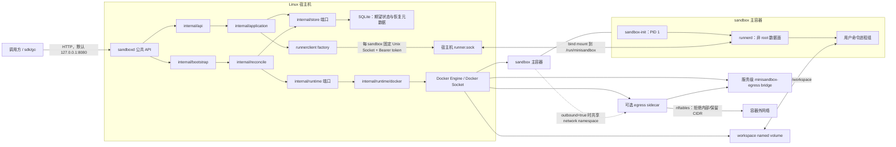
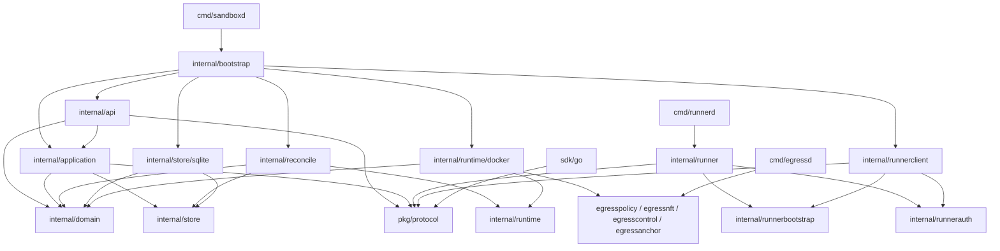
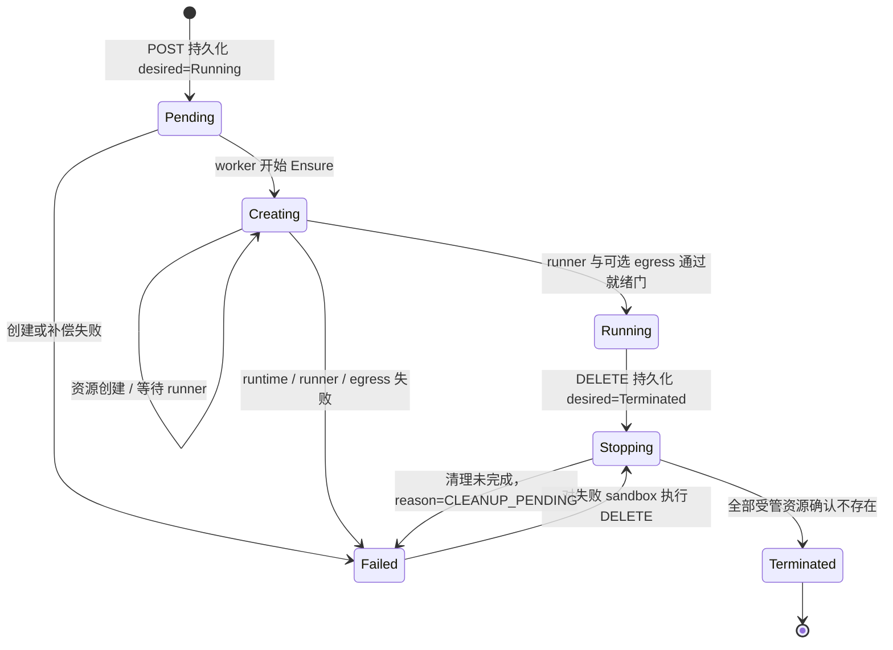

# MiniSandbox 当前项目状态、架构层次与模块依赖

> 本文是面向开发、评审和运维人员的代码现状说明。它描述“当前仓库实际已经实现了什么”，而不是仅复述阶段计划。
> 架构与安全边界的正式单一事实源仍是[总体设计文档](../all-go-agent-sandbox-runtime-design.md)，公共协议的单一事实源仍是
> [`api/*.openapi.yaml`](../../api/)。

## 1. 文档快照与结论

### 1.1 快照口径

| 项目 | 当前值 |
|---|---|
| 审阅日期 | 2026-08-09，Asia/Shanghai |
| 分支 | `main` |
| 本文生成前 HEAD | `36073e14fa360bd34f9f6087ce16e8269b8f1c52` |
| Phase 2 被测生产代码基线 | `440c73c0fac180d9cf6cb4feec221c75cc880387` |
| 基线一致性 | `440c73c..HEAD` 在 Go、API、配置、构建文件和依赖清单上无差异；之后只有文档提交 |
| Go module | `minisandbox` |
| `go.mod` 语言版本 | Go `1.26.0` |
| 本次普通检查环境 | `go1.26.4 windows/amd64` |
| 当前完成阶段 | Phase 1、Phase 2 已验收；Phase 3、Phase 4 尚未实施 |

审阅时工作区已经存在其他未提交文档、本地脚本和构建产物。本文只把受版本控制的生产代码、契约、配置、测试和验收报告作为判断依据；本文提交不包含那些既有改动。

### 1.2 一句话结论

MiniSandbox 当前已经是一个可在单机 Linux Docker Engine 上运行的、全 Go 实现的 Agent 命令沙盒原型：它具备异步生命周期管理、SQLite 期望状态、Docker 幂等收敛、容器内非 root 命令执行、前台 SSE、后台任务、完整进程组取消、PID 1 孤儿回收，以及可选的 egress sidecar 出站隔离。

它还不是面向公网和恶意多租户的生产平台：没有公共 API 鉴权/租户/配额，没有 TTL、续期、幂等创建、周期漂移修复、指标和管理诊断，也没有 microVM、gVisor 或 Kata 级别的强隔离。

### 1.3 阶段状态

| 阶段 | 状态 | 已交付 | 尚未交付 |
|---|---|---|---|
| Phase 1：Docker 生命周期 | 已完成并验收 | create/get/delete、SQLite、Docker adapter、reconcile、失败补偿、启动恢复、Unix Socket、嵌入式 runner/init | 不适用 |
| Phase 2：执行与受控出站 | 已完成并验收 | argv/shell、前台 SSE、后台 status/logs/cancel、timeout、进程组、非 root、PID 1、输出上限、retention GC、egress sidecar/nft | 不提供更细粒度 FQDN/端口 allowlist、sidecar 自动重启 |
| Phase 3：可靠性 | 未开始；仅有预留 | `ExpiresAt` 字段、TTL 判断 helper、`Scheduler` 类型和部分配置字段 | TTL/renew、Idempotency-Key、全局 admission、持久 retry、周期 reconcile、orphan 处理、metrics/diagnostics |
| Phase 4：Agent 体验 | 未开始 | 无生产闭环 | 文件 API、PTY、端口代理、镜像预拉取、TS/Python SDK 等 |
| 更远期 | 仅设计方向 | 无 | Kubernetes、Pool、快照、gVisor/Kata/microVM |

### 1.4 当前验证结论

本次审阅执行了以下只读或无源码写入的检查：

| 检查 | 结果 | 说明 |
|---|---|---|
| `go test ./...` | PASS | 普通单测、协议测试和 artifact contract 测试通过；带 `integration` build tag 的真实 Docker 测试不在本命令内 |
| `go vet ./...` | PASS | 无输出 |
| tracked Go files `gofmt -l` | PASS | 无输出 |
| `git diff --check` | PASS | 包括审阅前已存在的工作区文档改动 |
| `go mod tidy -diff` | 有差异 | `opencontainers/image-spec` 和 `x/sys` 被源码直接导入，但仍被列在 indirect 组 |

[Phase 2 最终验收报告](../reports/phase2-acceptance.md)记录：在原生 Linux/amd64 Docker Engine 上，39 个顶层 integration/security tests 全部执行，耗时 119.7 秒，无 FAIL、无 SKIP；Phase 2 核心条件 13/13 PASS，G1～G7 全部 PASS。本次 Windows 审阅没有重新执行这一 opt-in 套件，因此“当前普通回归通过”和“历史原生 Docker 验收通过”应分开理解。

## 2. 当前能力边界

### 2.1 已经可以使用的能力

| 能力 | 实现状态 | 关键入口 |
|---|---|---|
| 控制面健康与就绪 | 已实现 | `GET /healthz`、`GET /readyz` |
| 创建 sandbox | 已实现，异步 `202` | `POST /v1/sandboxes` |
| 查询生命周期 | 已实现 | `GET /v1/sandboxes/{sandbox_id}` |
| 删除 sandbox | 已实现，异步且幂等 | `DELETE /v1/sandboxes/{sandbox_id}` |
| Docker 资源幂等创建 | 已实现 | `runtime/docker.Runtime.Ensure` |
| 创建失败补偿 | 已实现 | operation journal + 全量幂等 Delete |
| 控制面启动恢复 | 已实现基础版本 | Store/Docker 扫描、关联、重新入队、安全诊断 |
| 前台 argv/shell 执行 | 已实现 | 公共 HTTP → runner Unix Socket → SSE |
| 后台执行 | 已实现 | 创建、状态、cursor 日志、取消 |
| 超时、取消、断开 | 已实现 | 统一终态裁决和完整进程组 TERM→KILL |
| stdout/stderr 区分 | 已实现 | Base64 wire event，sequence 单调递增 |
| 输出预算 | 已实现 | 达到预算后继续排空，发出一次截断事件并保留终态 |
| completed execution GC | 已实现 | 按保留时间和数量清理内存记录与 NDJSON 日志 |
| 非 root 用户命令 | 已实现 | 默认固定 UID/GID `1000:1000` |
| 容器 PID 1 | 已实现 | 信号转发、唯一 `wait4` 路径、孤儿回收、退出码传播 |
| 默认断网 | 已实现 | Docker `network=none` |
| 可选受控 outbound | 已实现，默认关闭 | 每 sandbox egress sidecar + nftables deny policy |
| Go SDK | 部分完整 | 生命周期和后台 execution 管理已封装；没有前台 SSE 高层方法 |

### 2.2 明确未实现的能力

- `POST /v1/sandboxes/{sandbox_id}/renew` 仍固定返回 `501 NOT_IMPLEMENTED`，而且没有进入公共 OpenAPI。
- 创建请求不支持 TTL，`ExpiresAt` 始终为 `nil`，SQLite schema 也没有 lease/expiry 字段。
- 不支持 `Idempotency-Key`、创建请求重放、全局 sandbox 数量 admission 或持久化 retry/backoff。
- 没有周期性 Store/Docker 对账；`internal/reconcile.Scheduler` 已定义但生产 bootstrap 未装配。
- 对稳定 `Running` 记录不会周期重新探测 Docker、runner 或 egress；运行期漂移主要在新 execution 的 health/admission gate 上 fail closed。
- 启动恢复会报告 orphan、重复资源和 spec drift，但不会自动接管或删除 orphan。
- 没有 `/metrics`、管理诊断 API、审计事件系统或持续依赖健康监控。
- 没有 workspace 文件 API、持久 workspace、快照、PTY、端口代理、Pool 或镜像预拉取。
- 没有 TypeScript/Python SDK；Go SDK 也尚未封装前台 SSE 消费。
- 没有 Kubernetes、gVisor、Kata、microVM 或 nested sandbox。

## 3. 运行时总体架构

### 3.1 进程与资源拓扑



### 3.2 四个生产进程

| 进程 | 所在位置 | 身份与权限 | 核心职责 | 禁止承担的职责 |
|---|---|---|---|---|
| `sandboxd` | 宿主机 | 需要访问 Docker socket、SQLite 和受管目录 | 公共 HTTP、配置装配、期望状态、reconcile、Docker 编排、runner 代理 | 不得在宿主机直接执行用户命令 |
| `sandbox-init` | 主容器 PID 1 | 以 root 启动，只保留固定容器能力 | 启动 runner、转发信号、唯一 `wait4` 回收、传播退出码、退出时归还日志目录 owner | 不处理 HTTP、业务、命令协议或 Docker |
| `runnerd` | 主容器 | 建立受管目录/socket 后永久降为固定非 root UID/GID，能力回验为零 | 校验并执行当前 sandbox 的命令、事件、日志、取消和 GC | 不访问 Docker socket，不管理其他 sandbox，不接受任意地址 |
| `egressd` | 可选 sidecar | bootstrap 时临时具备 `NET_ADMIN/SETUID/SETGID`；安装规则后降为固定非 root 且 capability 清零 | 持有 network namespace、安装/回验 nft、在内存保存 attestation、响应 attach inspect | 不监听网络端口，不挂载管理 socket，不支持热更新或 Docker exec |

`cmd/orphan-helper` 不是生产进程，只是 PID 1 integration test 使用的确定性 double-fork helper。

### 3.3 控制面与数据面的硬边界

- 公共客户端只能访问 `sandboxd`；不能直接选择 runner socket、sidecar、Docker container ID 或宿主机路径。
- `sandboxd` 到 `runnerd` 只允许固定 endpoint 集合，不是任意反向代理。
- 每个 sandbox 有独立的 `<run-root>/<sandbox-id>/runner.sock`；宿主目录为 `0700`，socket 为 `0600`。
- runner token 从宿主机 32 字节主密钥和 sandbox UUID 通过 HMAC-SHA256 派生；token 不写 labels、命令行或普通环境变量。
- 用户命令与 `runnerd` 当前使用相同非 root UID/GID。这阻止跨宿主和跨 sandbox 控制，但同 sandbox 内仍存在自我 DoS、同 UID 进程互相发信号或干扰日志的已接受限制。
- outbound sidecar 只提供“拒绝内部/保留 CIDR、其他目标可出站”的网络边界，不是 FQDN、端口、协议或业务级 allowlist。

## 4. 代码分层与依赖方向

### 4.1 高层依赖图



### 4.2 依赖规则

| 层次 | 允许依赖 | 不应依赖 |
|---|---|---|
| `internal/domain` | Go 标准库 | HTTP、Docker SDK、SQLite driver、adapter |
| `pkg/protocol` | Go 标准库 | 任意 `internal/**` |
| `internal/application` | domain、store 端口、protocol、显式 client interface | HTTP handler、Docker adapter、SQLite adapter |
| `internal/api` | application、domain、protocol、`net/http` | Docker/SQLite 具体实现 |
| `internal/reconcile` | domain、runtime/store 端口、runner probe/shutdown 端口 | HTTP、Docker/SQLite 具体类型 |
| `internal/runtime` / `internal/store` | domain 和必要的稳定值类型 | 具体 adapter |
| adapter | 对应端口、domain、外部 driver | API/租户/配额决策 |
| runner 数据面 | runner bootstrap/auth、protocol、OS 进程能力 | Docker SDK、Store、控制面 application |
| SDK | `pkg/protocol`、HTTP 标准库 | `internal/**` |

实际依赖总体符合上述方向。需要注意两个实现细节：

1. `internal/runnerbootstrap` 为了从控制面配置构造可信启动材料，直接依赖 `internal/config`；它是内部装配协议，不是可独立发布的 wire 包。
2. `internal/runtime` 的 egress 端口类型会引用 `egresspolicy` 和 `egressanchor` 的值对象，因此它已不再是只依赖 domain 的最小 Phase 1 端口。

## 5. 目录与模块分布

### 5.1 顶层目录

| 路径 | 作用 | 当前状态 |
|---|---|---|
| `cmd/` | 五个可执行程序入口，其中四个为生产入口、一个为测试 helper | 已实现 |
| `api/` | 公共 lifecycle/execution OpenAPI 和内部 runner OpenAPI | 已冻结为 `0.2.0`，由 contract tests 保护 |
| `internal/` | 控制面、数据面、adapter、配置、reconcile 与 egress 实现 | 主体实现 |
| `pkg/protocol/` | 控制面、runner、runnerclient、SDK 共用的稳定 HTTP/SSE wire model | 已实现 |
| `sdk/go/` | 用户侧 Go SDK | 生命周期与后台 execution 已实现，前台 SSE 缺失 |
| `configs/` | 完整示例配置 | 已实现；包含少量尚未生效的预留字段 |
| `build/egress/` | egressd 镜像构建与 artifact contract | 已实现 |
| `tests/contract/` | OpenAPI、fixture、错误码和 SDK wire 兼容测试 | 已实现 |
| `tests/integration/` | opt-in Linux/Docker 生命周期、执行、安全和 egress 测试 | 已实现，必须显式 build tag 和环境变量 |
| `tests/artifact/` | egress 构建契约测试 | 已实现 |
| `tests/security/` | 计划中的独立安全套件目录 | 目前只有说明；真实安全测试主要在 `tests/integration/` |
| `docs/` | 总体设计、ADR、阶段计划、运维指南和验收报告 | 内容丰富，但部分入口说明已滞后 |
| `OpenSandbox/` | 本地只读参考源码 | 被 Git 忽略，不属于本仓库交付 |
| `Dockerfile` | 构建 `sandboxd` 控制面镜像 | 已实现；不是用户 sandbox 镜像 |
| `Makefile` | 普通测试、构建三个主二进制和 egress 镜像 | 已实现 |

仓库目前有 366 个受版本控制的 Go 文件，其中 175 个生产/辅助源码文件、191 个 `_test.go` 文件。测试文件数量高于生产源码文件；最集中的两个实现区是 `internal/runner` 和 `internal/runtime/docker`。

### 5.2 控制面模块

| 模块 | 主要作用 | 直接内部依赖 | 状态与边界 |
|---|---|---|---|
| `internal/api` | 路由、严格 JSON、request ID、readiness、错误映射、SSE 转发 | application、domain、protocol | 已实现；handler 保持轻薄 |
| `internal/application` | create/get/delete/execute/status/logs/cancel 用例；运行状态准入 | domain、store、protocol | 已实现；不直接调用 Docker |
| `internal/domain` | Sandbox、SandboxSpec、ExecutionSpec、状态和领域错误 | 无内部依赖 | 已实现；最内层 |
| `internal/bootstrap` | 按安全顺序装配 config、目录、Store、runtime、worker、recovery、HTTP | 几乎所有控制面 adapter | 已实现；唯一生产 composition root |
| `internal/config` | 默认值、严格 YAML 加载、安全校验 | domain、egresspolicy | 已实现；部分字段是 Phase 3 预留 |
| `internal/datadir` | 创建/校验 data、DB parent、run root，收敛 `0700` | 无内部依赖 | 已实现；拒绝 symlink 和非目录 |
| `internal/reconcile` | 期望状态收敛、wake queue、keyed lock、worker、启动恢复 | domain、runtime、store | Phase 1/2 路径已实现；周期调度/TTL 未装配 |
| `internal/store` | Store 接口、CAS update model、corruption error | domain | 已实现端口 |
| `internal/store/sqlite` | SQLite WAL、migration、CRUD/CAS、候选与全量扫描 | store、domain | 已实现；schema 版本目前只有 1 |
| `internal/runtime` | Docker 无关的 Runtime/ActualSandbox/Egress 端口 | domain、egress value types | 已实现端口 |
| `internal/runtime/docker` | 镜像、volume、container、labels、artifact、network、sidecar、删除 | runtime、domain、embedded、runnerbootstrap、egress 模块 | 已实现；最大控制面 adapter |
| `internal/embedded` | `go:embed` 读取 Linux runner/init 产物 | `embed` | 已实现；二进制由构建流程生成 |
| `internal/testutil` | fake store/runtime/waker | domain、runtime、store | 仅测试 |

### 5.3 Runner 与内部通信模块

| 模块 | 主要作用 | 直接内部依赖 | 状态与边界 |
|---|---|---|---|
| `internal/runner` | runnerd 完整数据面：socket、降权、请求校验、Manager、进程组、事件、后台日志、GC | runnerauth、runnerbootstrap、protocol | 已实现；仓库中源码最多的包 |
| `internal/runnerclient` | sandboxd 到 runnerd 的 Unix Socket HTTP 客户端、health gate、SSE 解码 | runnerauth、runnerbootstrap、protocol | 已实现；endpoint 固定 |
| `internal/runnerauth` | 主密钥加载、HMAC token 派生、一次性 token 文件 | 无内部依赖 | 已实现；秘密值提供清零方法 |
| `internal/runnerbootstrap` | 单 sandbox 启动 JSON：协议、身份、限制和固定路径 | config | 已实现，协议版本为 1 |
| `internal/runnerstage` | 在宿主 runtime 目录原子发布 bootstrap JSON 和 token | config、runnerauth、runnerbootstrap | Linux 已实现；其他平台明确失败 |
| `pkg/protocol` | lifecycle、readiness、runner request、状态、SSE event、error envelope | 无内部依赖 | 已实现且有 fixture/contract tests |
| `sdk/go` | 用户侧 HTTP client 和 Go 原生 `time.Duration` 映射 | protocol | 部分完整 |

### 5.4 Egress 模块

| 模块 | 主要作用 | 直接内部依赖 | 状态与边界 |
|---|---|---|---|
| `internal/egresspolicy` | 合并内置 deny、运维追加 CIDR、Docker subnet/gateway；规范化并哈希 | 无内部依赖 | 已实现；不生成 nft 语法 |
| `internal/egressnft` | 严格 bootstrap、nft 规则编译、`nft -f -` 原子安装和只读回验 | egresspolicy | 已实现；不接受任意 nft 文本 |
| `internal/egressanchor` | netns/UID/GID/capability/no_new_privs 回验和内存 attestation | egressnft、egresspolicy | 已实现 |
| `internal/egresscontrol` | Docker attach 上的长度前缀 JSON 请求/响应、request ID/nonce 关联 | egressanchor、egressnft、egresspolicy | 已实现；首次 bootstrap 后只允许 inspect |
| `cmd/egressd` | sidecar PID 1 入口 | egresscontrol、egressnft、egressanchor | 已实现 |
| `build/egress` | 固定 builder/base digest、Debian snapshot、nft 版本、SBOM/provenance 输出契约 | 构建系统 | 已实现 |

### 5.5 入口模块

| 入口 | 装配关系 | 当前状态 |
|---|---|---|
| `cmd/sandboxd` | `main → bootstrap.Run` | 已实现；源码包注释仍错误地称为“初始化骨架” |
| `cmd/runnerd` | `main → WaitLoadBootstrapMaterial → runner.ServeConfigured` | 已实现；源码包注释仍错误地称 execution 待实现 |
| `cmd/sandbox-init` | `main → run → superviseRunner/wait4` | Unix 生产实现完整；Windows 仅保证编译 |
| `cmd/egressd` | `main → egresscontrol.Serve` | Linux sidecar 入口已实现 |
| `cmd/orphan-helper` | double-fork fixture | 测试专用，不进入生产构建 |

## 6. 核心状态与工作流

### 6.1 Sandbox 状态模型

持久化模型同时保存期望状态和观测状态：

- `DesiredState` 只有 `Running`、`Terminated`。
- `ObservedState` 有 `Pending`、`Creating`、`Running`、`Stopping`、`Terminated`、`Failed`。
- `revision` 每次实际更新递增，Store update 使用 CAS 防止过期快照覆盖并发结果。
- `reason` 是稳定机器码，`message` 是固定安全文本；底层 Docker cause、路径、token 和命令不进入公共响应。



`Failed` 在领域层被视为终态，但 Store 仍会把 `CLEANUP_PENDING` 或已经提交 `DesiredTerminated` 的 Failed 记录列为 reconcile candidate。普通创建失败目前没有持久化 backoff/自动重试。

### 6.2 sandboxd 启动

生产启动顺序固定为：

1. 读取 YAML，并在任何外部副作用前执行配置安全校验。
2. 创建/校验受管 data、数据库父目录和 run root。
3. 打开 SQLite，启用 WAL、foreign keys、5 秒 busy timeout，并执行 migration。
4. 从 `go:embed` 加载并验证 `runnerd`、`sandbox-init` 为 Linux amd64 ELF。
5. 创建 Docker client，显式连接配置中的 host 并 Ping daemon。
6. 加载 runner 主密钥，创建 runner client factory 和单 worker。
7. 执行一次 Store/Docker 启动恢复，对需要收敛的 ID 入队。
8. 只有 store、artifact、Docker、worker、recovery 全部 ready 后，HTTP `/readyz` 才返回 200。
9. 关闭时先撤销 readiness，再关闭 HTTP、worker、runtime 和 Store。

当前没有把 `reconcile.interval` 装配成周期 scheduler，所以第 7 步是一次性启动扫描，不是持续巡检。

### 6.3 创建 sandbox

```text
POST /v1/sandboxes
  → internal/api：限制 16 KiB、严格 JSON、拒绝未知字段
  → application：校验 outbound 门禁，构造 resolved SandboxSpec
  → store/sqlite：写入 Pending + DesiredRunning + revision=1
  → WakeQueue：按 sandbox ID 合并唤醒
  → reconcile：CAS 写 Creating
  → runtime/docker.Ensure：
       [outbound 时] Ensure bridge + sidecar + nft + attestation
       Inspect 确定性主容器
       创建 runtime directory
       inspect/pull 用户镜像
       创建受管 workspace volume
       以停止态创建主容器
       通过 Docker Copy API 注入 runnerd/sandbox-init
       发布 bootstrap JSON 与一次性 runner token
       启动主容器
  → runnerclient：通过固定 Unix Socket 校验 token、service、protocol、netns
  → [outbound 时] 比较 runner netns、sidecar netns、attestation 和 Docker network mode
  → store/sqlite：CAS 写 Running
```

`POST` 返回 `202` 只表示创建意图已经落库，不表示容器已就绪。客户端必须轮询到 `Running` 后再执行命令。

### 6.4 命令执行

前台和后台共用以下核心路径：

1. 公共 handler 校验 sandbox/execution ID、content type、accept、body 上限和严格 JSON。
2. application 从 Store 读取 sandbox；只有 `desired=Running && observed=Running` 才允许继续。
3. outbound sandbox 在每次新 execution 前执行只读 egress admission；查询和取消既有任务不依赖这个 gate。
4. runnerclient 从 sandbox ID 推导唯一 socket path和 HMAC token，先执行受缓存时间限制的 health gate。
5. runner 校验 argv/shell 二选一、timeout、环境变量预算、cwd 和并发上限。
6. 命令在独立进程组中启动，stdout/stderr 分别由 reader 持续排空。
7. EventSequencer 分配从 1 开始的单调 sequence；EventStore 执行输出预算。
8. TerminalArbiter 在 exit、cancel、timeout、前台断开、runner shutdown 和内部失败之间选择唯一赢家。
9. timeout/cancel 使用同一 `SIGTERM → grace → SIGKILL` 进程组终止器，等待主进程和 pipe readers 收敛后才发布终态。

前台模式返回 `200 text/event-stream`；客户端在终态前断开会取消任务。后台模式返回 `202 application/json`；创建请求断开不会取消任务，后续通过 status/logs/cancel 管理。

### 6.5 后台日志和保留

- 后台事件按 NDJSON 写入 `/run/minisandbox/executions`，该目录位于宿主 runtime bind mount 内。
- 日志以 event sequence 为 cursor；返回页必须连续，terminal 只能出现在最后一项。
- 默认单页最多 256 个事件、编码前 1 MiB。
- 默认终态至少保留 1 小时，每 sandbox 最多保留 100 个终态 execution。
- GC 每 250 ms 扫描一次；先从 Manager 查询集合移除，再安全删除经过验证的 regular log file；删除失败进入下一轮重试。
- 删除 sandbox 时先调用 runner shutdown 取消全部 execution，再删除主容器和 runtime directory，日志随 runtime directory 一并清理。

### 6.6 删除 sandbox

```text
DELETE
  → application：读取记录，CAS 写 DesiredTerminated，重复请求幂等
  → reconcile：CAS 写 Stopping
  → runner shutdown：关闭新任务准入并取消全部活动 execution
  → 删除主容器
  → 主容器确认不存在后，才删除 egress sidecar
  → 删除非持久 workspace volume（不使用 Force）
  → 删除经过路径证明的单 sandbox runtime directory
  → CAS 写 Terminated，并保留 SQLite 记录
```

删除步骤 best-effort 执行并聚合错误。任一资源仍未清理时记录 `Failed/CLEANUP_PENDING`，后续重复 DELETE 或 reconcile 可以继续；不会为了清理便利删除身份不匹配的同名资源。

服务级 `minisandbox-egress` bridge 不随单个 sandbox 删除。测试和运维清理必须先确认其 `Containers={}`，再按精确身份处理。

### 6.7 启动恢复和运行期漂移

启动恢复会：

- `Runtime.ListManaged` 枚举带 `minisandbox.io/managed=true` 的容器；
- `Store.ListAll` 读取全部持久化记录；
- 对候选、缺失 runtime、已有 runtime 和待删除记录重新入队；
- 在安全条件下恢复变化的 Docker runtime ID；
- 对 orphan、spec drift、重复 runtime、损坏 labels/schema/state 只发稳定诊断码。

当前不会自动删除或接管 orphan，也不会修复未知 schema。更重要的是，`ObservedState=Running` 的记录进入 Reconciler 后会直接 no-op，因此“外部删除主容器、runner 后续失效、长期运行漂移”还没有周期性状态修复；这是 Phase 3 的核心范围。outbound 新 execution 会额外执行 sidecar/netns 检查并 fail closed，但这不等价于完整生命周期重收敛。

### 6.8 受控 outbound

只有同时满足以下条件才允许创建 outbound sandbox：

1. 服务端 `security.allow_outbound=true`；
2. `egress.image` 是通过配置校验的精确 `repository@sha256:<digest>`；
3. 创建请求显式提交 `network.outbound=true`。

策略由三部分合并：代码内置 IPv4/IPv6 内部与保留 CIDR、Docker 实际 bridge subnet/gateway、运维只增不减的 `egress_denied_cidrs`。策略会排序、去重、折叠并计算稳定 SHA-256 hash。

sidecar 首次启动前，sandboxd 先建立 Docker attach；启动后发送唯一 bootstrap。egressd 原子安装 nft、回验规则、校验 netns、降权并生成只驻留进程内存的 attestation。之后只能重新 attach 做只读 inspect，每次使用新的 128-bit request ID 和 256-bit nonce。任何协议、镜像、policy hash、容器配置、capability 或 netns 不一致都会拒绝新 execution。

## 7. API、协议和数据模型

### 7.1 三类通信协议

| 边界 | 传输 | 契约/模型 | 鉴权与约束 |
|---|---|---|---|
| 用户 → `sandboxd` | loopback TCP HTTP/JSON/SSE | `api/lifecycle.openapi.yaml` + `pkg/protocol` | 当前无用户鉴权；监听地址必须是 loopback |
| `sandboxd` → `runnerd` | 每 sandbox Unix Socket 上的 HTTP/JSON/SSE | `api/runner.openapi.yaml` + `pkg/protocol` | 每 sandbox HMAC 派生 Bearer token、固定 endpoint allowlist |
| `sandboxd` → `egressd` | Docker attach stdin/stdout | 4 字节大端长度 + 封闭 JSON | 随机 request ID/nonce、bootstrap once、inspect-only、无网络 listener |
| `sandboxd` → container bootstrap | 受管 bind mount 中的文件 | `runnerbootstrap.Config` JSON + 一次性 token file | `0600`、原子 rename、token 读取后删除 |
| 控制面内部持久化 | SQLite | 显式 stored DTO | WAL、CAS revision、schema migration |

### 7.2 公共 API

| 方法与路径 | 成功响应 | 作用 |
|---|---|---|
| `GET /healthz` | `200` | 进程存活和 build 信息 |
| `GET /readyz` | `200` / `503` | store、artifact、Docker、worker、recovery 聚合状态 |
| `POST /v1/sandboxes` | `202` + Sandbox | 提交创建意图 |
| `GET /v1/sandboxes/{sandbox_id}` | `200` + Sandbox | 查询最近一次持久化状态 |
| `DELETE /v1/sandboxes/{sandbox_id}` | `202` / `204` | 提交删除意图；已 Terminated 为 204 |
| `POST /v1/sandboxes/{sandbox_id}/executions` | 前台 `200 SSE`；后台 `202 JSON` | 创建命令执行 |
| `GET /v1/sandboxes/{sandbox_id}/executions/{execution_id}` | `200` | 查询后台 execution |
| `GET .../{execution_id}/logs?cursor=&limit=` | `200` | cursor 分页读取事件 |
| `DELETE .../{execution_id}` | `202` / `204` | 取消活动任务；终态为幂等 no-op |

实现还注册了 `POST /v1/sandboxes/{sandbox_id}/renew`，但它固定返回 501，公共 OpenAPI 和 contract tests明确要求当前契约不包含 renew。

### 7.3 Runner 内部 API

| 方法与路径 | 用途 |
|---|---|
| `GET /healthz` | 返回 service/version/protocol/netns identity |
| `POST /v1/executions` | 前台或后台执行 |
| `GET /v1/executions/{execution_id}` | 状态 |
| `GET /v1/executions/{execution_id}/logs` | 后台日志 |
| `DELETE /v1/executions/{execution_id}` | 取消 |
| `POST /v1/shutdown` | 关闭准入并取消全部 execution |

最后一个 shutdown endpoint 已在实现和单测中使用，但尚未写入 `api/runner.openapi.yaml`，属于内部契约文档缺口。

### 7.4 Execution 状态和事件

后台状态为：`Pending`、`Running`、`Exited`、`Failed`、`Cancelled`、`TimedOut`。

SSE/日志事件为：

- 非终态：`started`、`stdout`、`stderr`、`output_limit_reached`；
- 唯一终态：`exited`、`failed`、`cancelled`、`timed_out`。

非零退出码仍是 `Exited/exited`，调用方通过 `exit_code` 判断命令业务结果；`Failed/failed` 只表示校验、启动或 runner 内部处理失败。stdout/stderr 原始字节使用标准 Base64，避免 UTF-8 假设破坏二进制输出。

### 7.5 SQLite 模型

当前 migration 版本只有 1，包含：

- `schema_migrations`：记录已应用版本；
- `sandboxes`：`id`、`spec_json`、desired/observed state、reason/message、runtime ID、spec hash、revision 和三个 UTC 时间字段；
- `(desired_state, observed_state)` reconcile candidate 索引。

没有 execution 表；execution 状态由每个 runner 进程内 Manager 持有，后台事件另存于 runtime 目录 NDJSON。没有 TTL、idempotency、retry、anomaly 或 audit 表。`Terminated` sandbox 记录不会物理删除。

### 7.6 Docker 资源和恢复标识

每个 sandbox 的确定性资源包括：

| 资源 | 名称/位置 | 生命周期 |
|---|---|---|
| 主容器 | `minisandbox-<uuid>` | sandbox 创建到删除 |
| workspace | `minisandbox-workspace-<uuid>` named volume | 非持久，随 sandbox 删除 |
| runtime directory | `<data.directory>/run/<uuid>` | 包含 bootstrap、socket 和 execution 日志 |
| runner socket | `<runtime-directory>/runner.sock` | runner 生命周期 |
| egress sidecar | `minisandbox-egress-<uuid>` | 仅 outbound sandbox；主容器删除后再删除 |
| egress bridge | `minisandbox-egress` | 服务级共享，不随单 sandbox 删除 |

主容器和 workspace 的恢复 labels 包含 managed、sandbox ID、schema version、spec hash、空 expires-at、workspace 名和 runner protocol version。sidecar/bridge 使用独立 resource-role、policy hash、image digest 和 egress protocol labels。token、命令、环境变量、输出、凭据和宿主机路径都不属于 label schema。

## 8. 安全模型

### 8.1 已实现的安全控制

- 公共控制面只能监听 loopback；配置为非 loopback 时启动失败。
- `sandboxd` 不使用 `os/exec` 执行用户命令，用户命令只能在 runner 数据面创建。
- 主容器 `Privileged=false`、`CapDrop=ALL`，只回加 `CHOWN/SETUID/SETGID/KILL` 供 init/runner bootstrap；启用 `no-new-privileges`。
- 用户命令执行前，runner 永久降为固定非 root UID/GID，清空 supplementary groups 和 effective/permitted/ambient capabilities，并回验身份。
- 默认 Docker network 为 `none`；不发布端口、不挂 Docker socket、不接受任意 device 或用户提供的宿主机 mount。
- `cwd` 必须在 `/workspace` 内，Linux 实现会解析 symlink 后再次验证，阻止 `..` 和链接逃逸。
- runner 内部请求体、header、path、环境变量、输出、单页日志和并发数都有上限。
- token、主密钥、用户 env、命令和输出不进入 labels；公共错误使用固定 allowlist 文案。
- cancel、timeout、前台断开、runner shutdown 共用完整进程组终止语义。
- egress sidecar 只读 rootfs、无 mount、无 port、无 Docker logs、无 restart policy；完成 bootstrap 后非 root 且 capability 为零。

### 8.2 仍然存在的安全边界

- 隔离基础仍是普通 Docker container，不应宣称等价于 microVM 或恶意多租户强隔离。
- 公共 API 没有认证、授权、租户隔离、配额和审计，只适合受信 loopback 调用方。
- 主容器 rootfs 当前不是只读；用户工作区是可写 named volume。
- runner 与用户命令同 UID，当前 sandbox 内的自我 DoS、同 UID 信号干扰和日志篡改属于已接受风险。
- outbound 是 deny-CIDR 模型，不识别 FQDN、端口、应用协议或位于公网地址的云元数据服务。
- sidecar 退出后不自动重启；新 execution 会 fail closed，但没有 Phase 3 自动修复闭环。
- Docker daemon 和宿主机目录仍是高权限可信计算基，部署错误会直接削弱边界。

## 9. 配置现状

### 9.1 已生效配置

| 分组 | 关键默认值 | 使用位置 |
|---|---|---|
| `server` | `127.0.0.1:8080`、shutdown `10s` | HTTP listener 和关闭边界 |
| `data` | `/var/lib/minisandbox`、SQLite path | 受管目录、Store、Docker runtime directory |
| `runtime` | Docker socket、linux/amd64、network none | Docker adapter 和默认 SandboxSpec |
| `limits.default_resources` | 500 millicpu、512 MiB、128 PIDs | 主容器资源限制 |
| `limits.max_resources` | 4000 millicpu、8192 MiB、1024 PIDs | 创建规格上限 |
| `runner` | UID/GID 1000、`/workspace`、10m/1h timeout、8 并发、10 MiB 输出 | runner bootstrap 和数据面限制 |
| `security` | 主密钥文件、outbound 默认 false | runner auth 和网络门禁 |
| `egress` | protocol 1、30s、UID/GID 65532、100m/64MiB/16 PIDs | sidecar artifact/策略/资源 |
| `reconcile` | runner ready 30s、delete 30s | probe 和单任务 worker timeout |

### 9.2 已声明但尚未真正生效或存在隐含约束的配置

| 字段 | 当前事实 | 风险/后续动作 |
|---|---|---|
| `limits.default_ttl` / `maximum_ttl` | 只加载和校验；创建记录仍令 `ExpiresAt=nil` | Phase 3 接入前不能把它们当实际租约 |
| `reconcile.interval` | 只加载和校验；生产没有创建 `Scheduler` | 当前无周期对账 |
| `runtime.workspace_directory` | 只加载和校验；workspace 实际使用 Docker named volume | 应删除失真字段或在未来明确接线 |
| `runtime.default_image` | 进入 default spec，但 application builder 会被公共请求 image 无条件覆盖；OpenAPI 要求 image | 当前并不提供“省略 image 使用默认值”的行为 |
| `runtime.runner_socket_directory` | runnerclient 使用该值；Docker runtime 总是使用 `<data.directory>/run` | 两者必须相等，当前代码未显式校验这一隐含耦合 |
| `runtime.network_mode` | 只允许 `none` | outbound 不是通过该字段开启，而是服务端 allow flag + 请求布尔值 + sidecar |

## 10. 构建、产物与外部依赖

### 10.1 构建链

`make build` 的顺序是：

1. 交叉编译静态 Linux/amd64 `runnerd`；
2. 交叉编译静态 Linux/amd64 `sandbox-init`；
3. 把二者写到 `internal/embedded/artifacts/linux_amd64/`；
4. 编译 `sandboxd`，此时 `go:embed` 把两个产物打入控制面；
5. 同时把三个可执行文件输出到 `bin/`。

`make egress-image` 独立使用 `build/egress/Dockerfile` 构建 egress 镜像，并要求 BuildKit 生成 SBOM、provenance 和 metadata。生产配置只接受精确 OCI digest，不接受浮动 tag。

根 `Dockerfile` 只构建 `sandboxd` 控制面镜像；最终镜像是 distroless non-root。它不是用户 sandbox 镜像。用户 sandbox 可以使用任意满足基本运行条件的 linux/amd64 镜像，runner/init 由控制面注入。

### 10.2 直接生产依赖

| 依赖 | 版本 | 用途 |
|---|---:|---|
| `github.com/moby/moby/api` | `v1.55.0` | Docker API 类型 |
| `github.com/moby/moby/client` | `v0.5.0` | Docker Engine client |
| `modernc.org/sqlite` | `v1.54.0` | 纯 Go SQLite driver |
| `go.yaml.in/yaml/v3` | `v3.0.4` | 严格 YAML 配置 |
| `github.com/distribution/reference` | `v0.6.0` | 容器镜像引用解析 |
| `github.com/containerd/errdefs` | `v1.0.0` | Docker/containerd 错误分类 |
| `github.com/opencontainers/image-spec` | `v1.1.1` | OCI platform 类型 |
| `golang.org/x/sys` | `v0.46.0` | Linux credential、capability、netns 等系统调用 |

后两项被生产源码直接导入，但在当前 `go.mod` 中仍标为 indirect；`go mod tidy -diff` 会把它们移动到直接依赖组，不改变版本。

## 11. 测试架构与质量状态

### 11.1 测试分层

| 层次 | 位置 | 重点 |
|---|---|---|
| 单元测试 | 各 `internal/**`、`pkg/**`、`sdk/go` | 状态机、校验、CAS、错误映射、竞态和失败路径 |
| adapter 测试 | `internal/runtime/docker`、`internal/store/sqlite` | 窄 fake engine、真实临时 SQLite、资源身份和补偿 |
| contract tests | `tests/contract` | OpenAPI 解析、禁止扩面、fixture、SDK/protocol 一致性 |
| artifact tests | `tests/artifact` | egress artifact contract |
| integration/security | `tests/integration` | 真实 Linux/Docker、PID 1、进程组、权限、socket、netns、nft、清理 |

### 11.2 规模分布

| 区域 | 生产文件 | 测试文件 | 说明 |
|---|---:|---:|---|
| `internal/runner` | 61 | 42 | 最大实现区，覆盖执行全生命周期 |
| `internal/runtime/docker` | 24 | 24 | Docker 与 egress 编排 |
| `internal/api` | 7 | 8 | 公共 handler 与错误映射 |
| `internal/application` | 5 | 6 | 用例与 admission |
| `internal/reconcile` | 8 | 4 | 测试文件少但单文件测试体量大 |
| `internal/store/sqlite` | 3 | 8 | migration、CAS、损坏数据 |
| `tests/contract` | 0 | 16 | 跨模块协议冻结 |
| `tests/integration` | 0 | 35 | opt-in Linux/Docker 场景 |

### 11.3 当前质量判断

优势：

- 测试数量和失败路径覆盖较强，尤其是 runner、Docker adapter、SQLite 和 contract。
- 安全相关行为不只靠 mock；Phase 1/2 都有真实 Linux/Docker 验收报告。
- SSE 唯一终态、进程组取消、secret isolation、socket 权限、nft/netns 都有专门测试。
- 外部依赖较少，runner 本身没有引入第三方生产依赖。

缺口：

- 仓库没有受版本控制的 CI workflow，验证主要依靠人工命令和阶段验收报告。
- `tests/security/README.md` 和 `tests/integration/README.md` 仍描述 Phase 1 口径，未准确索引现有 Phase 2 安全测试。
- 当前 Windows 普通回归不能替代 Linux build、race、staticcheck 和 Docker integration；这些必须在 Linux 验证。
- Phase 3 的时间跳变、崩溃点、持久 retry、orphan 和持续 readiness 测试尚不存在。

## 12. 已知差距与维护风险

### 12.1 文档与代码漂移

1. 根 [README](../../README.md)仍把 runner execution 描述为 `501 NOT_IMPLEMENTED`，模块表也停留在 Phase 1；这与当前 Phase 2 实现和验收报告冲突。
2. `cmd/sandboxd`、`cmd/runnerd`、`internal/config`、`internal/runtime/docker` 的部分包注释仍含“初始化骨架”“执行待实现”或“Phase 1 唯一能力”等旧表述。
3. `tests/integration/README.md` 只列 Phase 1 覆盖，但目录实际已有完整 Phase 2 执行和 egress tests。
4. 项目有多份总体说明、深度指南和阶段计划；阅读者应优先相信 OpenAPI、配置模型、领域代码和最终验收报告。

### 12.2 实现与契约缺口

1. `POST /v1/shutdown` 是 runner 删除流程依赖的真实内部 endpoint，但不在 `api/runner.openapi.yaml`。
2. Go SDK 只提供后台 execution；公共 API 已支持前台 SSE，但 SDK 没有对应消费方法。
3. `Reconciler.FailEgress` 已有单测和内部状态写入，但生产代码没有调用者；它写入的 lifecycle reason `EGRESS_UNHEALTHY` 也不在公共 `SandboxReason` 映射中。将来接线前必须同步 OpenAPI、protocol、mapper 和 contract tests。
4. `runtime.runner_socket_directory` 与 `<data.directory>/run` 的等值关系没有配置校验，非默认配置可能让容器创建 socket 的目录与控制面拨号目录分离。
5. 多个 Phase 3 配置已出现在示例 YAML，却不会改变当前行为；运维人员容易误以为 TTL 或周期 reconcile 已启用。
6. `go.mod` 的直接/间接依赖分组未通过 `go mod tidy -diff`，虽然当前 build/test 不受影响。

### 12.3 产品化缺口

- 没有版本 tag、已配置 Git remote 或仓库内 CI 发布流程。
- 没有多租户认证、授权、quota、审计和管理平面。
- 没有高可用控制面；SQLite 和单 worker 体现的是单机设计。
- 没有 schema 2、向后迁移策略和旧 sandbox 跨版本兼容矩阵。
- 没有持续 drift 修复、orphan quarantine/cleanup、retry backoff 或运维诊断 API。
- 没有对用户镜像来源、签名、registry 或内容的 allowlist；只有 egress sidecar 要求固定 digest。

## 13. 建议的下一阶段顺序

结合现有 [Phase 3 计划](../phase-3-reliability-development-plan.md)，建议按以下依赖顺序推进：

1. 先修正文档入口和当前契约漂移，明确 Phase 2 已完成及哪些配置仍是预留。
2. 冻结 TTL、renew、Idempotency-Key、diagnostics 和新增 reason/error 的 OpenAPI。
3. 设计并提交 SQLite schema 2：lease、retry、idempotency、anomaly；先完成升级兼容测试。
4. 把 `Scheduler` 接入 production bootstrap，建立有界扫描、持久 backoff 和 Running drift 策略。
5. 实现 TTL/renew revision 语义，并处理 timer、重启、时钟回拨和并发 DELETE。
6. 实现原子 idempotency replay 和全局 admission，确保重放优先于 quota。
7. 完成 orphan 分类、quarantine/cleanup 门禁和持续 readiness。
8. 加入 metrics、结构化诊断与正式 CI，再进行 Phase 3 原生 Linux/Docker 验收。

Phase 4 应继续保持在 Phase 3 之后；文件 API、PTY、端口代理会显著扩大攻击面和协议表面，不适合提前混入可靠性阶段。

## 14. 变更影响速查

| 要修改的内容 | 必须同时检查 |
|---|---|
| 公共 lifecycle/execution API | `api/lifecycle.openapi.yaml`、`pkg/protocol`、`internal/api`、application、SDK、contract fixtures/tests、用户文档 |
| runner 内部协议 | `api/runner.openapi.yaml`、`pkg/protocol`、runner、runnerclient、bootstrap protocol version、integration tests |
| Sandbox 状态/reason | domain、SQLite scanner/migration、reconcile、API mapper、OpenAPI enum、fixtures |
| 配置字段/default | `internal/config` load/default/validate、示例 YAML、bootstrap 使用点、运维文档 |
| Docker labels/资源名 | `labels.go`/`naming.go`、create/inspect/list/delete/recovery、security tests、旧资源兼容策略 |
| runner 身份/socket/token | runnerauth、runnerbootstrap、runnerstage、runner、runnerclient、Docker mount、安全 integration |
| execution 终态 | Execution model、Manager、TerminalArbiter、process waiter/terminator、SSE、日志、SDK、contract/integration |
| egress policy/协议 | ADR、artifact contract、egresspolicy/nft/control/anchor、Docker sidecar、build metadata、security integration |
| SQLite schema | migration、scanner、Store 端口、application/reconcile、恢复、向前/向后兼容测试 |

## 15. 关键文档索引

- [总体架构与安全边界](../all-go-agent-sandbox-runtime-design.md)
- [项目术语与模块指南](../project-terminology-and-module-guide.md)
- [Phase 1 验收报告](../reports/phase1-acceptance.md)
- [Phase 2 最终验收报告](../reports/phase2-acceptance.md)
- [Phase 2 使用与运维指南](../phase-2-operations-guide.md)
- [Phase 2 egress sidecar ADR](../decisions/0002-phase2-egress-sidecar-artifact.md)
- [Phase 3 可靠性计划](../phase-3-reliability-development-plan.md)
- [Phase 4 Agent 体验计划](../phase-4-agent-experience-development-plan.md)
- [公共 OpenAPI](../../api/lifecycle.openapi.yaml)
- [内部 Runner OpenAPI](../../api/runner.openapi.yaml)
- [示例配置](../../configs/sandboxd.example.yaml)
- [Integration 测试入口](../../tests/integration/README.md)

## 16. 最终判断

当前 MiniSandbox 的核心价值已经从“生命周期骨架”发展为“可验证的单机 Docker Agent 执行运行时”。Phase 2 的执行、进程、安全和 egress 设计有较完整的实现与原生验收证据，包边界也基本清晰。

下一步最重要的工作不是继续扩大功能面，而是把当前事实同步到入口文档，随后补齐 Phase 3 的持续收敛、租约、幂等、异常治理和可观测性。在这些能力完成前，项目适合受信开发环境、原型和单机 Agent 工作流验证，不应被定位为可直接暴露公网的恶意多租户生产沙盒平台。
