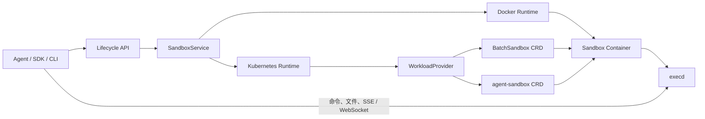
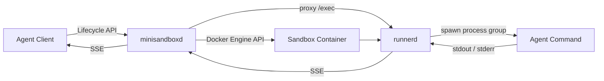
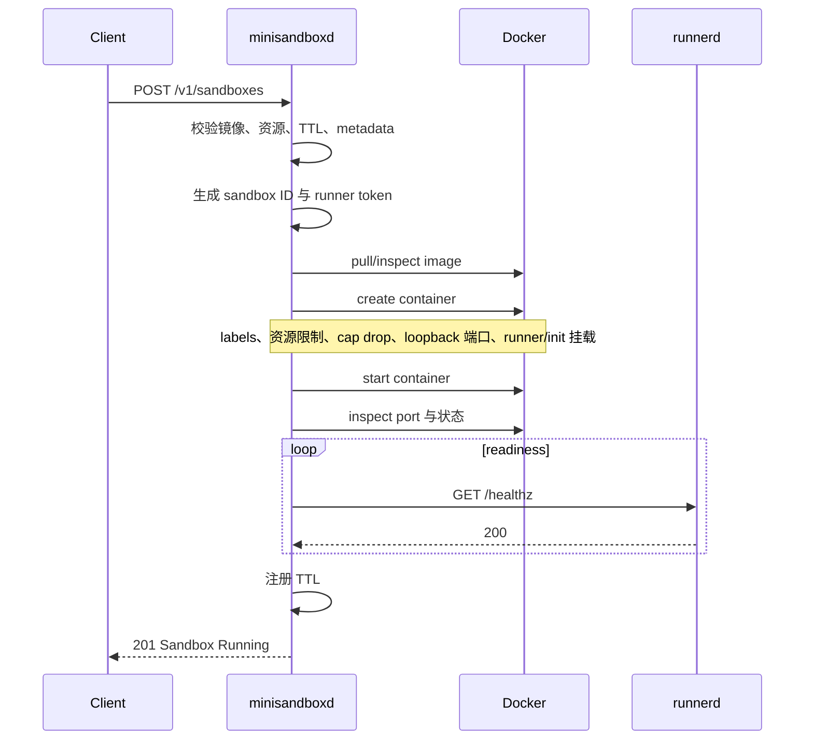

# OpenSandbox 核心 Sandbox 模块分析与 Go 简化版 Agent Sandbox Runtime 设计

> 分析基线：本地 `OpenSandbox` 仓库，提交 `d4b2905f`（2026-07-23）。
>
> 这里的 “sandbox 模块” 不是指单一目录。OpenSandbox 真正的核心是一条跨越协议、生命周期控制面、运行时后端和沙箱内执行代理的完整链路。

## 1. 结论先行

OpenSandbox 最值得模仿的不是它目前支持的全部功能，而是以下四个架构决定：

1. **控制面与数据面分离**：生命周期服务负责创建、查询、回收容器；`execd` 负责在容器内部执行命令、读写文件和流式返回结果。
2. **先定义稳定协议，再适配运行时**：生命周期协议位于 `specs/sandbox-lifecycle.yml`，执行协议位于 `specs/execd-api.yaml`；Docker、Kubernetes 和 SDK 都围绕协议实现。
3. **运行时差异收敛在 Provider 后面**：API 层不直接操作 Docker 或 Kubernetes，而是调用统一的 `SandboxService`；Kubernetes 内部又有一层 `WorkloadProvider`。
4. **“容器已启动”不等于“Agent 可工作”**：高层 SDK 先等待生命周期状态为 `Running`，再解析 `execd` 端点并调用 `/ping`，形成两级就绪检查。

如果要用 Go 写一个简化版，建议保留这些边界，但第一版只实现：

- 单机 Linux；
- Docker 后端；
- 一个 sandbox 对应一个容器；
- 创建、查询、删除、续期；
- 命令执行与 SSE 流式输出；
- 基础超时、资源限制、鉴权和重启恢复。

第一版不要实现 Kubernetes CRD、Pool、快照、Jupyter、PTY、egress sidecar、Credential Vault 和容器内二次 bubblewrap 隔离。这些能力都可以在基本生命周期可靠后再增加。

## 2. OpenSandbox 的核心到底在哪里

### 2.1 核心模块地图

| 层次 | 关键路径 | 职责 | Go 简化版如何参考 |
|---|---|---|---|
| 公共协议 | [`specs/sandbox-lifecycle.yml`](../OpenSandbox/specs/sandbox-lifecycle.yml) | 创建、查询、删除、暂停、续期、端点等生命周期契约 | 先冻结一个更小的 HTTP/JSON 契约 |
| 执行协议 | [`specs/execd-api.yaml`](../OpenSandbox/specs/execd-api.yaml) | 命令、文件、会话、代码解释器、指标协议 | 第一版只保留 health、exec、cancel、status |
| API 入口 | [`server/opensandbox_server/api/lifecycle.py`](../OpenSandbox/server/opensandbox_server/api/lifecycle.py) | 薄路由、请求校验、调用 service | Go handler 只做 decode、validate、错误映射 |
| 生命周期抽象 | [`server/opensandbox_server/services/sandbox_service.py`](../OpenSandbox/server/opensandbox_server/services/sandbox_service.py) | 定义运行时无关的生命周期能力 | 定义小而稳定的 `Runtime` interface |
| 运行时选择 | [`server/opensandbox_server/services/factory.py`](../OpenSandbox/server/opensandbox_server/services/factory.py) | 根据配置选择 Docker 或 Kubernetes | 第一版固定 Docker，但保留构造注入 |
| Docker 后端 | [`server/opensandbox_server/services/docker/docker_service.py`](../OpenSandbox/server/opensandbox_server/services/docker/docker_service.py) | 单机生命周期、TTL、资源、网络、卷、清理 | 最值得直接研究的 MVP 参考 |
| Docker 注入 | [`server/opensandbox_server/services/docker/runtime.py`](../OpenSandbox/server/opensandbox_server/services/docker/runtime.py) | 抽取并注入 `execd`、bootstrap、bwrap | 简化为挂载静态 runner 二进制和 bootstrap |
| Kubernetes 后端 | [`server/opensandbox_server/services/k8s/kubernetes_service.py`](../OpenSandbox/server/opensandbox_server/services/k8s/kubernetes_service.py) | K8s 创建编排、回滚、PVC、等待就绪 | 只作为未来多后端设计参考 |
| K8s Provider | [`server/opensandbox_server/services/k8s/workload_provider.py`](../OpenSandbox/server/opensandbox_server/services/k8s/workload_provider.py) | 屏蔽 BatchSandbox 与 agent-sandbox CRD 差异 | 将来新增 K8s 时再引入第二层 Provider |
| 沙箱内代理 | [`components/execd`](../OpenSandbox/components/execd) | 在沙箱内执行命令、文件操作、SSE/WS、指标 | Go `runnerd` 的直接原型 |
| 启动脚本 | [`components/execd/bootstrap.sh`](../OpenSandbox/components/execd/bootstrap.sh) | 同时启动 `execd` 和用户 entrypoint，转发信号 | 保留“双进程启动 + PID 1 信号处理”思路 |
| Go SDK | [`sdks/sandbox/go`](../OpenSandbox/sdks/sandbox/go) | 封装生命周期、端点、就绪等待和 SSE | 可直接参考客户端对象与等待策略 |
| K8s 控制器 | [`kubernetes`](../OpenSandbox/kubernetes) | CRD、Pool、调度、快照、任务执行 | 不属于单机 MVP，避免第一版照搬 |

需要特别注意：[`sandboxes`](../OpenSandbox/sandboxes) 目录主要放具体沙箱镜像或环境，并不是生命周期实现本身。

### 2.2 总体结构



这张图体现了 OpenSandbox 最核心的边界：

- **生命周期流量**走控制面；
- **命令和文件流量**走沙箱内代理；
- 控制面不承担命令执行本身；
- 客户端通过 sandbox ID 把两类流量关联起来。

## 3. 一次 Sandbox 创建是如何完成的

### 3.1 服务启动与后端选择

[`server/opensandbox_server/main.py`](../OpenSandbox/server/opensandbox_server/main.py) 启动 FastAPI 应用，主要完成：

- 加载配置；
- 初始化 API Key 或租户鉴权；
- 注册生命周期、诊断、Pool 和代理路由；
- 按 `runtime.type` 验证 Docker 或 Kubernetes 安全运行时；
- 初始化可观测性和可选的自动续期组件。

[`services/factory.py`](../OpenSandbox/server/opensandbox_server/services/factory.py) 根据配置创建：

- `DockerSandboxService`；
- `KubernetesSandboxService`。

路由只持有 `SandboxService`，因此 `POST /sandboxes` 最终只是校验 extensions，然后调用：

```text
sandbox_service.create_sandbox(request)
```

这是典型的“薄 Handler、厚 Service”结构。

### 3.2 请求模型先约束不变量

[`server/opensandbox_server/api/schema.py`](../OpenSandbox/server/opensandbox_server/api/schema.py) 中的 `CreateSandboxRequest` 在进入运行时前就限定了重要不变量：

- `image` 与 `snapshotId` 必须且只能出现一个；
- 使用 image 时必须提供 entrypoint；
- 非 Pool 模式必须提供资源限制；
- timeout 最小 60 秒；
- `credentialProxy.enabled` 依赖 `networkPolicy`；
- volume 必须且只能选择一种后端；
- metadata、platform、资源格式还会在 service 层继续校验。

这值得 Go 版照搬：**不要让 Docker adapter 成为第一个发现无效输入的地方**。

### 3.3 统一生命周期接口

`SandboxService` 抽象了：

- create、list、get、delete；
- pause、resume、renew；
- metadata patch；
- logs、inspect、events；
- endpoint resolution。

它让上层 API 不依赖具体运行时，但这个接口对简化版 Go 项目略宽。Go 中更适合按能力拆成几个小接口，例如：

```go
type LifecycleRuntime interface {
    Create(ctx context.Context, spec CreateSpec) (Sandbox, error)
    Inspect(ctx context.Context, id string) (Sandbox, error)
    List(ctx context.Context, filter ListFilter) ([]Sandbox, error)
    Delete(ctx context.Context, id string) error
    Renew(ctx context.Context, id string, expiresAt time.Time) error
}

type EndpointResolver interface {
    Resolve(ctx context.Context, id string, port int) (Endpoint, error)
}

type Diagnostics interface {
    Logs(ctx context.Context, id string, tail int) (io.ReadCloser, error)
}
```

第一版甚至只需要 `Create/Inspect/List/Delete/Renew`。

### 3.4 Docker 创建链路

Docker 是理解 OpenSandbox 最短、最实用的路径。

`DockerSandboxService.create_sandbox()` 的主要步骤如下：

1. 拒绝 Docker 不支持的 Pool 参数。
2. 如果从快照创建，先把 snapshot 解析成实际镜像。
3. 校验 entrypoint、metadata、platform、timeout、网络策略和卷。
4. 生成 UUID sandbox ID，并计算 `createdAt`、`expiresAt`。
5. 将系统字段写入 Docker labels，将用户变量写入 environment。
6. 拉取或检查镜像，转换 CPU、内存和 GPU 限制。
7. 准备端口、volume、网络和可选 egress sidecar。
8. 创建主容器，但先不启动。
9. 从独立 `execd_image` 中抽取 `execd`、`bootstrap.sh` 和可选 `bwrap`，复制进主容器。
10. 把 `/opt/opensandbox/bootstrap.sh` 设置为容器 entrypoint。
11. 启动主容器。
12. 安排 TTL 到期回收。
13. 返回 sandbox ID、状态和时间信息。

相关代码集中在：

- [`docker_service.py`](../OpenSandbox/server/opensandbox_server/services/docker/docker_service.py)；
- [`container_ops.py`](../OpenSandbox/server/opensandbox_server/services/docker/container_ops.py)；
- [`runtime.py`](../OpenSandbox/server/opensandbox_server/services/docker/runtime.py)。

`DockerSandboxService` 本身通过多个 mixin 组合容器、网络、卷、诊断、运行时注入和 OSSFS 能力，避免把所有实现继续堆进同一个类。Go 版不需要模仿 Python 多继承，但可以使用显式组合：

```go
type DockerRuntime struct {
    client    *client.Client
    injector *RuntimeInjector
    endpoints *EndpointResolver
    labels    *LabelCodec
}
```

这样既保留一个对外 `Runtime`，也能分别测试注入、端点和 label 逻辑。

#### 为什么不是要求所有用户镜像预装 execd

OpenSandbox 使用一个独立的 `execd_image` 作为分发载体，再把静态二进制注入用户容器。这带来三个好处：

- 用户镜像不需要继承特定基础镜像；
- `execd` 可以独立发布和升级；
- 多语言 SDK 只依赖稳定的执行协议。

代价是创建过程更复杂，还要处理目标 OS/CPU 架构、注入失败和缓存。

Go MVP 可以先将 `runnerd` 编译成静态 Linux 二进制，并从宿主机只读挂载到容器：

```text
/opt/minisandbox/bin/runnerd -> /opt/minisandbox/runnerd:ro
```

等需要支持远端 Docker、多架构或宿主机无本地二进制时，再实现 OpenSandbox 的“从 runner image 抽取并缓存”方案。

### 3.5 bootstrap 的作用

OpenSandbox 不是让 `execd` 替代用户进程，而是由 [`bootstrap.sh`](../OpenSandbox/components/execd/bootstrap.sh) 同时启动：

- 后台 `execd`；
- 前台用户 entrypoint。

脚本还负责：

- 信号转发；
- 选择 bash 或 sh；
- 初始化 execd 环境文件；
- 可选的 CA 注入；
- 等待用户进程并返回其退出码。

这解决了一个经常被低估的问题：一个普通容器通常只有一个 entrypoint，但 Agent sandbox 同时需要“控制代理”和“用户工作负载”。

Go 版也需要一个极小的 init/bootstrap。可选方案有：

1. shell 脚本启动 `runnerd` 和用户进程；
2. 写一个 Go `sandbox-init`，负责启动两个子进程、转发信号和回收僵尸进程；
3. 使用 sidecar，共享目标容器的 PID/网络/文件系统 namespace。

对于单机 Docker MVP，方案 2 最稳健：不依赖用户镜像有 bash，并能正确处理 PID 1 的信号和子进程回收。

### 3.6 Kubernetes 如何复用同一模型

Kubernetes 后端没有改变上层生命周期协议，而是增加了 `WorkloadProvider`：

- `BatchSandboxProvider` 操作 OpenSandbox 自己的 `BatchSandbox` CRD；
- `AgentSandboxProvider` 操作 `agents.x-k8s.io/v1alpha1` 的 `Sandbox` CRD。

以 `BatchSandboxProvider` 为例，创建 Pod template 时：

- init container 从 `execd_image` 复制 `execd` 和 bootstrap；
- 使用 `emptyDir` 在 init container 与主容器之间共享二进制；
- 主容器挂载这些文件并通过 bootstrap 启动；
- 默认 `automountServiceAccountToken: false`；
- 可增加 RuntimeClass、资源约束、卷和 egress sidecar；
- 状态从 CRD status、Pod readiness 和 endpoints annotation 映射成公共 sandbox 状态。

Kubernetes 服务还非常重视**副作用回滚**：如果 PVC 已创建而 CRD 创建失败，它会尝试删除工作负载；只有确认工作负载不再存活时才清理 PVC，避免活 Pod 引用已删除存储。

这个思路值得 Go 版学习：创建过程要被视为一个 saga，而不是一个不可失败的函数。

### 3.7 创建状态的一个实现细节

生命周期路由返回 HTTP `202 Accepted`，协议上表达“创建已接受”。但当前实现并非完全一致的纯异步任务模型：

- Docker service 会等待容器创建并启动后再返回；
- Kubernetes service 会等待工作负载达到可接受状态后再返回；
- 高层 Go SDK 仍会继续轮询生命周期状态，并对 `execd /ping` 做第二级健康检查。

因此，自建 Go 版需要明确选择一种语义：

- **同步创建**：直到 runner 健康才返回 `201`；
- **异步创建**：立即返回 `202 + id`，后台 reconcile，客户端轮询；
- **有限同步**：在短时间窗口内等待，超时后保持 `Pending` 并返回 `202`。

单机 MVP 推荐同步创建：实现简单、调用方体验直接。需要应对慢镜像拉取后，再演进为真正异步。

## 4. Execd：沙箱数据面的核心

### 4.1 启动结构

[`components/execd/main.go`](../OpenSandbox/components/execd/main.go) 的启动流程是：

1. 初始化 flags 和日志；
2. 加载可选的 isolation 配置；
3. 探测 bubblewrap 能力；
4. 初始化执行 Controller；
5. 初始化 OpenTelemetry；
6. 创建 Gin Router；
7. 在默认端口 `44772` 监听。

[`components/execd/pkg/web/router.go`](../OpenSandbox/components/execd/pkg/web/router.go) 注册了：

- `/ping`；
- `/command`；
- `/files`、`/directories`；
- `/session`；
- `/code`；
- `/pty`；
- `/metrics`；
- `/v1/isolated/*`。

Router 中的 access-token middleware 使用 `X-EXECD-ACCESS-TOKEN` 保护所有接口。

### 4.2 普通命令执行

普通命令执行的链路为：

```text
POST /command
  -> 解析并校验请求
  -> 构造 ExecuteCodeRequest
  -> runtime.Controller.Execute
  -> runCommand / runBackgroundCommand
  -> 事件回调转换成 SSE
```

`runCommand` 中值得借鉴的细节包括：

- 使用 `context` 实现超时和取消；
- 使用独立进程组；
- 取消时杀死整个进程组，而不只是 shell 主进程；
- stdout 与 stderr 分开落到临时文件，再由 tail goroutine 推送；
- 记录 command ID、PID、开始时间、结束时间和 exit code；
- 背景命令提供 status 与基于 cursor 的增量日志读取；
- 对客户端断开和输出流关闭做并发保护。

“杀进程组”对 Agent runtime 非常重要。只杀 `sh -c` 会留下它启动的编译器、测试进程或后台服务。

### 4.3 SSE 事件

OpenSandbox 将运行时 callback 转成以下流事件：

- init；
- stdout；
- stderr；
- result；
- status；
- error；
- complete；
- ping。

SSE 响应头延迟到第一个事件再提交，这样同步失败仍可返回结构化 JSON 错误。写事件时使用锁保护 response writer，并在流期间发送 ping。

Go 版可以把协议缩减为：

```json
{"type":"started","execId":"...","timestamp":...}
{"type":"stdout","data":"...","timestamp":...}
{"type":"stderr","data":"...","timestamp":...}
{"type":"exit","exitCode":0,"durationMs":1234,"timestamp":...}
{"type":"error","code":"EXEC_TIMEOUT","message":"...","timestamp":...}
```

每行一个 JSON 事件即可；如果严格使用 SSE，应写成：

```text
event: stdout
data: {"data":"hello\n"}

```

协议一旦发布，应通过 contract test 固定事件名、终止事件和错误语义。

### 4.4 容器隔离与 bubblewrap 隔离不是一回事

OpenSandbox 的基础隔离边界是 Docker/Kubernetes 容器。`execd` 后来又增加了可选的 isolated session：

- bubblewrap 创建 PID、UTS、IPC、cgroup 和可选网络 namespace；
-根文件系统只读；
- workspace 可选择 rw、ro 或 overlay；
-过滤 execd 自身 token 和常见 secret 环境变量；
-可使用 seccomp denylist；
-每个 session 有独立 upper dir，并支持 diff/commit。

实现位于：

- [`components/execd/pkg/isolation`](../OpenSandbox/components/execd/pkg/isolation)；
- [`components/execd/pkg/runtime/isolated_session.go`](../OpenSandbox/components/execd/pkg/runtime/isolated_session.go)；
- [`oseps/0013-isolated-execution-api.md`](../OpenSandbox/oseps/0013-isolated-execution-api.md)。

但在 Docker 中启用这层能力可能需要 `CAP_SYS_ADMIN`，并放宽 AppArmor/seccomp；这不是“免费增加安全性”。对于“一 Agent 一容器”的简化版，第一版应依赖容器边界和 Docker 默认 seccomp，不应为了 nested bubblewrap 先扩大主容器权限。

## 5. 状态、端点、TTL 和持久化

### 5.1 状态不是单独数据库里的真相

OpenSandbox 的普通 sandbox 生命周期主要从底层运行时重建：

- Docker：container status + labels；
- Kubernetes：CRD status + Pod readiness + annotations。

公共状态包含：

- `state`；
- `reason`；
- `message`；
- `lastTransitionAt`。

这个模型比单一的 `running: true/false` 更适合 Agent：模型或上层调度器可以区分镜像拉取失败、资源不足、容器退出、健康检查失败和超时回收。

### 5.2 labels/annotations 是关联键

OpenSandbox 用系统 labels/annotations 保存：

- sandbox ID；
- expiration；
- snapshot ID；
- manual cleanup；
-用户 metadata；
-扩展字段；
-端点信息等。

Go 单机版也可以让 Docker 成为第一版的事实源：

- 每个容器都带 `minisandbox.io/managed=true`；
- 带 `minisandbox.io/id`；
- 带 `minisandbox.io/expires-at`；
- 带 schema version。

进程重启后扫描这些 labels，就能恢复托管容器并重建 TTL。

### 5.3 TTL 的可靠实现

OpenSandbox Docker 后端使用内存 timer，并在服务重启时扫描已有容器恢复 timer。

Go 版应额外避免一个常见竞态：

1. 创建时安排旧到期时间的 timer；
2. 用户续期；
3. 旧 timer 到点；
4. 旧 timer 错误删除已续期 sandbox。

因此 timer 触发时必须重新 inspect 容器，比较当前 `expires-at`；只有当前值仍已过期才删除。还可以使用 generation/version 防止旧任务生效。

### 5.4 就绪是两阶段的

建议沿用 Go SDK 在 [`sdks/sandbox/go/sandbox.go`](../OpenSandbox/sdks/sandbox/go/sandbox.go) 中的策略：

1. 等待生命周期状态 `Running`；
2. 解析 runner endpoint；
3. 轮询 runner `/healthz`；
4. 任一步失败都执行 best-effort cleanup。

只检查 Docker `State.Running` 不够：bootstrap 可能失败、runner 端口可能未监听、二进制架构可能错误。

## 6. Go 简化版的推荐架构

### 6.1 MVP 假设

先显式限制范围：

- 只运行在 Linux；
- 只支持本机 Docker Engine；
- 只支持 Linux/amd64，或在构建阶段固定一种架构；
- 一个 sandbox 一个容器；
- 控制 API 只监听内网或 loopback；
- 用户代码不可信；
- 不支持宿主机任意目录挂载；
- 不支持 privileged、Docker socket 和 host network；
- 只支持命令执行，不提供 Jupyter 语义。

这些限制不是架构缺陷，而是让安全边界和失败模式保持可控。

### 6.2 两个二进制

推荐构建两个 Go 二进制：

```text
minisandboxd   # 宿主机控制面，操作 Docker
runnerd        # 注入容器的数据面，执行命令和流式输出
```

可选再增加：

```text
sandbox-init   # 容器 PID 1，启动 runnerd 与用户 entrypoint
```



推荐由 `minisandboxd` 代理 runner 流量，而不是把 runner host port 直接返回给外部客户端。这样：

- runner token 不暴露给客户端；
- 所有外部鉴权集中在控制面；
- runner 端口可以只绑定 `127.0.0.1`；
- 统一记录审计、限流和请求 ID。

### 6.3 建议目录

```text
mini-sandbox/
  cmd/
    minisandboxd/
      main.go
    runnerd/
      main.go
    sandbox-init/
      main.go
  internal/
    api/
      lifecycle_handler.go
      exec_proxy_handler.go
      middleware.go
    domain/
      sandbox.go
      errors.go
      events.go
    service/
      sandbox_service.go
      ttl_manager.go
      reconciler.go
    runtime/
      runtime.go
      docker/
        client.go
        create.go
        inspect.go
        delete.go
        endpoint.go
        labels.go
    runner/
      exec_manager.go
      process_unix.go
      stream.go
      auth.go
  api/
    openapi.yaml
  build/
    Dockerfile.runner
  tests/
    integration/
```

Handler 不直接 import Docker package；`service` 只依赖 `runtime.Runtime` 接口。

### 6.4 推荐领域模型

```go
type SandboxState string

const (
    StatePending    SandboxState = "Pending"
    StateRunning    SandboxState = "Running"
    StateStopping   SandboxState = "Stopping"
    StateTerminated SandboxState = "Terminated"
    StateFailed     SandboxState = "Failed"
)

type SandboxStatus struct {
    State            SandboxState `json:"state"`
    Reason           string       `json:"reason,omitempty"`
    Message          string       `json:"message,omitempty"`
    LastTransitionAt time.Time    `json:"lastTransitionAt"`
}

type ResourceLimits struct {
    CPUs      float64 `json:"cpus"`
    MemoryMB  int64   `json:"memoryMb"`
    PIDs      int64   `json:"pids"`
}

type CreateSandboxRequest struct {
    Image          string            `json:"image"`
    Entrypoint     []string          `json:"entrypoint,omitempty"`
    Env            map[string]string `json:"env,omitempty"`
    TimeoutSeconds int64             `json:"timeoutSeconds"`
    Resources      ResourceLimits    `json:"resources"`
    Metadata       map[string]string `json:"metadata,omitempty"`
}

type Sandbox struct {
    ID        string        `json:"id"`
    Image     string        `json:"image"`
    Status    SandboxStatus `json:"status"`
    CreatedAt time.Time     `json:"createdAt"`
    ExpiresAt time.Time     `json:"expiresAt"`
    Metadata  map[string]string `json:"metadata,omitempty"`
}
```

第一版不要使用 `map[string]string` 表达所有资源。OpenSandbox 的通用 map 便于跨平台扩展，但 Go MVP 用强类型字段更容易校验，也不容易出现 `"500m"`、`"0.5"`、`"512Mi"` 的重复解析逻辑。

### 6.5 最小 API

生命周期：

```text
POST   /v1/sandboxes
GET    /v1/sandboxes/{id}
GET    /v1/sandboxes
DELETE /v1/sandboxes/{id}
POST   /v1/sandboxes/{id}/renew
GET    /healthz
```

执行：

```text
POST   /v1/sandboxes/{id}/exec
DELETE /v1/sandboxes/{id}/exec/{execId}
GET    /v1/sandboxes/{id}/exec/{execId}
```

`POST /exec` 使用 SSE 返回输出。请求建议优先支持 argv，而不是只接受 shell 字符串：

```json
{
  "argv": ["go", "test", "./..."],
  "cwd": "/workspace",
  "env": {"CI": "true"},
  "timeoutSeconds": 120
}
```

确实需要 shell 语法时再显式提供：

```json
{
  "shell": "go test ./... && echo done",
  "cwd": "/workspace"
}
```

区分这两种模式可以减少非预期的 quoting 和 shell 差异。

## 7. Go MVP 的关键实现流程

### 7.1 创建流程



建议具体步骤：

1. 在 handler 层限制 body 大小并 decode JSON。
2. service 校验镜像 allowlist、TTL 上下界、CPU/内存/PID 上限。
3. 生成 UUID。
4. 用服务端 master key 对 sandbox ID 做 HMAC，派生 runner token。
5. 拉取或检查镜像。
6. 创建容器，设置：
   - `NetworkMode=bridge`；
   - runner 端口仅发布到 `127.0.0.1`；
   - `CapDrop=["ALL"]`；
   - `SecurityOpt=["no-new-privileges:true"]`；
   - Docker 默认 seccomp；
   - CPU、memory、PIDsLimit；
   - 禁止 privileged；
   - 禁止挂载 Docker socket；
   - 只挂载受控 workspace 和只读 runner/init。
7. 启动容器。
8. inspect Docker 自动分配的 host port。不要自己先“找空闲端口再占用”，这会产生 TOCTOU 竞态。
9. 同时检查容器状态和 runner `/healthz`。
10. readiness 超时则强制清理容器并返回结构化错误。
11. 注册 TTL。

### 7.2 runnerd 执行流程

`runnerd` 至少需要：

- token middleware；
- 每个 exec 的 ID、状态、PID/PGID、开始/结束时间；
- foreground SSE；
- `context.WithTimeout`；
- 进程组取消；
- stdout/stderr 并发读取；
- 输出上限；
- 并发执行上限；
- 退出事件恰好发送一次。

Unix 实现重点：

```go
cmd.SysProcAttr = &syscall.SysProcAttr{Setpgid: true}
```

取消时：

```go
_ = syscall.Kill(-cmd.Process.Pid, syscall.SIGKILL)
```

还必须处理以下边界：

- `cmd.Start()` 失败时仍返回终止事件；
- stdout 很大时不能阻塞子进程；
- 客户端断开时是否取消命令要有明确策略；
- 超时、显式 cancel、进程非零退出要使用不同 reason；
- 不允许无限保存日志；
- runner 停止时清理所有子进程组。

### 7.3 TTL 与重启恢复

`minisandboxd` 启动时：

1. 列出带 `minisandbox.io/managed=true` 的容器；
2. 验证 label schema version；
3. 已过期的立即回收；
4. 未过期的重新注册 timer；
5. 状态异常的标记为 `Failed` 或按策略清理；
6. 重新 inspect runner port。

不要把“进程内 map”当作唯一事实源。进程退出后它会丢失，而 Docker 容器仍然存在。

### 7.4 创建失败的补偿

创建函数要记录已完成的副作用，并逆序补偿：

```text
image pull                       无需回滚
workspace 创建成功              失败时删除临时 workspace
container create 成功           失败时 force remove
container start 成功            readiness 失败时 force remove
TTL 注册成功                    删除失败时注销 timer
```

删除 API 应设计为幂等：

- 容器已不存在仍返回成功；
- workspace 清理失败应记录并进入后台重试；
- 不应因为 timer 已不存在而使删除失败。

## 8. 安全边界

### 8.1 第一版必须有的限制

- 控制 API 至少有 API Key；
- runner 端口只绑定 loopback；
- runner 使用独立 token；
- token 不写普通日志；
- 禁止 host network；
- 禁止 privileged；
- 禁止 Docker socket；
- 默认 drop all capabilities；
- 默认 `no-new-privileges`；
- 默认以固定的非 root UID/GID 运行用户命令；确需 root 的镜像通过显式兼容 profile 开启；
- 设置 CPU、内存、PID 和执行并发上限；
- workspace host path 由服务端生成，客户端不能传任意宿主机路径；
- 镜像名称、环境变量数量、命令长度、上传大小和输出大小均有限制；
- 删除和超时必须杀掉完整容器，不只杀当前命令。

### 8.2 不要误判 Docker 权限

宿主机上的 `minisandboxd` 能访问 Docker socket，等价于拥有很高的主机权限。因此：

- 不要把 Docker socket 传入 sandbox；
- 控制面应以最小网络暴露运行；
- 严格验证用户传入的 mounts、devices、capabilities、security options；
- API 不应原样透传任意 Docker `HostConfig`；
- 生产环境应考虑将控制面放在独立节点，或进一步使用 gVisor/Kata。

### 8.3 secret 处理

runner token 可由持久化 master key 通过 HMAC 派生：

```text
token = HMAC-SHA256(masterKey, sandboxID)
```

这样服务重启后无需在 labels 中保存明文 token。master key 必须来自权限严格的配置文件或 secret manager，不能每次启动随机生成。

普通 Agent 凭证也不应长期写入容器 labels。第一版可只支持短期环境变量；需要更强安全性时，再参考 OpenSandbox egress/Credential Vault 的“凭证不直接暴露给工作负载”设计。

## 9. 哪些设计应该照搬，哪些暂时不要

| OpenSandbox 设计 | 建议 | 原因 |
|---|---|---|
| 生命周期与 execd 分离 | 照搬 | 保持控制面简单，执行协议可独立演进 |
| OpenAPI 先行 | 照搬 | SDK、server、runner 更容易做 contract test |
| Docker labels 重建状态 | 照搬 | 单机 MVP 不必先引入数据库 |
| 两级 readiness | 照搬 | 容器运行不代表 runner 可用 |
| 进程组取消 | 照搬 | 防止 Agent 子进程泄漏 |
| SSE 流式输出 | 照搬 | Agent 需要持续观察工具运行 |
| 创建失败逆序清理 | 照搬 | 避免孤儿容器、目录和端口 |
| `state + reason + message` | 照搬 | 便于 Agent 与运维自动判断失败 |
| Docker/K8s 双后端 | 延后 | 第一版会显著扩大测试矩阵 |
| BatchSandbox、Pool | 不做 | 属于高吞吐调度优化，不是基本 runtime |
| Snapshot、pause/resume | 延后 | 涉及一致性、镜像仓库和存储语义 |
| Jupyter code context | 不做 | shell/argv 已覆盖多数 coding agent |
| PTY WebSocket | 第二阶段 | 仅交互式 TUI/终端真正需要 |
| 文件 API | 第二阶段 | 先通过命令和固定 workspace 完成 MVP |
| egress sidecar | 后期 | 网络 namespace、DNS、nftables 复杂度高 |
| nested bubblewrap | 谨慎后期 | 可能需要扩大容器权限，需单独威胁建模 |
| 一个很宽的 Runtime interface | 不照搬 | Go 中按能力拆小接口更容易测试和扩展 |

## 10. 推荐开发阶段

### Phase 0：协议和领域模型

完成：

- OpenAPI；
- sandbox 状态机；
- 错误码；
- SSE 事件；
- `Runtime` interface；
- fake runtime 单元测试。

验收标准：

- handler 不依赖 Docker；
- 所有公共错误都有稳定 code；
- contract test 能固定 JSON 和 SSE 格式。

### Phase 1：Docker 生命周期

完成：

- create/get/list/delete；
- labels；
-资源限制；
- loopback 端口；
- workspace；
-容器启动失败回滚。

验收标准：

- 可创建一个最小 Linux 容器；
- 删除幂等；
- `minisandboxd` 重启后仍能发现已有 sandbox；
- 无 Docker socket、privileged、host network 泄漏。

### Phase 2：runnerd 和命令流

完成：

- `/healthz`；
- argv 执行；
-可选 shell 执行；
-SSE stdout/stderr/exit；
-timeout/cancel；
-进程组清理；
-输出与并发限制。

验收标准：

- 能运行 `go test ./...` 并实时看到输出；
- timeout 后无残留子进程；
-客户端断开行为符合既定策略；
-终止事件只出现一次。

### Phase 3：可靠性

完成：

- TTL；
-续期；
-重启恢复；
-周期 reconcile；
-请求 ID、结构化日志、基本 metrics；
-启动失败和孤儿资源清理。

验收标准：

-旧 timer 不会删除已续期 sandbox；
-服务崩溃重启后过期资源仍会被回收；
-并发 create/delete/renew 通过 `go test -race`。

### Phase 4：Agent 体验

按实际需求选择：

-文件上传下载；
-PTY；
-后台命令和 cursor 日志；
-端口代理；
-镜像预热；
-客户端 SDK。

### Phase 5：更强隔离或集群化

再考虑：

- gVisor/Kata RuntimeClass；
-Kubernetes provider；
-Pool；
-快照；
-egress 策略；
-凭证代理；
-per-execution bubblewrap。

## 11. 测试清单

### 单元测试

- 请求校验；
- 状态映射；
- Docker 错误到公共错误码的映射；
- label 编解码；
- TTL generation；
- SSE 事件顺序；
- 输出截断；
- HMAC token 派生；
-路径规范化和 workspace 越界。

### Docker 集成测试

- 创建、health、exec、删除完整链路；
- 镜像不存在；
- runner 二进制架构错误；
- entrypoint 立即退出；
- 内存和 PID 限制；
- 命令超时并杀死孙进程；
- 大 stdout/stderr；
- 服务重启后恢复 TTL；
- 续期与旧 timer 竞态；
-并发删除；
-host port 只绑定 `127.0.0.1`；
-容器内看不到 Docker socket 和控制面 secret。

### 故障注入

- Docker daemon 暂时不可用；
- create 成功但 start 失败；
- start 成功但 runner health 失败；
- delete 过程中 daemon 断连；
- SSE 客户端中途断开；
-控制面在创建中途崩溃。

## 12. 推荐阅读顺序

如果准备开始编码，建议按以下顺序读 OpenSandbox，而不是从整个仓库逐文件看：

1. [`specs/sandbox-lifecycle.yml`](../OpenSandbox/specs/sandbox-lifecycle.yml)：先理解公共资源和状态。
2. [`services/sandbox_service.py`](../OpenSandbox/server/opensandbox_server/services/sandbox_service.py)：理解生命周期边界。
3. [`api/lifecycle.py`](../OpenSandbox/server/opensandbox_server/api/lifecycle.py)：确认 API 层保持多薄。
4. [`docker/docker_service.py`](../OpenSandbox/server/opensandbox_server/services/docker/docker_service.py)：追创建、TTL、删除。
5. [`docker/container_ops.py`](../OpenSandbox/server/opensandbox_server/services/docker/container_ops.py)：看容器参数和启动。
6. [`docker/runtime.py`](../OpenSandbox/server/opensandbox_server/services/docker/runtime.py)：看 execd 如何注入。
7. [`components/execd/bootstrap.sh`](../OpenSandbox/components/execd/bootstrap.sh)：看双进程启动和信号。
8. [`components/execd/pkg/web/router.go`](../OpenSandbox/components/execd/pkg/web/router.go)：看数据面 API 分组。
9. [`components/execd/pkg/web/controller/command.go`](../OpenSandbox/components/execd/pkg/web/controller/command.go)：看命令 API 到 runtime 的转换。
10. [`components/execd/pkg/runtime/command.go`](../OpenSandbox/components/execd/pkg/runtime/command.go)：看进程、超时、输出和清理。
11. [`sdks/sandbox/go/sandbox.go`](../OpenSandbox/sdks/sandbox/go/sandbox.go)：看客户端如何组合 lifecycle 与 execd readiness。
12. 最后再读 [`server/.../services/k8s`](../OpenSandbox/server/opensandbox_server/services/k8s) 和 [`kubernetes`](../OpenSandbox/kubernetes)，用于规划第二后端。

## 13. 最终建议

可以把 Go 简化版定义成一句话：

> 一个用 Go 编写的单机 Docker 控制面，为每个 Agent 创建受限容器，并通过容器内的 Go runner 提供可取消、可超时、可流式观察的命令执行能力。

实现时最应坚持的三条原则是：

1. **生命周期 API 与执行 API 分离**；
2. **Docker 是事实源，控制面可重启恢复**；
3. **删除、超时和取消必须覆盖整个资源与进程树**。

只要这三点做稳，后续增加文件 API、端口代理、PTY、网络策略、快照、Pool 或 Kubernetes 都是能力扩展；如果一开始把所有功能揉进一个 Docker handler，后续扩展会很快失控。

OpenSandbox 使用 Apache License 2.0。若直接复制或修改其中代码，需要保留相应版权与许可证声明，并按项目许可证要求分发 NOTICE/许可证材料；如果只是参考架构并独立实现，也建议在设计文档中记录参考来源。
