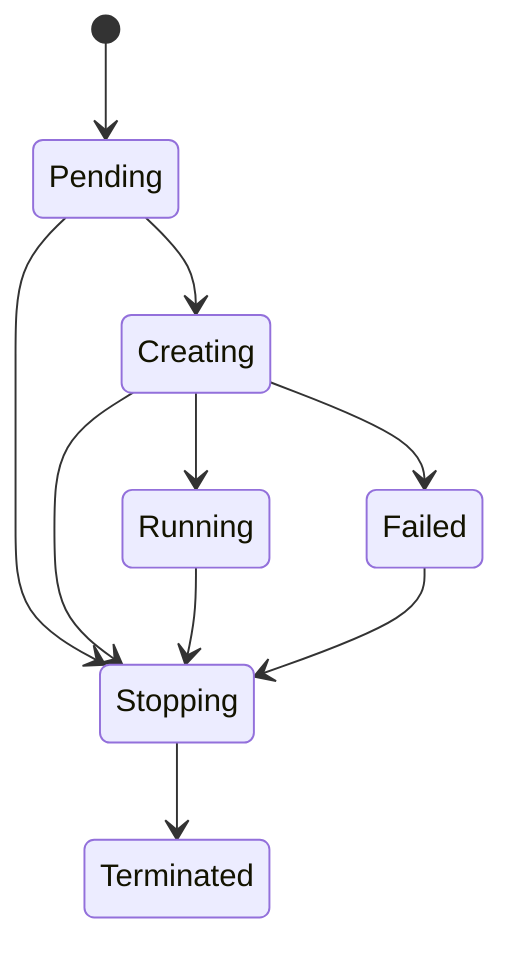
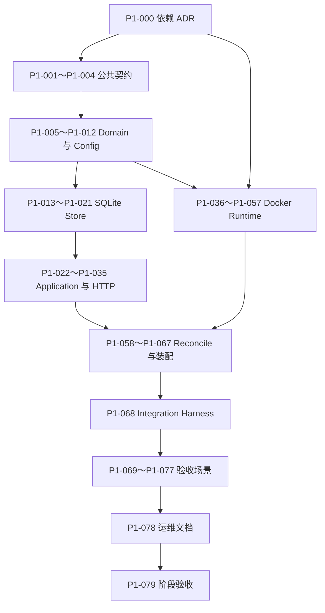

# Phase 1：Docker 生命周期细粒度开发计划与设计方案

> - 状态：待审查
> - 适用基线：当前 MiniSandbox 初始化骨架
> - 上位设计：[全 Go Agent Sandbox Runtime 设计](./all-go-agent-sandbox-runtime-design.md)
> - 阶段定义：本文的“第一阶段”对应上位设计中的 **Phase 1：Docker 生命周期**

## 1. 文档目的

本文把 Phase 1 拆成可以逐个开发、逐个测试、逐个提交和逐个审查的小任务。

执行时遵循以下规则：

1. 一个任务只增加一个小能力。
2. 一个任务对应一个独立提交。
3. 每个任务完成后先运行该任务的聚焦测试，再运行约定的基础检查。
4. 每个任务提交后暂停，等待审查通过再继续下一个任务。
5. 不为了后续任务提前加入字段、抽象或依赖。
6. 如果任务实施中发现必须改变本文的公共契约、安全边界或依赖选择，应先修改本文并重新审查，而不是边写代码边扩大范围。

本文不是工期估算。任务编号表达依赖顺序，不表达开发时长。

## 2. Phase 1 的准确边界

### 2.1 阶段目标

Phase 1 结束时，MiniSandbox 应完成以下最小闭环：

```text
POST 创建
  → Store 持久化 Pending
  → 后台 worker 唤醒
  → Docker 创建 workspace volume 和容器
  → 注入 sandbox-init 与 runnerd
  → 启动容器
  → 通过独立 Unix Socket 检查 runnerd
  → Store 更新为 Running
  → GET 可查询
  → DELETE 提交终止意图
  → 后台清理容器、volume 和 runtime dir
  → Store 更新为 Terminated
```

`sandboxd` 重启后必须能扫描 Store 与 Docker labels，重新识别已存在的受管容器。

### 2.2 阶段验收

严格沿用上位设计的 Phase 1 验收条件：

- 创建请求立即返回 `202 Accepted`，最终状态进入 `Running`。
- 创建中任何一步失败，都不遗留无人管理的容器、非持久 volume 或 runtime directory。
- 删除操作幂等，多次删除不会报内部错误，也不会删除其他 sandbox 的资源。
- `sandboxd` 重启后能够发现已有受管容器，并恢复 Store 与 Docker 的关联。

另外增加四个实现完整性条件：

- `/readyz` 只有在 Store、Docker、嵌入 artifact 和启动恢复全部可用后才返回成功。
- runner 只通过每个 sandbox 独立的 Unix Socket 通信，不发布 TCP 端口。
- Docker labels 和日志中不出现用户环境变量、runner token、凭据或命令内容。
- 第一阶段不提供命令执行能力；runner 的执行接口继续明确返回 `501`。

### 2.3 明确不做

以下能力不进入 Phase 1：

- argv、shell、SSE、timeout、cancel 和后台命令；
- 完整孤儿进程回收和 runner 非 root 身份切换；
- TTL 自动回收、renew revision 和旧 timer 失效；
- `Idempotency-Key`；
- sandbox 列表、分页和租户隔离；
- API Key、RBAC、配额和多租户鉴权；
- 用户 env、secret 持久化和 registry credential；
- startup process；
- Pool、快照、pause/resume 和 Kubernetes；
- PTY、文件 API、端口代理和 ingress/egress 策略；
- 多架构 artifact；Phase 1 只支持 `linux/amd64`。

Phase 1 的服务只能默认绑定 loopback，不能作为公网生产服务发布。

## 3. 当前基线与差距

### 3.1 已有能力

当前骨架已经具备：

- `sandboxd`、`sandbox-init`、`runnerd` 三个 Go 入口；
- domain、application、runtime、store、reconcile、runnerclient 的包边界；
- 生命周期和 runner OpenAPI 初稿；
- `sandboxd /healthz`；
- `runnerd` Unix Socket HTTP server 和 `/healthz`；
- runner Bearer token middleware；
- Runtime、Store 接口骨架；
- Docker adapter 和 SQLite adapter 占位；
- Linux artifact 构建及 `go:embed` 目录；
- Go SDK 初稿；
- 基础单元测试和跨平台构建验证。

### 3.2 必须先补齐的 Phase 0 缺口

当前代码还不能直接进入 Docker 生命周期实现，原因包括：

- 生命周期 OpenAPI 暴露了 Phase 1 不会正确实现的 `env`、`command`、`ttl_seconds`、`renew` 和 `Idempotency-Key`。
- 公共错误模型尚未固定。
- domain model 不能保存完整的 resolved spec、reason、message、runtime ID 和 spec hash。
- Store 接口过于通用，不能表达 CAS revision 和 reconcile candidate。
- 缺少 fake Store、fake Runtime 和真正的 handler contract test。
- `sandboxd` 还没有配置加载、依赖装配和 `/readyz`。

这些缺口连同依赖决策放在任务 P1-000 至 P1-022 中逐步关闭。

## 4. 实施前审查门

### G1：公共契约审查

当前仓库还没有正式发布，建议在第一个可运行版本前把 Phase 1 API 收缩到真实支持的能力：

```text
POST   /v1/sandboxes
GET    /v1/sandboxes/{id}
DELETE /v1/sandboxes/{id}
GET    /healthz
GET    /readyz
```

Phase 1 的创建请求建议只接受：

```json
{
  "image": "debian:bookworm-slim"
}
```

资源限制、workspace、network 使用服务端安全默认值，后续以向后兼容的可选字段增加。

该调整会删除当前 OpenAPI 初稿中的未实现字段和 endpoint，属于预发布阶段的破坏性整理。执行 P1-001 前必须由用户确认。

### G2：Docker label 审查

当前代码与上位设计的 label 名称略有差异。建议在创建第一个实际容器前统一为：

```text
minisandbox.io/managed=true
minisandbox.io/id=<sandbox-id>
minisandbox.io/schema-version=1
minisandbox.io/spec-hash=<sha256>
minisandbox.io/expires-at=
minisandbox.io/workspace=<volume-name>
```

Phase 1 尚无历史容器，因此这是调整 label 契约成本最低的时点。执行 P1-037 前必须确认名称。

### G3：生产依赖审查

Phase 1 预计新增三类生产依赖：

- Docker 官方 Go SDK；
- 支持 `CGO_ENABLED=0` 的纯 Go SQLite driver；
- 一个维护中的 YAML v3 parser。

具体 module path 和固定版本在 P1-000 中形成依赖 ADR，经确认后才修改 `go.mod`。不引入 Web framework、ORM、migration framework、DI framework 或日志 framework。

### G4：Linux Docker 集成环境

runner Unix Socket、Linux artifact 和容器信号行为必须在真实 Linux Docker daemon 上验证。执行集成测试任务前，需要确认以下环境之一：

- Linux 开发机；
- WSL2 中的 Linux Docker daemon；
- Linux CI runner。

Windows 单元测试和交叉编译不能替代这些验收。

## 5. Phase 1 核心设计

### 5.1 外部 API

Phase 1 的公共资源使用最小模型：

```go
type CreateSandboxRequest struct {
    Image string `json:"image"`
}

type Sandbox struct {
    ID        string        `json:"id"`
    State     SandboxState  `json:"state"`
    Reason    string        `json:"reason"`
    Message   string        `json:"message"`
    Image     string        `json:"image"`
    CreatedAt time.Time     `json:"created_at"`
    UpdatedAt time.Time     `json:"updated_at"`
}
```

创建成功：

```http
HTTP/1.1 202 Accepted
Location: /v1/sandboxes/<id>
Content-Type: application/json
```

删除语义：

- 第一次删除把 desired state 设置为 `Terminated`，返回 `202`。
- 已经处于 `Stopping` 时返回 `202`。
- 已经处于 `Terminated` 时返回 `204`。
- 资源记录不存在时返回 `404`。
- Docker 容器已被外部删除时，删除 reconcile 仍收敛到 `Terminated`。

### 5.2 内部 resolved spec

即使 Phase 1 的外部请求只有 image，Store 也要保存完整的有效规格，保证重启恢复不依赖已经变化的默认配置：

```go
type SandboxSpec struct {
    Image       string
    Resources   ResourceLimits
    Workspace   WorkspaceSpec
    Network     NetworkSpec
    Platform    Platform
}

type ResourceLimits struct {
    CPUQuotaMillis int64
    MemoryMiB      int64
    PIDs           int64
}

type WorkspaceSpec struct {
    MountPath  string
    Persistent bool
}

type NetworkSpec struct {
    Outbound bool
}

type Platform struct {
    OS   string
    Arch string
}
```

Phase 1 固定：

```text
workspace.mountPath=/workspace
workspace.persistent=false
network.outbound=false
platform=linux/amd64
```

资源上限从服务端配置解析为 resolved spec。Store 不只保存“用户输入”，而是保存“实际要收敛的完整规格”。

### 5.3 状态和 reason

状态机：



Phase 1 固定以下 status reason：

| Reason | State | 含义 |
|---|---|---|
| `CREATE_ACCEPTED` | Pending | 创建意图已持久化 |
| `CREATING_RUNTIME` | Creating | 正在准备 Docker 资源 |
| `WAITING_RUNNER` | Creating | 容器已启动，等待 runner |
| `RUNNING` | Running | 容器运行且 runner health 成功 |
| `DELETE_ACCEPTED` | Stopping | 删除意图已持久化 |
| `DELETING_RUNTIME` | Stopping | 正在清理 Docker 资源 |
| `TERMINATED` | Terminated | 受管资源已确认不存在 |
| `IMAGE_PULL_FAILED` | Failed | 镜像拉取失败 |
| `ARTIFACT_INVALID` | Failed | runner/init artifact 缺失或平台错误 |
| `CONTAINER_CREATE_FAILED` | Failed | 容器创建失败 |
| `ARTIFACT_INJECTION_FAILED` | Failed | artifact 注入失败 |
| `CONTAINER_START_FAILED` | Failed | 容器启动失败 |
| `RUNNER_UNHEALTHY` | Failed | runner 在时限内未就绪 |
| `SPEC_DRIFT` | Failed | 已有容器的 spec hash 与 Store 不同 |
| `CLEANUP_PENDING` | Failed | 创建失败后的补偿尚未完成 |
| `RUNTIME_UNAVAILABLE` | Failed | Docker daemon 暂时不可用 |
| `INTERNAL_ERROR` | Failed | 未分类的内部错误，公共 message 使用固定安全文案 |

`message` 只能包含安全诊断信息，不能包含 Docker socket、宿主机绝对路径、环境变量值或内部堆栈。

### 5.4 Store

Store 是期望状态权威来源，SQLite schema 至少保存：

```text
id
spec_json
desired_state
observed_state
reason
message
runtime_id
spec_hash
revision
created_at
updated_at
last_transition_at
```

Phase 1 不删除 Terminated 记录，以便 GET 和审计；记录保留策略以后单独设计。

Store 更新使用 revision CAS：

```sql
UPDATE sandboxes
SET ..., revision = revision + 1
WHERE id = ? AND revision = ?;
```

受影响行数为零时返回领域层并发冲突，调用方重新读取。SQLite 使用 UTC RFC3339Nano 时间、WAL、busy timeout 和显式事务。

### 5.5 Docker 资源

资源命名必须是确定性的：

```text
container:  minisandbox-<sandbox-id>
volume:     minisandbox-workspace-<sandbox-id>
runtimeDir: <dataDir>/run/<sandbox-id>
hostSocket: <dataDir>/run/<sandbox-id>/runner.sock
guestSocket:/run/minisandbox/runner.sock
```

只允许 sandboxd 计算这些名称。API 不接受容器名、volume 名或宿主机路径。

Volume 和 container 都写入安全 labels。查找和删除资源时同时校验确定性名称与 labels，避免误删同名非受管资源。

Runtime 向 reconciler 返回自己的内部观测模型，而不是 Docker SDK struct：

```go
type ActualSandbox struct {
    ID             string
    RuntimeID      string
    State          ActualState
    SpecHash       string
    Workspace      string
    DiscoveryIssue string
}
```

`DiscoveryIssue` 只用于启动扫描中报告 label 损坏或未知 schema；它不能包含原始 label 全文或宿主机路径。runner readiness 不属于该模型，由独立 RunnerProbe 返回。

### 5.6 容器安全配置

Phase 1 创建的容器固定使用：

```text
Privileged=false
NetworkMode=none
CapDrop=ALL
CapAdd=CHOWN,SETUID,SETGID,KILL
NoNewPrivileges=true
Docker default seccomp
PIDsLimit=<resolved spec>
Memory=<resolved spec>
NanoCPUs=<resolved spec>
ReadonlyRootfs=false
User=0:0
无 published ports
无 Docker socket
无用户指定 bind mount
```

唯一宿主机 bind mount 是由 sandboxd 创建的受管 runtime directory，用于 Unix Socket。workspace 使用 named volume。

Phase 1 的 runner 仍以 root 运行，但执行 API 保持 `501`，因此不会运行用户命令。非 root 切换在 Phase 2 完成；在此之前 Phase 1 不能被描述为可执行不可信代码的生产 sandbox。

### 5.7 Artifact 注入

创建流程固定为：

1. 创建 stopped container。
2. 从嵌入资源读取 `linux/amd64` 的 `sandbox-init` 和 `runnerd`。
3. 在内存中生成 tar stream，目标 mode 为 `0755`。
4. 通过 Docker Copy API 写入 `/opt/minisandbox/`。
5. 启动容器。

容器 entrypoint 固定为：

```text
/opt/minisandbox/sandbox-init -- /opt/minisandbox/runnerd serve
```

不得要求用户镜像包含 shell，也不 bind mount 宿主机二进制。

### 5.8 异步执行和唤醒

创建 handler 只做：

1. decode；
2. validate；
3. resolve defaults；
4.生成 ID 和 spec hash；
5. Store Create；
6.唤醒指定 sandbox；
7.返回 `202`。

内存队列不是事实源。Phase 1 使用“按 sandbox ID 合并”的 wake queue：

- 同一 ID 在队列中最多出现一次；
- pending set 保存待处理 ID，容量为 1 的 channel 只发送“有工作”通知，不为每个 ID 分配一个 channel item；
- worker 每次从 pending set 取一个 ID，完成后如果仍有待处理 ID 就再次通知；
- 进程启动时从 Store 重新加载 candidate；
- Phase 3 再增加 maxSandboxes、周期扫描、退避和更完整的失败恢复。

### 5.9 Reconcile

Reconciler 依赖三个端口：

```go
Store
Runtime
RunnerProbe
```

对单个 sandbox：

```text
获取 keyed lock
  → 从 Store 重新读取最新 revision
  → desired=Running：Ensure Docker → probe runner → Running
  → desired=Terminated：Delete Docker → Terminated
  → CAS 更新 observed state
  → 释放 keyed lock
```

`Runtime.Ensure` 只负责 Docker 资源达到 started 状态。runner readiness 由独立 `RunnerProbe` 通过 Unix Socket 判断，避免 Docker adapter 直接实现 runner HTTP 协议。

### 5.10 创建补偿

一次 Ensure 记录本次调用新建的副作用：

```text
runtime directory
workspace volume
container
```

失败时只逆序清理“本次调用创建”的资源，不能删除调用前已经存在且通过 labels/spec hash 验证的资源。

如果补偿失败：

- 返回包含 cleanup pending 分类的内部错误；
- observed state 写为 `Failed/CLEANUP_PENDING`；
- 保留 runtime ID、volume 名和 labels；
- 不从 Store 删除记录；
- 后续删除请求仍可调用幂等 Runtime.Delete。

### 5.11 启动恢复

Phase 1 启动恢复按以下顺序：

1. 打开 Store 并完成 migration。
2. 验证 embedded artifact。
3. Docker Ping。
4. `Runtime.ListManaged` 扫描受管容器。
5. Store `ListReconcileCandidates`。
6. 将 Store 记录与 Docker container 按 sandbox ID 对账。
7.恢复缺失 runtime ID。
8. 将仍需收敛的 ID 放入 wake queue。
9.标记 recovery complete。
10. `/readyz` 才可以成功。

Docker 中存在但 Store 不存在的容器，Phase 1 只记录安全告警，不自动导入或删除；完整 orphan 策略放到 Phase 3。

## 6. 每个任务的完成标准

除任务自身的验收项外，每个代码任务都必须满足：

- 中文模块和导出 API 注释与行为同步；
- 受影响包聚焦测试通过；
- `gofmt` 和 `go vet` 通过；
- 不产生与任务无关的格式化或重构 diff；
- 不把 secret、绝对宿主机路径或 Docker socket 暴露到公共错误；
- 提交信息只描述当前一个小功能；
- 明确记录未运行的 Linux/Docker 检查。

建议每个任务的审查包包含：

```text
任务 ID
目标
设计决定
文件列表
测试结果
明确未做
commit SHA
```

## 7. 任务总览

| 分组 | 任务 | 结果 |
|---|---:|---|
| A. 契约与领域基线 | P1-000～P1-012 | 固定依赖、API、错误、domain、配置 |
| B. Store | P1-013～P1-021 | 可重启的 SQLite 期望状态存储 |
| C. Application 与 HTTP | P1-022～P1-035 | 真正异步的 create/get/delete |
| D. Docker runtime 原子能力 | P1-036～P1-057 | 可组合、可单测的 Docker 操作 |
| E. Reconcile 与启动装配 | P1-058～P1-067 | 生命周期状态机、worker、恢复和 readiness |
| F. Docker 验收 | P1-068～P1-079 | 真实 Linux Docker 验收与文档 |

## 8. 详细任务

### A. 契约与领域基线

### P1-000：固定 Phase 1 依赖 ADR

- **依赖**：G3 审查。
- **唯一目标**：记录 Docker SDK、SQLite driver 和 YAML parser 的选择与版本策略。
- **设计**：比较维护状态、Go 版本兼容、静态构建、许可证和 transitive dependency；只在 ADR 中决策，不改生产代码。
- **修改范围**：新增 `docs/decisions/0001-phase1-dependencies.md`。
- **测试**：无代码测试；检查文档链接和 `git diff --check`。
- **验收**：三类依赖都有选择、理由、固定版本策略和升级策略。
- **本任务不做**：不修改 `go.mod`，不连接 Docker 或 SQLite。

### P1-001：收缩并冻结 Phase 1 生命周期 OpenAPI

- **依赖**：G1 审查通过。
- **唯一目标**：让全部公共契约层只描述 Phase 1 真正支持的生命周期能力。
- **设计**：创建请求只保留 `image`；保留 create/get/delete/health，新增 ready；移除 renew、未实现字段和 Idempotency-Key。
- **修改范围**：`api/lifecycle.openapi.yaml`、`pkg/protocol` 生命周期请求类型、`sdk/go` 受影响 facade。
- **测试**：OpenAPI 语法校验；protocol JSON round trip；SDK 编译和请求映射测试。
- **验收**：OpenAPI、wire model 和 SDK 中都不存在 Phase 1 不支持的 endpoint 或字段。
- **本任务不做**：不修改 handler 行为。

### P1-002：固定 Phase 1 状态响应 schema

- **依赖**：P1-001。
- **唯一目标**：在 OpenAPI 中定义 `state/reason/message` 和时间字段。
- **设计**：状态枚举固定为 Pending、Creating、Running、Stopping、Terminated、Failed；reason 使用本文 5.3 的集合。
- **修改范围**：lifecycle OpenAPI、`pkg/protocol` Sandbox response、SDK response 映射。
- **测试**：schema example 校验和 protocol JSON round trip。
- **验收**：create 和 get 在 OpenAPI、protocol 和 SDK 中复用同一 Sandbox response schema。
- **本任务不做**：不实现状态转换。

### P1-003：固定公共错误 schema

- **依赖**：P1-001。
- **唯一目标**：定义统一的公共 JSON 错误结构。
- **设计**：

  ```json
  {
    "error": {
      "code": "INVALID_REQUEST",
      "message": "Request is invalid.",
      "request_id": "req-...",
      "retryable": false
    }
  }
  ```

- **修改范围**：lifecycle OpenAPI、`pkg/protocol` 公共错误类型和现有占位 error response。
- **测试**：错误 examples 可被 schema 校验；JSON envelope round trip；占位 handler 响应结构。
- **验收**：400、404、409、500、503 都引用同一基础结构。
- **本任务不做**：不编写领域错误到 HTTP 状态的 mapper。

### P1-004：增加生命周期 contract fixtures

- **依赖**：P1-002、P1-003。
- **唯一目标**：建立 create/get/delete/health/ready 的固定 JSON fixtures。
- **设计**：fixture 只保存 wire data，不引用 domain struct；测试负责 JSON decode 和必填字段检查。
- **修改范围**：`tests/contract/fixtures/lifecycle/` 和一个 contract test。
- **测试**：只运行 contract package。
- **验收**：fixture 能发现字段名、状态枚举和错误 envelope 的漂移。
- **本任务不做**：不启动 HTTP server，不验证业务行为。

### P1-005：扩展领域 SandboxSpec

- **依赖**：P1-001。
- **唯一目标**：让 domain 能表达 Phase 1 的 resolved spec。
- **设计**：新增 `SandboxSpec`、`ResourceLimits`、`WorkspaceSpec`、`NetworkSpec` 和 `Platform`；外部请求模型不直接复用这些类型。
- **修改范围**：`internal/domain/`。
- **测试**：构造完整 spec 并验证值语义。
- **验收**：`Sandbox` 使用 `Spec SandboxSpec`，不再只保存裸 `Image`。
- **本任务不做**：不做校验、hash 或 Docker 转换。

### P1-006：补齐领域状态元数据

- **依赖**：P1-005。
- **唯一目标**：让 Sandbox record 保存 reason、message、runtime ID、spec hash 和 last transition。
- **设计**：保留 desired/observed 分离；revision 使用 `uint64`；所有时间在应用层转 UTC。
- **修改范围**：`internal/domain/sandbox.go` 和领域测试。
- **测试**：零值、复制和 terminal state 测试。
- **验收**：Store 所需字段全部可由 domain 表达。
- **本任务不做**：不实现 Store。

### P1-007：实现 Phase 1 spec 校验

- **依赖**：P1-005。
- **唯一目标**：拒绝无效 image、资源值、mount path 和 platform。
- **设计**：
  - image 非空并限制最大长度；
  - CPU、memory、PIDs 在服务端允许范围；
  - mount path 必须等于 `/workspace`；
  - Phase 1 只接受 `linux/amd64`；
  - persistent 和 outbound 必须为 false。
- **修改范围**：`internal/domain` 新增 validator。
- **测试**：每条规则一个 table case。
- **验收**：错误能定位字段，但不回显潜在秘密值。
- **本任务不做**：不校验 registry allowlist。

### P1-008：实现稳定 spec hash

- **依赖**：P1-005、P1-007。
- **唯一目标**：同一 resolved spec 始终生成相同 SHA-256。
- **设计**：使用专用 canonical struct 和固定 JSON 字段顺序；hash 不包含状态、时间、runtime ID 或 message。
- **修改范围**：`internal/domain` 或独立纯函数 package。
- **测试**：map 顺序不影响、字段变化会改变、重复计算一致。
- **验收**：输出为小写十六进制 SHA-256。
- **本任务不做**：不生成 Docker labels。

### P1-009：建立 typed config 和安全默认值

- **依赖**：P1-005。
- **唯一目标**：用 Go 类型表示 server、data、runtime、limits 和 reconcile 配置。
- **设计**：默认 loopback、network none、非持久 workspace、有限 CPU/memory/PIDs、固定 linux/amd64。
- **修改范围**：新增 `internal/config`，更新中文模块注释。
- **测试**：默认值快照式断言。
- **验收**：默认配置能生成完整 resolved spec。
- **本任务不做**：不读取 YAML。

### P1-010：加载 YAML 配置

- **依赖**：P1-000、P1-009。
- **唯一目标**：从显式路径读取 YAML 并覆盖默认值。
- **设计**：未知字段报错；环境变量不用于传递 secret；配置路径由 `-config` 指定。
- **修改范围**：`internal/config`、`go.mod`、`go.sum`。
- **测试**：最小配置、完整配置、未知字段、格式错误。
- **验收**：解析错误包含字段位置，但不打印整个配置内容。
- **本任务不做**：不创建目录，不连接依赖。

### P1-011：验证配置安全边界

- **依赖**：P1-010。
- **唯一目标**：启动前一次性拒绝不安全或互相矛盾的配置。
- **设计**：Phase 1 拒绝非 loopback listen、非 linux/amd64、非 `none` network、persistent workspace、超限资源和空 data dir。
- **修改范围**：`internal/config` validator 和示例配置。
- **测试**：每条拒绝规则一个 table case。
- **验收**：无效安全配置使启动失败，不静默降级。
- **本任务不做**：不启动 HTTP server。

### P1-012：创建并校验受管数据目录

- **依赖**：P1-011。
- **唯一目标**：安全创建 data、run 和数据库父目录。
- **设计**：只操作已验证的绝对 data dir；目录 mode 为 `0700`；拒绝 symlink data dir；重复调用幂等。
- **修改范围**：新增受管目录 helper。
- **测试**：临时目录、重复调用、相对路径、symlink。
- **验收**：返回确定的 database path 和 run root。
- **本任务不做**：不创建单个 sandbox runtime dir。

### B. Store

### P1-013：重塑 Store 接口

- **依赖**：P1-006。
- **唯一目标**：用面向生命周期和 CAS 的方法替换通用 Save/Delete。
- **设计**：

  ```go
  Create(ctx, sandbox) error
  Get(ctx, id) (Sandbox, error)
  UpdateDesired(ctx, id, desired, expectedRevision) (Sandbox, error)
  UpdateObserved(ctx, ObservedUpdate) (Sandbox, error)
  ListReconcileCandidates(ctx, limit) ([]Sandbox, error)
  ListAll(ctx) ([]Sandbox, error)
  ```

- **补充模型**：

  ```go
  type ObservedUpdate struct {
      ID               string
      ExpectedRevision uint64
      State            SandboxState
      Reason           string
      Message          string
      RuntimeID        string
  }
  ```

- **修改范围**：`internal/store/store.go` 和编译占位。
- **测试**：接口 compile assertion。
- **验收**：接口不暴露 SQL 类型，也不提供物理删除 Phase 1 记录的方法。
- **本任务不做**：不实现 SQLite。

### P1-014：引入 SQLite driver 并打开数据库

- **依赖**：P1-000、P1-012、P1-013。
- **唯一目标**：`sqlite.Open` 建立真实连接并可 Ping。
- **设计**：使用纯 Go driver；单 writer；配置 WAL、foreign keys、busy timeout；提供 `Close`。
- **修改范围**：`go.mod`、`go.sum`、SQLite adapter。
- **测试**：临时数据库 open、ping、close、重复 open。
- **验收**：`CGO_ENABLED=0` 下可构建 sandboxd。
- **本任务不做**：不创建业务表。

### P1-015：实现版本化 migration runner

- **依赖**：P1-014。
- **唯一目标**：在事务内创建 schema version 表并执行 migration 1。
- **设计**：migration 只向前；同一版本只能执行一次；未知更高版本拒绝启动。
- **修改范围**：`internal/store/sqlite/migrations.go`。
- **测试**：空库、重复迁移、未知新版本、失败回滚。
- **验收**：创建本文 5.4 所需 sandboxes 表和索引。
- **本任务不做**：不实现 Store CRUD。

### P1-016：实现 SQLite Create

- **依赖**：P1-015。
- **唯一目标**：原子插入一条 Pending/DesiredRunning sandbox。
- **设计**：spec 以 JSON 保存；时间转 UTC RFC3339Nano；duplicate ID 映射为 domain conflict。
- **修改范围**：SQLite Store 的 Create。
- **测试**：成功插入、重复 ID、context cancel。
- **验收**：创建后 revision 固定为 1，状态和 hash 完整。
- **本任务不做**：不实现 Get。

### P1-017：实现 SQLite Get

- **依赖**：P1-016。
- **唯一目标**：按 ID 完整还原 domain Sandbox。
- **设计**：集中 row scanner；未知状态、损坏 spec JSON 和非法时间返回 store corruption error。
- **修改范围**：SQLite Get 和 scanner helper。
- **测试**：完整往返、不存在、损坏行。
- **验收**：不存在统一映射为 `domain.ErrNotFound`。
- **本任务不做**：不更新记录。

### P1-018：实现 UpdateObserved CAS

- **依赖**：P1-017。
- **唯一目标**：按 expected revision 更新 observed state、reason、message 和 runtime ID。
- **设计**：revision 加一；状态变化时更新 last transition；相同状态只更新 updated time；成功时返回事务内更新后的完整记录和新 revision。
- **修改范围**：SQLite Store 的 UpdateObserved。
- **测试**：成功 CAS、旧 revision、状态变化时间、事务回滚。
- **验收**：零受影响行映射为 domain conflict。
- **本任务不做**：不实现 desired state 更新。

### P1-019：实现 UpdateDesired CAS

- **依赖**：P1-017。
- **唯一目标**：幂等提交 `DesiredTerminated`。
- **设计**：Running→Terminated 更新 revision 并返回新记录；已经 DesiredTerminated 时返回当前记录作为 no-op 结果。
- **修改范围**：SQLite Store 的 UpdateDesired。
- **测试**：首次更新、重复更新、旧 revision、不存在。
- **验收**：不会直接把 observed state 写成 Terminated。
- **本任务不做**：不调用 Runtime.Delete。

### P1-020：实现 ListReconcileCandidates

- **依赖**：P1-017。
- **唯一目标**：按稳定顺序列出仍需收敛的记录。
- **设计**：返回 desired 与 observed 不一致、Pending、Creating、Stopping，以及带 cleanup pending 的 Failed；支持 limit。
- **修改范围**：SQLite query。
- **测试**：状态组合、limit、排序。
- **验收**：Terminated 且 desired Terminated 的记录不返回。
- **本任务不做**：不实现 worker。

### P1-021：实现 ListAll 和数据库重开测试

- **依赖**：P1-020。
- **唯一目标**：验证进程关闭再打开后全部 sandbox 记录可恢复。
- **设计**：ListAll 按 created time 和 ID 稳定排序；测试关闭连接后用同一路径重开。
- **修改范围**：SQLite ListAll 和持久化测试。
- **测试**：多记录、关闭、重开、字段逐项比对。
- **验收**：resolved spec、revision、runtime ID 和状态无损恢复。
- **本任务不做**：不连接 Docker。

### C. Application 与 HTTP

### P1-022：增加 fake Store 和 fake Runtime

- **依赖**：P1-013。
- **唯一目标**：为 application 和 reconciler 提供确定性的内存测试替身。
- **设计**：fake 显式记录调用参数，可注入错误；不模拟 SQL 或 Docker 内部细节；并发访问加锁并通过 race test。
- **修改范围**：测试专用 package，不进入生产依赖装配。
- **测试**：fake 自身的并发和错误注入测试。
- **验收**：后续 service 测试不需要 SQLite 或 Docker。
- **本任务不做**：不实现状态机。

### P1-023：注入 ID Generator 和 Clock

- **依赖**：无。
- **唯一目标**：让创建用例的 ID 和时间可确定测试。
- **设计**：生产 ID 使用 `crypto/rand` 生成 UUID v4 格式；Clock 只暴露 `Now()`；测试使用固定实现。
- **修改范围**：application 所需的小接口及实现。
- **测试**：ID 格式、随机源失败、UTC 时间。
- **验收**：service 测试中不调用真实时钟或全局随机状态。
- **本任务不做**：不引入第三方 UUID 库。

### P1-024：实现 resolved spec builder

- **依赖**：P1-007、P1-009。
- **唯一目标**：把最小创建请求和服务端默认值转换为完整 domain spec。
- **设计**：builder 是纯函数；调用 domain validation；不会接受用户宿主机路径或 Docker HostConfig。
- **修改范围**：application builder 和测试。
- **测试**：默认值、无效 image、配置边界。
- **验收**：相同请求和配置产生相同 resolved spec。
- **本任务不做**：不生成 ID、hash 或持久化。

### P1-025：实现 CreateSandbox application service

- **依赖**：P1-008、P1-013、P1-023、P1-024。
- **唯一目标**：创建并持久化 Pending sandbox。
- **设计**：生成 ID、resolved spec、spec hash 和时间；desired=Running、observed=Pending、reason=CREATE_ACCEPTED；一次 Store.Create。
- **修改范围**：`internal/application/sandbox_service.go`。
- **测试**：成功、validation error、ID error、Store conflict、Store unavailable。
- **验收**：service 不调用 Runtime，不等待 worker。
- **本任务不做**：不唤醒 reconcile；下一任务单独增加。

### P1-026：为创建 service 增加 Wake 端口

- **依赖**：P1-025。
- **唯一目标**：Store 创建成功后唤醒对应 sandbox ID。
- **设计**：`Wake(id)` 是无业务状态的优化端口；只有 Store.Create 成功后调用。记录一旦成功提交，即使进程正在关闭导致 wake 未送达，也仍返回已接受结果，由下次启动恢复重新入队，避免客户端重试产生第二个 sandbox。
- **修改范围**：application service 和 fake waker。
- **测试**：调用顺序、Store 失败不 wake、wake 未送达时仍返回已接受且记录存在。
- **验收**：service 不把内存队列当作创建事实源。
- **本任务不做**：不实现真实队列。

### P1-027：实现 GetSandbox application service

- **依赖**：P1-013。
- **唯一目标**：按 ID 查询 domain Sandbox。
- **设计**：service 只做权限扩展点和 Store 错误归一化，当前单租户不增加额外规则。
- **修改范围**：sandbox service。
- **测试**：成功、不存在、Store unavailable。
- **验收**：不读取 Docker 来回答普通 GET。
- **本任务不做**：不实现 HTTP 映射。

### P1-028：实现 DeleteSandbox application service

- **依赖**：P1-019、P1-026。
- **唯一目标**：CAS 提交 DesiredTerminated 并唤醒 reconcile。
- **设计**：读取最新 revision；并发冲突最多重新读取一次；Terminated 返回 already terminated 结果；其他已经 DesiredTerminated 的记录仍再次 wake，使调用方可以显式重试 cleanup pending；重复删除保持成功。
- **修改范围**：sandbox service。
- **测试**：Running、Pending、Failed、Stopping、Terminated、CAS conflict。
- **验收**：service 不直接调用 Docker Delete。
- **本任务不做**：不改变 observed state。

### P1-029：实现 protocol 与 domain 显式映射

- **依赖**：P1-002、P1-006。
- **唯一目标**：集中完成 domain Sandbox 到公共 response 的转换。
- **设计**：只暴露安全字段；domain reason 映射到协议 reason；不暴露 runtime ID、spec hash、revision 和宿主机路径。
- **修改范围**：`internal/api` mapper。
- **测试**：每个状态、失败 message、内部字段不可见。
- **验收**：handler 不直接把 domain struct JSON encode。
- **本任务不做**：不注册路由。

### P1-030：实现统一 error mapper

- **依赖**：P1-003。
- **唯一目标**：把 domain/application/runtime 分类错误转换为公共错误 envelope。
- **设计**：已知错误固定 HTTP/code/retryable；未知错误记录内部 cause，但响应只返回 INTERNAL_ERROR 和 request ID。
- **修改范围**：`internal/api/error_response.go`。
- **测试**：400、404、409、500、503；秘密字符串不能出现在响应。
- **验收**：所有 handler 复用同一 mapper。
- **本任务不做**：不修改业务 service。

### P1-031：实现 create HTTP handler

- **依赖**：P1-001、P1-025、P1-026、P1-029、P1-030。
- **唯一目标**：完成 `POST /v1/sandboxes` 的 decode、调用和 `202` 响应。
- **设计**：限制 body 大小；拒绝未知 JSON 字段和多余 JSON document；设置 Location；不等待 Docker。
- **修改范围**：lifecycle handler 和 router wiring。
- **测试**：httptest 验证 202、Location、body limit、unknown field、invalid JSON、service error。
- **验收**：handler 内没有 Docker、SQLite 或状态机逻辑。
- **本任务不做**：不实现 GET/DELETE。

### P1-032：实现 get HTTP handler

- **依赖**：P1-027、P1-029、P1-030。
- **唯一目标**：完成 `GET /v1/sandboxes/{id}`。
- **设计**：校验 ID 格式；调用 service；统一 JSON 和错误映射。
- **修改范围**：lifecycle handler。
- **测试**：200、无效 ID、404、Store unavailable。
- **验收**：响应符合 P1-004 fixture。
- **本任务不做**：不实现列表。

### P1-033：实现 delete HTTP handler

- **依赖**：P1-028、P1-030。
- **唯一目标**：完成幂等 `DELETE /v1/sandboxes/{id}`。
- **设计**：首次/处理中返回 202，已终止返回 204，不存在返回 404。
- **修改范围**：lifecycle handler。
- **测试**：四类响应和 request ID。
- **验收**：handler 不等待 Docker 删除。
- **本任务不做**：不实现清理。

### P1-034：增加 readiness 状态对象

- **依赖**：无。
- **唯一目标**：用并发安全对象记录 Store、Docker、artifact、recovery 和 worker 状态。
- **设计**：默认 not ready；只提供设置单项状态和生成不含秘密的 snapshot。
- **修改范围**：`internal/api` 或独立 health package。
- **测试**：状态组合和并发读写 race test。
- **验收**：readiness 不是一个无条件 bool。
- **本任务不做**：不注册 `/readyz`。

### P1-035：实现 `/readyz`

- **依赖**：P1-034。
- **唯一目标**：根据 readiness snapshot 返回 200 或 503。
- **设计**：200 只在所有必要条件满足时返回；503 body 只列组件名和安全状态，不返回路径或 cause。
- **修改范围**：router 和 OpenAPI contract test。
- **测试**：每个缺失条件、全部 ready。
- **验收**：`/healthz` 不受依赖故障影响，`/readyz` 能反映依赖故障。
- **本任务不做**：不主动 Ping Docker。

### D. Docker runtime 原子能力

### P1-036：引入 Docker SDK 并实现 Ping

- **依赖**：P1-000、G3。
- **唯一目标**：创建 Docker client 并验证 daemon 可访问。
- **设计**：支持显式 `docker_host`；API version negotiation；client 可 Close；内部错误保留 cause。
- **修改范围**：`go.mod`、`go.sum`、Docker Runtime constructor。
- **测试**：使用窄 Engine fake 测试 constructor；真实 Ping 放 integration。
- **验收**：daemon 不可用映射为 runtime unavailable。
- **本任务不做**：不拉镜像或创建资源。

### P1-037：固定并实现 label codec

- **依赖**：G2 审查、P1-008。
- **唯一目标**：集中生成和解析受管资源 labels。
- **设计**：只接受 schema version 1；expires-at 在 Phase 1 为空；parse 验证 managed、ID、hash 和 workspace。
- **修改范围**：`internal/runtime/docker/labels.go`。
- **测试**：round trip、缺字段、未知 schema、恶意超长值、secret absence。
- **验收**：其他 Docker 文件不手写 label key。
- **本任务不做**：不调用 Docker。

### P1-038：实现确定性资源命名

- **依赖**：P1-023。
- **唯一目标**：从合法 sandbox ID 生成 container、volume 和 runtime dir 名称。
- **设计**：不接受任意字符串拼路径；生成后再次检查路径位于 data/run 下；固定长度上限。
- **修改范围**：Docker naming/path helper。
- **测试**：合法 ID、路径穿越、分隔符、超长值。
- **验收**：helper 不访问文件系统。
- **本任务不做**：不创建目录或 Docker 资源。

### P1-039：创建单 sandbox runtime directory

- **依赖**：P1-012、P1-038。
- **唯一目标**：幂等创建 `<dataDir>/run/<id>`。
- **设计**：mode 0700；拒绝 symlink；返回 host socket path；删除另设任务。
- **修改范围**：Docker workspace/runtime directory helper。
- **测试**：创建、重复、symlink、越界 ID。
- **验收**：不创建 socket 文件本身。
- **本任务不做**：不调用 runner。

### P1-040：建立 ArtifactProvider 并校验嵌入产物

- **依赖**：构建骨架。
- **唯一目标**：读取两个 linux/amd64 artifact 并验证非空、名称和基础 ELF 标识。
- **设计**：生产 provider 包装 `internal/embedded`；使用标准库 ELF parser 校验 ELF64、little-endian、x86-64 和可执行类型；测试 provider 可注入固定 bytes；启动时提前校验。
- **修改范围**：embedded adapter 和接口。
- **测试**：缺失、空文件、错误 magic、成功。
- **验收**：artifact 无效会使 readiness 失败，不等到创建中途才发现。
- **本任务不做**：不生成 tar。

### P1-041：生成 artifact tar stream

- **依赖**：P1-040。
- **唯一目标**：把 runnerd 和 sandbox-init 打包为 Docker Copy API 可用的 tar。
- **设计**：路径固定、mode 0755、uid/gid 0、mtime 固定以便测试；拒绝调用方传路径。
- **修改范围**：`injector.go` 纯内存函数。
- **测试**：解包检查两个文件的路径、内容、mode 和无额外 entry。
- **验收**：不写宿主机临时文件。
- **本任务不做**：不调用 CopyToContainer。

### P1-042：实现镜像引用基础校验

- **依赖**：P1-007。
- **唯一目标**：在调用 Docker 前拒绝空、非法和不允许的平台引用。
- **设计**：Phase 1 接受普通 name/tag/digest；限制长度；registry allowlist 暂不实现。
- **修改范围**：Docker image helper。
- **测试**：常见合法引用、控制字符、空值、超长值。
- **验收**：错误不包含 registry credential。
- **本任务不做**：不 inspect 或 pull。

### P1-043：实现 image inspect-or-pull

- **依赖**：P1-036、P1-042。
- **唯一目标**：确保镜像在 daemon 中存在。
- **设计**：先 inspect；not found 才 pull；必须完整 drain 并关闭 pull stream；使用独立 create timeout。
- **修改范围**：`image.go`。
- **测试**：已存在、pull 成功、pull 失败、context timeout、stream close。
- **验收**：错误分类为可重试 runtime unavailable 或 image pull failed。
- **本任务不做**：不检查镜像平台。

### P1-044：校验镜像平台

- **依赖**：P1-043。
- **唯一目标**：拒绝非 linux/amd64 镜像。
- **设计**：读取 image inspect 的 OS/Architecture；空平台不猜测；返回 ARTIFACT_INVALID 类别。
- **修改范围**：`image.go`。
- **测试**：linux/amd64、arm64、windows、缺字段。
- **验收**：不启动平台不匹配容器。
- **本任务不做**：不增加其他架构 artifact。

### P1-045：幂等 Ensure workspace volume

- **依赖**：P1-037、P1-038。
- **唯一目标**：创建或复用当前 sandbox 的 named volume。
- **设计**：先 inspect；不存在则创建；存在时必须验证 managed/id/schema labels；label 不匹配返回 conflict。
- **修改范围**：`workspace.go`。
- **测试**：创建、复用、同名非受管 volume、Engine error。
- **验收**：返回 `CreatedByThisCall` 标记供补偿使用。
- **本任务不做**：不创建容器。

### P1-046：构建安全 ContainerConfig

- **依赖**：P1-005、P1-037、P1-038。
- **唯一目标**：把 resolved spec 转为固定安全 Docker create config。
- **设计**：应用本文 5.6 全部约束；只挂载 named volume 和受管 runtime dir；entrypoint 固定；不设置用户命令。
- **修改范围**：`create.go` 和 `resources.go` 的纯转换。
- **测试**：逐项断言 privileged、caps、security opt、network、mount、ports、resource conversion。
- **验收**：调用方无法注入 HostConfig。
- **本任务不做**：不调用 ContainerCreate。

### P1-047：创建 stopped container

- **依赖**：P1-036、P1-037、P1-046。
- **唯一目标**：创建尚未启动的受管容器。
- **设计**：先按确定性名称 inspect；不存在则 create；存在则验证 labels/spec hash；drift 返回 conflict。
- **修改范围**：Docker create 原子函数。
- **测试**：创建、复用、同名非受管、spec drift、Engine error。
- **验收**：返回 container ID 和 `CreatedByThisCall`。
- **本任务不做**：不注入、不启动。

### P1-048：复制 artifact 到 stopped container

- **依赖**：P1-041、P1-047。
- **唯一目标**：调用 Docker Copy API 写入固定 `/opt/minisandbox`。
- **设计**：只接受本任务生成的 tar stream；context timeout；关闭 reader。
- **修改范围**：`injector.go` Docker 调用。
- **测试**：目标路径、copy 成功、错误传播、cancel。
- **验收**：不依赖 shell 和容器内命令。
- **本任务不做**：不启动容器。

### P1-049：启动已准备的容器

- **依赖**：P1-047、P1-048。
- **唯一目标**：幂等启动 container。
- **设计**：inspect 已 running 则成功；created/stopped 才 start；不存在返回 runtime missing。
- **修改范围**：Docker start helper。
- **测试**：already running、start success、missing、start error。
- **验收**：不做 runner health check。
- **本任务不做**：不更新 Store。

### P1-050：实现 Runtime.Inspect

- **依赖**：P1-036、P1-037、P1-038。
- **唯一目标**：按 sandbox ID 返回受管容器的实际状态。
- **设计**：使用确定性名称 inspect 并校验 labels；不存在映射 ActualMissing；不把原始 Docker struct 泄露到 runtime port。
- **修改范围**：`inspect.go` 和 runtime types。
- **测试**：missing、created、running、stopped、label mismatch。
- **验收**：返回 container ID、actual state 和安全内部元数据；ActualSandbox 不包含 RunnerReady。
- **本任务不做**：不探测 runner。

### P1-051：实现 Unix Socket RunnerProbe

- **依赖**：P1-038、现有 runnerclient。
- **唯一目标**：按 sandbox ID 对 host socket 执行 `/healthz`。
- **设计**：每次 probe 只构造当前 sandbox 的 socket path；使用 runner ready timeout；错误分为 socket missing、unhealthy 和 timeout。
- **修改范围**：runnerclient adapter 和 `RunnerProbe` 接口。
- **测试**：临时 Unix Socket server、200、401、500、timeout、路径越界。
- **验收**：接口不接受任意 URL 或 HTTP path。
- **本任务不做**：不重试、不更新 Store。

### P1-052：编排 Runtime.Ensure

- **依赖**：P1-039～P1-050。
- **唯一目标**：把已经完成的原子 Docker 能力组合为幂等 Ensure。
- **设计**：

  1. 校验 spec 和 artifacts；
  2. 检查已有 container；
  3. 确保 runtime dir；
  4. 确保 image；
  5. 确保 volume；
  6. 创建 stopped container；
  7. 对任何未运行 container 重新注入固定 artifacts，使创建中途崩溃可恢复；
  8. 启动；
  9. 返回 actual state。

- **修改范围**：Docker `Runtime.Ensure`。
- **测试**：完整调用顺序、已有 running、已有 stopped 会重新注入、spec drift、每一步错误。
- **验收**：同一 ID 和 spec 重复调用不会创建第二个容器或 volume。
- **本任务不做**：不 probe runner，不写 Store。

### P1-053：实现幂等容器删除

- **依赖**：P1-036、P1-037、P1-038。
- **唯一目标**：停止并删除指定 sandbox 的受管 container。
- **设计**：不存在即成功；存在时必须验证 labels；先 stop timeout，失败后按明确策略 force remove；同名非受管资源拒绝删除。
- **修改范围**：`delete.go` 的 container helper。
- **测试**：missing、stopped、running、force fallback、label mismatch。
- **验收**：只影响一个经过身份验证的 container。
- **本任务不做**：不删除 volume 或目录。

### P1-054：实现幂等 volume 删除

- **依赖**：P1-037、P1-038、P1-045。
- **唯一目标**：删除当前 sandbox 的非持久 workspace volume。
- **设计**：不存在即成功；label 不匹配拒绝；volume in use 返回 cleanup pending。
- **修改范围**：workspace delete helper。
- **测试**：missing、success、label mismatch、in use。
- **验收**：Phase 1 永远不使用 force 删除未验证 volume。
- **本任务不做**：不删除 container。

### P1-055：实现 runtime directory 删除

- **依赖**：P1-038、P1-039。
- **唯一目标**：安全删除单个 sandbox 的 runtime directory。
- **设计**：先验证绝对路径仍位于 run root；拒绝 symlink；只删除精确 ID 目录；不存在即成功。
- **修改范围**：runtime directory helper。
- **测试**：正常、missing、symlink、越界路径、其他 sandbox 不受影响。
- **验收**：绝不对 data root 或 run root 执行递归删除。
- **本任务不做**：不调用 Docker。

### P1-056：编排 Runtime.Delete

- **依赖**：P1-053、P1-054、P1-055。
- **唯一目标**：按固定顺序幂等清理一个 sandbox 的全部 runtime 资源。
- **设计**：container → volume → runtime dir；聚合错误时保留未完成步骤；重复调用从实际状态继续。
- **修改范围**：Docker `Runtime.Delete`。
- **测试**：全部成功、每一步失败、部分已不存在、第二次重试。
- **验收**：只有全部资源确认不存在时返回 nil。
- **本任务不做**：不更新 Store。

### P1-057：实现 Runtime.ListManaged

- **依赖**：P1-036、P1-037。
- **唯一目标**：枚举 schema version 1 的受管容器供启动恢复使用。
- **设计**：查询 `managed=true`，包含 stopped container；逐个解析 labels；损坏资源作为单独诊断项，不中断其他结果。
- **修改范围**：Docker list/inspect helper。
- **测试**：空列表、多容器、损坏 label、unknown schema、Engine error。
- **验收**：返回结果按 sandbox ID 稳定排序。
- **本任务不做**：不导入、删除或更新 Store。

### E. Reconcile、worker 与启动装配

### P1-058：实现创建路径的状态转换

- **依赖**：P1-018、P1-022、P1-051、P1-052。
- **唯一目标**：让 DesiredRunning 的单个 sandbox 从 Pending 收敛到 Running。
- **设计**：keyed lock 后重新读取；CAS 写 Creating/CREATING_RUNTIME；Runtime.Ensure；CAS 写 WAITING_RUNNER；RunnerProbe；CAS 写 Running。
- **修改范围**：`internal/reconcile/reconciler.go`。
- **测试**：fake Store/Runtime/Probe 验证状态顺序和调用顺序。
- **验收**：reconcile 重复调用 Running 记录时不产生额外副作用。
- **本任务不做**：不实现删除路径或失败分类。

### P1-059：实现删除路径的状态转换

- **依赖**：P1-018、P1-056、P1-058。
- **唯一目标**：让 DesiredTerminated 的记录最终进入 Terminated。
- **设计**：任何非 Terminated observed state 都先 CAS 为 Stopping/DELETING_RUNTIME；调用 Runtime.Delete；成功后写 Terminated。
- **修改范围**：reconciler。
- **测试**：从 Pending、Creating、Running、Failed、Stopping 开始；重复 reconcile。
- **验收**：Runtime.Delete 返回 nil 前不能写 Terminated。
- **本任务不做**：不实现失败补偿。

### P1-060：实现 runtime 错误分类

- **依赖**：P1-030、P1-043～P1-056。
- **唯一目标**：把内部 Docker/runner 错误映射到稳定 reason 和 retryable 属性。
- **设计**：使用 typed errors 和 `errors.Is/As`；不解析错误字符串；公共 message 使用固定安全文案。
- **修改范围**：runtime error types 和 classifier。
- **测试**：本文 5.3 每个失败 reason 一个 case；cause 不泄露。
- **验收**：未知错误映射为 RUNTIME_UNAVAILABLE 或 INTERNAL_ERROR，而非原样返回。
- **本任务不做**：不修改状态机。

### P1-061：实现创建失败补偿

- **依赖**：P1-052、P1-056、P1-060。
- **唯一目标**：Ensure 失败时逆序清理本次新建的副作用。
- **设计**：operation journal 只记录 `CreatedByThisCall=true` 的目录、volume、container；补偿过程继续尝试后续步骤并聚合结果。
- **修改范围**：Docker Ensure 的补偿 helper。
- **测试**：image、volume、create、copy、start 各阶段失败；预先存在资源不能被补偿删除。
- **验收**：补偿成功无孤儿；补偿失败返回 cleanup pending typed error。
- **本任务不做**：不写 observed state。

### P1-062：把失败结果写入 observed state

- **依赖**：P1-058、P1-060、P1-061。
- **唯一目标**：创建或删除失败后完成必要清理并写入 Failed reason/message。
- **设计**：Ensure 内部错误先由 operation journal 补偿；无论失败发生在 Ensure 还是 RunnerProbe，reconciler 随后都幂等调用一次 Runtime.Delete，清理由进程崩溃遗留、但本次 journal 未记录的旧 partial resource。清理成功时保留原失败 reason，清理失败时改为 CLEANUP_PENDING；CAS conflict 时不覆盖更新后的 desired state。
- **修改范围**：reconciler failure branch。
- **测试**：每种 typed error、runner probe 失败后的 Delete、cleanup pending、CAS conflict、删除中失败。
- **验收**：非 CLEANUP_PENDING 的创建失败不遗留 runtime 资源；cleanup pending 时 Store 保留足够 runtime ID 供后续 Delete 重试。
- **本任务不做**：不自动退避重试。

### P1-063：实现按 ID 合并的 WakeQueue

- **依赖**：无。
- **唯一目标**：同一 sandbox 的重复唤醒在队列中合并为一个 item。
- **设计**：mutex + pending set + 容量为 1 的 notification channel；worker 完成后调用 Done，并在 set 非空时重新通知；支持 context shutdown。
- **修改范围**：`internal/reconcile` queue。
- **测试**：重复 wake、不同 ID、通知已满、Done 后重入、并发 race。
- **验收**：不会因为同一 ID 高频 wake 增长内存，也不会因为 notification channel 已满丢失 ID。
- **本任务不做**：不启动 worker。

### P1-064：实现单 worker 消费循环

- **依赖**：P1-058、P1-059、P1-063。
- **唯一目标**：从 WakeQueue 取 ID 并调用一次 Reconcile。
- **设计**：每次调用有 reconcile timeout；panic 转内部错误并保持进程存活；shutdown 停止取新任务并等待当前任务。
- **修改范围**：scheduler/worker。
- **测试**：成功、reconcile error、context cancel、graceful stop。
- **验收**：Phase 1 先使用单 worker，避免在生命周期正确前引入并行复杂度。
- **本任务不做**：不增加周期扫描或重试退避。

### P1-065：实现启动恢复对账

- **依赖**：P1-020、P1-021、P1-057、P1-063。
- **唯一目标**：启动时把 Store candidate 和已存在 Docker container 重新关联并入队。
- **设计**：
  - Store 有、Docker 有：验证 hash，恢复 runtime ID，入队；
  - Store 有、Docker 无：desired Running/Terminated 都入队；
  - Docker 有、Store 无：安全告警，不导入不删除；
  - label 损坏：安全告警。
- **修改范围**：新增 recovery service。
- **测试**：四种对账组合和 spec drift。
- **验收**：recovery 完成前 readiness.recovery=false。
- **本任务不做**：不实现完整 orphan 策略。

### P1-066：装配 sandboxd 配置与依赖

- **依赖**：P1-010～P1-015、P1-034、P1-036、P1-040、P1-064、P1-065。
- **唯一目标**：在 `cmd/sandboxd` 中按明确顺序创建真实依赖。
- **设计**：load/validate config → directories → Store → artifacts → Docker → queue/worker → recovery → HTTP；失败时逆序 Close。
- **修改范围**：新增 bootstrap package，`main.go` 只解析 flag、调用 bootstrap 和处理信号。
- **测试**：fake bootstrap dependencies 验证启动和关闭顺序。
- **验收**：业务装配不堆入 `main.go`，启动失败没有遗留 goroutine。
- **本任务不做**：不改变 HTTP endpoint 行为。

### P1-067：连接 readiness 生命周期

- **依赖**：P1-035、P1-066。
- **唯一目标**：让真实启动步骤驱动 `/readyz`。
- **设计**：Store open、artifact valid、Docker ping、worker started、recovery complete 分别设置；shutdown 一开始即转 not ready。
- **修改范围**：bootstrap 与 readiness wiring。
- **测试**：每个启动失败点和 shutdown 状态。
- **验收**：HTTP 开始接受请求时 `/readyz` 能准确反映是否可创建 sandbox。
- **本任务不做**：不做持续 Docker health monitor。

### F. 真实 Docker 验收

### P1-068：建立 Linux Docker integration harness

- **依赖**：G4、P1-066。
- **唯一目标**：为每个测试创建隔离 data dir 和唯一 test label，并保证 finally cleanup。
- **设计**：测试默认通过 build tag 或环境变量 opt-in；只清理由当前 test ID 标记的资源；超时后输出安全诊断。
- **修改范围**：`tests/integration`。
- **测试**：harness 自检和空测试 cleanup。
- **验收**：测试失败后也不遗留 test container、volume 和目录。
- **本任务不做**：不写生命周期场景。

### P1-069：验收 create 最终 Running

- **依赖**：P1-068。
- **唯一目标**：真实验证 POST→poll GET→Running。
- **设计**：构建 linux/amd64 artifacts；启动 sandboxd；POST image；轮询 Location；Docker inspect 验证 container running；runner socket health 成功。
- **修改范围**：一个 integration test。
- **测试**：本任务本身。
- **验收**：在 runner ready timeout 内进入 Running。
- **本任务不做**：不执行用户命令。

### P1-070：验收 Ensure 重复调用不创建重复资源

- **依赖**：P1-068、P1-069。
- **唯一目标**：真实验证同一 sandbox 多次 reconcile 只有一个 container 和 volume。
- **设计**：记录第一次资源 ID；重复 wake/reconcile；按 labels 枚举并比较。
- **修改范围**：一个 integration test。
- **测试**：本任务本身。
- **验收**：container/volume 数量均为 1，ID 不变。
- **本任务不做**：不做并发 race。

### P1-071：验收创建失败无孤儿

- **依赖**：P1-061、P1-068。
- **唯一目标**：真实验证 artifact 注入或 container start 失败后的补偿。
- **设计**：通过测试 ArtifactProvider 提供能通过 ELF 校验、但启动后立即失败的静态测试 runner；等待 Failed；按 labels 和路径检查资源。
- **修改范围**：一个 integration test。
- **测试**：本任务本身。
- **验收**：补偿成功时 container、volume、runtime dir 均不存在；Store 保留 Failed reason。
- **本任务不做**：不测试补偿自身失败。

### P1-072：验收 cleanup pending 可由删除恢复

- **依赖**：P1-062、P1-068。
- **唯一目标**：验证部分清理失败后 DELETE 可以继续完成清理。
- **设计**：用受控 Engine fault 或占用 volume 造成第一次 cleanup pending，解除故障后提交 DELETE。
- **修改范围**：一个 adapter/integration 边界测试。
- **测试**：本任务本身。
- **验收**：最终 Terminated，所有受管资源消失。
- **本任务不做**：不实现自动重试。

### P1-073：验收删除幂等

- **依赖**：P1-068、P1-069。
- **唯一目标**：真实验证多次 DELETE 和外部删除 container。
- **设计**：删除 Running sandbox；重复 DELETE；另一个 case 先用 Docker 外部删除 container 再调用 API。
- **修改范围**：一个 integration test 文件，可包含两个同语义 case。
- **测试**：本任务本身。
- **验收**：都进入 Terminated，不误删其他 sandbox。
- **本任务不做**：不测试并发删除。

### P1-074：验收 sandboxd 重启发现已有容器

- **依赖**：P1-065、P1-068、P1-069。
- **唯一目标**：真实验证控制面进程重启恢复。
- **设计**：创建 Running → 停止 sandboxd但保留容器 → 使用同一 data dir 重启 → 等待 ready → GET 仍为 Running。
- **修改范围**：一个黑盒 integration test。
- **测试**：本任务本身。
- **验收**：container ID 不变，Store runtime ID 正确，未创建第二个容器。
- **本任务不做**：不测试创建中途的每个 crash point；那属于 Phase 3。

### P1-075：验收容器安全配置

- **依赖**：P1-046、P1-068、P1-069。
- **唯一目标**：用 Docker inspect 验证 Phase 1 固定安全 profile。
- **设计**：检查 privileged、caps、security options、network none、无 published ports、无 Docker socket、mount 只有受管 runtime dir 和 named volume。
- **修改范围**：一个 security integration test。
- **测试**：本任务本身。
- **验收**：所有本文 5.6 可由 inspect 验证的字段都匹配。
- **本任务不做**：不执行容器逃逸测试。

### P1-076：验收 labels 不含秘密

- **依赖**：P1-037、P1-068。
- **唯一目标**：验证 container 和 volume labels 只包含 allowlist key。
- **设计**：按资源类型读取 labels；拒绝未知 minisandbox label；扫描值中不得出现配置路径、token 或请求正文。
- **修改范围**：一个 security test。
- **测试**：本任务本身。
- **验收**：labels 精确等于已审查契约。
- **本任务不做**：不做日志秘密扫描。

### P1-077：验收 runtime socket 隔离

- **依赖**：P1-039、P1-051、P1-068。
- **唯一目标**：验证两个 sandbox 使用不同 Unix Socket 且互不覆盖。
- **设计**：创建两个 sandbox；比较 host path 和 inode；删除一个后另一个 health 仍成功。
- **修改范围**：一个 security integration test。
- **测试**：本任务本身。
- **验收**：socket mode 为 0600，父目录 mode 为 0700，删除只影响目标 ID。
- **本任务不做**：不验证宿主机多用户 ACL；需专用 Linux 环境后另建任务。

### P1-078：增加 Phase 1 运维和手工验收文档

- **依赖**：P1-069～P1-077。
- **唯一目标**：记录构建、启动、创建、查询、删除和清理步骤。
- **设计**：命令全部可复制；明确 Phase 1 不能执行用户命令、只绑定 loopback、只支持 linux/amd64。
- **修改范围**：`docs/getting-started/phase1-docker-lifecycle.md` 和 README 入口。
- **测试**：在干净 Linux Docker 环境逐条执行文档命令。
- **验收**：文档不会建议 privileged、host network 或 Docker socket 进入 sandbox。
- **本任务不做**：不描述 Phase 2 执行 API。

### P1-079：Phase 1 最终回归与验收记录

- **依赖**：P1-000～P1-078。
- **唯一目标**：形成可审计的阶段验收报告，不再增加功能。
- **设计**：记录 commit 范围、依赖版本、测试环境、全部检查结果、已知限制和遗留 Phase 2/3 项。
- **修改范围**：新增 `docs/reports/phase1-acceptance.md`。
- **测试**：

  ```text
  gofmt check
  go test ./...
  go test -race ./...
  go vet ./...
  staticcheck ./...
  Linux artifact build
  Phase 1 Docker integration suite
  Phase 1 security suite
  ```

- **验收**：本文 2.2 的每一条都有对应自动化测试或明确人工证据。
- **本任务不做**：不在验收提交中修复新问题；发现问题时回到独立修复任务。

## 9. 任务依赖主路径

下面只展示关键主路径，细节依赖以每个任务为准：



并不是所有任务都必须严格串行。例如，在 P1-001 契约冻结后，Store 和 Docker 的纯 helper 可以分别开发；但为了方便单人逐提交审查，默认仍按编号推进。

## 10. 每个分组的审查重点

### 10.1 契约与领域

- OpenAPI 是否只承诺真实支持的行为；
- domain 是否保持对 HTTP、Docker 和 SQLite 零依赖；
- reason 和错误码是否稳定且不泄露内部细节；
- resolved spec 是否能在重启后重建同一资源。

### 10.2 Store

- 是否所有更新都在事务内；
- revision conflict 是否可识别；
- 时间和 JSON 是否可无损 round trip；
- 关闭重开后状态是否完整；
- 是否误存 secret、输出或无限历史。

### 10.3 HTTP

- handler 是否保持轻薄；
- create 是否真正异步；
- body limit、unknown field 和错误 envelope 是否一致；
- response 是否隐藏 runtime ID、hash 和宿主机路径。

### 10.4 Docker Runtime

- 每个原子函数是否幂等；
- 查找和删除是否同时校验名称与 labels；
- 失败补偿是否只删除本次创建的资源；
- 是否引入 privileged、host network、任意 bind mount 或 published port；
- artifact 注入是否完全不依赖 shell。

### 10.5 Reconcile

- desired、actual、observed 是否各司其职；
- 同一 sandbox 是否通过 keyed lock 串行；
- CAS conflict 是否重新读取而非覆盖；
- 只有资源全部清理后才写 Terminated；
- 队列是否只是唤醒机制而非事实源。

### 10.6 集成测试

- 测试失败后是否也能清理；
- 是否只操作唯一 test labels 对应的资源；
- 是否在真实 Linux Docker 上运行；
- 是否验证“没有多余资源”，而不只是状态码成功。

## 11. Phase 1 测试矩阵

| 能力 | 单元测试 | SQLite 测试 | Fake Runtime | Linux Docker |
|---|---:|---:|---:|---:|
| spec validation/hash | 必须 | - | - | - |
| Store create/get/CAS/list | 必须 | 必须 | - | - |
| handler contract | 必须 | 可选 | - | - |
| Docker labels/naming/config | 必须 | - | 必须 | 抽样验证 |
| Ensure 幂等 | 必须 | - | 必须 | 必须 |
| 创建补偿 | 必须 | - | 必须 | 必须 |
| Delete 幂等 | 必须 | - | 必须 | 必须 |
| Reconcile 状态机 | 必须 | 可选 | 必须 | 闭环验证 |
| 启动恢复 | 必须 | 必须 | 必须 | 必须 |
| socket 隔离 | 可选 | - | - | 必须 |
|安全 profile | 必须 | - | - | 必须 |

## 12. Commit 与审查约定

建议提交格式：

```text
docs(phase1): decide dependency set
api(lifecycle): freeze phase1 create contract
domain: add resolved sandbox spec
store(sqlite): create sandbox records
runtime(docker): ensure workspace volume
reconcile: converge running sandboxes
test(integration): verify idempotent deletion
```

禁止在一个提交中同时包含以下组合：

- OpenAPI 变更 + Docker 实现；
- schema migration + HTTP handler；
- Docker create + Docker delete；
- create reconcile + delete reconcile；
- 功能实现 + 大规模重命名；
- 集成测试修复 + 无关格式化。

如果一个任务实现后 diff 仍然难以一次审查，应继续拆分，而不是以本文编号为理由维持大提交。

## 13. Phase 1 完成后的能力与限制

Phase 1 完成后，系统可以安全地演示：

- 异步创建一个隔离的 Docker sandbox 容器；
- 使用独立 named volume 和 Unix Socket；
- 等待最小 runner 健康；
- 查询生命周期状态；
- 幂等删除；
- 控制面重启后重新发现受管容器。

但它仍然不能用于运行不可信 Agent 命令，因为 Phase 2 尚未完成：

- runner 非 root 降权；
- argv/shell 执行；
- 进程组 timeout/cancel；
- SSE 输出；
- 输出上限和后台任务；
- 完整 PID 1 孤儿回收。

Phase 1 的正确定位是“Docker 生命周期控制面闭环”，不是“可投入生产的 Agent sandbox runtime”。

## 14. 建议的首次审查顺序

第一次不需要一次审完 80 个任务。建议按以下顺序审查：

1. 先确认第 2 节的 Phase 1 边界，特别是“不执行用户命令”和“只绑定 loopback”。
2. 再确认 G1 的 API 收缩方案，决定是否允许删除当前未实现字段。
3. 确认 G2 的 Docker label 名称，避免真实资源创建后再迁移。
4. 确认 G3 的三类生产依赖选择流程。
5. 最后只审查 P1-000～P1-004，作为第一批可执行任务。

完成这五项确认后，实际开发应从 P1-000 开始，每完成一个任务提交一次并暂停。后续任务如果因前面实现暴露了新约束，应先修订本文对应任务，再继续编码。
