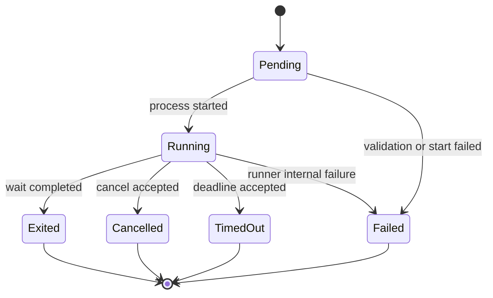
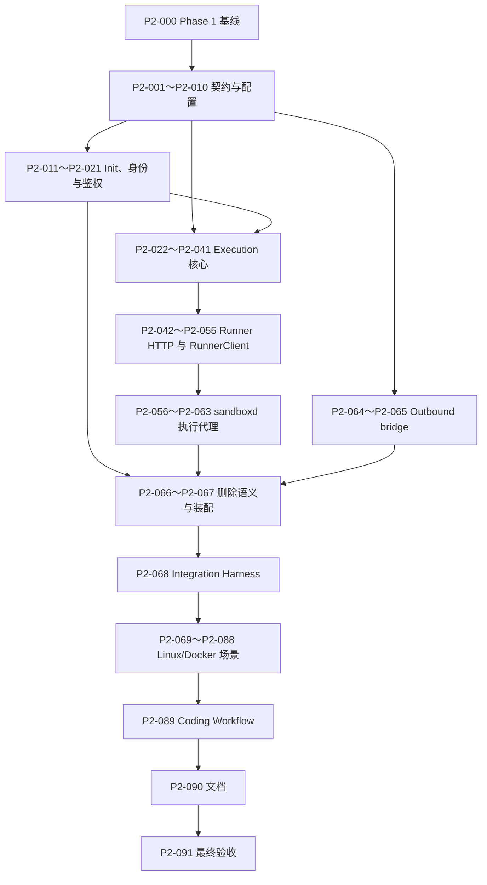

# Phase 2：Init 与 Runner 执行细粒度开发计划与设计方案

> - 状态：待审查
> - 前置阶段：[Phase 1：Docker 生命周期细粒度开发计划](./phase-1-docker-lifecycle-development-plan.md)
> - 上位设计：[全 Go Agent Sandbox Runtime 设计](./all-go-agent-sandbox-runtime-design.md)
> - 阶段定义：本文的“第二阶段”对应上位设计中的 **Phase 2：Init 与 Runner 执行**

> Phase 2 egress artifact、可重连 attach 控制协议与进程内 attestation 的最终契约见
> [ADR-0002](./decisions/0002-phase2-egress-sidecar-artifact.md)；该 ADR 覆盖本文更早的 one-shot/tmpfs 草案。

## 1. 文档目的

本文把 Phase 2 拆成可以逐个开发、逐个测试、逐个提交和逐个审查的小任务。

执行规则与 Phase 1 相同：

1. 一个任务只增加一个小能力。
2. 一个任务对应一个独立提交。
3. 每个任务先运行聚焦测试，再运行阶段要求的基础检查。
4. 每个任务提交后暂停，等待审查通过再进入下一任务。
5. 不为后续 Phase 3、Phase 4 提前增加持久化、PTY、文件或集群抽象。
6. 发现协议、安全或进程语义必须变化时，先修改本文并重新审查。

任务编号只表达依赖顺序，不表达工期。

## 2. Phase 2 的准确边界

### 2.1 强制前置条件

Phase 2 不能直接基于当前初始化骨架开始。开始 P2-001 前必须满足：

- Phase 1 的 P1-000～P1-079 全部完成；
- 存在 `docs/reports/phase1-acceptance.md`；
- create → Running → delete → Terminated 的 Linux Docker 集成测试通过；
- runnerd 和 sandbox-init 已以 linux/amd64 artifact 注入；
- Store、Docker labels、Unix Socket、启动恢复和 `/readyz` 已稳定；
- 工作区没有未解释的 Phase 1 失败、cleanup pending 或未知受管容器。

P2-000 专门验证这些前置条件，不实现 Phase 2 功能。

### 2.2 阶段目标

Phase 2 结束时，调用方应能够：

```text
创建 outbound sandbox
  → 等待 Running
  → argv 执行 git clone
  → shell 或 argv 执行 build/test
  → 实时接收 stdout/stderr SSE
  → 查询后台 execution 状态和日志
  → 显式取消或等待 timeout
  → 删除 sandbox
```

容器内必须满足：

- `sandbox-init` 正确承担 PID 1、信号转发和孤儿回收；
- runner 完成初始化后从 root 降为固定非 root UID/GID；
- 用户命令在独立进程组中运行；
- timeout、cancel、前台断开和 sandbox 删除都不会遗留子孙进程；
- runner 不能访问 Docker socket，也不能管理其他 sandbox。

### 2.3 阶段验收

严格沿用上位设计的 Phase 2 验收条件：

- 可以完成 coding agent 的 clone/build/test 流程；
- 超时后没有残留子孙进程；
- 每次 SSE 执行恰好产生一个终止事件。

增加以下完整性条件：

- argv 与 shell 必须且只能设置一个；
- 非零退出码使用 `exited`，不误报系统失败；
- 前台客户端断开会取消执行，后台客户端断开不会取消；
- stdout 与 stderr 保持区分，事件 sequence 单调递增；
- 输出超过限制后继续排空 pipe，但不继续保存，并在终止事件标记截断；
- 执行环境不继承 runner token、socket 配置或其他内部变量；
- cwd 不能通过 `..` 或 symlink 逃离 `/workspace`；
- 普通执行 UID 非 root，effective capabilities 为零；
- 普通命令无法连接 runner Unix Socket；
- 删除 sandbox 会终止全部托管 execution。

### 2.4 明确不做

以下能力不进入 Phase 2：

- periodic reconcile、指数退避和完整 crash-point 恢复；
- TTL、renew revision 和 Idempotency-Key；
- execution 跨 runner/container 重启恢复；
- 将 execution 历史写入控制面 SQLite；
- 可信审计日志；容器内后台日志只用于用户体验；
- API 多租户、RBAC、计费和分布式配额；
- PTY、交互式 terminal、文件上传下载和目录 API；
- 端口代理、ingress 和 FQDN egress allowlist；
- startup process；
- root compatibility profile；
- gVisor、Kata、microVM 和 Kubernetes；
- 多架构 runner artifact；
- 任意宿主机路径日志或持久化 execution volume。

Phase 2 仍是单机、loopback、Docker-first 的开发版本，不宣称具备恶意多租户强隔离。

## 3. Phase 1 交付基线与 Phase 2 差距

### 3.1 Phase 2 假定 Phase 1 已提供

- 异步 lifecycle create/get/delete；
- SQLite desired/observed state；
- Docker Ensure/Inspect/Delete/ListManaged；
- 确定性 container、volume、runtime directory 和 socket；
- 安全 Docker profile；
- artifact 注入；
- 最小 runner `/healthz`；
- 启动恢复和 readiness；
- 真实 Linux Docker integration harness。

### 3.2 Phase 2 需要新增

- 稳定的外部 execution API 和内部 runner API；
- execution domain model、状态机和 manager；
- 严格 SSE 编解码；
- argv/shell、env、cwd 和 executable resolution；
- stdout/stderr 读取、事件排序、输出预算和背压隔离；
- 统一 terminal arbiter；
- 进程组 cancel/timeout；
- 前台与后台不同的 context 生命周期；
- 后台事件日志、cursor 和 GC；
- runner non-root 初始化；
- runner token 派生和过滤；
- sandbox-init 单一 wait/reap 机制；
- 受控 outbound Docker bridge；
- sandboxd 到 runnerd 的显式 allowlist proxy；
- 真实进程树、安全和 coding workflow 验收。

## 4. 实施前审查门

### G1：Phase 1 验收门

没有 Phase 1 验收报告时，不实施 Phase 2。Phase 2 不负责一边修补 Docker 生命周期，一边增加进程执行。

### G2：执行协议审查

建议冻结以下外部语义：

- `background=false`：`POST` 返回 `200 text/event-stream`，连接保持到唯一终止事件；
- `background=true`：`POST` 返回 `202 application/json`，后续通过 status/logs/cancel 管理；
- wire timeout 使用 `timeout_seconds`，Go SDK 使用 `time.Duration`；
- cwd 字段统一为 `cwd`；
- stdout/stderr 载荷使用 Base64，避免任意字节和 UTF-8 chunk 边界丢失；
- 非零退出码仍是正常 `exited`；
- 终止类型固定为 `exited/failed/cancelled/timed_out`。

当前 runner OpenAPI 初稿使用 `working_dir` 和纳秒 `timeout`，本门会产生预发布破坏性调整。执行 P2-001 前必须确认。

### G3：runner 身份与 socket 所有权

runner 以 root 启动，只完成：

1. 读取内部配置；
2. 临时取得受管 runtime 目录所有权；
3. 读取并删除一次性 token 文件；
4. 创建 runner 数据目录；
5. 初始化 workspace mount root ownership；
6. 绑定 Unix Socket；
7. 把 runtime 目录和 socket owner 恢复为 sandboxd 的宿主机有效 UID/GID，mode 分别设为 0700/0600；
8. 清空 supplementary groups；
9. setgid/setuid 到固定非 root execution UID/GID；
10. 验证 UID/GID、capabilities 和不可转储状态；
11. 开始接受 HTTP 请求。

Phase 2 不支持 Docker user namespace remap。控制面 UID/GID 与 execution UID/GID 的数字映射和不相等约束必须在 P2-007/P2-016 中验证。

### G4：runner artifact 升级策略

Phase 2 runner protocol 与 Phase 1 health-only runner 不兼容。建议预发布阶段采用：

- 部署 Phase 2 前删除所有 Phase 1 sandbox；
- container labels 增加 runner protocol version；
- `/healthz` 返回 protocol version；
- sandboxd 拒绝连接未知版本；
- 不实现运行中容器热升级。

执行 P2-009 前确认该迁移策略。

### G5：Outbound 网络

Phase 1 固定 `network=none`，但 clone/build/test 需要网络。Phase 2 建议以向后兼容字段增加：

```json
{
  "image": "golang:1.26",
  "network": {
    "outbound": true
  }
}
```

服务端配置必须显式允许 outbound。`outbound=true` 使用受管 Docker bridge，`false` 继续使用 `none`。不支持 host network、published port、FQDN allowlist 或用户自定义 network。

这是隔离语义变化，执行 P2-005 前必须确认。

### G6：Linux 进程语义环境

以下行为必须在真实 Linux 容器中验证，不能只使用 Windows 单测或 fake：

- PID 1 和 `wait4`；
- SIGTERM/SIGKILL；
- process group；
- 孤儿后代回收；
- setgroups/setgid/setuid；
- capabilities 清零；
- Unix Socket 权限；
- 客户端断开；
- sandbox 删除时的进程清理。

### G7：依赖策略

Phase 2 runner 核心优先只使用 Go 标准库和 Phase 1 已批准依赖。若 SSE、ring buffer、capability 或 process tree 实现需要新增生产依赖，必须单独提交 ADR 并先确认，不能在功能任务中顺带加入。

## 5. Phase 2 核心设计

### 5.1 外部执行 API

允许的外部 endpoint：

```text
POST   /v1/sandboxes/{sandbox_id}/executions
GET    /v1/sandboxes/{sandbox_id}/executions/{execution_id}
DELETE /v1/sandboxes/{sandbox_id}/executions/{execution_id}
GET    /v1/sandboxes/{sandbox_id}/executions/{execution_id}/logs
```

外部请求：

```go
type ExecuteRequest struct {
    Argv           []string          `json:"argv,omitempty"`
    Shell          string            `json:"shell,omitempty"`
    Cwd            string            `json:"cwd,omitempty"`
    Env            map[string]string `json:"env,omitempty"`
    TimeoutSeconds int64             `json:"timeout_seconds,omitempty"`
    Background     bool              `json:"background,omitempty"`
}
```

规则：

- `argv` 与 `shell` 必须且只能设置一个；
- argv 不能为空数组，`argv[0]` 不能为空；
- 默认 cwd 为 `/workspace`；
- timeout 为零时使用 runner 默认值，不能超过服务端最大值；
- `background=false` 时要求客户端接受 SSE；
- `background=true` 时返回 execution descriptor；
- 请求中不能包含 sandbox ID、socket path、UID/GID、capability 或 Docker 参数。

### 5.2 内部 Runner API

内部 endpoint 与外部能力一一对应：

```text
GET    /healthz
POST   /v1/executions
GET    /v1/executions/{execution_id}
DELETE /v1/executions/{execution_id}
GET    /v1/executions/{execution_id}/logs
```

约束：

- runner API 不接受 sandbox ID；
- sandboxd 只调用上述固定路径；
- 没有任意 path reverse proxy；
- 每次请求携带派生 Bearer token；
- body、header、env、argv、shell 和日志分页均有上限；
- runner 只监听已绑定的当前 sandbox Unix Socket。

### 5.3 Execution 状态

```go
type ExecutionState string

const (
    ExecPending   ExecutionState = "Pending"
    ExecRunning   ExecutionState = "Running"
    ExecExited    ExecutionState = "Exited"
    ExecFailed    ExecutionState = "Failed"
    ExecCancelled ExecutionState = "Cancelled"
    ExecTimedOut  ExecutionState = "TimedOut"
)
```

状态机：



非零 exit code 仍进入 `Exited`。`Failed` 只表示命令无法启动、pipe/runner 内部错误或协议失败。

### 5.4 SSE 事件契约

每个事件都包含：

```go
type ExecutionEvent struct {
    ExecutionID   string
    Sequence      uint64
    Timestamp     time.Time
    Type          EventType
    DataBase64    string
    ExitCode      *int
    DurationMS    int64
    OutputTruncated bool
    ErrorCode     string
    Message       string
}
```

SSE frame：

```text
id: 2
event: stdout
data: {"execution_id":"e1","sequence":2,"timestamp":"...","data_base64":"b2sK"}

```

事件类型：

| 类型 | 是否终止 | 语义 |
|---|---:|---|
| `started` | 否 | 用户进程已成功启动 |
| `stdout` | 否 | Base64 编码的 stdout bytes |
| `stderr` | 否 | Base64 编码的 stderr bytes |
| `output_limit_reached` | 否 | 输出预算首次耗尽，只出现一次 |
| `exited` | 是 | 正常 wait 完成，包括非零 exit code |
| `failed` | 是 | 启动或 runner 内部失败 |
| `cancelled` | 是 | 显式取消、前台断开或 runner shutdown |
| `timed_out` | 是 | execution deadline 到期 |

规则：

- sequence 从 1 开始严格递增；
- `started` 只在 `cmd.Start` 成功后出现；
- stdout/stderr 的跨 fd 顺序只保证“runner 实际观察顺序”；
- terminal event 恰好一个且必须是最后一个；
- terminal event 等 stdout/stderr reader 完成后再发布；
- SSE `id` 等于 sequence；
- keepalive comment 不占 sequence；
- event JSON 必须单行，不能把命令输出直接拼入 SSE frame。

### 5.5 Terminal arbiter

一个 execution 只能由单一 supervisor 决定终态。

Supervisor 串行接收：

```text
process wait result
explicit cancel request
request disconnect
timeout
runner shutdown
pipe/internal failure
```

第一个被 supervisor 接受的终止原因胜出。后续原因只做幂等确认，不能发布第二个 terminal event。

取消流程：

```text
标记 cancel cause
  → SIGTERM(-pgid)
  → 等待 terminationGrace
  → 进程组仍存活则 SIGKILL(-pgid)
  → 等待主进程和 pipe readers 完成
  → 发布唯一 terminal event
```

不能使用 `exec.CommandContext` 的默认 kill 语义，因为它只保证处理主进程，不保证完整进程组。

### 5.6 进程启动

每个用户命令：

- 使用最终校验后的 cwd；
- 使用最终过滤后的 env；
- 通过独立 process group 启动；
- 不继承 runner 的 stdin；
- stdout/stderr 使用独立 pipe；
- stdin 在 Phase 2 固定为 closed/EOF；
- 不使用 TTY；
- 设置 Linux parent-death safety；runner 退出时 container PID 1 也会退出，Docker 最终终止剩余进程。

argv 模式不经过 shell。shell 模式只按固定顺序检测：

```text
/bin/bash
/bin/sh
```

两者都不存在时返回 `SHELL_NOT_FOUND`。

### 5.7 Env

最终环境：

```text
sanitized image env
+ execution env
- MINISANDBOX_* internal env
- runner token
- runner socket/bootstrap keys
- server denylist
```

限制建议：

```text
maxEnvVars=128
maxEnvKeyBytes=128
maxEnvValueBytes=8192
maxEnvTotalBytes=65536
```

key 必须匹配：

```text
[A-Za-z_][A-Za-z0-9_]*
```

execution env 覆盖同名 image env。日志最多记录通过清洗的 key 数量，不记录 value。进程启动后 execution object 不继续保存 Env map。

### 5.8 CWD

Phase 2 采用保守策略：

- 默认 `/workspace`；
- 必须是绝对路径；
- clean 后必须是 `/workspace` 或其子目录；
- 每个路径组件都用 `Lstat` 检查；
- 任何 symlink 组件都拒绝；
- 最终路径必须存在且是目录。

该策略比“EvalSymlinks 后允许仍在 workspace 的 symlink”更严格，但更容易审查并避免 TOCTOU 误解。后续如需允许 symlink，单独设计基于 `openat`/fd 的安全 cwd。

### 5.9 输出、背压和事件存储

执行进程不能因为客户端慢而阻塞：

1. stdout/stderr reader 持续读取 pipe。
2. reader 把 byte chunk 发送到中央 sequencer。
3. sequencer 分配 sequence 并写入有界 event store。
4. SSE subscriber 按 sequence 读取 event store。
5. subscriber 慢只影响自己的 HTTP writer，不阻塞 pipe reader。

Phase 2 默认总输出预算：

```text
maxExecutionOutputBytes=10 MiB
```

stdout 与 stderr 共用该预算。超过上限后：

- 第一次发布 `output_limit_reached`；
- 继续读取并丢弃后续 stdout/stderr，避免子进程因 pipe 塞满；
- terminal event 永远保留；
- terminal event 设置 `output_truncated=true`；
- 命令继续执行，不因输出上限自动取消。

前台 event store 保存在有界内存中。后台 execution 另外写容器内事件日志。

### 5.10 前台与后台

前台执行：

- execution context 派生自 runner server lifetime 和请求 context；
- 客户端断开或单次 SSE write timeout 会请求 cancel；
- 连接持续到 terminal event；
- 调用方关闭 Go SDK stream 等价于客户端断开。

后台执行：

- execution context 只派生自 runner server lifetime，不派生自 HTTP request；
- POST 成功创建后立即返回 `202`；
- 客户端断开不取消；
- 通过 GET 查询状态、DELETE 取消、logs cursor 读取事件；
- runner shutdown 或 sandbox delete 会取消。

### 5.11 后台事件日志

后台日志固定写入容器内部：

```text
/var/lib/minisandbox/executions/<execution-id>.ndjson
```

不能由请求指定路径。每行是一条完整 `ExecutionEvent` JSON。

日志策略：

- 单文件受 max output bytes 限制；
- terminal event 必须写入，即使输出已截断；
- cursor 使用最后已读取的 sequence，不使用宿主机 byte offset；
- 读取页同时限制 event 数和 response bytes；
- 完成后按 retention 清理；
- 限制 retained execution 数量；
- runner 重启后不恢复正在运行的 execution；
- 日志是 sandbox 用户体验数据，不是防篡改审计记录。

### 5.12 Runner Manager

Manager 只管理当前 sandbox：

```text
execution ID → execution state
             → supervisor
             → event store/log
             → cancel function
```

职责：

- 限制同时运行 execution 数；
- 注册、查询、取消和完成；
- shutdown 时取消全部；
- 完成后保留 descriptor 到 retention 到期；
- 不接受 sandbox ID；
- 不持久化到控制面 Store。

### 5.13 Runner 身份切换

runner 在监听前完成：

```text
root bootstrap
  → mkdir/chown workspace root
  → mkdir/chown execution data dir
  → bind socket
  → chown/chmod socket
  → setgroups([])
  → setgid(non-root)
  → setuid(non-root)
  → verify euid/egid
  → verify CapEff=0
  → serve
```

只调整 workspace mount root ownership，不递归 chown 用户数据。

降权失败必须使 runner 退出，sandbox 不能进入 Running。不能静默继续 root 执行。

### 5.14 Runner token

控制面读取权限至少 0600 的 master key file：

```text
token = HMAC-SHA256(masterKey, "runner:"+sandboxID)
```

规则：

- token 不写 Store、labels、日志或公共错误；
- sandboxd 重启后可重新派生；
- sandboxd 在启动容器前把派生值原子写入受管 runtime 目录中的固定一次性文件，mode 为 0600；
- token 不通过 Docker env、container command、labels 或普通 bootstrap JSON 传入；
- runner root bootstrap 使用 no-follow 打开并验证 regular file、owner、mode 和长度，读完立即 unlink 并清零临时 byte buffer；
- runner 降权后设置 `PR_SET_DUMPABLE=0`，避免同 UID 用户进程读取 runner 内存或 `/proc/<pid>/environ`；
- execution env builder 无条件过滤全部内部 key；
- 比较使用 constant-time；
- token 不是容器内 root 的强安全边界，Unix Socket 权限仍是第一层。

### 5.15 Sandbox-init

`sandbox-init` 只能有一个 child reaping 机制：

- 启动 runnerd 后记录 runner PID；
- 不再同时调用 `cmd.Wait` 和通用 `wait4(-1)`；
- 通过 SIGCHLD 唤醒后循环 `wait4(-1, WNOHANG)`，直到没有可回收 child；
- runner PID 的 wait status 决定 init 最终退出码；
- 其他 PID 视为重新托管的孤儿后代并回收；
- SIGTERM/SIGINT/SIGHUP 转发给 runnerd process group；
- runnerd 退出后 init 退出，Docker 终止容器内剩余进程。

该设计避免两个 goroutine 竞争回收同一个 child。

### 5.16 sandboxd 执行代理

sandboxd 的 execution application service：

1. 从 Store 读取 sandbox；
2. 要求 observed state 为 Running；
3. 按 sandbox ID 创建固定 RunnerClient；
4. 只调用允许的 runner method；
5. 映射内部错误；
6. 前台流式转发 SSE；
7. 后台转发 descriptor/status/logs/cancel。

sandboxd 不解析命令、不启动宿主机进程、不接受 runner URL，也不缓存 execution output。

### 5.17 Outbound bridge

Phase 2 增加受管 Docker network：

```text
name: minisandbox
driver: bridge
labels:
  minisandbox.io/managed=true
  minisandbox.io/schema-version=1
  minisandbox.io/resource=network
```

启动时幂等 ensure：

- 不存在则创建；
- 存在且 labels/driver 正确则复用；
- 同名非受管或配置漂移则 readiness 失败；
- sandbox 请求 outbound=false 使用 `none`；
- outbound=true 且服务端允许时连接 `minisandbox`；
- 无 published ports；
- 不使用 host network；
- 不在 Phase 2 实现域名、CIDR 或端口 allowlist。

集成测试使用本地 fixture Git server，不依赖公网。

## 6. Phase 2 配置

建议增加：

```yaml
runner:
  execution_uid: 1000
  execution_gid: 1000
  default_cwd: "/workspace"
  default_timeout: "10m"
  max_timeout: "1h"
  termination_grace: "2s"
  max_concurrent_executions: 8
  max_request_bytes: 1048576
  max_output_bytes: 10485760
  max_env_vars: 128
  max_env_key_bytes: 128
  max_env_value_bytes: 8192
  max_env_total_bytes: 65536
  max_log_page_events: 256
  max_log_page_bytes: 1048576
  completed_retention: "1h"
  max_retained_executions: 100
  sse_write_timeout: "15s"

security:
  runner_master_key_file: "/etc/minisandbox/runner-master-key"
  allow_outbound: false

runtime:
  outbound_network_name: "minisandbox"
```

所有 limit 在 sandboxd 启动时验证，并作为内部 bootstrap config 传给 runner。普通 execution 请求不能扩大这些上限。

## 7. 每个任务的完成标准

除任务自身验收项外，每个代码任务都必须：

- 保持中文模块和导出 API 注释同步；
- 运行受影响包聚焦测试；
- 运行 `gofmt`、`go test ./...` 和 `go vet ./...`；
- 涉及并发时运行 `go test -race`；
- 涉及 PID、signal、UID、capability 或 Unix Socket 时运行真实 Linux 测试；
- 涉及 public/internal API 时同步 OpenAPI、protocol、SDK、fixtures 和 handler；
- 确保 terminal event 恰好一个；
- 确保测试失败路径清理进程、文件和容器；
- 不记录命令全文、env value、token 或宿主机敏感路径；
- 提交只包含当前任务的小功能。

每个审查包应提供：

```text
任务 ID
目标
设计决定
文件列表
测试结果
Linux/Docker 验证结果
明确未做
commit SHA
```

## 8. 任务总览

| 分组 | 任务 | 结果 |
|---|---:|---|
| A. 契约、配置与网络入口 | P2-000～P2-010 | 固定前置条件、执行协议、limits 和 outbound contract |
| B. Init、身份与内部鉴权 | P2-011～P2-021 | 正确 PID 1、non-root runner、socket 和 token |
| C. Execution 核心 | P2-022～P2-041 | 进程、状态、输出、终态、cancel/timeout |
| D. Runner HTTP 与后台日志 | P2-042～P2-055 | SSE、后台状态、logs cursor 和 runnerclient |
| E. sandboxd 代理与 Docker 网络 | P2-056～P2-067 | 外部 API、断开语义、bridge 和装配 |
| F. Linux/Docker 验收 | P2-068～P2-091 | 进程树、安全、协议、coding workflow、文档与最终验收 |

## 9. 详细任务

### A. 契约、配置与网络入口

### P2-000：验证 Phase 1 验收基线

- **依赖**：G1。
- **唯一目标**：确认 Phase 1 验收报告和真实 Docker 证据满足 Phase 2 前置条件。
- **设计**：逐项读取 P1-079 报告、依赖版本、已知限制和运行资源；发现缺口时回到独立 Phase 1 修复任务。
- **修改范围**：只更新 Phase 1 报告中的确认记录，或新增 Phase 2 kickoff checklist。
- **测试**：重新运行 Phase 1 核心 create/delete/restart smoke。
- **验收**：没有未解释的 cleanup pending、unknown managed resource 或失败测试。
- **本任务不做**：不修改 runner 或 execution API。

### P2-001：冻结前台执行请求契约

- **依赖**：P2-000、G2。
- **唯一目标**：固定 argv/shell/cwd/env/timeout/background=false 的公共和内部请求 schema。
- **设计**：统一使用 `cwd` 和 `timeout_seconds`；删除纳秒 timeout 和 `working_dir` 初稿字段；argv/shell 使用 oneOf。
- **修改范围**：外部 lifecycle OpenAPI、runner OpenAPI、`pkg/protocol`、Go SDK request model。
- **测试**：OpenAPI example、JSON round trip、SDK mapping。
- **验收**：外部与内部请求字段、单位和约束一致。
- **本任务不做**：不实现 handler 或 process。

### P2-002：冻结 SSE 事件契约

- **依赖**：P2-001。
- **唯一目标**：固定本文 5.4 的事件类型、字段和 Base64 输出语义。
- **设计**：终止事件使用互斥 schema；exit code 只属于 exited；error code/message 只属于 failed；sequence 从 1 开始。
- **修改范围**：两个 OpenAPI、`pkg/protocol` events、SDK event model、contract fixtures。
- **测试**：每种 event fixture、非法字段组合、Base64 round trip。
- **验收**：四种 terminal event 均可区分，非零 exit code 不映射为 failed。
- **本任务不做**：不实现 SSE encoder。

### P2-003：冻结后台 status/cancel/logs 契约

- **依赖**：P2-001、P2-002。
- **唯一目标**：固定 background 202 descriptor、GET state、DELETE cancel 和 logs cursor schema。
- **设计**：cursor 为 sequence；logs response 有 events、next_cursor、complete；terminal DELETE 返回 204，运行中取消返回 202。
- **修改范围**：两个 OpenAPI、protocol、Go SDK facade 和 fixtures。
- **测试**：descriptor/status/log page JSON round trip。
- **验收**：SDK 不需要拼接私有 runner path。
- **本任务不做**：不实现存储和 endpoint。

### P2-004：固定 execution 公共错误

- **依赖**：P2-001～P2-003。
- **唯一目标**：增加 execution 专用稳定错误 code。
- **设计**：至少包含 SANDBOX_NOT_RUNNING、INVALID_EXECUTION_REQUEST、EXECUTION_NOT_FOUND、EXECUTION_LIMIT_REACHED、SHELL_NOT_FOUND、INVALID_CWD、RUNNER_UNHEALTHY、RUNNER_PROTOCOL_MISMATCH。
- **修改范围**：OpenAPI error responses、protocol error constants、现有 error mapper contract。
- **测试**：HTTP/code/retryable matrix。
- **验收**：公共错误不包含 argv、shell、env value、socket path 或内部 cause。
- **本任务不做**：不编写 runner error mapper。

### P2-005：增加 outbound lifecycle contract

- **依赖**：P2-000、G5。
- **唯一目标**：向创建请求增加可选 `network.outbound`。
- **设计**：默认 false；只允许 boolean；protocol、SDK、domain mapping 和 spec hash 同步。
- **修改范围**：lifecycle OpenAPI、protocol、SDK、contract fixtures、Phase 1 domain/spec hash 测试。
- **测试**：字段缺失、false、true、hash 差异。
- **验收**：旧客户端不传字段时继续 network none。
- **本任务不做**：不创建 Docker network。

### P2-006：增加 execution limit 配置模型

- **依赖**：P2-000。
- **唯一目标**：在 typed config 中增加本文第 6 节 runner limits。
- **设计**：只加类型和安全默认值；duration 使用 Go 原生类型；bytes/count 使用明确整数。
- **修改范围**：config model、示例配置和中文注释。
- **测试**：默认值逐项断言。
- **验收**：默认配置有界且适合本地开发。
- **本任务不做**：不解析或验证新字段。

### P2-007：验证 execution 与身份配置

- **依赖**：P2-006、G3。
- **唯一目标**：启动前拒绝无效 limit、UID/GID、路径和 outbound 配置。
- **设计**：execution UID/GID 非零；与 socket owner 数字身份不相等；timeout/grace/output/env/page/retention 全部有上下界；default cwd 固定 workspace。
- **修改范围**：config validator。
- **测试**：每条规则一个 table case。
- **验收**：无效身份或无界 limit 阻止 sandboxd 启动。
- **本任务不做**：不切换身份。

### P2-008：定义 runner bootstrap config

- **依赖**：P2-006、P2-007。
- **唯一目标**：定义 sandboxd 传给 runnerd 的内部配置结构。
- **设计**：包含 execution UID/GID、socket owner UID/GID、limits、paths、sandbox ID、protocol version；不包含用户 request。
- **修改范围**：内部 protocol/bootstrap model。
- **测试**：序列化 round trip、未知字段、缺失字段。
- **验收**：结构有显式 version，字段均可从控制面配置和 sandbox ID 推导。
- **本任务不做**：不决定传输方式。

### P2-009：增加 runner protocol version

- **依赖**：P2-008、G4。
- **唯一目标**：让 container label 和 runner `/healthz` 暴露可比较的协议版本。
- **设计**：label 只写非秘密整数版本；health 返回 service/version/protocol_version；sandboxd 要求精确匹配。
- **修改范围**：Docker labels、runner health protocol、runnerclient health、contract tests。
- **测试**：匹配、旧版本、未来版本、缺失版本。
- **验收**：版本不匹配的 sandbox 不能进入 Running。
- **本任务不做**：不热升级已有 container。

### P2-010：建立 Phase 2 contract test matrix

- **依赖**：P2-001～P2-009。
- **唯一目标**：用统一 fixtures 验证外部 API、runner API、protocol 和 SDK。
- **设计**：request、event、descriptor、status、cancel、logs、error 和 health version 各有正反 fixture。
- **修改范围**：`tests/contract`。
- **测试**：contract suite。
- **验收**：字段名、单位、枚举或 terminal schema 漂移会使测试失败。
- **本任务不做**：不启动真实 runner。

### B. Init、身份与内部鉴权

### P2-011：改为 sandbox-init 单一 wait4 reaper

- **依赖**：P2-000、G6。
- **唯一目标**：消除 `cmd.Wait` 与通用 child reaping 竞争。
- **设计**：Start runnerd 后只使用一个 wait4 loop；记录 runner PID；SIGCHLD 后 reap 直到 pid=0/ECHILD；孤儿 PID 单独计数。
- **修改范围**：`cmd/sandbox-init/run_unix.go`。
- **测试**：Linux helper process 生成多层 orphan；race detector。
- **验收**：每个 child 只被回收一次，runner exit status 可识别。
- **本任务不做**：不实现信号转发变化。

### P2-012：实现 init 信号转发

- **依赖**：P2-011。
- **唯一目标**：把 SIGTERM、SIGINT、SIGHUP 转发给 runnerd process group。
- **设计**：只在 runner PID 有效且尚未 reap 时发送负 PGID；忽略 ESRCH；不转发 SIGCHLD。
- **修改范围**：sandbox-init signal loop。
- **测试**：helper runner 捕获三类信号；runner 先退出 race。
- **验收**：信号不会发送到 init 自己或错误 PID。
- **本任务不做**：不增加 grace escalation。

### P2-013：映射 init 最终退出码

- **依赖**：P2-011、P2-012。
- **唯一目标**：把 runner wait status 稳定映射为 sandbox-init exit code。
- **设计**：正常退出保持 code；signal 退出使用 128+signal；启动失败 127；内部 init 错误 1。
- **修改范围**：sandbox-init exit helper。
- **测试**：0、非零、SIGTERM、SIGKILL、启动不存在。
- **验收**：Docker inspect 能从 init exit code 判断 runner 退出类别。
- **本任务不做**：不读取 execution 状态。

### P2-014：增加 init 孤儿回收 Linux 测试

- **依赖**：P2-011～P2-013、G6。
- **唯一目标**：真实验证双重 fork/父进程退出后的 orphan 被 PID 1 回收。
- **设计**：专用 helper binary 生成 orphan；通过 `/proc` 和 wait 结果验证，不依赖固定 sleep。
- **修改范围**：sandbox-init Linux integration test。
- **测试**：本任务本身。
- **验收**：测试结束无 zombie，init 能继续等待 runner。
- **本任务不做**：不启动 Docker sandboxd。

### P2-015：初始化 runner 受管目录

- **依赖**：P2-008。
- **唯一目标**：root bootstrap 阶段创建 execution data dir 并初始化 workspace mount root。
- **设计**：固定路径；拒绝 symlink；只 chown mount root，不递归；mode 有界；重复启动幂等。
- **修改范围**：`internal/runner` bootstrap helper。
- **测试**：临时目录、重复、symlink、错误 owner。
- **验收**：不接受请求提供路径。
- **本任务不做**：不绑定 socket 或执行 setuid。

### P2-016：固定 runner socket owner 和 mode

- **依赖**：P2-007、P2-008、P2-015。
- **唯一目标**：在降权前绑定 socket 并设置控制面可访问、执行用户不可访问的权限。
- **设计**：父目录 0700；socket chown 为 sandboxd effective UID/GID；mode 0600；验证 socket owner 与 execution UID/GID 不同。
- **修改范围**：runnerd listener/bootstrap。
- **测试**：owner/mode、身份相同拒绝、stale socket、symlink。
- **验收**：listener fd 在降权后仍可 accept，普通 execution UID 无 pathname connect 权限。
- **本任务不做**：不执行 setuid。

### P2-017：实现 runner 身份切换

- **依赖**：P2-015、P2-016、G6。
- **唯一目标**：按 setgroups → setgid → setuid 顺序降为固定非 root。
- **设计**：只在 Linux runner 使用；失败立即返回并关闭 listener；不保留 keepcaps。
- **修改范围**：runner Linux identity helper。
- **测试**：特权 Linux helper、非法 UID/GID、调用顺序。
- **验收**：降权后不能恢复 root。
- **本任务不做**：不启动用户命令。

### P2-018：验证 runner 身份、capabilities 与不可转储状态

- **依赖**：P2-017。
- **唯一目标**：降权后主动验证实际身份、`CapEff=0` 和 `PR_GET_DUMPABLE=0`。
- **设计**：降权后先设置 `PR_SET_DUMPABLE=0`，再读取有效 UID/GID、`/proc/self/status` 和 prctl 状态；任一步失败都视为 bootstrap 失败；安全日志只记录数值身份和结果。
- **修改范围**：identity verifier。
- **测试**：真实 Linux 子进程和 status parser fixture。
- **验收**：任何 capability 残留或 dumpable 非零都使 runner 退出，同 UID helper 无法读取 runner 的 `/proc/<pid>/environ`。
- **本任务不做**：不修改 Docker CapDrop 配置。

### P2-019：读取和验证 runner master key

- **依赖**：P2-007。
- **唯一目标**：sandboxd 从 secret file 安全读取固定长度 master key。
- **设计**：绝对 regular file、非 symlink、权限不宽于 0600、最小熵长度；错误不打印内容。
- **修改范围**：security config loader。
- **测试**：权限、symlink、短 key、空 key、成功。
- **验收**：key 不进入普通 config dump。
- **本任务不做**：不派生 token。

### P2-020：派生并暂存一次性 runner token

- **依赖**：P2-008、P2-019。
- **唯一目标**：按 sandbox ID 派生 token，并通过受管 runtime 目录中的一次性文件交给 runner bootstrap。
- **设计**：HMAC-SHA256 domain separation；sandboxd 使用 no-follow、exclusive create 和原子 rename 写固定文件，mode 0600；runner root 临时取得目录所有权后读取并 unlink；双方清零临时 byte buffer；token 不进入 env、command、bootstrap JSON 或 labels。
- **修改范围**：token derivation、credential file staging/consumption 与 Docker runtime-dir mount 装配。
- **测试**：稳定派生、不同 ID 不同、错误 key、mode/owner、symlink、重复写、读取后删除、Docker env/labels/command snapshot。
- **验收**：sandboxd 重启使用同一 master key 可重新派生；runner ready 后宿主机和容器内均不存在 credential 文件。
- **本任务不做**：不校验 HTTP header。

### P2-021：强制 runner 内部鉴权

- **依赖**：P2-016、P2-020。
- **唯一目标**：所有 `/v1/executions` endpoint 必须通过 Bearer token。
- **设计**：constant-time compare；health 是否鉴权由 contract 固定为是；401 不说明 token 缺失还是错误；请求日志不记录 header。
- **修改范围**：runner auth middleware、runnerclient。
- **测试**：正确、错误、缺失、重复 header、日志 redaction。
- **验收**：空 token 不再允许启动 Phase 2 runner。
- **本任务不做**：不实现 execution handler。

### C. Execution 核心

### P2-022：定义 execution 领域模型与状态机

- **依赖**：P2-002～P2-004。
- **唯一目标**：建立不依赖 HTTP 的 execution ID、状态、终止原因和只读 descriptor 模型。
- **设计**：只允许本节 5.3 的状态转换；状态值通过显式 mapper 转为 wire enum；终态不可逆；非零退出码属于 `Exited`。
- **修改范围**：`internal/runner` 的 execution model 与 state transition tests。
- **测试**：每条合法边、每条非法边、重复终态、非零退出码。
- **验收**：非法转换返回稳定内部错误且不改变原状态。
- **本任务不做**：不创建进程，不加入 manager。

### P2-023：生成 execution ID 与注入时钟

- **依赖**：P2-022。
- **唯一目标**：为 execution 提供不可预测 ID、UTC 时间戳和可测试时钟。
- **设计**：ID 使用加密随机源并带固定 `exec_` 前缀；随机失败即拒绝创建；时间只通过注入 clock 取得；不从 ID 推导时间或 sandbox。
- **修改范围**：execution factory、clock 接口和单元测试。
- **测试**：格式、唯一性、随机源失败、固定时钟、并发生成。
- **验收**：ID 可安全进入 URL path，且不包含 sandbox ID、PID 或顺序计数器。
- **本任务不做**：不注册 execution，不新增第三方 ID 依赖。

### P2-024：校验 argv、shell、timeout 与 background

- **依赖**：P2-001、P2-006、P2-022。
- **唯一目标**：把基础请求校验收敛为一个 runner 内部 validator。
- **设计**：argv/shell 必须且只能设置一个；拒绝空 argv、空 `argv[0]`、NUL 和超长参数；timeout 为零取默认值，超过 max 拒绝；background 只决定生命周期，不改变命令。
- **修改范围**：`internal/runner` request validator。
- **测试**：互斥矩阵、空白 shell、参数数量/字节上限、默认/最大/负 timeout。
- **验收**：validator 返回清洗后的新值，不修改调用方 request。
- **本任务不做**：不校验 env 或 cwd，不启动命令。

### P2-025：校验、合并并过滤 execution 环境

- **依赖**：P2-006、P2-020、P2-024。
- **唯一目标**：生成不泄露 runner 内部配置的最终进程环境。
- **设计**：先清洗 image env，再用请求 env 覆盖；拒绝非法 key、NUL 和超限；无条件删除 `MINISANDBOX_*`、token、socket、bootstrap 与 denylist key；结果按 key 排序便于测试。
- **修改范围**：environment builder 与 redaction tests。
- **测试**：覆盖、重复、非法 key、各级 limit、内部 key 大小写策略、NUL、排序。
- **验收**：测试把敏感值放入输入后，最终 env、错误和日志均不含该值。
- **本任务不做**：不读取宿主机环境，不把 env 保存到 execution descriptor。

### P2-026：限制 execution cwd 在 workspace 内

- **依赖**：P2-024、G6。
- **唯一目标**：把请求 cwd 解析为 `/workspace` 内存在且无 symlink 的目录。
- **设计**：默认 `/workspace`；要求绝对路径；clean 后检查边界；从 workspace 根逐组件 `Lstat`；任何 symlink、非目录或不存在均拒绝。
- **修改范围**：Linux cwd validator。
- **测试**：根目录、子目录、`..`、相似前缀、缺失路径、文件、各层 symlink。
- **验收**：不能通过字符串、symlink 或 workspace 前缀碰撞逃逸。
- **本任务不做**：不支持可信 symlink，不切换进程 cwd。

### P2-027：探测固定 shell

- **依赖**：P2-024。
- **唯一目标**：为 shell 模式按固定顺序选择 `/bin/bash` 或 `/bin/sh`。
- **设计**：只检查两个绝对路径是否为可执行 regular file；bash 优先；都不可用时返回 `SHELL_NOT_FOUND`；不读取 `$SHELL` 或 `PATH`。
- **修改范围**：shell resolver。
- **测试**：bash、仅 sh、都缺失、目录、不可执行文件。
- **验收**：相同镜像文件系统得到确定结果。
- **本任务不做**：不构造 argv，不执行 shell。

### P2-028：构造 argv 与 shell 命令

- **依赖**：P2-024、P2-027。
- **唯一目标**：把已校验请求映射为不启动进程的 `exec.Cmd` specification。
- **设计**：argv 模式原样使用参数且不经过 shell；shell 模式固定为 `<shell> -c <source>`；设置 cwd、env、closed stdin 和独立 stdout/stderr pipe 需求；不使用 `CommandContext`。
- **修改范围**：command builder 与 specification tests。
- **测试**：带空格/引号 argv、shell source、cwd/env、stdin、不存在 argv[0] 的延后语义。
- **验收**：argv 参数不会被重新拼接或解释。
- **本任务不做**：不调用 `Start`，不解析用户 shell 文本。

### P2-029：以独立进程组启动命令

- **依赖**：P2-028、G6。
- **唯一目标**：成功启动用户命令并取得稳定 PGID。
- **设计**：Linux 使用 `Setpgid=true`；`Start` 后确认 PID/PGID；失败不发布 `started`；设置 parent-death safety 的具体方式由 Linux helper 封装并测试。
- **修改范围**：process starter 与 Linux helper。
- **测试**：正常启动、可执行文件不存在、权限拒绝、PGID 等于 leader PID、runner 父进程退出 helper。
- **验收**：每次成功启动都有独立 PGID，任何启动失败都不留下 child。
- **本任务不做**：不等待、不取消、不发布事件。

### P2-030：持续读取 stdout 与 stderr

- **依赖**：P2-028、P2-029。
- **唯一目标**：分别排空两个 pipe 并产生带 stream 类型的原始 chunk。
- **设计**：每个 fd 一个 reader；复制 chunk 后交给有界内部通道；EOF 是正常完成；读取错误单独上报；reader 不分配 sequence，也不直接写 HTTP。
- **修改范围**：pipe reader。
- **测试**：空输出、二进制、非 UTF-8、大于 buffer、交错输出、读错误、race。
- **验收**：stdout/stderr 不混合，输入 buffer 被复用时事件内容不变化。
- **本任务不做**：不做 Base64、不决定终态。

### P2-031：实现中央事件 sequencer

- **依赖**：P2-002、P2-023、P2-030。
- **唯一目标**：由单一 goroutine 为 execution 的所有事件分配连续 sequence。
- **设计**：`started` 固定 sequence 1；stdout/stderr、limit 和 terminal 都经同一入口；timestamp 来自注入 clock；sequencer 关闭后拒绝发布。
- **修改范围**：event sequencer。
- **测试**：并发输入、连续编号、关闭后写入、时间戳、race。
- **验收**：高并发输出下无重复、倒退或跳号。
- **本任务不做**：不保存事件，不编码 SSE。

### P2-032：实现有界事件存储与输出截断

- **依赖**：P2-006、P2-031。
- **唯一目标**：限制 stdout/stderr 保存总量，同时保证 pipe 可继续排空和终态可保存。
- **设计**：只按解码前原始输出 bytes 计费；预算首次耗尽发布一次 `output_limit_reached`；后续输出丢弃；控制事件不占输出预算；terminal 预留空间且标记 `output_truncated`。
- **修改范围**：in-memory event store 与 output budget。
- **测试**：恰好上限、跨 chunk、双 stream 共享、零输出、limit 事件一次、terminal 永远保留。
- **验收**：内存占用受配置上限控制，超限命令不会因停止读 pipe 而阻塞。
- **本任务不做**：不写后台 NDJSON，不取消超限命令。

### P2-033：实现唯一终态裁决器

- **依赖**：P2-022、P2-031、P2-032。
- **唯一目标**：让并发 wait、cancel、timeout、disconnect、shutdown 和内部错误只能选出一个终止原因。
- **设计**：单一 supervisor loop 串行接收原因；首个接受的原因锁定终态；等待进程和 readers 收尾后发布 terminal；重复原因返回幂等结果。
- **修改范围**：terminal arbiter/supervisor。
- **测试**：所有原因两两竞争、重复 cancel、终态后 timeout、pipe error 与 wait 竞态、race。
- **验收**：每种竞态都恰好一个 terminal，且它是最后一条事件。
- **本任务不做**：不发送 signal，不解释 wait status。

### P2-034：等待主进程并映射 exited

- **依赖**：P2-029、P2-030、P2-033。
- **唯一目标**：把主进程 wait 结果映射为正确的 `exited` 或内部失败候选。
- **设计**：只由 execution supervisor 调用 `cmd.Wait`；等待两个 pipe reader 完成；正常 code 0 和非零 code 都是 `exited`；无法取得 wait status 才是 `failed`。
- **修改范围**：process waiter 与 wait result mapper。
- **测试**：0、1、127、signal exit、reader 晚于主进程、Wait 内部错误。
- **验收**：非零退出不返回 HTTP 系统错误，terminal 带 exit code 与 duration。
- **本任务不做**：不处理主动 cancel 或 timeout。

### P2-035：取消完整进程组

- **依赖**：P2-029、P2-033、G6。
- **唯一目标**：显式取消时按 TERM → grace → KILL 终止 execution 的整个进程组。
- **设计**：只向负 PGID 发 signal；`ESRCH` 视为已退出；使用可注入 timer；grace 后用 `kill(-pgid, 0)` 探测；最终仍由 waiter 回收主进程。
- **修改范围**：Linux process-group terminator。
- **测试**：主进程、子进程、忽略 TERM、grace 内退出、已退出、重复 cancel、错误 PGID 防护。
- **验收**：cancel 返回后进程组不存在，终态为 `cancelled` 且只出现一次。
- **本任务不做**：不接 HTTP DELETE，不处理 timeout。

### P2-036：实现 execution timeout

- **依赖**：P2-024、P2-035。
- **唯一目标**：到达 execution deadline 时复用进程组终止流程并产生 `timed_out`。
- **设计**：deadline 从成功启动时开始；timeout 与显式 cancel 竞态交给 arbiter；停止并释放 timer；排队时间不计入执行 timeout。
- **修改范围**：supervisor timeout source。
- **测试**：到期、完成前停止、cancel/timeout 竞态、零值使用默认、timer leak。
- **验收**：timeout 后无主进程和后代，terminal 为 `timed_out`。
- **本任务不做**：不实现请求/响应超时。

### P2-037：注册、查询和限流 execution

- **依赖**：P2-006、P2-022、P2-023、P2-033。
- **唯一目标**：Manager 在单个 runner 内管理 execution 并限制并发运行数。
- **设计**：先原子占用 slot 再注册 Pending；启动失败释放；只返回 descriptor snapshot；达到上限返回 `EXECUTION_LIMIT_REACHED`；终态对象进入保留集合。
- **修改范围**：runner execution manager。
- **测试**：注册、重复 ID、查询、启动失败释放、并发上限边界、race。
- **验收**：任意竞态下 Running/Pending 数不超过配置上限。
- **本任务不做**：不做 retention GC，不启动真实命令。

### P2-038：按 ID 幂等取消 execution

- **依赖**：P2-035、P2-037。
- **唯一目标**：Manager 对运行中和终态 execution 提供稳定 cancel 语义。
- **设计**：运行中首次取消返回 accepted；已请求取消再次调用仍成功；终态返回 no-op；未知 ID 返回 not found；不暴露内部 goroutine。
- **修改范围**：manager cancel method。
- **测试**：Pending、Running、每种 terminal、未知 ID、并发重复取消。
- **验收**：重复请求不改变已选终态、不重复发送 terminal。
- **本任务不做**：不实现 HTTP 状态码映射。

### P2-039：runner shutdown 取消全部 execution

- **依赖**：P2-035、P2-037、P2-038。
- **唯一目标**：runner 停止接受请求后终止所有托管进程组并等待收尾。
- **设计**：先关闭创建入口，再 snapshot 活跃 execution 并并发请求 `runner_shutdown` cancel；等待有总上限；超时返回错误交给 init/Docker 最终终止。
- **修改范围**：manager `Shutdown`。
- **测试**：零任务、多个任务、并发创建、忽略 TERM、重复 shutdown、race。
- **验收**：正常 shutdown 返回时 manager 无活跃 execution。
- **本任务不做**：不处理 OS signal，不删除容器。

### P2-040：定义前台 execution context 生命周期

- **依赖**：P2-033、P2-035、P2-037。
- **唯一目标**：前台 execution 在请求断开或 stream write 失败时被取消。
- **设计**：execution lifetime 同时受 runner server context 和 request context 约束；断开原因统一映射为 `cancelled`，但内部记录安全的 cause 分类；终态已发布后断开无动作。
- **修改范围**：foreground execution coordinator。
- **测试**：请求取消、server shutdown、正常完成后取消、两者竞态、race。
- **验收**：前台连接消失后进程组最终不存在。
- **本任务不做**：不写 SSE frame，不设置 HTTP write deadline。

### P2-041：定义后台 execution context 生命周期

- **依赖**：P2-033、P2-037、P2-039。
- **唯一目标**：后台 execution 脱离创建请求 context，只受显式取消和 runner lifetime 约束。
- **设计**：在接受创建前构造 server-lifetime context；POST 返回或客户端断开不传播取消；runner shutdown 仍取消；创建失败不泄漏 context。
- **修改范围**：background execution coordinator。
- **测试**：请求立即取消、后台继续、显式取消、server shutdown、创建失败、race。
- **验收**：202 已返回后断开客户端，命令仍能走到自己的 terminal。
- **本任务不做**：不持久化日志，不实现查询 endpoint。

### D. Runner HTTP 与后台日志

### P2-042：实现严格 SSE 编码器

- **依赖**：P2-002、P2-031。
- **唯一目标**：把一个 `ExecutionEvent` 编码为合法、可立即 flush 的 SSE frame。
- **设计**：`id` 等于 sequence，`event` 等于 type，`data` 为单行 JSON；Base64 输出只存在 JSON 字段；拒绝 sequence 0 和未知 type；keepalive 另用 comment helper。
- **修改范围**：runner transport SSE encoder。
- **测试**：所有事件、特殊字符、空数据、二进制 Base64、非法事件、frame 分隔。
- **验收**：任意输出都不能注入新的 SSE field 或 frame。
- **本任务不做**：不循环发送事件，不操作 HTTP status。

### P2-043：实现 runner 前台创建 handler

- **依赖**：P2-021、P2-024～P2-041。
- **唯一目标**：`POST /v1/executions` 在 `background=false` 时创建 execution 并进入流式响应。
- **设计**：限制 body 后严格解码；要求 SSE Accept；完成 validation 后才提交 Manager；启动失败在 headers 未提交时返回 JSON error；启动成功后交给 stream loop。
- **修改范围**：runner foreground create handler。
- **测试**：鉴权、method/content-type/accept、非法 JSON、尾随 JSON、validation、启动失败、成功交接。
- **验收**：handler 不直接调用 OS process API，且不会在 JSON error 后再写 SSE。
- **本任务不做**：不定义 stream loop，不支持后台请求。

### P2-044：实现 runner 前台 SSE stream

- **依赖**：P2-040、P2-042、P2-043。
- **唯一目标**：从 event store 依序发送到唯一 terminal 并及时处理慢客户端。
- **设计**：设置 `text/event-stream`、no-cache；每 frame flush；使用 `http.ResponseController` write deadline；空闲时发 comment keepalive；写失败或 deadline 触发前台 cancel；不能反向阻塞 publisher。
- **修改范围**：runner foreground stream loop。
- **测试**：顺序、flush、keepalive 不占 sequence、慢 writer、断开、terminal 后结束。
- **验收**：正常连接最后一帧是唯一 terminal；慢连接不会使用户进程 pipe 堵塞。
- **本任务不做**：不代理到 sandboxd，不保存后台文件。

### P2-045：实现 runner 后台创建 handler

- **依赖**：P2-021、P2-041、P2-043。
- **唯一目标**：`background=true` 时创建 execution 并返回 `202` descriptor。
- **设计**：复用同一 request validator；在发送 202 前保证 execution 已注册且启动已被接受；响应只含公开 descriptor；context 与 request 分离。
- **修改范围**：runner background branch/handler。
- **测试**：成功 202、validation、limit、启动失败、响应写失败后继续运行。
- **验收**：返回 descriptor 后可立即按 ID 查询，客户端断开不取消。
- **本任务不做**：不实现日志文件或查询 handler。

### P2-046：实现 runner execution 状态查询

- **依赖**：P2-003、P2-037、P2-045。
- **唯一目标**：`GET /v1/executions/{id}` 返回一致的 descriptor snapshot。
- **设计**：严格匹配单段 ID；只读 Manager snapshot；运行中不返回 env、命令全文、PID/PGID 或内部错误；终态返回必要的 exit/terminal metadata。
- **修改范围**：runner status handler 与 mapper。
- **测试**：每个状态、未知/非法 ID、method、并发状态变化、字段 redaction。
- **验收**：响应符合 contract，且 race detector 下 snapshot 一致。
- **本任务不做**：不返回事件内容，不等待状态改变。

### P2-047：实现 runner cancel endpoint

- **依赖**：P2-003、P2-038、P2-046。
- **唯一目标**：`DELETE /v1/executions/{id}` 映射幂等取消结果。
- **设计**：运行中首次或重复取消返回 202；已终态返回 204；未知 ID 返回 404；响应不等待完整 grace/KILL，但状态最终可查询。
- **修改范围**：runner cancel handler。
- **测试**：running、cancel requested、terminal、unknown、并发 DELETE。
- **验收**：DELETE 重试安全，且不会选择第二种终态。
- **本任务不做**：不实现同步等待终止参数。

### P2-048：写入后台 NDJSON 事件日志

- **依赖**：P2-015、P2-031、P2-032、P2-041。
- **唯一目标**：后台 execution 把已排序事件追加到固定路径的 NDJSON 文件。
- **设计**：文件名只来自已校验 execution ID；使用 `O_CREATE|O_EXCL` 和受限 mode；逐事件完整 JSON 行；按 sequence 写；输出超限后仍写 limit 和 terminal；sync/close 错误提交给 arbiter。
- **修改范围**：background event log writer。
- **测试**：路径、mode、顺序、部分写、磁盘错误、截断、terminal、symlink 预置攻击。
- **验收**：每一完整行可独立解码，路径不能由 request 影响。
- **本任务不做**：不读取日志，不做跨重启恢复。

### P2-049：按 sequence cursor 读取后台日志

- **依赖**：P2-003、P2-048。
- **唯一目标**：`GET .../logs` 返回 cursor 之后的一页完整事件。
- **设计**：cursor 表示最后已读 sequence，缺失等价 0；逐行解码并验证 ID/sequence；同时限制事件数和 response bytes；`next_cursor` 是本页最后 sequence；terminal 已见时 `complete=true`。
- **修改范围**：log reader 与 runner logs handler。
- **测试**：第一页、续页、空页、边界、非法 cursor、损坏行、超大行、完成状态。
- **验收**：重复相同 cursor 得到相同已保留结果，不暴露文件 offset/path。
- **本任务不做**：不长轮询，不删除日志。

### P2-050：清理已完成 execution 与日志

- **依赖**：P2-006、P2-037、P2-048、P2-049。
- **唯一目标**：按 retention 和数量上限从 Manager 与固定目录清理已完成 execution。
- **设计**：只选择终态；先从可查询集合原子移除，再删除对应已验证 regular file；按完成时间和 ID 稳定排序；运行中对象绝不清理；失败可在下一轮重试。
- **修改范围**：runner completed-execution GC。
- **测试**：时间到期、数量驱逐、运行中保护、删除失败重试、symlink 拒绝、并发查询、race。
- **验收**：内存对象和日志数量最终受限，GC 不跟随 symlink。
- **本任务不做**：不恢复 runner 重启前日志，不写控制面 Store。

### P2-051：集中 runner 请求上限与错误映射

- **依赖**：P2-004、P2-006、P2-043～P2-049。
- **唯一目标**：统一限制 runner HTTP header/body/path/page 并把内部错误映射为稳定 JSON。
- **设计**：server 设置 header/read/write-idle 合理边界；body 使用 hard limit；未知字段和尾随数据拒绝；公共 message 使用固定模板；日志只记 request ID、error code 和安全计数。
- **修改范围**：runner middleware、decoder 和 error mapper。
- **测试**：超大 header/body、慢读、未知字段、内部错误、secret/command redaction。
- **验收**：所有非 SSE 失败都使用 contract error envelope，敏感输入不出现在响应或日志。
- **本任务不做**：不实现外部 sandboxd error mapper。

### P2-052：装配 runner server 与 readiness

- **依赖**：P2-016～P2-018、P2-021、P2-039、P2-043～P2-051。
- **唯一目标**：按安全顺序启动完整 runner HTTP server，并在 shutdown 时调用 Manager。
- **设计**：完成目录/socket/降权/身份验证后再 serve；路由使用显式 mux；health 返回 build/protocol 与 draining 状态；停止时先拒绝新 execution，再 shutdown manager 和 HTTP server。
- **修改范围**：`cmd/runnerd` composition root。
- **测试**：启动顺序、bootstrap 失败、不匹配身份、路由表、graceful shutdown、goroutine leak。
- **验收**：未降权或鉴权未配置时不能 ready；不存在 catch-all proxy 路由。
- **本任务不做**：不改变 Docker 容器创建流程。

### P2-053：实现严格 runner SSE 解码器

- **依赖**：P2-002、P2-042。
- **唯一目标**：runnerclient 增量解码 SSE 并验证事件一致性。
- **设计**：限制单行、单 frame 和总缓冲；要求 id/type/data 一致；JSON 严格解码；验证 execution ID、连续 sequence、唯一且最后 terminal；keepalive comment 忽略。
- **修改范围**：`internal/runnerclient` SSE decoder。
- **测试**：分片读取、CRLF/LF、所有事件、缺帧/重复/倒序、超大行、双 terminal、terminal 后数据。
- **验收**：畸形或超限流立即返回 `RUNNER_PROTOCOL_MISMATCH` 类内部错误并关闭 body。
- **本任务不做**：不发 HTTP 请求，不映射 SDK event。

### P2-054：实现 RunnerClient execution 方法

- **依赖**：P2-003、P2-046～P2-049、P2-053。
- **唯一目标**：通过当前 sandbox Unix Socket 调用 execute/status/cancel/logs 五种固定操作。
- **设计**：Transport 只 dial 构造时注入的 socket；method 自己拼固定 path 并转义 execution ID；统一 body limit、deadline 和 close；前台返回 typed event stream。
- **修改范围**：`internal/runnerclient` public methods。
- **测试**：Unix Socket fake server、每个 method/path/status、取消 context、超限响应、连接关闭。
- **验收**：调用方不能传 scheme、host、socket 或任意 path。
- **本任务不做**：不检查 sandbox state，不映射外部 HTTP。

### P2-055：校验 RunnerClient token 与协议版本

- **依赖**：P2-009、P2-020、P2-021、P2-054。
- **唯一目标**：每次内部调用携带正确 token，并在执行前确认 health protocol 匹配。
- **设计**：client factory 按 sandbox ID 派生 token；header 仅在发送时构造；health 结果短时只缓存成功版本；401、连接错误和版本漂移映射为稳定内部类别。
- **修改范围**：runnerclient factory、auth transport 与 health gate。
- **测试**：header、redaction、正确/错误版本、401、socket down、缓存失效。
- **验收**：token 不可从 client 的格式化输出、错误或日志观察到，未知版本不发送执行请求。
- **本任务不做**：不更新 sandbox observed state。

### E. sandboxd 代理与 Docker 网络

### P2-056：建立 execution application service

- **依赖**：P2-004、P2-054、P2-055。
- **唯一目标**：控制面只允许在 observed state 为 Running 的 sandbox 上调用 RunnerClient。
- **设计**：按 sandbox ID 读取 Store；不存在、非 Running、删除中和 runner 不健康分别映射稳定错误；service 通过 runnerclient interface 注入；不读取或解释命令内容。
- **修改范围**：`internal/application` execution service 与 ports。
- **测试**：sandbox 不存在、各状态、client factory/error、Running 成功。
- **验收**：application 不 import Docker adapter、HTTP 或 `os/exec`。
- **本任务不做**：不实现 handler，不改变 lifecycle 状态。

### P2-057：实现外部前台 execution handler

- **依赖**：P2-001、P2-002、P2-004、P2-056。
- **唯一目标**：公共 `POST .../executions` 在前台模式下返回 runner 事件流。
- **设计**：严格 decode 与 content negotiation；调用 application service 获取 typed stream；只做 wire mapping；内部 stream 建立前错误返回 JSON，建立后协议错误通过安全结束策略处理。
- **修改范围**：`internal/api` foreground execution handler。
- **测试**：path、request mapping、各类 service error、SSE headers、事件转发。
- **验收**：handler 不 import Docker/runner 实现，不在宿主机创建进程。
- **本任务不做**：不实现 background 分支和 write deadline。

### P2-058：实现外部后台 execution handler

- **依赖**：P2-003、P2-056、P2-057。
- **唯一目标**：公共 POST 在后台模式下返回 202 descriptor。
- **设计**：复用公共 request decoder；`background=true` 明确分支；application 返回协议 DTO 前的内部 result；Location 指向公共 status URL。
- **修改范围**：`internal/api` background execution handler。
- **测试**：202、Location、request mapping、limit/not-running/error、字段 redaction。
- **验收**：响应不泄露 runner socket、PID/PGID、token 或内部 path。
- **本任务不做**：不实现查询、取消或日志。

### P2-059：实现外部 execution 状态查询

- **依赖**：P2-003、P2-056、P2-058。
- **唯一目标**：公共 GET 查询指定 sandbox 下的 execution descriptor。
- **设计**：sandbox ID 和 execution ID 分别校验；application 先确认 sandbox Running，再调用固定 client method；显式 mapper 转换状态。
- **修改范围**：application query method 与 API handler。
- **测试**：成功、sandbox/execution not found、not running、runner unavailable、状态映射。
- **验收**：同一 execution ID 不能跨 sandbox 选择 runner。
- **本任务不做**：不缓存状态，不读取后台日志。

### P2-060：实现外部 execution 取消

- **依赖**：P2-003、P2-056、P2-059。
- **唯一目标**：公共 DELETE 代理 runner 的幂等取消语义。
- **设计**：202/204/404 显式映射；请求不接受 signal、PID、grace 或 force 参数；重复 DELETE 保持安全。
- **修改范围**：application cancel method 与 API handler。
- **测试**：accepted、terminal no-op、unknown、sandbox not running、runner error、重复请求。
- **验收**：用户不能借 cancel API 指定宿主机或容器内任意 PID。
- **本任务不做**：不等待进程终态，不删除 sandbox。

### P2-061：实现外部 execution 日志分页

- **依赖**：P2-003、P2-049、P2-056。
- **唯一目标**：公共 logs endpoint 代理 sequence cursor 分页。
- **设计**：只接受 cursor 和受服务端上限约束的 page size；runner 返回后再次校验 ID/sequence；响应沿用公共 event model。
- **修改范围**：application logs method 与 API handler。
- **测试**：默认 cursor、续页、非法 cursor/limit、超限、complete、runner protocol error。
- **验收**：公共 API 不暴露容器文件路径、byte offset 或任意日志路径。
- **本任务不做**：不提供 tail/follow，不读取宿主机文件。

### P2-062：传播前台断开并限制 sandboxd SSE 写入

- **依赖**：P2-040、P2-057。
- **唯一目标**：外部前台客户端断开或 sandboxd 写超时时关闭内部 stream context。
- **设计**：每 frame 设置 write deadline 并 flush；request context cancel 关闭 RunnerClient response body；内部 runner 观察断开后取消 execution；keepalive 不伪造 execution sequence。
- **修改范围**：sandboxd SSE stream loop。
- **测试**：正常流、外部断开、慢 writer、runner 先断、terminal 后断开、goroutine leak。
- **验收**：断开最终传播到 runner，且 sandboxd 不无限缓存或阻塞。
- **本任务不做**：不让后台 POST 继承该取消规则。

### P2-063：锁定 sandboxd 到 runner 的端点 allowlist

- **依赖**：P2-054、P2-056～P2-061。
- **唯一目标**：通过测试保证控制面没有任意 runner path、method 或 URL 代理能力。
- **设计**：application 只依赖命名方法；handler route table 精确枚举；拒绝额外 path segment、encoded slash、absolute-form URL 和用户提供 socket。
- **修改范围**：API route tests、runnerclient surface tests 与 security regression。
- **测试**：path traversal、双重编码、未知 method/path、伪造 host/socket/query。
- **验收**：唯一可达操作与本节 5.1/5.2 列表完全一致。
- **本任务不做**：不增加新的 endpoint。

### P2-064：幂等 Ensure 受管 outbound bridge

- **依赖**：P2-005、G5。
- **唯一目标**：Docker adapter 在 sandboxd 启动时确保唯一受管 bridge 存在且未漂移。
- **设计**：按固定 name inspect；不存在则带 labels 创建；同名非受管、driver 非 bridge 或关键 labels 不匹配返回 drift；并发 create 冲突后重新 inspect。
- **修改范围**：runtime interface、Docker network adapter、fake 和 labels tests。
- **测试**：create、reuse、并发、同名外部 network、driver/label drift、Docker 错误。
- **验收**：操作可重试且不会删除或接管非 MiniSandbox network。
- **本任务不做**：不连接 sandbox，不清理 network。

### P2-065：把 network.outbound 映射到容器配置

- **依赖**：P2-005、P2-064。
- **唯一目标**：容器创建时根据已持久化 spec 选择 `none` 或受管 bridge。
- **设计**：false 固定 `NetworkMode=none`；true 必须同时满足服务端 allow 和 bridge healthy；禁止 host、用户自定义 network、published ports 和额外 endpoints。
- **修改范围**：Docker create spec mapping、domain adapter tests。
- **测试**：默认/false、true allowed、true denied、bridge unavailable、inspect snapshot。
- **验收**：旧请求行为不变，outbound=true 的容器只有一个受管 bridge attachment。
- **本任务不做**：不做 DNS/FQDN/CIDR/port egress allowlist。

### P2-066：定义 sandbox 删除时的 execution 终止语义

- **依赖**：P2-039、P2-056、Phase 1 delete。
- **唯一目标**：删除 Running sandbox 时先做有界 runner shutdown，再由 Docker stop/delete 兜底。
- **设计**：reconcile delete 尝试固定 shutdown method；连接失败或超时不阻塞永久清理；Docker stop 后确认容器不存在；重复 delete 不依赖 execution 历史。
- **修改范围**：delete application/reconcile step 与 runnerclient shutdown port。
- **测试**：无任务、有活跃任务、runner 不可达、shutdown 超时、重复删除、container 已失。
- **验收**：删除完成后无相关容器进程、socket 和 execution 日志目录。
- **本任务不做**：不把 execution 状态写入 SQLite，不改变 Phase 1 终态定义。

### P2-067：装配 Phase 2 sandbox bootstrap

- **依赖**：P2-009、P2-020、P2-052、P2-055、P2-064～P2-066。
- **唯一目标**：把 runner config/token、protocol label、network 和 readiness gate 接入现有 create/reconcile composition。
- **设计**：每次 Ensure 从受信配置和 sandbox record 重建 bootstrap；启动后 health 必须认证且版本匹配；失败保持可解释 observed failure；日志只记安全字段。
- **修改范围**：sandboxd composition root、Docker container spec 和 readiness probe wiring。
- **测试**：完整 spec snapshot、token/secret redaction、version mismatch、identity bootstrap failure、network matrix。
- **验收**：只有通过 socket、鉴权、协议版本和 runner readiness 检查的容器才进入 Running。
- **本任务不做**：不增加 periodic reconcile、热升级或旧容器迁移。

### F. Linux/Docker 验收

### P2-068：扩展 execution Docker 测试工具

- **依赖**：P2-052、P2-067、G6。
- **唯一目标**：提供可重复创建 Phase 2 sandbox、调用 API、收集证据并清理的 integration harness。
- **设计**：所有资源带测试专用 MiniSandbox labels；随机隔离测试名；轮询显式状态而非固定 sleep；记录 container inspect、进程检查和 API event；成功/失败路径均清理。
- **修改范围**：`tests/integration` helpers 与 opt-in test entry。
- **测试**：harness 自检、启动失败清理、中断清理、并行名称隔离。
- **验收**：单条测试失败后再次运行不会受残留 container/network/socket 影响。
- **本任务不做**：不验证具体 execution 功能，不依赖公网。

### P2-069：在真实容器验证 PID 1 孤儿回收

- **依赖**：P2-014、P2-068。
- **唯一目标**：证明打包后的 sandbox-init 能回收用户命令产生的孤儿后代。
- **设计**：测试 helper 生成可识别的 double-fork child 并让父进程退出；在容器 PID namespace 检查 reparent/reap；使用条件轮询和最终诊断。
- **修改范围**：Docker integration test 与 helper artifact。
- **测试**：本任务本身，包含正常和 helper 异常路径。
- **验收**：execution 结束后不存在对应 zombie，runner 与后续 execution 仍正常。
- **本任务不做**：不测试 cancel/timeout。

### P2-070：验证 execution 非 root 且 capabilities 为零

- **依赖**：P2-018、P2-068。
- **唯一目标**：从真实用户命令证明 UID/GID 非零且 `CapEff=0`。
- **设计**：argv 读取 `/proc/self/status` 和身份信息；与配置期望比对；同时 inspect Docker user/cap drop/security options。
- **修改范围**：Docker security integration test。
- **测试**：本任务本身；错误配置应使 sandbox 非 Running。
- **验收**：执行身份等于配置的非 root UID/GID，supplementary groups 为空，effective capabilities 为零。
- **本任务不做**：不测试 root compatibility profile。

### P2-071：验证 execution 用户不能连接 runner Socket

- **依赖**：P2-016、P2-021、P2-068。
- **唯一目标**：证明普通用户命令即使知道 socket 路径也不能访问 runner API。
- **设计**：测试命令尝试 Unix Socket connect 和 HTTP request；同时读取目录/socket stat；失败必须来自文件权限，随后控制面调用仍成功。
- **修改范围**：Docker security integration test。
- **测试**：无 token connect、伪造 token、控制面正常访问。
- **验收**：execution UID 的连接被拒绝，socket mode/owner 符合 G3，runner 未受影响。
- **本任务不做**：不把 token 暴露给测试命令，不宣称防御容器内 root。

### P2-072：验收 argv 执行

- **依赖**：P2-057、P2-068。
- **唯一目标**：真实验证 argv 模式保留参数边界且不经过 shell。
- **设计**：helper 原样输出参数长度和 Base64；输入包含空格、引号、通配符、分号和美元符；按 SSE 解码比对。
- **修改范围**：execution integration test。
- **测试**：空输出、复杂参数、绝对/`PATH` executable、非法 argv。
- **验收**：特殊字符不被展开或解释，收到 started 和唯一 exited。
- **本任务不做**：不测试 shell 模式。

### P2-073：验收 shell fallback 与缺失错误

- **依赖**：P2-027、P2-057、P2-068。
- **唯一目标**：真实验证 bash 优先、sh fallback 和无 shell 的稳定错误。
- **设计**：准备三个最小测试镜像；shell source 证明使用的解释器；缺失时断言 `SHELL_NOT_FOUND` 且没有 started event。
- **修改范围**：test images/fixtures 与 integration test。
- **测试**：bash+sh、仅 sh、都无、shell 非可执行。
- **验收**：选择顺序固定，错误中不回显完整 shell source。
- **本任务不做**：不允许用户指定 shell path。

### P2-074：验收 stdout/stderr 事件顺序

- **依赖**：P2-030～P2-032、P2-057、P2-068。
- **唯一目标**：真实验证双流区分、Base64 完整性和 sequence 单调性。
- **设计**：helper 用握手交替写两个 fd，并包含非 UTF-8 bytes；测试不假设内核未同步写的绝对顺序，只断言 runner 观察序列连续且每个 fd 内容完整。
- **修改范围**：SSE integration test 与 helper。
- **测试**：小 chunk、大 chunk、二进制、空 stream、快速交错。
- **验收**：无丢字节、重复 sequence 或 stream 混淆，terminal 最后出现。
- **本任务不做**：不承诺跨 fd 的业务时间顺序。

### P2-075：验收非零退出仍为 exited

- **依赖**：P2-034、P2-057、P2-068。
- **唯一目标**：防止命令业务失败被误映射成 runner 系统失败。
- **设计**：分别退出 1、2、127；断言 HTTP stream 正常建立、terminal type 为 exited、exit code 精确。
- **修改范围**：execution contract/integration regression。
- **测试**：0 与三个非零 code。
- **验收**：所有可观察 wait exit code 都使用 exited，不产生 failed。
- **本任务不做**：不解释各工具退出码含义。

### P2-076：验收进程启动失败

- **依赖**：P2-029、P2-043、P2-057、P2-068。
- **唯一目标**：验证不存在或不可执行文件产生安全、确定的失败且无残留进程。
- **设计**：覆盖 exec not found、permission denied 和目录；允许按 headers 是否已提交采用契约规定的 JSON error 或唯一 failed event，但 fixture 固定唯一结果。
- **修改范围**：execution integration/contract test。
- **测试**：三种启动失败、错误 redaction、进程检查。
- **验收**：没有 started/exited 混淆，没有 child、敏感 argv 或宿主机 path 泄露。
- **本任务不做**：不把 exit 127 当启动失败的通用替代。

### P2-077：验收显式取消会杀死后代

- **依赖**：P2-035、P2-060、P2-068。
- **唯一目标**：证明 DELETE 会终止忽略 TERM 的多层进程树。
- **设计**：后台 helper 建立 leader、child、grandchild 并输出 PID；部分进程忽略 TERM；发送 DELETE 后轮询 terminal 和 `/proc`/容器进程列表。
- **修改范围**：Linux Docker process-tree integration test。
- **测试**：grace 内退出、需要 KILL、重复 DELETE、cancel/自然退出竞态。
- **验收**：所有记录 PID 消失，最终只有一个 cancelled terminal。
- **本任务不做**：不测试 timeout 或前台断开。

### P2-078：验收 timeout 会杀死后代

- **依赖**：P2-036、P2-068。
- **唯一目标**：证明超时复用进程组终止语义且不会遗留子孙进程。
- **设计**：使用与 P2-077 相同 helper；设置短但非零 timeout；以事件时间戳和进程检查断言，避免依赖精确毫秒。
- **修改范围**：Linux Docker timeout integration test。
- **测试**：TERM 响应、KILL escalation、timeout/自然退出边界。
- **验收**：最终唯一 terminal 为 timed_out，全部 PID 消失。
- **本任务不做**：不验证 HTTP client deadline。

### P2-079：验收前台客户端断开

- **依赖**：P2-040、P2-062、P2-068。
- **唯一目标**：证明关闭公共 SSE 连接会传递取消并终止进程组。
- **设计**：收到 started/PID 后主动关闭 TCP response body；通过独立安全观察接口或容器进程检查等待清理；不能依靠已关闭 stream 读取 terminal。
- **修改范围**：end-to-end disconnect integration test。
- **测试**：立即断开、输出中断开、terminal 后关闭。
- **验收**：前两种场景无残留进程，正常 terminal 后关闭不改变状态。
- **本任务不做**：不保证断开客户端能收到 cancelled event。

### P2-080：验收后台客户端断开不取消

- **依赖**：P2-041、P2-058、P2-059、P2-068。
- **唯一目标**：证明后台 execution 不继承 POST 请求的取消。
- **设计**：发送创建请求后立即关闭连接/context；命令写完成标记并正常退出；随后通过独立 client 查询状态和日志。
- **修改范围**：background lifecycle integration test。
- **测试**：正常完成、创建响应写失败、runner shutdown 对照。
- **验收**：普通断开后 execution 到 Exited；只有 runner shutdown 对照为 Cancelled。
- **本任务不做**：不测试日志分页边界。

### P2-081：验收输出限制与持续排空

- **依赖**：P2-032、P2-044、P2-068。
- **唯一目标**：证明超过输出预算不会导致内存无界或子进程因满 pipe 卡住。
- **设计**：helper 输出显著超过小型测试 limit 后写完成标记并退出；检查保存 bytes、一次 limit event、terminal truncated 标记和最终退出。
- **修改范围**：output-limit integration test。
- **测试**：stdout 超限、stderr 超限、双流共同超限、恰好边界。
- **验收**：命令在时限内完成，terminal 保留，累计保存输出不超过规则定义。
- **本任务不做**：不因输出超限自动 cancel。

### P2-082：验收后台日志 cursor 与终态

- **依赖**：P2-049、P2-061、P2-068。
- **唯一目标**：从公共 API 分页读完整后台事件并重组连续序列。
- **设计**：使用小 page limit 产生多页；重复其中一页；直到 complete；对照最终 descriptor 和 terminal。
- **修改范围**：background logs end-to-end test。
- **测试**：cursor 0、多页、重复 cursor、完成后空页、非法 cursor。
- **验收**：去重后 sequence 从 1 连续到唯一 terminal，`next_cursor` 行为符合契约。
- **本任务不做**：不验证 retention 删除。

### P2-083：验收 completed retention GC

- **依赖**：P2-050、P2-068。
- **唯一目标**：证明已完成对象和日志按时间/数量策略清理，运行中任务不受影响。
- **设计**：用测试配置缩短 retention 和数量；创建多个完成任务与一个运行任务；轮询 status/log file count；随后取消运行任务。
- **修改范围**：runner GC Docker integration test。
- **测试**：时间过期、数量驱逐、运行中保护、删除失败重试 fixture。
- **验收**：被清理 ID 返回 not found，运行中 ID 始终可查，目录最终有界。
- **本任务不做**：不要求 runner 重启后恢复历史。

### P2-084：验收并发 execution 上限

- **依赖**：P2-037、P2-068。
- **唯一目标**：真实验证单 sandbox 并发上限在竞争创建时不会被突破。
- **设计**：barrier 同时提交大于 limit 的后台任务；成功任务阻塞等待；统计 202 和 limit error；释放后再次创建。
- **修改范围**：execution concurrency integration test。
- **测试**：等于上限、超过上限、完成释放、启动失败释放。
- **验收**：容器实际同时活跃进程组不超过 limit，slot 可复用。
- **本任务不做**：不实现跨 sandbox 或全局配额。

### P2-085：验收环境过滤与秘密不泄露

- **依赖**：P2-025、P2-051、P2-068。
- **唯一目标**：从用户进程、API、日志和 Docker inspect 四个观察面验证内部秘密隔离。
- **设计**：分别为 master key、一次性 token 文件、bootstrap 配置和 request env 注入测试哨兵；命令枚举自身 env；收集服务日志、错误、labels 和 Docker inspect；只对测试哨兵做精确扫描。
- **修改范围**：security integration test 与 redaction fixture。
- **测试**：允许 env 覆盖、`MINISANDBOX_*`、token key、非法 env、错误路径。
- **验收**：用户允许值可见；token 不出现在 Docker env/command；所有内部哨兵不出现在命令环境、labels、响应或日志；runner ready 后一次性文件已删除。
- **本任务不做**：不扫描镜像自身已有秘密，不记录真实凭据。

### P2-086：验收 cwd 穿越与 symlink 防护

- **依赖**：P2-026、P2-068。
- **唯一目标**：在真实容器文件系统证明 cwd 只能落在无 symlink 的 workspace 子目录。
- **设计**：准备合法目录、文件、`..`、相似前缀、指向内外部的 symlink 和中间组件 symlink；命令只输出 `pwd`。
- **修改范围**：cwd security integration test。
- **测试**：上述全部路径和默认 cwd。
- **验收**：只有 `/workspace` 及真实子目录成功；任何 symlink 均返回 `INVALID_CWD`。
- **本任务不做**：不支持基于 fd 的 symlink 白名单。

### P2-087：验收删除 sandbox 清理 execution

- **依赖**：P2-066、P2-068。
- **唯一目标**：端到端证明删除含前台/后台活跃任务的 sandbox 不遗留受管资源。
- **设计**：启动带后代且忽略 TERM 的任务后删除；轮询 record terminal、container/volume/runtime dir/socket/log dir 和测试 PID；重复 DELETE。
- **修改范围**：lifecycle/execution cleanup integration test。
- **测试**：runner 可达、runner 不可达、Docker stop escalation、重复删除。
- **验收**：Phase 1 删除终态成立，所有 execution 进程和 Phase 2 文件均消失。
- **本任务不做**：不保存 execution 取消历史。

### P2-088：验收 outbound Docker 安全配置

- **依赖**：P2-064、P2-065、P2-068。
- **唯一目标**：用 Docker inspect 证明 outbound 只增加受管 bridge，不扩大其他宿主机能力。
- **设计**：比较 outbound false/true 容器；检查 network、published ports、mounts、Docker socket、privileged、capabilities、security options 和 labels。
- **修改范围**：Docker security integration test。
- **测试**：false、true allowed、true denied、同名外部 network/drift。
- **验收**：true 仅连接标记正确的 bridge；两种模式均无 host network、端口发布、Docker socket 或额外 capability。
- **本任务不做**：不证明互联网目标可信，不实现 egress allowlist。

### P2-089：验收本地 clone/build/test 工作流

- **依赖**：P2-072～P2-088。
- **唯一目标**：使用本地 fixture Git server 完成阶段定义的 coding agent 闭环。
- **设计**：fixture 仓库包含小型 Go 项目和确定性测试；通过受管 bridge clone 到 workspace；分别用 argv 和 shell build/test；收集事件、退出码、文件产物和清理证据。
- **修改范围**：fixture Git server、sample repository 和 end-to-end test。
- **测试**：成功流程、clone 地址不可达、测试失败为非零 exited、sandbox 删除。
- **验收**：成功流程 clone/build/test 全通过；失败流程错误语义正确；测试不访问公网。
- **本任务不做**：不测试任意第三方仓库、包缓存、凭据或长时任务。

### P2-090：编写 Phase 2 使用与运维文档

- **依赖**：P2-001～P2-089。
- **唯一目标**：记录已经实现并验证的 execution 使用、配置、安全边界和排障方法。
- **设计**：更新 README 入口、API examples、前台/后台示例、cancel/timeout、outbound opt-in、master key 文件、Linux/Docker 要求和已知限制；示例不含真实 secret。
- **修改范围**：`README.md`、`docs/`、example config 注释。
- **测试**：链接、命令语法、OpenAPI/example 字段一致性和文档中的配置默认值检查。
- **验收**：新用户能按文档完成本地 Phase 2 smoke，且不会把它误解为生产级恶意多租户隔离。
- **本任务不做**：不新增行为，不补写未实现能力的成功示例。

### P2-091：执行 Phase 2 最终验收并归档证据

- **依赖**：P2-068～P2-090。
- **唯一目标**：执行完整验证矩阵并形成可复核的阶段验收报告。
- **设计**：报告记录 commit、OS/arch、Go/Docker 版本、配置摘要、每条命令和结果、跳过项理由、资源清理结果及已知限制；失败不得标记阶段完成。
- **修改范围**：`docs/reports/phase2-acceptance.md`，不修改生产代码。
- **测试**：`gofmt` 检查、`go test ./...`、`go test -race` 相关包、`go vet ./...`、项目既有 staticcheck、Linux 两个二进制构建、全部 opt-in integration/security tests。
- **验收**：G1～G7 和第 2.3 节全部有证据，Docker 中无测试残留受管资源，报告状态明确为通过或失败。
- **本任务不做**：不以报告任务顺手修代码；发现问题时新建独立修复任务并重跑验收。

## 10. 任务依赖主路径

本文共 92 个任务，编号为 P2-000～P2-091。关键主路径如下，精确依赖仍以各任务的“依赖”字段为准：



契约、init helper 和纯 execution model 在依赖满足后可以并行研究，但默认开发顺序仍按任务编号推进。每完成一个编号就提交并暂停，不把“可并行”解释为一个审查包中混入多个功能。

## 11. 每个分组的审查重点

### 11.1 契约与配置

- 外部和内部字段、单位、enum、HTTP status 是否一致；
- argv/shell、前台/后台和 terminal 语义是否唯一；
- 协议变更是否同步 OpenAPI、protocol、SDK、fixtures 和文档；
- limits 是否有安全默认值、上下界和启动时校验；
- outbound 是否保持默认关闭且需要服务端显式允许；
- labels、配置 dump 和错误中是否没有 secret。

### 11.2 Init、身份与鉴权

- 是否只有一个 `wait4` reaper，不与 `cmd.Wait` 竞争；
- signal 是否只发给已验证的 runner process group；
- socket 是否在降权前创建并按 G3 设置 owner/mode；
- `setgroups → setgid → setuid` 顺序和失败行为是否正确；
- 降权后是否验证实际 EUID/EGID 与 `CapEff=0`；
- master key/token 是否不持久化、不打印且不会进入执行环境。

### 11.3 Execution 核心

- validation 是否发生在进程创建前；
- argv 是否完全绕过 shell，shell 是否只使用固定探测顺序；
- cwd 是否拒绝 traversal、前缀碰撞和所有 symlink；
- 每个命令是否拥有独立进程组；
- timeout/cancel 是否终止整个组并由同一 waiter 回收；
- stdout/stderr 是否区分，publisher 是否不被慢客户端反压；
- output budget 是否有界且超限后继续排空；
- terminal arbiter 是否在全部竞态下恰好发布一个最终事件。

### 11.4 Runner HTTP、日志与 RunnerClient

- runner 路由是否只管理当前 sandbox，且全部敏感 endpoint 需要鉴权；
- body/header/frame/page 是否有明确上限；
- 前台断开和后台断开的生命周期是否不同且有测试；
- SSE sequence、type、JSON 和 Base64 是否严格验证；
- 后台日志路径是否固定、cursor 是否使用 sequence；
- retention GC 是否绝不删除运行中 execution 或跟随 symlink；
- RunnerClient 是否只能 dial 构造时确定的 Unix Socket 和固定方法。

### 11.5 sandboxd 与 Docker

- handler 是否轻薄，application 是否不依赖 HTTP/Docker 细节；
- sandboxd 是否始终先确认 sandbox Running；
- 是否完全没有宿主机 `os/exec` 或任意 runner reverse proxy；
- external/internal error 映射是否稳定且不泄露内部路径；
- managed bridge 是否通过 name、labels 和 driver 三重验证；
- outbound 容器是否仍无 host network、published ports、Docker socket 或额外 capability；
- 删除是否先尝试有界 shutdown，并由 Docker 删除提供最终隔离清理。

### 11.6 Linux/Docker 验收

- 测试是否在真实 Linux PID namespace、UID 和 Unix Socket 权限下运行；
- 是否通过条件轮询而不是固定 sleep 规避偶然通过；
- 是否验证“进程和资源已经不存在”，不只验证 API status；
- 测试资源是否带精确 labels，失败路径是否同样清理；
- fixture Git server 是否本地、确定且不依赖公网；
- 跳过项是否明确记录，不能用 Windows 单测替代 Linux 证据。

## 12. Phase 2 测试矩阵

| 能力 | 单元/Contract | Race | 真实 Linux | Docker E2E |
|---|---:|---:|---:|---:|
| OpenAPI/protocol/SDK 映射 | 必须 | - | - | 抽样 |
| request/env/cwd validation | 必须 | 可选 | cwd 必须 | 必须 |
| init wait/reap/signal | 必须 | 必须 | 必须 | 必须 |
| UID/GID/capability 降权 | parser 必须 | - | 必须 | 必须 |
| Unix Socket owner/auth | 必须 | 可选 | 必须 | 必须 |
| execution 状态机/manager | 必须 | 必须 | - | 必须 |
| process group start/cancel/timeout | helper 必须 | 必须 | 必须 | 必须 |
| stdout/stderr/sequencer | 必须 | 必须 | 可选 | 必须 |
| output budget/持续排空 | 必须 | 必须 | 可选 | 必须 |
| terminal 唯一性 | 必须 | 必须 | 必须 | 必须 |
| SSE 编解码/断开 | 必须 | 必须 | 可选 | 必须 |
| background logs/cursor/GC | 必须 | 必须 | 可选 | 必须 |
| sandboxd allowlist proxy | 必须 | 可选 | - | 必须 |
| outbound bridge | adapter 必须 | 可选 | - | 必须 |
| sandbox delete 清理 execution | fake 必须 | 必须 | 必须 | 必须 |
| clone/build/test workflow | contract 可选 | - | - | 必须 |
| secret redaction | 必须 | - | 可选 | 必须 |

每个小任务只运行与自身直接相关的聚焦项和仓库基础检查；P2-091 再运行完整矩阵。Linux/Docker 条目无法运行时，该任务不能标记完成。

## 13. Commit 与审查约定

建议提交格式：

```text
api(execution): freeze foreground request
protocol: define execution SSE events
init: reap orphaned child processes
runner: validate execution environment
runner: terminate execution process groups
runner(http): stream foreground events
runnerclient: decode execution event stream
application: require running sandbox for execution
runtime(docker): ensure outbound bridge
test(integration): verify timeout kills descendants
docs(phase2): add execution operations guide
```

禁止在同一提交中组合：

- OpenAPI 契约冻结与执行实现；
- init reaper 与 runner command waiter；
- env/cwd validation 与进程启动；
- stdout reader、sequencer、event store 和 SSE writer；
- cancel 与 timeout；
- foreground 与 background context；
- runner handler 与 sandboxd handler；
- outbound bridge 创建与容器 network 映射；
- 功能代码与最终验收报告；
- 多个 integration 场景或无关格式化。

如果某个任务实现后的 diff 仍难以在一次审查中理解，应继续拆分子任务并先修订本文，不能因为已有 P2 编号就维持大提交。

## 14. Phase 2 完成后的能力与限制

Phase 2 完成后，MiniSandbox 可以在单机 Docker 环境中演示：

- 通过控制面创建 `network=none` 或显式 outbound sandbox；
- 在非 root、零 effective capability 身份下执行 argv 或 shell；
- 实时区分接收 stdout/stderr SSE；
- 以稳定 execution ID 管理后台任务、分页日志和取消；
- 对 timeout、显式 cancel、前台断开和删除执行完整进程组清理；
- 使用本地 Git fixture 完成 clone/build/test；
- 在 sandboxd 重启后继续依靠 Phase 1 恢复 sandbox 生命周期。

它仍然有以下明确限制：

- Docker container 是第一版主要隔离边界，不是 microVM 级强隔离；
- outbound 只是受管 bridge，不提供域名、CIDR、端口级 egress policy；
- runner 或 container 重启后不恢复进行中的 execution 和内存状态；
- 容器内 NDJSON 可被同权限用户数据路径影响，不是可信审计日志；
- 不支持 stdin、PTY、交互 terminal、文件 API、startup process 和端口代理；
- 不支持多租户 RBAC、全局配额、计费和跨节点调度；
- Phase 3 的周期 reconcile、TTL、幂等键、完整 crash recovery 尚未实现；
- Phase 4 的文件/交互体验，以及 Phase 5 的 Pool、快照和 Kubernetes 尚未实现。

因此 Phase 2 的准确定位是“可运行 coding workflow、具备明确进程与输出边界的本地 Agent sandbox runtime”，仍不是可直接承载恶意多租户生产流量的平台。

后续阶段按目标选择：Phase 3“可靠性”是把本地 runtime 做到可长期运行的必做阶段；Phase 4“Agent 体验”是形成实用 coding-agent 产品体验的建议阶段；Phase 5“集群化”只在需要 Kubernetes、多节点、Pool 或更强隔离时实施。也就是第二阶段之后还有“1 个必做 + 1 个建议 + 1 个可选”阶段。

## 15. 建议的首次审查顺序

第一次审查不需要一次确认 92 个任务的实现细节，建议先决定会影响后续所有任务的七件事：

1. 确认 G1：Phase 2 是否严格等待 Phase 1 P1-079 通过。
2. 确认 G2：是否采用 `cwd`、`timeout_seconds`、Base64 输出和四种 terminal event。
3. 确认 G3：socket owner 与 execution UID/GID 必须不同，runner 完成 bootstrap 后永久降权。
4. 确认 G4：是否接受清理 Phase 1 sandbox 后升级 protocol，不做热迁移。
5. 确认 G5：是否增加默认关闭、服务端显式允许的 `network.outbound`。
6. 确认前台断开取消、后台断开继续，以及输出超限只截断不取消。
7. 确认 Phase 2 不增加生产依赖，确有需要时另立 ADR 和审查任务。

这些门确认后，实际开发从 P2-000 开始。P2-000 通过后先只实施 P2-001，完成、测试、提交并暂停；后续严格按同样节奏逐项推进。
