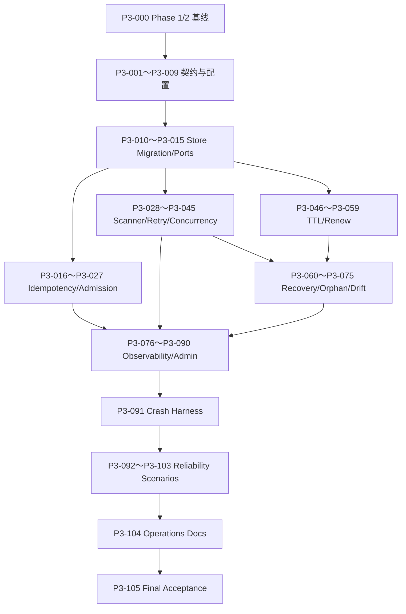

# Phase 3：可靠性细粒度开发计划与设计方案

> - 状态：七项设计门禁已确认，待执行 P3-000
> - 前置阶段：[Phase 2：Init 与 Runner 执行细粒度开发计划](./phase-2-runner-execution-development-plan.md)
> - 上位设计：[全 Go Agent Sandbox Runtime 设计](./all-go-agent-sandbox-runtime-design.md)
> - 阶段定义：本文的“第三阶段”对应上位设计中的 **Phase 3：可靠性**

## 1. 文档目的

本文把 Phase 3 拆成可以逐个开发、逐个测试、逐个提交和逐个审查的小任务。

执行规则与前两个阶段相同：

1. 一个任务只增加一个小能力。
2. 一个任务对应一个独立提交。
3. 每个任务先运行聚焦测试，再运行阶段要求的基础检查。
4. 每个任务提交后暂停，等待审查通过再进入下一任务。
5. 可靠性功能必须以持久化事实和可重复 reconcile 为基础，不能依赖“进程通常不会在这里退出”。
6. 不为 Phase 4、Phase 5 提前加入文件 API、PTY、Pool、快照、Kubernetes 或分布式抽象。
7. 发现协议、持久化、安全或恢复语义必须变化时，先修订本文并重新审查。

任务编号只表达推荐依赖顺序，不表达工期。

## 2. Phase 3 的准确边界

### 2.1 强制前置条件

开始 P3-001 前必须满足：

- Phase 1 的 P1-000～P1-079 全部完成；
- Phase 2 的 P2-000～P2-097 全部完成；
- 存在通过状态的 `docs/reports/phase1-acceptance.md` 和 `docs/reports/phase2-acceptance.md`；
- create → execute → cancel/timeout → delete 的真实 Linux Docker 闭环通过；
- Store schema、Docker labels、runner protocol 和 Phase 2 配置已经冻结；
- 工作区没有未解释的 `CLEANUP_PENDING`、未知受管资源、残留 execution 或失败集成测试。

P3-000 专门验证这些前置条件，不实现 Phase 3 功能。

### 2.2 阶段目标

Phase 3 结束时，系统必须能够：

```text
接收带 TTL 和 Idempotency-Key 的创建请求
  → 即使响应丢失也只创建一个 sandbox
  → 周期扫描弥补丢失 wake
  → 对临时失败按持久化退避重试
  → 在 sandboxd 任意生命周期步骤崩溃后重启收敛
  → 续期使旧 timer 失效
  → 到期自动提交删除意图并清理全部资源
  → 对 Store 与 Docker 的孤儿/漂移进行安全对账
  → 通过指标、结构化日志和诊断接口解释当前状态
```

可靠性闭环必须覆盖：

- create、image pull、container create、start、runner ready 和 observed update；
- delete、runner shutdown、主容器/egress sidecar/volume/runtime directory 清理和 terminal update；
- TTL create、renew、expire、旧 timer 和 restart schedule rebuild；
- 同一 sandbox 的 create/delete/renew/recovery 竞争；
- Docker 暂时不可用、runner 暂时不健康和 SQLite CAS conflict；
- Store 有/Docker 有、Store 有/Docker 无、Store 无/Docker 有和资源标签损坏。

### 2.3 阶段验收

严格沿用上位设计的 Phase 3 验收条件：

- 在 create、start、ready、delete 任一点终止 `sandboxd`，重启后都能收敛；
- 并发 create/delete/renew 通过 race test；
- 到期资源最终全部回收。

增加以下完整性条件：

- 丢失 wake、进程重启和 timer 丢失都不会永久丢失工作；
- 相同 Idempotency-Key 与相同请求只产生一个 sandbox；
- 相同 key 与不同请求稳定返回 `409 IDEMPOTENCY_CONFLICT`；
- idempotency record 与 sandbox record 在同一事务提交；
- maxSandboxes 和 create/delete/image-pull 并发限制在竞争下不被突破；
- retry attempt 和 next retry time 跨 `sandboxd` 重启保留；
- CAS conflict 不计入业务失败重试次数；
- 续期和到期竞争时只有一个 desired-state 结果胜出；
- Store 存在时，过期 Docker label 不能覆盖较新的 Store `ExpiresAt`；
- 完整且可验证的孤儿容器可以导入；标签不完整或 schema 未知的资源不自动删除；
- diagnostics、metrics、日志和错误不包含 token、env value、命令全文或宿主机敏感路径；
- `/readyz` 持续反映 Store、Docker、worker、scanner 和 recovery 状态，不只在启动时检查一次。

### 2.4 明确不做

以下能力不进入 Phase 3：

- execution 跨 runner/container 重启恢复；
- 把 execution stdout/stderr 或后台日志写入控制面 SQLite；
- 用户 secret/env 的持久化加密和密钥轮换；
- 持久 workspace、快照、Pool、预热容器和镜像缓存管理；
- 文件上传下载、目录 API、PTY、交互 stdin 和端口代理；
- 多租户 RBAC、租户级配额、计费和审计日志；
- 多实例 `sandboxd` leader election、分布式锁和高可用 SQLite；
- Kubernetes、CRD、Operator、gVisor、Kata 和 microVM；
- 自动删除标签损坏、schema 未知或所有权不确定的 Docker 资源；
- admin 强制接管、删除或修改 orphan 的写接口；
- 用户自定义 FQDN/CIDR/端口级 egress policy、动态更新、代理和 MITM；
- startup process 和 root compatibility profile。

Phase 3 的目标是“单机进程可重启、操作可重试、资源最终收敛”，不是“分布式控制面”。

## 3. 前两阶段交付基线与 Phase 3 差距

### 3.1 Phase 3 假定已经提供

- SQLite sandbox record、revision CAS 和基础 migration；
- desired/observed lifecycle 状态与稳定 reason；
- 幂等 Docker Ensure/Inspect/Delete/ListManaged，按 sandbox ID 聚合主容器和可选 egress sidecar；
- 确定性 container、volume、runtime directory、socket 和 labels；
- 按 sandbox ID 合并的 wake queue、单 worker 和 keyed lock；
- 一次启动恢复、readiness 和 create failure compensation；
- non-root runner、execution SSE、process-group cancel/timeout 和后台任务；
- 每 sandbox egress sidecar、不可覆盖的内部 CIDR nft deny 和 fail-closed readiness；
- 真实 Linux Docker integration/security harness。

### 3.2 Phase 3 需要新增

- `ttl_seconds`、`expires_at`、renew 和 Idempotency-Key 公共契约；
- expires/retry/idempotency/anomaly 持久化；
- 周期 candidate scan、分页和 scanner lifecycle；
- 持久化指数退避、retry classification 和用户意图抢占；
- 多 worker 与 create/delete/image-pull 并发限制；
- 原子 maxSandboxes admission；
- TTL heap、旧 expiry timer、周期过期兜底和 lease projection；
- 更完整的启动恢复与 create/delete crash-point 收敛；
- container、volume 和 runtime directory 资源盘点；
- 完整 orphan 导入、明确过期 orphan 清理和歧义资源隔离清单；
- Running sandbox 的 actual drift 与 runner health 恢复；
- 结构化日志、固定 cardinality metrics、持续 readiness 和只读 admin diagnostics；
- chaos/failpoint、fake clock 和真实 Docker 恢复验收。

## 4. 实施前审查门

### G1：Phase 1/2 验收门

P3-000 必须重新执行前两阶段的核心 smoke，并读取两个验收报告。Phase 3 不负责在可靠性代码中掩盖尚未闭环的 lifecycle 或 runner 缺陷。

### G2：TTL 与续期契约

冻结以下语义：

- 沿用现有 `limits.default_ttl=30m` 和 `limits.maximum_ttl=24h`，只新增 `limits.minimum_ttl=1m`，不再增加重复的 `lifecycle` 配置段；
- create 可选 `ttl_seconds`，缺失时使用服务端 `limits.default_ttl`；
- 每个 sandbox 都有非空 `expires_at`；
- wire 使用 RFC3339 UTC，Go SDK 使用 `time.Time` 和 `time.Duration`；
- `POST /v1/sandboxes/{id}/renew` 只接受绝对 `expires_at`；
- renew 只能延长；等于当前值是 `200` 幂等 no-op，早于当前值返回 `409 LEASE_CONFLICT`；
- 新到期时间必须位于 `now + minimum_ttl` 与 `now + maximum_ttl` 的闭区间内；
- `now >= expires_at` 后即视为已过期，即使 scanner 尚未提交终止意图也不能续期；
- desired 已是 Terminated 时不能续期，也不能复活；
- 显式 delete 的优先级高于 renew、timer 和 Running recovery；
- 到期通过 CAS 提交 `DesiredTerminated`，然后复用正常 delete reconcile；
- renew 与 expire 竞争时，CAS 首个成功者胜出。

Store 是唯一租约权威。`lease.json` 是受管 runtime directory 中的可变恢复投影，固定字段为 `schema_version`、`sandbox_id`、`spec_hash`、`expires_at` 和 `projected_store_revision`；文件最大 1 KiB、拒绝未知字段、no-follow regular file、owner-only `0600`，并通过同目录 temp、file fsync、rename、directory fsync 原子替换。内存 heap/timer 只负责唤醒，timer 身份为 `(sandbox_id, expected_expires_at)`，不绑定会因无关状态更新而变化的整个 sandbox revision。

Docker container label 仍是创建时不可变快照。Phase 3 新建资源使用 label schema v2，reader 同时识别 v1/v2；v1 语义不可原地改写。v1 orphan 缺少可信 `lease.json` 时不能推断当前租约，只能进入 anomaly，不能用旧 label 自动删除。

P3-001 及后续实现必须遵守上述已冻结公共语义；如需改变，先重新打开本门禁审查。

### G3：Idempotency-Key 契约

冻结：

- key 长度 1～128，只允许 `[A-Za-z0-9._:-]`；
- 当前单租户版本固定使用 `scope_id=local:v1`，Store schema 保留 `scope_id` 供未来认证主体隔离；
- request hash 基于 presence-aware canonical model：会受服务端默认值影响的字段必须编码“缺失”哨兵，不把当前默认值写入 canonical bytes；hash 使用带协议域分离前缀的 SHA-256，不包含服务端计算出的绝对 `expires_at`；
- 相同 scope/key/hash 在 retention 内精确重放首次 `202`、Location 和安全响应体；
- 相同 scope/key 不同 hash 返回 409；
- 无 key 时保持每次创建新 sandbox；
- idempotency record 与 sandbox record 同事务提交；
- 只有已接受并提交的 `202` 创建结果进入 idempotency table；重放使用新的 request ID，但 status、Location 和 body 保持首次值；
- raw key、request body 和 request hash 不进入响应、指标或日志，日志最多记录 key 是否存在；
- record 在 sandbox 非 Terminated 时不得 GC；sandbox Terminated 后再保留至少 24 小时，只有“已终态且终态宽限已过”两个条件同时满足才允许删除。

P3-003 及后续实现必须遵守上述已冻结语义；如需改变，先重新打开本门禁审查。

### G4：SQLite migration 与兼容性

Phase 3 会增加 sandbox 列和新表，属于持久化兼容风险。开始 migration 前必须：

- 以 Phase 2 最终 schema 为输入，而不是假设当前 scaffold；
- 依次使用 v2 sandbox 字段、v3 idempotency table、v4 anomaly table，版本单调且每版职责唯一；
- migration 前用 SQLite `VACUUM INTO` 创建一致性备份，备份失败则拒绝启动和升级；
- migration 使用 `BEGIN IMMEDIATE` 在单事务内完成，并在提交前后校验 schema/version/关键索引；
- 旧 `DesiredRunning` 记录按 `migration_time + limits.default_ttl` 回填，旧 `DesiredTerminated` 按 `migration_time` 回填，已 observed Terminated 的记录使用 `last_transition_at`；retry/health 清零，origin 为 `api`；
- migration 前后均可读取旧 sandbox；
- migration 失败保持旧数据可重试，不半升级；
- 不提供 down migration。Phase 3 产生运行时副作用之前允许停止服务、恢复备份并退回 Phase 2；产生 Phase 3 runtime/Store 变更后只能 forward-fix 或受控 drain，不能直接用旧二进制打开新库。

本文不授权跳过兼容性验证或删除旧数据库。

### G5：Retry 与 Running 恢复策略

冻结：

- retryable create/runtime/runner 错误使用持久化 capped exponential backoff + full jitter，默认 `retry_min=1s`、`retry_max=1m`；
- delete、expire 和 `CLEANUP_PENDING` 只对身份完整可信的受管资源无限重试到配置上限间隔，不放弃资源；未知或 drift 资源只记 anomaly；
- non-retryable spec/image/security 错误保持 Failed，等待 delete；
- CAS conflict 立即重读，不增加 retry attempt；
- create/delete/renew 等新用户意图绕过旧 backoff；
- Docker 全局失联时降低 readiness，不对每个 sandbox 各自制造重建风暴；
- `outbound=false` 的 Running 主容器缺失或停止时复用 Ensure/Start，并保留已验证的 workspace volume；
- Running 自动恢复新增独立 `ReplaceCompute`/`RecreateRuntime` runtime 操作：只替换主容器、可选 egress sidecar、socket/bootstrap/execution 临时状态，必须保留已验证的 workspace volume 和 `lease.json`；当前完整 `Runtime.Delete` 会删除 workspace，只能用于显式 delete/expire/cleanup，严禁被自动恢复调用；
- runner 连续 3 次健康失败后先关闭新 execution admission、有界 shutdown，再调用 `ReplaceCompute`；
- `outbound=true` 的主容器/sidecar/attestation 任一缺失、停止或不健康时，先关闭新 admission 并有界取消当前受管 execution，再按 main → sidecar 移除 compute，随后 sidecar → main 完整重建；绝不单独 Start stopped sidecar；
- spec drift 永不自动覆盖或删除。

自动重建 Running compute 会中断当前 execution，因此实现必须显式关闭 admission、有界取消，并以 workspace/lease 保留测试作为验收门。

### G6：Orphan 策略

在“一个 Docker daemon 只由一个 sandboxd 实例管理”的 Phase 3 不变量下，默认启用 trusted orphan import，并按安全性分三类：

1. 完整、schema 可识别、名称/labels/spec hash/安全 profile/lease 可验证，且与 outbound spec 一致的未过期 orphan resource bundle：重建 resolved spec，导入为 `origin=recovered_orphan` 和保守的 observed Creating；outbound bundle 必须同时包含共享同一 netns 的主容器和 sidecar。
2. 上述完整可信 orphan 已明确过期：先导入为 `DesiredTerminated`，再通过普通 reconcile 删除。
3. 标签不完整、schema 未知、hash/netns 不符、v1 且缺少可信 lease manifest，或仅存在主容器、sidecar、volume/runtime directory：写入持久化 anomaly 清单并告警，不自动导入、停止或删除。

anomaly 只有在一次完整且成功的 inventory 明确确认资源已经不存在后才能 resolved；盘点部分失败不能误消除异常。服务级 `minisandbox-egress` 网络不属于 per-sandbox orphan bundle。Phase 3 不提供 admin 写接口；任何更激进的 orphan 删除策略都必须另行确认。

### G7：Metrics 与 Admin 访问

指标使用官方 `github.com/prometheus/client_golang` 和 Prometheus exposition；采用注入的 `prometheus.NewRegistry`，不使用全局/default registry，不默认注册 Go/process collectors。metric 使用 `minisandbox_` 前缀，label 只能使用固定低 cardinality enum，禁止 sandbox ID、execution ID、image、error message 或 idempotency key。

SQLite 当前单连接上限为 1，Store-backed gauge 由带 timeout 的周期采样生成原子 snapshot，scrape handler 不直接占用数据库连接。Phase 3 只统计控制面能够准确观察的 execution request、前台 terminal observation 和 runner probe；在没有持久化 runner event/ledger 前，不宣称提供跨 runner、含后台任务的权威 execution 总数。P3-006 负责把已确认选择写成 ADR，P3-082 才引入依赖和修改 `go.mod`。

`/metrics` 和 `/v1/admin/**`：

- `admin.enabled=false` 时不读取 token file、不注册路由，对外自然返回 404；
- 复用现有 server listener，不新增公网端口；
- 启用后 `token_file` 必填，缺失、无效或读取失败都阻止启动；默认配置中的 `token_file` 为空；
- token file 必须是绝对路径的 owner-owned、regular、non-symlink 文件，权限不宽于 `0600`；内容是至少 256 bit 的 base64url token；只接受一个 Bearer header，比较摘要时使用 constant-time，且 token 不进入日志、错误或 config dump；
- token 启动时只读一次，轮换通过重启完成；
- 当前全局 server listener 已强制 loopback，不增加 `allow_non_loopback`。未来远程 admin 必须单独设计 listener/mTLS 和威胁模型，不能由一个布尔开关放宽；
- diagnostics 不返回原始 Docker logs、命令、env、token 或宿主机绝对路径。

### G8：Crash 与时间测试环境

可靠性验收必须同时使用：

- 单元测试中的 fake clock、fake ticker、可控随机源和 failpoint；
- 真实 Linux Docker 中可从外部强制终止 `sandboxd` 的黑盒 harness；
- 独立 SQLite data directory 和唯一测试 labels；
- 条件轮询，不使用固定长 sleep；
- 失败路径的资源盘点和最终清理。

不能用优雅 shutdown 代替 crash-point 测试。

## 5. Phase 3 核心设计

### 5.1 公共生命周期契约

创建请求向后兼容增加 TTL：

```http
POST /v1/sandboxes
Idempotency-Key: build-job-42
```

```json
{
  "image": "golang:1.26",
  "ttl_seconds": 3600,
  "network": {
    "outbound": true
  }
}
```

创建和查询响应增加：

```json
{
  "id": "sb_...",
  "state": "Pending",
  "reason": "CREATE_ACCEPTED",
  "expires_at": "2026-07-25T12:00:00Z",
  "created_at": "2026-07-25T11:00:00Z",
  "updated_at": "2026-07-25T11:00:00Z"
}
```

续期：

```http
POST /v1/sandboxes/{sandbox_id}/renew
Content-Type: application/json
```

```json
{
  "expires_at": "2026-07-25T13:00:00Z"
}
```

成功返回 `200` 和更新后的 sandbox。续期不接受相对增量，避免客户端重试把租约重复累加。

新增公共错误：

| Code | HTTP | Retryable | 语义 |
|---|---:|---:|---|
| `INVALID_TTL` | 400 | false | create TTL 不在允许范围 |
| `INVALID_EXPIRATION` | 400 | false | renew 时间格式或范围非法 |
| `LEASE_CONFLICT` | 409 | false | renew 试图缩短租约或并发者已经写入更晚值 |
| `SANDBOX_EXPIRING` | 409 | false | 删除/到期已提交，不能续期 |
| `IDEMPOTENCY_CONFLICT` | 409 | false | 同 key 对应不同请求 |
| `SANDBOX_LIMIT_REACHED` | 429 | true | active sandbox 达到上限 |
| `ADMIN_DISABLED` | 404 | false | admin surface 未启用 |

### 5.2 Lifecycle reason 扩展

Phase 3 增加：

| Reason | State | Retry |
|---|---|---|
| `RETRY_SCHEDULED` | Failed/Creating/Stopping | 按 `next_reconcile_at` |
| `RECOVERING_RUNTIME` | Creating | 立即或按退避 |
| `RUNNER_HEALTH_DEGRADED` | Running | 连续探测 |
| `TTL_EXPIRED` | Stopping | 删除直到成功 |
| `ORPHAN_IMPORTED` | Creating/Running | 正常 reconcile |
| `ORPHAN_EXPIRED` | Stopping | 删除直到成功 |
| `SPEC_DRIFT` | Failed | 不自动重试覆盖 |
| `CLEANUP_PENDING` | Failed/Stopping | 无限有界退避 |

`retry_attempt` 和 `next_reconcile_at` 是调度元数据，不作为新的 public state。公共 message 只使用固定安全模板。

### 5.3 Store schema

在 Phase 2 sandbox record 上增加：

```text
expires_at
retry_attempt
next_reconcile_at
last_reconcile_at
health_failure_count
origin                 # api | recovered_orphan
```

Idempotency table：

```text
scope_id
idempotency_key
request_hash
sandbox_id
status_code
location
response_json
created_at
PRIMARY KEY(scope_id, idempotency_key)
```

Runtime anomaly table：

```text
resource_key
resource_type
classification
safe_fingerprint
first_seen_at
last_seen_at
observation_count
resolved_at
```

约束：

- 不保存原始 Docker error、container logs、env、token 或命令；
- 所有时间使用 UTC RFC3339Nano；
- sandbox 与 idempotency record 原子创建；
- renew、expire、observed/retry 更新均使用 revision CAS；
- anomaly fingerprint 只由安全标识和 hash 组成；
- 不增加无限增长的 reconcile history 表。

Schema 从 Phase 2 v1 依次迁移为 v2（sandbox lease/retry/origin）、v3（idempotency）和 v4（anomaly）。打开旧库时，先在同目录受限备份位置使用 `VACUUM INTO` 生成一致性备份；备份失败则保持 not ready 并拒绝升级。每一版通过 `BEGIN IMMEDIATE`、schema/index 校验和单次 version commit 完成，失败后旧库仍可重试。

v1 backfill 使用一次注入的 `migration_time`：`DesiredRunning` 的 `expires_at=migration_time+limits.default_ttl`，`DesiredTerminated` 的 `expires_at=migration_time`，已 observed Terminated 的记录使用原 `last_transition_at`；retry/health 清零且 `origin=api`。不提供 down migration；只有尚未产生 Phase 3 runtime/Store 副作用时，才允许停机恢复备份并回到 Phase 2，之后必须 forward-fix 或受控 drain。

### 5.4 周期 Reconcile

内存 wake queue 保留为低延迟优化，新增周期 scanner：

```text
interval tick
  → keyset 分页查询 due candidates
  → Wake(sandboxID)
  → 扫描到本轮末尾
  → interval + jitter 后开始下一轮
```

candidate 包括：

- desired 与 observed 尚未收敛；
- retryable 且 `next_reconcile_at <= now`；
- `expires_at <= now`；
- Running 且到达 health/actual-state 检查周期；
- `CLEANUP_PENDING`；
- 启动恢复刚导入或重新关联的记录。

规则：

- 查询按 sandbox ID 稳定 keyset 分页，不使用随删除漂移的 OFFSET；
- scanner 只唤醒，不直接调用 Docker；
- 同一 ID 仍由 WakeQueue 合并；
- Reconciler 取得 keyed lock 后重新读取最新 record；
- keyed lock 在无持有者和等待者时回收，避免 ID 数量导致内存增长；
- scanner cursor、ticker 和 queue 都不是事实源。

### 5.5 持久化 Retry

第 `n` 次 retryable 失败：

```text
cap = min(retry_max, retry_min * 2^n)
delay = random(0, cap]     # full jitter
next_reconcile_at = now + delay
```

规则：

- 实际选中的 `next_reconcile_at` 持久化，重启后不重新随机；
- 成功收敛时 attempt 清零、next 置空；
- non-retryable error 不设 next；
- delete、expire、cleanup pending 永远可重试，间隔最多 retry_max；
- must-converge cleanup 仅能作用于名称、labels、schema、spec hash 和资源关系均可信的受管资源；未知或 drift 资源进入 anomaly，不因“必须清理”而放宽身份校验；
- CAS conflict、context shutdown 和 worker 未取得 semaphore 不计业务 attempt；
- 新 delete/renew/create recovery 意图可把 next 提前到 now；
- Docker 全局不可用时 readiness 降级，scanner/worker 共享 dependency health gate，避免为所有 sandbox 同时增加 attempt 或触发重建风暴；
- 日志记录 attempt、delay_ms 和 error code，不记录底层 error 文本。

### 5.6 并发与 Admission

Phase 3 把单 worker 扩为固定 worker pool，不改变每 sandbox 串行规则：

```text
WakeQueue
  → N workers
  → keyed lock per sandbox
  → create/delete semaphore
  → Docker/runner operation
  → CAS result
```

限制：

- `max_concurrent_reconciles`；
- `max_concurrent_creates`；
- `max_concurrent_image_pulls`；
- `max_concurrent_deletes`；
- `max_sandboxes`。

`max_sandboxes` 在 SQLite 写事务中检查。计数包括所有尚未 Terminated 的记录；只有资源清理并写入 Terminated 后才释放容量。Idempotency replay 必须先于 quota 判断，不能因为系统后来达到上限而拒绝已有请求的重放。

Phase 3 不增加不可靠的全局 execution 计数；Phase 2 的 per-sandbox execution limit 保持不变。

### 5.7 TTL 与 Renew

三层信息的权威顺序：

```text
Store expires_at             # 唯一权威
runtime directory lease.json # 可变恢复投影
Docker expires-at label      # 创建时快照，最后兜底
内存 min-heap/timer          # 唤醒优化
```

Phase 3 创建的 Docker 资源使用 label schema v2；reader 同时识别 v1/v2，但不改写 v1 label。v1 orphan 只有在 `lease.json` 身份、spec hash 和租约都可验证时才能导入，否则进入 anomaly。Store 存在时，任何 label 或 manifest 都不能反向覆盖 Store。

创建时：

1. 校验 `ttl_seconds`。
2. 使用注入 clock 计算一次绝对 `expires_at`。
3. 与 sandbox/idempotency record 同事务保存。
4. 提交后加入 TTL heap 并唤醒 reconcile。

续期时：

1. 读取最新 record。
2. 验证 desired 仍为 Running 且 `now < expires_at`；已到期但尚未被 scanner 处理的租约同样拒绝续期。
3. 新值等于当前值时返回当前 sandbox，作为不修改 revision、heap 或 manifest 的 `200` 幂等 no-op。
4. 新值早于当前值返回 `409 LEASE_CONFLICT`；更晚值还必须位于 `now + minimum_ttl` 与 `now + maximum_ttl` 的闭区间内。
5. CAS 更新 expires、revision，并把 reconcile 时间提前到 now。
6. upsert 新 heap entry。
7. reconciler 原子更新固定 `lease.json`；不尝试修改不可变 container labels。

timer 触发时携带 `(sandboxID, expectedExpiresAt)`：

- 重读 Store；
- expires 不同则该 timer 失效，并为当前值重建 entry；无关 observed/retry revision 变化不会误使当前租约 timer 失效；
- 尚未到期则重建；
- 已到期则 CAS desired 为 Terminated；
- CAS 冲突重新读取，不直接删除 Docker；
- 成功后 Wake，复用正常 delete。

周期 scanner 同时查询已过期记录，保证 heap/timer 全部丢失仍能回收。

`lease.json` 固定小于等于 1 KiB，只包含 `schema_version`、`sandbox_id`、`spec_hash`、`expires_at` 和 `projected_store_revision`。reader 拒绝未知字段、symlink、非 regular file、owner 不符或 mode 宽于 `0600`；writer 使用同目录 temp、file fsync、rename 和 directory fsync，崩溃后只能观察到旧完整文件或新完整文件。

### 5.8 Idempotency

request hash 使用显式 canonical model：

```text
API contract version
normalized image
network.outbound
resource/workspace options
ttl_seconds
其他真实支持的创建字段
```

canonical model 必须保留字段 presence。会受服务端默认变化影响的缺失字段编码显式 absent sentinel，不能先填入当前默认值再参与 hash；因此同一原始客户端请求在服务端默认调整后仍然命中原 idempotency record。canonical bytes 使用固定字段顺序和 contract version，SHA-256 输入带 `minisandbox:create:v1` 域分离前缀。

不包含：

- request ID；
- 到达时间；
- 计算后的绝对 expires_at；
- server default 的当前绝对值；
- response state；
- token、Authorization 或 Idempotency-Key 本身。

Store transaction：

```text
BEGIN IMMEDIATE
  → 查询 scope/key
  → 已有且 hash 相同：返回 stored response
  → 已有且 hash 不同：conflict
  → 检查 maxSandboxes
  → INSERT sandbox
  → INSERT idempotency record
COMMIT
```

响应写失败不回滚已提交事务。客户端使用同一 key 重试时得到首次存储的 `202`、Location 和 body。

只有已接受并提交的 `202` 写入 idempotency table。重放请求生成新的 request ID，但不能改写保存的 status、Location、body 或记录时间。GC 必须 join sandbox 状态：sandbox 非 Terminated 时永不删除；Terminated 后至少等待 24 小时，只有终态宽限已过才可复用原 key。

### 5.9 启动恢复

启动顺序：

```text
not ready
  → open/migrate Store
  → validate artifacts/config/secrets
  → Docker ping + Ensure/validate managed minisandbox-egress network + image configuration
  → inventory main/egress containers、volumes、runtime directories
  → reconcile Store records with actual resources
  → import trusted orphan resource bundles
  → record ambiguous anomalies
  → rebuild TTL heap
  → enqueue due candidates
  → start worker pool/scanner/health monitor
  → recovery complete
  → ready
```

Recovery 只能提交持久化结果或 Wake；不在 inventory loop 内执行无界 Docker 删除。

### 5.10 Store 与 Docker 对账

| Store | Actual resource aggregate | 行为 |
|---|---|---|
| desired Running | 与 outbound spec 一致、主容器/可选 sidecar 完整且 hash 匹配 | 恢复 runtime metadata，Wake 后 Ensure/probe |
| desired Running | none 模式主容器缺失/stopped | 保留已验证 workspace/lease，幂等 Ensure/Start compute |
| desired Running | outbound 主容器或 sidecar 缺失/stopped/unhealthy | 标记 recovering，先停止接收并取消当前受管 execution，再以 `ReplaceCompute` 按 main → sidecar 移除、sidecar → main 重建；保留 workspace/lease，不得调用完整 Delete 或单独 Start sidecar |
| desired Terminated | 任意受管资源存在 | Wake 删除 |
| Terminated | 资源不存在 | 不变 |
| Terminated | 资源仍存在 | Wake 删除，不复活 |
| 任意 | hash/profile drift | Failed/SPEC_DRIFT，不覆盖实际资源 |
| 无 Store | 与 outbound spec 一致的完整可信主容器/可选 sidecar bundle | 重建 spec，导入后正常 reconcile |
| 无 Store | 完整可信且已过期 | 导入 DesiredTerminated 后删除 |
| 无 Store | 不完整/未知/仅主容器/仅 sidecar/仅 volume/dir | anomaly 隔离清单，只告警 |

恢复 runtime ID 或导入记录都使用事务和唯一约束，重复启动结果一致。

### 5.11 Orphan 与 Anomaly

可信 orphan resource bundle 必须同时满足：

- 精确 managed label；
- 已知 schema/protocol version；
- 名称与 sandbox ID 确定性匹配；
- `lease.json` 若存在则必须是 no-follow regular file，且 sandbox ID/spec hash 与 labels 一致；
- inspect 得到的 image、resources、workspace、network、platform 可映射为 resolved spec；
- 重算 spec hash 与 label 一致；
- security profile 没有 privileged、host namespace、Docker socket、任意 bind 或额外 port；
- workspace volume 和 runtime directory 的身份一致。
- `network.outbound=false` 时没有 egress sidecar；`true` 时恰好一个主容器和一个 sidecar，resource role、runner/egress protocol、policy hash、netns identity、实际共享 namespace 与 `RestartPolicy=no` 全部一致。
- label schema v1 的 orphan 必须有可信 `lease.json`；缺失时无法证明当前 expiry，只能进入 anomaly。

任一条件不满足即写 anomaly。anomaly 记录允许被后续 observation 更新；只有一次覆盖全部资源类型且没有 partial error 的完整 inventory 明确确认资源已不存在时才能标记 resolved。记录不包含原始 inspect JSON，服务级 `minisandbox-egress` 网络不进入 per-sandbox orphan 分类。

### 5.12 Running Drift 恢复

周期检查 Running record 及其主容器/可选 egress sidecar 聚合资源：

- `outbound=false` 的主容器不存在或 stopped：进入 `RECOVERING_RUNTIME` 并按既有 Ensure/Start 语义恢复；
- 所有自动恢复都必须保留身份已验证的 workspace volume 和 `lease.json`；新增 `ReplaceCompute`/`RecreateRuntime` runtime 端口只清理主容器、可选 sidecar、runner socket/bootstrap/execution 临时状态，当前会删除 volume/runtime directory 的完整 `Runtime.Delete` 只用于显式 delete/expire/cleanup；
- `outbound=true` 的主容器或 sidecar 不存在、stopped、attestation/protocol/policy/netns unhealthy：先关闭新 admission 并有界取消当前受管 execution，精确验证后由 `ReplaceCompute` 按 main → sidecar 移除现有 compute，再通过 sidecar → main 正常 bootstrap 完整重建；
- 禁止单独 Start stopped sidecar，因为原进程内的 bootstrap 状态和 attestation 已丢失，且新 namespace 不能热替换到现有主容器；
- labels/spec/security profile drift：`SPEC_DRIFT`，不自动修正；
- runner 单次 probe 失败：保持 Running，增加连续失败计数并记录 degraded；
- 连续 3 次失败达到阈值：关闭新 admission、有界 shutdown 后执行 `ReplaceCompute`；
- probe 成功：失败计数清零。

删除/续期意图在 keyed lock 和最新 record 检查后优先于 recovery，不能被旧 health result 覆盖。

### 5.13 可观测性

结构化日志使用固定字段：

```text
timestamp
level
component
request_id
sandbox_id
execution_id
operation
attempt
duration_ms
error_code
```

指标至少包括：

```text
minisandbox_sandbox_create_requests_total{result}
minisandbox_sandbox_create_duration_seconds
minisandbox_sandbox_state_count{state}
minisandbox_reconcile_total{operation,result}
minisandbox_reconcile_duration_seconds{operation}
minisandbox_retry_scheduled_total{operation,error_code}
minisandbox_cleanup_pending
minisandbox_lease_expired_total
minisandbox_orphan_observations_total{classification}
minisandbox_runtime_docker_operations_total{operation,result}
minisandbox_execution_requests_total{mode,result}
minisandbox_execution_foreground_terminal_observed_total{result}
minisandbox_runner_probe_total{result}
minisandbox_metrics_snapshot_age_seconds
```

使用 `github.com/prometheus/client_golang`、自建 `prometheus.NewRegistry` 和依赖注入的 collector；不使用全局/default registry，也不默认注册 Go/process collectors。禁止把 ID、image、URL、message、key 或用户 metadata 放入 metric labels。

Store-backed gauge 由后台周期采样器使用短 timeout 生成不可变原子 snapshot；`/metrics` scrape 不直接查询单连接 SQLite。execution 指标名称刻意区分“控制面收到请求”和“前台代理观察到 terminal”；在 runner 没有持久化 event/ledger 前，不把后台 execution 或 runner 重启前事件伪装为单调、权威的全局总数。

只读 diagnostics：

```text
GET /v1/admin/sandboxes/{sandbox_id}/diagnostics
```

返回清洗后的：

- Store desired/observed/reason/revision/expiry/retry；
- Docker resource existence、安全 profile 是否匹配和 safe hash；
- runner health 类别和最后检查时间；
- 最近一次 reconcile 的安全 code/time；
- anomaly classification。

不返回 Docker raw inspect/logs、命令、输出、env、token、socket path、data dir 或内部堆栈。

### 5.14 持续 Readiness

`/healthz` 只表示进程活着。`/readyz` 同时要求：

- Store 最近一次 probe 成功；
- Docker 最近一次 ping 在 freshness window 内；
- artifacts/security config 有效；
- recovery 已完成；
- worker pool、periodic scanner 和 TTL scheduler 正在运行；
- 服务未进入 shutdown/draining；
- 未发生阻止安全运行的 global resource drift。

单个 sandbox Failed、cleanup pending 或 anomaly 不使全局 not ready，但必须通过 metrics/diagnostics 可见。Docker 短暂失败超过 freshness window 后 readiness 失败，恢复成功后自动变回 ready。

### 5.15 Crash 一致性

每个副作用之后都可能崩溃：

```text
Store create commit
runtime dir create
volume create
container create
artifact copy
container start
runner ready
observed Running CAS
desired Terminated CAS
runner shutdown
container remove
volume remove
runtime dir remove
observed Terminated CAS
```

恢复只依赖 Store、确定性命名、labels 和 Docker inspect。不能依赖上次进程内 operation journal、queue、timer、semaphore 或 goroutine 是否执行到 defer。

## 6. Phase 3 配置

建议增加：

```yaml
idempotency:
  max_key_bytes: 128
  terminal_retention: "24h"
  gc_interval: "10m"

reconcile:
  interval: "10s"
  jitter: "2s"
  timeout: "2m"
  page_size: 100
  max_concurrent: 8
  retry_min: "1s"
  retry_max: "1m"
  running_check_interval: "30s"
  runner_unhealthy_threshold: 3
  docker_freshness: "30s"

limits:
  default_ttl: "30m"
  minimum_ttl: "1m"
  maximum_ttl: "24h"
  max_sandboxes: 100
  max_concurrent_creates: 4
  max_concurrent_image_pulls: 2
  max_concurrent_deletes: 4

recovery:
  import_trusted_orphans: true
  record_ambiguous_anomalies: true

admin:
  enabled: false
  token_file: ""
```

所有 duration、count、阈值、路径和组合关系在启动时验证。`admin.enabled=false` 时忽略且不读取空 token path；启用时 token path 和 secret file 必须通过 G7 校验。server listener 继续使用现有 loopback-only 约束，不增加 admin 放宽开关。普通 API 请求不能扩大服务端上限；无效安全配置必须阻止启动。

## 7. 每个任务的完成标准

除任务自身验收项外，每个代码任务都必须：

- 保持中文模块和导出 API 注释同步；
- 运行受影响包聚焦测试；
- 运行 `gofmt`、`go test ./...` 和 `go vet ./...`；
- 涉及并发、timer、queue、lock 或 metrics 时运行 `go test -race`；
- 涉及 SQLite 时验证 migration、关闭重开和真实事务；
- 涉及 crash、Docker、signal 或资源清理时运行真实 Linux Docker 测试；
- 涉及 public API 时同步 OpenAPI、protocol、SDK、fixtures 和 handler；
- 使用 fake clock/ticker/rng，避免依赖固定 sleep；
- 验证重试和恢复不会产生重复 container、volume、runtime directory 或 sandbox record；
- 验证日志、错误、metrics、diagnostics 和测试输出不泄露秘密；
- 提交只包含当前任务的小功能。

每个审查包应提供：

```text
任务 ID
目标
设计决定
文件列表
测试结果
race/SQLite/Linux/Docker 结果
crash 或时间语义证据
明确未做
commit SHA
```

## 8. 任务总览

| 分组 | 任务 | 结果 |
|---|---:|---|
| A. 契约、配置与 Store 扩展 | P3-000～P3-015 | 冻结 TTL/renew/idempotency/admin 契约和持久化基础 |
| B. Idempotency 与 Admission | P3-016～P3-027 | 原子重放、冲突、retention 和 maxSandboxes |
| C. 周期 Reconcile、Retry 与并发 | P3-028～P3-045 | scanner、持久化退避、worker pool 和 operation limits |
| D. TTL 与 Renew | P3-046～P3-059 | lease truth、heap、旧 timer、续期和 lease projection |
| E. Recovery、Orphan 与 Drift | P3-060～P3-075 | 全资源对账、可信导入、anomaly 和 Running 恢复 |
| F. 可观测性与诊断 | P3-076～P3-090 | 日志、指标、admin diagnostics 和持续 readiness |
| G. Crash/Concurrency 验收 | P3-091～P3-105 | crash point、TTL、idempotency、orphan、文档和最终报告 |

## 9. 详细任务

### A. 契约、配置与 Store 扩展

### P3-000：验证 Phase 1/2 验收基线

- **依赖**：G1。
- **唯一目标**：确认两个阶段验收报告、真实 Docker 证据和当前 schema/labels/protocol 满足 Phase 3 前置条件。
- **设计**：逐项记录 commit、schema version、label version、runner protocol、已知限制和残留资源；发现缺口时回到独立 Phase 1/2 修复任务。
- **修改范围**：Phase 3 kickoff checklist，不修改生产代码。
- **测试**：重跑 create/execute/cancel/delete 和 restart smoke。
- **验收**：没有未解释的失败、cleanup pending、unknown resource 或协议漂移。
- **本任务不做**：不修改 TTL、Store 或 reconciler。

### P3-001：冻结 create TTL 契约

- **依赖**：P3-000、G2。
- **唯一目标**：向 create request 增加可选 `ttl_seconds`，向 sandbox response 增加必填 `expires_at`。
- **设计**：wire 秒数使用正整数；缺失使用现有 `limits.default_ttl=30m`；允许范围复用 `limits.minimum_ttl=1m` 与 `limits.maximum_ttl=24h`；response 使用 RFC3339 UTC；外部 request 不接受绝对 create expiry。
- **修改范围**：lifecycle OpenAPI、`pkg/protocol`、Go SDK model 和 fixtures。
- **测试**：缺失、min/max、零、负值、超限、JSON round trip 和 SDK duration mapping。
- **验收**：旧客户端不传 TTL 仍可创建，所有成功 sandbox 都返回 expires_at。
- **本任务不做**：不计算或持久化 expires，不修改 handler。

### P3-002：冻结 renew 契约

- **依赖**：P3-001、G2。
- **唯一目标**：定义 `POST /v1/sandboxes/{id}/renew` 的 request、response 和 HTTP 语义。
- **设计**：只接受 `expires_at`；延长成功 200；等于当前值为 200 幂等 no-op；缩短为 `409 LEASE_CONFLICT`；不存在 404；已删除或 `now>=expires_at` 为 409；格式/服务端边界非法为 400；响应复用公共 sandbox model。
- **修改范围**：lifecycle OpenAPI、protocol、Go SDK facade 和 contract fixtures。
- **测试**：成功、非法时间、未知字段、时区归一化、404/409 fixtures。
- **验收**：SDK 不需要拼私有 path，wire 和 Go 时间类型转换无损。
- **本任务不做**：不实现 Store renew 或 handler。

### P3-003：冻结 Idempotency-Key 契约

- **依赖**：P3-000、G3。
- **唯一目标**：定义 create header、重放响应和冲突错误。
- **设计**：key 为 1～128 个允许字符；单租户 scope 固定为 `local:v1`；相同 hash 精确重放首次 202/Location/body，但使用本次新 request ID；不同 hash 为 409；只保存已接受 202；响应不回显 key。
- **修改范围**：OpenAPI header、错误 code、SDK create options 和 fixtures。
- **测试**：合法边界、非法字符、重复 header、same/conflict replay fixture。
- **验收**：contract 明确无 key 仍是非幂等创建。
- **本任务不做**：不计算 hash，不修改 Store。

### P3-004：冻结 Phase 3 状态 reason 与错误

- **依赖**：P3-001～P3-003。
- **唯一目标**：固定第 5.2 节 reason、retryable 属性和公共安全 message。
- **设计**：reason 与 state 合法组合显式列举；调度 attempt/next time 不新增 public state；旧 reason 保持兼容。
- **修改范围**：domain constants、protocol enums、OpenAPI 和 error mapper contract。
- **测试**：reason/state/error/HTTP/retryable 矩阵。
- **验收**：未知内部错误不能原样成为公共 reason/message。
- **本任务不做**：不实现状态转换和 retry。

### P3-005：冻结 diagnostics 响应契约

- **依赖**：P3-004、G7。
- **唯一目标**：定义只读 admin diagnostics endpoint 的安全字段 allowlist。
- **设计**：只返回 Store、runtime、runner、reconcile 和 anomaly 的 typed summary；时间 UTC；不存在 404；admin disabled 对外表现 404。
- **修改范围**：新增 `api/admin.openapi.yaml`、protocol model 和 fixtures。
- **测试**：完整/缺失 section、unknown sandbox、disabled、字段 allowlist snapshot。
- **验收**：schema 中不存在 raw log、inspect JSON、command、env、token、host path 或 socket path 字段。
- **本任务不做**：不实现 admin auth 或 handler。

### P3-006：确定 metrics 格式与依赖

- **依赖**：P3-000、G7。
- **唯一目标**：用 ADR 固化已确认的官方 `prometheus/client_golang` 选择和固定 metric/label contract。
- **设计**：记录版本选择规则、transitive dependencies、license、维护性、并发和测试策略；固定 `prometheus.NewRegistry`、无默认 Go/process collectors、`minisandbox_` 前缀、低 cardinality labels、Store 周期原子 snapshot，以及“execution 请求/前台 terminal observation 不是后台任务权威总账”的边界。
- **修改范围**：新增 Phase 3 metrics ADR，不修改 `go.mod`。
- **测试**：无代码测试；核对 metric 名、type、bucket 和 label cardinality。
- **验收**：每个 metric 的 type、labels、单位和更新位置唯一明确。
- **本任务不做**：不安装依赖，不实现 `/metrics`。

### P3-007：增加 reconcile、retry 与并发配置模型

- **依赖**：P3-000。
- **唯一目标**：为第 6 节 reconcile 和 lifecycle operation limits 增加 typed config 与默认值。
- **设计**：duration 用 Go 类型；count 使用有界整数；默认值适合单机开发；字段命名与示例 YAML 一致。
- **修改范围**：config model、defaults、示例配置和中文注释。
- **测试**：逐字段默认值和 YAML round trip。
- **验收**：加载旧配置时得到明确安全默认值。
- **本任务不做**：不验证组合关系，不装配 worker。

### P3-008：增加 TTL、idempotency、recovery 与 admin 配置模型

- **依赖**：P3-001～P3-003、P3-005。
- **唯一目标**：为 lease、idempotency retention、orphan policy 和 admin access 增加 typed config。
- **设计**：TTL 复用现有 `limits.default_ttl`/`maximum_ttl` 并只新增 `minimum_ttl`；admin 默认关闭且默认 token path 为空；token 只引用 secret file；trusted orphan import 默认 true；不提供“删除所有 orphan”或 `allow_non_loopback` 开关。
- **修改范围**：config model、defaults、example YAML 和注释。
- **测试**：默认值、显式值、secret 字段不进入普通 config dump。
- **验收**：配置模型没有 raw token、用户 Docker network 或任意 orphan action。
- **本任务不做**：不读取 token file，不验证配置。

### P3-009：验证 Phase 3 配置

- **依赖**：P3-007、P3-008。
- **唯一目标**：启动前拒绝无界、矛盾或不安全的 Phase 3 配置。
- **设计**：校验 min/default/max TTL；retry min/max；jitter 不大于 interval；page/worker/semaphore 正数；threshold；terminal retention；admin disabled 时不要求也不读取 token path，enabled 时要求非空绝对路径；server 继续复用既有 loopback-only 校验。
- **修改范围**：config validator。
- **测试**：每条规则一个 table case，包含边界和组合错误。
- **验收**：无效可靠性或 admin 配置阻止启动，不静默改成宽松值。
- **本任务不做**：不打开 Store、Docker 或 secret file。

### P3-010：迁移 sandbox lease 与 retry 字段

- **依赖**：P3-009、G4。
- **唯一目标**：在 schema v2 中为现有 sandbox 增加 expires/retry/health/origin 字段，并建立可恢复的升级边界。
- **设计**：升级前 `VACUUM INTO` 一致性备份，失败则不迁移；`BEGIN IMMEDIATE` 单事务 migration；`DesiredRunning` 按 migration clock + 现有 30m default TTL 回填，`DesiredTerminated` 使用 migration clock，已 observed Terminated 使用 `last_transition_at`；retry/health 清零、origin=api；提交前后校验 schema/version/index；记录只允许“Phase 3 副作用前恢复备份回退 Phase 2”的操作边界。
- **修改范围**：SQLite migration 和 row schema。
- **测试**：Phase 2 fixture 升级、空库、重复打开、每个旧状态、migration 中断回滚。
- **验收**：旧记录 spec/revision/runtime/state 不丢失，升级后全部字段可读取。
- **本任务不做**：不增加 idempotency/anomaly 表，不实现 Store method。

### P3-011：迁移 idempotency records 表

- **依赖**：P3-003、P3-010。
- **唯一目标**：在 schema v3 增加带 scope/key 唯一约束和 sandbox 外键语义的 idempotency table。
- **设计**：response JSON 有 byte limit；时间 UTC；不级联删除 sandbox；key/hash 使用受限 text；索引支持按 sandbox 终态和 `last_transition_at` 执行 terminal-retention GC，不使用从 create 起算的固定 expiry。
- **修改范围**：SQLite migration。
- **测试**：唯一冲突、相同 key 不同 scope、response limit、sandbox Terminated 后记录保留、重复 migration。
- **验收**：表不含 Authorization、raw request 或 secret 字段。
- **本任务不做**：不编写 create transaction。

### P3-012：迁移 runtime anomalies 表

- **依赖**：P3-010、G6。
- **唯一目标**：在 schema v4 增加可去重、可更新和可标记 resolved 的安全 anomaly 表。
- **设计**：resource key 唯一；classification enum；safe fingerprint 固定长度；observation count 有界；无 raw JSON/BLOB。
- **修改范围**：SQLite migration。
- **测试**：insert/upsert/resolve、非法 enum、重复 key、关闭重开。
- **验收**：仅凭表内容不能得到宿主机路径、容器日志或用户 env。
- **本任务不做**：不扫描 Docker，不实现诊断接口。

### P3-013：扩展 reconcile candidate Store 端口

- **依赖**：P3-010。
- **唯一目标**：用 keyset 分页查询在给定时间真正 due 的 sandbox。
- **设计**：方法显式接受 now、running cutoff、after ID 和 limit；返回按 ID 稳定排序的 domain snapshot；SQL predicate 覆盖第 5.4 节候选。
- **修改范围**：Store interface、SQLite adapter 和 fake Store。
- **测试**：每类 candidate、未来 retry、running cutoff、分页边界、插入/终止干扰。
- **验收**：不使用 OFFSET，limit 和 cursor 行为可预测。
- **本任务不做**：不启动 scanner，不修改 retry metadata。

### P3-014：扩展 renew、expire 与 retry Store 端口

- **依赖**：P3-010、P3-013。
- **唯一目标**：提供带 revision CAS 的 Renew、ExpireIntent、ScheduleRetry、ResetRetry 和 health-result 原子更新。
- **设计**：每个方法只完成一种原子转换；受影响零行返回 typed conflict/not-found；禁止通用 map update。
- **修改范围**：Store interface、SQLite adapter 和 fake。
- **测试**：成功、旧 revision、错误 desired/state、时间 round trip、关闭重开。
- **验收**：调用方不能绕过状态前置条件任意写 lease/retry 字段。
- **本任务不做**：不实现 application 或 reconciler policy。

### P3-015：建立 Phase 3 contract 与 migration matrix

- **依赖**：P3-001～P3-014。
- **唯一目标**：用统一 fixtures 锁定 API、protocol、SDK、reason、schema upgrade 和 Store mapping。
- **设计**：create/renew/idempotency/diagnostics/error 和 Phase 2 database fixture 分别有正反例；migration 结果与 domain 映射快照可审查。
- **修改范围**：`tests/contract` 和 Store migration fixtures。
- **测试**：本任务新增 suite。
- **验收**：字段、单位、enum、HTTP、schema default 或 mapping 漂移会使测试失败。
- **本任务不做**：不启动 Docker、scanner 或真实 HTTP server。

### B. Idempotency 与 Admission

### P3-016：定义创建请求 canonical model

- **依赖**：P3-001、P3-003。
- **唯一目标**：把客户端创建语义映射为字段顺序固定、与运行时对象解耦的 canonical model。
- **设计**：显式列出所有受支持字段；image 采用 contract 定义的规范化；会受服务端默认影响的可选字段保留 presence 并编码显式 absent sentinel，不能填入当前默认值；map 按 key 排序；包含 API contract version。
- **修改范围**：application idempotency canonicalizer。
- **测试**：字段顺序、JSON map 顺序、等价 image/boolean/TTL、未知字段不可能进入。
- **验收**：语义相同请求得到逐字节相同 canonical encoding。
- **本任务不做**：不计算 hash，不读取 server clock。

### P3-017：计算稳定 request hash

- **依赖**：P3-016。
- **唯一目标**：对 canonical bytes 计算带版本域分离的 SHA-256 hash。
- **设计**：输入前缀包含 `minisandbox:create:v1`；输出固定 lowercase hex；hash 不包含 key、request ID、Authorization、now 或绝对 expires。
- **修改范围**：idempotency hash helper。
- **测试**：golden vector、单字段差异、相同请求、空/超大 canonical input 防护。
- **验收**：重启和不同 map iteration 下 hash 稳定。
- **本任务不做**：不访问 Store，不记录 request body。

### P3-018：校验并作用域化 Idempotency-Key

- **依赖**：P3-003。
- **唯一目标**：把可选 header 转为受限 `(scopeID, key)`。
- **设计**：拒绝空值、重复 header、非法字符和超长；当前单租户 scope 固定为 `local:v1`，未来再由 authenticated principal port 替换；日志只记录 key 是否存在，不记录 raw key 或其可关联 hash 前缀。
- **修改范围**：API middleware/application option mapper。
- **测试**：字符/长度边界、重复 header、不同 scope、日志 redaction。
- **验收**：raw key 不出现在 error、log、metric 或 response。
- **本任务不做**：不实现多租户授权，不查询 Store。

### P3-019：原子创建 sandbox 与 idempotency record

- **依赖**：P3-011、P3-014、P3-017、P3-018。
- **唯一目标**：新 key 第一次请求在一个 SQLite transaction 中创建两个 record。
- **设计**：`BEGIN IMMEDIATE`；先查 key，再进行 admission；生成 sandbox/expires/response 后插入 sandbox 和 idempotency；只保存已接受的 `202`；任一步失败全部回滚。
- **修改范围**：Store `CreateIdempotent` 和 SQLite adapter。
- **测试**：成功、sandbox insert 失败、idempotency insert 失败、commit 失败、关闭重开。
- **验收**：数据库中不可能只存在 sandbox 或只存在 idempotency record。
- **本任务不做**：不实现已有 key replay 或 HTTP handler。

### P3-020：重放相同 idempotent 请求

- **依赖**：P3-019。
- **唯一目标**：已有 scope/key/hash 返回首次保存的 status、Location 和 body，不新建 sandbox。
- **设计**：读取 record 后校验 response byte limit 和 schema version；response 使用保存值而非当前 sandbox 状态；HTTP status、Location 和 body 精确重放，request ID 使用本次请求的新值；重放不延长 retention。
- **修改范围**：Store replay result 与 application branch。
- **测试**：Pending 后 replay、Running 后 replay、Terminated 后 replay、重启后 replay。
- **验收**：四种场景返回相同 sandbox ID 和首次响应 bytes，sandbox 总数不变。
- **本任务不做**：不处理 hash conflict，不运行 quota。

### P3-021：拒绝 idempotency hash 冲突

- **依赖**：P3-019、P3-020。
- **唯一目标**：同 scope/key 对应不同 request hash 时返回稳定 conflict。
- **设计**：在 create transaction 内比较 constant-length hash；公共错误不说明旧/新请求差异；冲突不修改任何 record。
- **修改范围**：Store conflict result、application/error mapper。
- **测试**：单字段差异、不同 TTL、并发同 key 不同 hash、日志 redaction。
- **验收**：一个请求成功，其他冲突；只存在成功请求的 sandbox。
- **本任务不做**：不允许 key 重绑定，不返回旧 request。

### P3-022：保持无 key 创建语义

- **依赖**：P3-019。
- **唯一目标**：无 Idempotency-Key 时每次请求仍创建独立 sandbox，且不写 idempotency table。
- **设计**：复用同一 sandbox validation/TTL/admission transaction，但不制造伪 key；response 构造与有 key 首次请求一致。
- **修改范围**：Store/application non-idempotent branch。
- **测试**：连续相同请求、并发相同请求、table 行数、回滚。
- **验收**：每次得到不同 ID，idempotency table 不增长。
- **本任务不做**：不做客户端自动生成 key。

### P3-023：原子执行 maxSandboxes admission

- **依赖**：P3-007、P3-019、P3-022。
- **唯一目标**：在 SQLite create transaction 中保证 active sandbox 数不超过配置。
- **设计**：计数所有非 Terminated record；`BEGIN IMMEDIATE` 串行 admission；到上限返回 typed limit；Terminated 只有在资源确认清理后释放容量。
- **修改范围**：SQLite create transaction 和 Store result。
- **测试**：limit-1、limit、并发 limit+N、Stopping/Failed/Pending/Terminated 计数。
- **验收**：竞争创建后 active count 永远不超过 limit。
- **本任务不做**：不实现租户级或资源加权配额。

### P3-024：让 idempotency replay 优先于 quota

- **依赖**：P3-020、P3-023。
- **唯一目标**：系统达到 maxSandboxes 后仍可重放已经成功的 idempotent create。
- **设计**：transaction 先查 idempotency key，只有新 key/无 key 才检查 quota；conflict 也先于 quota 返回。
- **修改范围**：create transaction branch ordering。
- **测试**：满额 replay、满额 conflict、满额新 key、满额无 key。
- **验收**：已有请求不因后来容量变化失去幂等性。
- **本任务不做**：不为新请求预留未来容量。

### P3-025：验证响应丢失后的 create 重试

- **依赖**：P3-020、P3-024。
- **唯一目标**：证明 Store commit 成功但 HTTP response 写失败时，同 key 重试不会创建第二个 sandbox。
- **设计**：注入 failing ResponseWriter/连接断开；第一次事务保留；第二次使用独立请求；对照 Store 与 wake 次数。
- **修改范围**：application/handler failure test 和必要的 commit-result boundary。
- **测试**：header 前失败、body 部分写、客户端取消、重启后重试。
- **验收**：所有 case 只有一个 sandbox；重放 response 与首次存储一致。
- **本任务不做**：不保证第一次客户端收到完整响应。

### P3-026：清理过期 idempotency records

- **依赖**：P3-008、P3-011。
- **唯一目标**：只清理“sandbox 已 Terminated 且终态宽限已过”的 idempotency record，限制表增长又不破坏长租约幂等性。
- **设计**：Store 权威 now 参数；join sandbox terminal state/`last_transition_at`，按稳定 key 有界 batch；非 Terminated 永不删除，Terminated 后至少保留 24h；不删除 sandbox；失败下轮重试；GC 使用 server lifetime context。
- **修改范围**：Store delete-expired method 和 idempotency GC loop。
- **测试**：未过期/过期、分页、并发 replay、删除失败、shutdown、race。
- **验收**：sandbox 活跃多久都可重放；Terminated 后宽限内仍可重放；宽限后删除才允许相同 key 成为新请求；sandbox record 不受影响。
- **本任务不做**：不删除 Terminated sandbox，不做 vacuum。

### P3-027：装配 idempotent create 到 API 与 SDK

- **依赖**：P3-018～P3-026。
- **唯一目标**：把 header validation、canonical hash、atomic create/replay/conflict 和 wake 接入公共 create 路径。
- **设计**：只在首次新建成功后 Wake；replay 不重复 Wake；handler 保持 decode/map；SDK 通过 typed option 设置 key。
- **修改范围**：application create service、HTTP handler、router、SDK 和 integration-style handler tests。
- **测试**：新建、replay、conflict、无 key、limit、response failure、request ID。
- **验收**：API 契约所有分支与 P3-003 一致，handler 不直接操作 SQLite。
- **本任务不做**：不启动 periodic scanner，不实现 TTL timer。

### C. 周期 Reconcile、Retry 与并发

### P3-028：提供可靠性时间与随机源端口

- **依赖**：无。
- **唯一目标**：让 scanner、retry、TTL 和 GC 不直接依赖真实 wall clock、ticker 或全局随机源。
- **设计**：定义最小 Clock/Timer/Ticker/Random 接口；生产实现包装标准库；fake 支持手动推进、可控 firing 和固定随机序列。
- **修改范围**：`internal/reconcile` time source 与 test fake。
- **测试**：advance、stop/reset、并发 waiter、重复 fire、防 goroutine leak。
- **验收**：后续单元测试无需固定 sleep 即可确定触发顺序。
- **本任务不做**：不实现 scanner、backoff 或 TTL heap。

### P3-029：实现 candidate sweep 分页游标

- **依赖**：P3-013、P3-028。
- **唯一目标**：把一次 due-candidate 全量扫描组织为不会重复 OFFSET 漂移的 keyset sweep。
- **设计**：cursor 初始为空；每页最后 ID 成为下一 cursor；空页结束；每页有 context timeout；同一 sweep 有最大安全页数防 adapter bug。
- **修改范围**：reconcile candidate sweeper。
- **测试**：空库、多页、恰好整页、页间插入/终止、重复/倒退 adapter 结果。
- **验收**：稳定数据集每个 due ID 每轮最多提交一次，错误不会无限循环。
- **本任务不做**：不调用 Wake，不启动周期 loop。

### P3-030：让 periodic scanner 唤醒 due candidate

- **依赖**：P3-029、Phase 1 WakeQueue。
- **唯一目标**：一次 scanner sweep 将每个 due candidate ID 提交给合并 WakeQueue。
- **设计**：scanner 不调用 Reconcile/Docker；单个 Wake 失败继续处理其他 ID 并聚合安全结果；context cancel 立即停止后续 page。
- **修改范围**：periodic scanner `ScanOnce`。
- **测试**：多页 Wake、重复 ID、queue closed、Store error、context cancel。
- **验收**：丢失某次 Wake 不改变 Store，下一 sweep 仍会重新发现 candidate。
- **本任务不做**：不创建 ticker，不修改 retry。

### P3-031：实现 interval + jitter scanner loop

- **依赖**：P3-007、P3-028、P3-030。
- **唯一目标**：按配置周期运行 scanner，并在 shutdown 时无泄漏退出。
- **设计**：启动先执行一次 sweep；下一次间隔为 interval 加有界对称 jitter；同一实例不重叠 sweep；panic 转安全错误并继续后续周期。
- **修改范围**：scanner lifecycle loop。
- **测试**：首次立即扫、jitter 边界、长 sweep、不重入、panic、shutdown、race。
- **验收**：ticker 丢失或一次 sweep 失败不会永久停止周期扫描。
- **本任务不做**：不装配 readiness，不实现 metrics。

### P3-032：合并事件 Wake 与周期 Wake

- **依赖**：P3-030、P3-031、Phase 1 WakeQueue。
- **唯一目标**：保证 API、recovery、TTL 和 scanner 同时 Wake 同一 ID 时只形成一个待处理项。
- **设计**：所有来源调用同一 WakeQueue；pending/processing/requeue 状态明确；处理期间再次 Wake 会在 Done 后重入一次。
- **修改范围**：WakeQueue 状态机和 source tests。
- **测试**：四来源并发、processing 期间 wake、Done 竞态、shutdown、race。
- **验收**：不丢最后一次意图，也不会按 Wake 次数增长内存。
- **本任务不做**：不决定来源优先级，最新 Store record 始终决定行为。

### P3-033：回收无使用者的 keyed lock

- **依赖**：Phase 1 keyed lock。
- **唯一目标**：sandbox 数量长期增长时 keyed lock map 不无限保留历史 ID。
- **设计**：entry 维护 holder/waiter refcount；最后一个 release 且无 waiter 时在同一 mutex 下删除；旧 entry 不能误删新 entry。
- **修改范围**：`internal/reconcile/keyed_lock.go`。
- **测试**：单次、多个 waiter、取消等待、删除后重建、ABA、十万 ID、race。
- **验收**：空闲后 entry count 回到零，同一 ID 临界区仍严格串行。
- **本任务不做**：不改变 worker 数或 Store CAS。

### P3-034：定义 retry policy 输入与结果

- **依赖**：P3-004、P3-014。
- **唯一目标**：用纯领域类型表示 operation、error class、attempt 和下一步 retry decision。
- **设计**：结果只有 retry-at、do-not-retry、immediate-reread；delete/expire/cleanup 标为 must-converge；不携带 raw error text。
- **修改范围**：reconcile retry policy model。
- **测试**：每个 operation/error class 的允许组合和非法输入。
- **验收**：policy model 不 import Docker、SQLite、HTTP 或 timer。
- **本任务不做**：不计算 delay，不分类具体错误。

### P3-035：分类 retryable 与 non-retryable 错误

- **依赖**：P3-034、Phase 1/2 typed errors。
- **唯一目标**：把 Store/Runtime/RunnerProbe 错误映射为稳定 retry decision input。
- **设计**：使用 `errors.Is/As`；CAS conflict → immediate reread；shutdown cancel → no accounting；Docker unavailable/timeout → retryable；spec/security drift → non-retryable；delete not-found → success。
- **修改范围**：reconcile error classifier。
- **测试**：所有已知 typed error、wrapped cause、unknown error、字符串伪装。
- **验收**：不解析错误字符串，公共 reason 与 retry 分类一致。
- **本任务不做**：不计算 backoff，不写 Store。

### P3-036：计算 capped exponential full-jitter backoff

- **依赖**：P3-007、P3-028、P3-034。
- **唯一目标**：根据 attempt 和配置得到溢出安全的随机 delay。
- **设计**：指数乘法饱和到 retry_max；随机范围 `(0, cap]`；attempt 有上限；测试随机源可精确控制。
- **修改范围**：纯 backoff helper。
- **测试**：attempt 0/1/大值、overflow、min=max、随机边界、golden sequence。
- **验收**：任何输入都不产生负 duration、零 busy-loop 或超过 retry_max。
- **本任务不做**：不读取时钟，不持久化结果。

### P3-037：在失败路径持久化 retry schedule

- **依赖**：P3-014、P3-035、P3-036。
- **唯一目标**：一次 retryable reconcile 失败后 CAS 保存 attempt 和选定的 next time。
- **设计**：先确定安全 reason/message，再使用当前 revision 更新；CAS conflict 重新读取而不覆盖新意图；持久化成功后无需额外内存 timer，scanner 会发现。
- **修改范围**：reconciler failure branch。
- **测试**：首次/多次、重启读取、CAS conflict、non-retryable、delete must-converge。
- **验收**：相同失败不会立即 hot loop，next time 跨 Store reopen 不变。
- **本任务不做**：不执行下一次 retry，不重置成功 metadata。

### P3-038：成功收敛时重置 retry metadata

- **依赖**：P3-014、P3-037。
- **唯一目标**：create/delete/health reconcile 成功后清零 attempt 和 next time。
- **设计**：与最终 observed update 同一 CAS 写入；中间步骤成功但尚未收敛不提前清零；Terminated 也清零。
- **修改范围**：reconciler success updates。
- **测试**：Running、Terminated、中间 Creating、CAS conflict、已清零幂等。
- **验收**：成功后旧 next time 不再使 record 成为 retry candidate。
- **本任务不做**：不清理 idempotency 或 anomaly。

### P3-039：让新用户意图绕过旧 backoff

- **依赖**：P3-002、P3-014、P3-037。
- **唯一目标**：delete、renew 和 recovery 修正提交后把 `next_reconcile_at` 提前到 now 并 Wake。
- **设计**：意图与 retry metadata 在同一 CAS/transaction 更新；旧 worker 取得 lock 后必须重读；delete 优先于 create retry。
- **修改范围**：application delete/renew 和 recovery Store updates。
- **测试**：Failed+future retry 后 delete、renew、并发旧 worker、CAS conflict。
- **验收**：用户不需要等待旧 backoff 才能删除或续期。
- **本任务不做**：不允许 renew 已 DesiredTerminated 的 sandbox。

### P3-040：把单 worker 扩为固定 worker pool

- **依赖**：P3-007、P3-032、P3-033。
- **唯一目标**：不同 sandbox 可并发 reconcile，同一 sandbox 仍串行。
- **设计**：固定 N workers 共享 WakeQueue；每项有独立 context timeout；panic 隔离到当前 item；worker identity 只用于安全日志。
- **修改范围**：reconcile scheduler/worker pool。
- **测试**：不同 ID 并发、同 ID 串行、panic、timeout、queue reentry、race。
- **验收**：最大同时 Reconcile 不超过配置，单项失败不终止其他 worker。
- **本任务不做**：不增加 create/delete/image semaphores。

### P3-041：限制并发 create 操作

- **依赖**：P3-007、P3-040。
- **唯一目标**：所有 Runtime Ensure/create 路径共享 `max_concurrent_creates` semaphore。
- **设计**：取得 keyed lock 后再等 semaphore；等待可取消；未取得不计 retry attempt；release 使用 defer 并有 panic 测试。
- **修改范围**：reconciler create operation gate。
- **测试**：limit、取消等待、panic、不同 ID、delete 不占 create slot、race。
- **验收**：fake Runtime 观测到的同时 create 数不超过 limit。
- **本任务不做**：不限制 image pull 或 delete。

### P3-042：限制并发 delete 操作

- **依赖**：P3-007、P3-040。
- **唯一目标**：所有 Runtime Delete 路径共享独立 `max_concurrent_deletes` semaphore。
- **设计**：delete/expire/cleanup/recovery 共用；等待取消不丢 Store intent；create 和 delete semaphore 互不占用。
- **修改范围**：reconciler delete operation gate。
- **测试**：limit、四种来源、取消、panic、与 create 并行、race。
- **验收**：同时 delete 不超过配置，后续 scanner 能重试未执行项。
- **本任务不做**：不限制 image pull，不改变 Delete 幂等语义。

### P3-043：限制并发 image pull

- **依赖**：P3-007、P3-041、Docker image adapter。
- **唯一目标**：所有镜像拉取共享比 create 更细的 `max_concurrent_image_pulls` limiter。
- **设计**：Runtime 通过注入 limiter port 在真正 pull 前 acquire；本地已有 image 不占 slot；等待响应 context cancel；不按 image 建无限 lock map。
- **修改范围**：runtime interface composition 和 Docker image path。
- **测试**：pull limit、cached image、失败 release、cancel、多个 create、race。
- **验收**：并发 create 可继续准备非 pull 步骤，但实际 pull 数不超过上限。
- **本任务不做**：不做镜像预拉取、缓存淘汰或 registry 限流。

### P3-044：实现可靠性组件 graceful shutdown

- **依赖**：P3-026、P3-031、P3-040～P3-043。
- **唯一目标**：按明确顺序停止 admission、scanner/GC、workers 和依赖，不遗留 goroutine。
- **设计**：先 readiness=false 和拒绝新请求；停止产生新 Wake；关闭 queue intake；等待当前 operation 到总 grace；最后关闭 Store/Docker；超时返回安全诊断。
- **修改范围**：bootstrap shutdown coordinator。
- **测试**：每个阶段阻塞、重复 shutdown、operation cancel、timeout、goroutine leak。
- **验收**：优雅关闭不开始新 Docker 操作，未完成 Store intent 可由重启恢复。
- **本任务不做**：不把优雅关闭测试当作 crash 验收。

### P3-045：持续监测 Store/Docker 与全局 readiness

- **依赖**：P3-007、P3-028、P3-031、P3-044。
- **唯一目标**：周期更新 Store/Docker freshness，并驱动 `/readyz` 自动降级与恢复。
- **设计**：轻量 Store probe 和 Docker Ping 有独立 timeout；保存最近成功时间和安全错误类别；超过 freshness 才 not ready；Docker 全局 outage 关闭 runtime operation gate，避免每个 sandbox 各自增加 attempt 或重建；单 sandbox failure 不影响全局。
- **修改范围**：dependency health monitor 与 readiness wiring。
- **测试**：成功、短暂失败、过 freshness、恢复、shutdown、fake clock、race。
- **验收**：Docker 长时间不可用时 ready=false，恢复后无需重启即可 ready=true。
- **本任务不做**：不检查单个 Running 聚合资源、egress 或 runner。

### D. TTL 与 Renew

### P3-046：解析并计算 create TTL

- **依赖**：P3-001、P3-008、P3-028。
- **唯一目标**：把可选 `ttl_seconds` 解析为规范化 TTL 和一次性绝对 expires。
- **设计**：缺失使用 default；校验 min/max 后以注入 clock 的 UTC now 计算；检查 duration/time overflow；同时保留规范化相对 TTL 供 request hash。
- **修改范围**：application create lease resolver。
- **测试**：默认、min/max、越界、overflow、固定 clock、时区。
- **验收**：同一次 create 流程只读取一次 now，hash 不依赖绝对时间。
- **本任务不做**：不写 Store，不创建 heap entry。

### P3-047：在 create transaction 保存并返回 expires

- **依赖**：P3-019、P3-022、P3-046。
- **唯一目标**：首次创建时把绝对 expires 与 sandbox 同事务保存，并映射到 response。
- **设计**：idempotency response 保存同一 expires；无 key 路径使用同一 builder；response mapper 统一 UTC 格式。
- **修改范围**：create Store input、application response 和 HTTP mapper。
- **测试**：有/无 key、replay、Store reopen、response JSON、事务失败。
- **验收**：Store、首次 response 和重放 response 的 expires 完全一致。
- **本任务不做**：不启动 TTL scheduler，不写 lease manifest。

### P3-048：实现 TTL heap 的 entry 与幂等 upsert

- **依赖**：P3-028。
- **唯一目标**：在内存 min-heap 中按 sandbox ID 保存最新 `expected_expires_at` entry。
- **设计**：ID 到 heap index map；upsert 替换旧 expiry 并 fix；remove 幂等；相同 expiry no-op；不保存整个 sandbox revision 或完整 Sandbox。
- **修改范围**：`internal/reconcile` TTL heap。
- **测试**：插入、提前/延后、替换、删除、相同值、稳定 tie-break、大量 ID、race。
- **验收**：每个 ID 最多一个 entry，peek 始终是最早 expiry。
- **本任务不做**：不创建 timer，不读取 Store。

### P3-049：实现 TTL scheduler timer loop

- **依赖**：P3-028、P3-048。
- **唯一目标**：为 heap 最早 entry 设置单个可重置 timer，并把到期 entry 交给 callback。
- **设计**：空 heap 不设 timer；upsert/remove 唤醒 loop；正确 stop/drain/reset；callback 不在 heap mutex 内执行；server shutdown 停止。
- **修改范围**：TTL scheduler。
- **测试**：空→有、提前/延后、同刻多个、callback 慢、reset race、shutdown、race。
- **验收**：不为每个 sandbox 创建 goroutine/timer，时间推进可完全由 fake clock 控制。
- **本任务不做**：不判断 record 是否真的到期，不写 desired state。

### P3-050：使旧 expiry timer 安全失效

- **依赖**：P3-014、P3-049。
- **唯一目标**：timer callback 重读 Store，并拒绝对 `expires_at` 已变化的 entry 执行动作，同时不受无关 revision 更新干扰。
- **设计**：not found/Terminated 移除；expires 不匹配时 upsert 当前值；相同 expiry 即使 observed/retry revision 已变化仍可继续校验；当前 now 尚早也重排；Store error 留待 scanner/下一 retry。
- **修改范围**：TTL due-entry validator。
- **测试**：renew 后旧 entry、普通 observed/retry revision 变化但 expiry 相同、尚未到期、deleted/not found、Store error。
- **验收**：旧 timer 不能提交删除意图，且当前租约仍有新 entry。
- **本任务不做**：不执行 expire CAS。

### P3-051：提交 TTL expire intent

- **依赖**：P3-014、P3-050。
- **唯一目标**：确认到期后 CAS 把 desired 改为 Terminated 并 Wake。
- **设计**：只允许当前 desired Running；reason 为 TTL_EXPIRED；retry metadata 提前到 now；CAS conflict 重新读取；成功后移除 heap entry 并 Wake。
- **修改范围**：TTL expiration coordinator。
- **测试**：Pending/Creating/Running/Failed、已 Terminated、CAS conflict、重复 callback、Wake failure。
- **验收**：到期只写 Store 意图，不直接调用 Docker；重复触发幂等。
- **本任务不做**：不执行 Runtime.Delete，不更新 observed Terminated。

### P3-052：增加周期过期扫描兜底

- **依赖**：P3-013、P3-030、P3-051。
- **唯一目标**：heap、timer 或 callback 全部丢失时，periodic scanner 仍发现 expires<=now 的 active record。
- **设计**：candidate SQL 已包含 expiry；Reconcile 取得 lock 后先调用同一 expiration decision；未过期照常处理。
- **修改范围**：scanner/reconciler expiry pre-check。
- **测试**：空 heap 到期、scanner 重启、timer 停止、CAS conflict、renew 后旧 SQL snapshot。
- **验收**：只运行 scanner 也能最终把过期 sandbox 送入普通删除路径。
- **本任务不做**：不建立第二套 delete 实现。

### P3-053：校验 renew 请求语义

- **依赖**：P3-002、P3-008、P3-028。
- **唯一目标**：验证绝对 expires 的延长、幂等 no-op、已过期和服务端边界语义。
- **设计**：严格 RFC3339 后转 UTC；`now>=current` 或 desired 非 Running 时拒绝；新值等于 current 返回 no-op，新值更早返回 `LEASE_CONFLICT`，更晚值必须在 `now+minimumTTL` 与 `now+maximumTTL` 闭区间内；不使用客户端 clock。
- **修改范围**：application renew validator。
- **测试**：相等 no-op、缩短 conflict、尚未扫描的已过期租约、minimum/maximum 边界、overflow、非 Running、时区。
- **验收**：非法 renew 不修改 revision、heap、manifest 或 WakeQueue。
- **本任务不做**：不执行 Store CAS。

### P3-054：实现 renew 乐观并发循环

- **依赖**：P3-014、P3-039、P3-053。
- **唯一目标**：通过有限 CAS retry 让并发续期最终保留最大合法 expires。
- **设计**：读→校验→Renew CAS；相等直接返回当前值且不写 revision；冲突重读；如果竞争者已写入请求的同一值则返回幂等成功，写入更晚值则当前较早请求返回 `LEASE_CONFLICT`；delete/expire intent 永远优先；限制 retry 次数防 hot loop。
- **修改范围**：application renew use case。
- **测试**：成功、并发早/晚值、delete 竞争、expire 竞争、冲突上限。
- **验收**：最终 expires 不倒退，DesiredTerminated 一旦成功不能被 renew 覆盖。
- **本任务不做**：不更新 heap/manifest，不写 HTTP。

### P3-055：装配 renew HTTP handler

- **依赖**：P3-002、P3-054。
- **唯一目标**：公共 endpoint 严格 decode、调用 use case 并返回更新后的 sandbox。
- **设计**：body limit、unknown field、单 JSON value、path ID 和统一 error mapper；handler 不读取 Store revision。
- **修改范围**：`internal/api` renew handler 和 router。
- **测试**：200、400、404、409、method/content-type/body、request ID。
- **验收**：response 与 OpenAPI fixture 一致，错误不回显旧/新 expires 内部差异。
- **本任务不做**：不实现 SDK，不操作 timer。

### P3-056：实现 Go SDK Renew

- **依赖**：P3-002、P3-055。
- **唯一目标**：Go SDK 用 `time.Time` 调用 renew 并返回 typed Sandbox。
- **设计**：统一 URL builder、UTC 序列化、context 取消和公共 error decode；不自动重试非幂等时间变更。
- **修改范围**：`sdk/go`。
- **测试**：request path/body、UTC、response、错误、context cancel。
- **验收**：调用方不接触 wire 字符串或内部 revision。
- **本任务不做**：不提供 ExtendBy，避免响应丢失时重复累加。

### P3-057：定义并原子写入 lease manifest

- **依赖**：P3-010、Phase 1 runtime directory。
- **唯一目标**：冻结 label schema v2/双版本 reader，并把最新租约投影为固定、安全、可原子替换的 `lease.json`。
- **设计**：Phase 3 新资源写 v2 label、reader 双读 v1/v2 且绝不原地改写 v1；manifest 小于等于 1 KiB，严格字段只含 `schema_version`、`sandbox_id`、`spec_hash`、`expires_at`、`projected_store_revision`；拒绝未知字段；同目录 temp+file fsync+rename+parent fsync；no-follow regular file；owner-only mode 0600；不接受请求路径。
- **修改范围**：runtime lease manifest codec/writer。
- **测试**：v1/v2 label codec、v1 不改写、manifest round trip/未知字段/超限、partial write、rename/fsync error、symlink、owner/mode、版本、敏感字段 allowlist。
- **验收**：崩溃后只有旧完整文件或新完整文件，不出现半 JSON。
- **本任务不做**：不读取 manifest，不修改 Docker label。

### P3-058：把 lease manifest 投影接入 reconcile

- **依赖**：P3-047、P3-054、P3-057。
- **唯一目标**：create/renew/recovery 后由 reconcile 幂等确保 manifest 与 Store 当前租约一致。
- **设计**：取得 keyed lock 后读最新 record；写成功才更新相应 reconcile metadata；写失败按 retry policy；Store 永远优先，创建时 Docker label 不更新。
- **修改范围**：reconciler lease projection step。
- **测试**：初建、renew、重复、stale worker、写失败重试、delete 期间。
- **验收**：Running record 的 manifest 最终等于 Store；旧 Docker label 不能回写 Store。
- **本任务不做**：不读取 orphan manifest，不触发 container recreate。

### P3-059：恢复 TTL schedule 并验证关键竞态

- **依赖**：P3-048～P3-058。
- **唯一目标**：启动时从 Store 重建 heap，并用确定性测试锁定 renew/expire/restart 竞争。
- **设计**：分页读取 active lease；upsert 后才启动 timer loop；恢复期间已过期交给 expiration coordinator；测试覆盖旧 expiry timer、无关 revision 更新和 label/manifest 差异。
- **修改范围**：TTL recovery bootstrap 和 focused integration tests。
- **测试**：重启、旧 timer、renew/expire CAS 顺序、空 heap fallback、manifest 写延迟。
- **验收**：任何竞态最终要么保留最新租约，要么保持已提交删除意图，不会复活或漏删。
- **本任务不做**：不运行真实 Docker crash matrix；留到 G 组。

### E. Recovery、Orphan 与 Drift

### P3-060：盘点全部受管 main/egress container

- **依赖**：Phase 2 聚合 `ListManaged`、G6。
- **唯一目标**：启动恢复时枚举 running/stopped 的 MiniSandbox 主容器和 egress sidecar 并形成安全 observation。
- **设计**：Docker filter 只做初筛；逐个 inspect 并解析名称、sandbox ID、resource role、runner/egress protocol、policy hash、state、network/netns、mount、restart policy 和安全 profile；损坏项单独返回 anomaly，不中断其他资源。
- **修改范围**：Docker container inventory adapter。
- **测试**：空、running/stopped、损坏/未知 labels、同名外部容器、inspect 消失竞态、稳定排序。
- **验收**：输出不包含 env、command、raw inspect 或宿主机 bind source。
- **本任务不做**：不导入、启动、停止或删除 container。

### P3-061：盘点全部受管 workspace volume

- **依赖**：Phase 1 volume labels、G6。
- **唯一目标**：枚举 MiniSandbox workspace volume 并按 sandbox ID 建立 observation。
- **设计**：验证 managed/resource/schema/id/name；不读取 volume 内容；同一 ID 多 volume 或 label 损坏归类 anomaly。
- **修改范围**：Docker volume inventory adapter。
- **测试**：正常、孤立 volume、重复 ID、未知 schema、外部 volume、inspect race。
- **验收**：不会把仅名称相似但 labels 不匹配的 volume 认作受管资源。
- **本任务不做**：不挂载或删除 volume。

### P3-062：盘点受管 runtime directory 与 lease manifest

- **依赖**：P3-057、Phase 1 runtime-dir naming。
- **唯一目标**：只在配置 dataDir/run 下安全枚举 sandbox directory 和可选 lease manifest。
- **设计**：拒绝 symlink/reparse point；目录名先做 ID 校验；读取固定 manifest 时 no-follow、size limit、owner/mode/version/hash 校验；不递归扫描用户文件。
- **修改范围**：filesystem runtime inventory。
- **测试**：正常、缺失 manifest、symlink dir/file、超大/损坏 JSON、未知目录、权限错误。
- **验收**：扫描不能逃离受管 root，输出不包含绝对 host path。
- **本任务不做**：不创建、修复或删除目录。

### P3-063：聚合实际资源 observation

- **依赖**：P3-060～P3-062。
- **唯一目标**：按 sandbox ID 合并主容器、可选 egress sidecar、volume、directory/manifest，形成与 Store 无关的 actual snapshot。
- **设计**：每个 resource role 最多一个；根据 public outbound spec 验证 sidecar 应存在或必须不存在；重复、孤立 sidecar、矛盾 ID/hash/schema/netns 形成 typed anomaly；snapshot 按 ID 排序且不可变。
- **修改范围**：recovery actual-resource aggregator。
- **测试**：完整组合、各类缺失、重复、跨资源 hash 冲突、顺序稳定。
- **验收**：聚合只分类事实，不决定导入或删除。
- **本任务不做**：不查询 Store，不调用 Docker mutation。

### P3-064：定义 Store/Actual 对账决策矩阵

- **依赖**：P3-004、P3-063。
- **唯一目标**：用纯函数把第 5.10 节组合映射为 Wake、metadata repair、import、anomaly 或 no-op。
- **设计**：输入只含 domain Store snapshot 和 safe actual snapshot；输出为 typed plan；Terminated 永不导入为 Running；drift 永不产生 mutate-actual plan。
- **修改范围**：recovery planner。
- **测试**：矩阵每一格、desired/observed 各状态、partial resources、unknown schema。
- **验收**：所有组合有显式结果，不使用默认“删除未知资源”分支。
- **本任务不做**：不执行 plan，不重建 spec。

### P3-065：恢复 Store record 的 runtime metadata

- **依赖**：P3-014、P3-064。
- **唯一目标**：Store 与可信主容器/可选 sidecar bundle 匹配时 CAS 修复缺失/旧 runtime metadata 并 Wake。
- **设计**：再次验证 sandbox ID/spec hash/resource roles/protocol/policy hash/netns；不从 Docker 覆盖 Store spec/expiry；CAS conflict 重读；已 DesiredTerminated 只修复聚合删除所需 metadata。
- **修改范围**：recovery metadata repair executor。
- **测试**：缺失 ID、相同 ID、不同 ID、CAS conflict、desired delete、stale observation。
- **验收**：重复恢复幂等，不制造第二个 runtime。
- **本任务不做**：不导入 Store 缺失资源，不启动 container。

### P3-066：恢复 desired Terminated 的残留资源

- **依赖**：P3-032、P3-039、P3-064。
- **唯一目标**：Store 已提交删除但实际资源仍存在时立即 Wake 普通 delete reconcile。
- **设计**：恢复阶段不直接删；把 retry next 提前到 now；保留精确 actual metadata；无资源时允许后续 reconcile 写 Terminated。
- **修改范围**：recovery delete-plan executor。
- **测试**：完整/部分资源、Stopping/Terminated、future backoff、重复启动。
- **验收**：已删除意图永不因发现 running container 被改回 Running。
- **本任务不做**：不创建第二套 recovery delete。

### P3-067：检测 spec 与安全 profile drift

- **依赖**：P3-004、P3-060、P3-064。
- **唯一目标**：可信 Store record 与 actual 主容器/sidecar bundle 不一致时写安全的 SPEC_DRIFT 诊断并停止自动修改。
- **设计**：比较 spec hash、name、resource role、image/platform、runner/egress protocol、policy hash、netns identity、resources、network、mount、restart policy、privileged/caps/ports/socket；差异只记录固定 field code，不记录 raw values/path。
- **修改范围**：runtime drift comparator 和 recovery/reconcile mapping。
- **测试**：每个字段漂移、多个差异、safe message、CAS conflict、false-positive baseline。
- **验收**：drift 不触发删除、重建或 Store spec 覆盖。
- **本任务不做**：不提供 admin accept/repair endpoint。

### P3-068：从可信 resource bundle 重建 resolved spec

- **依赖**：P3-060～P3-063、Phase 1 spec hash。
- **唯一目标**：把主容器和可选 egress sidecar 的 allowlist inspect 字段映射为完整 domain SandboxSpec 并重算 hash。
- **设计**：只支持已知 schema/platform/profile；image digest/name按既有 contract；workspace/network/outbound/resources 显式映射；outbound=true 必须验证完整 sidecar role/protocol/policy/netns，未知字段不透传。
- **修改范围**：Docker observation-to-domain importer。
- **测试**：golden inspect model、每个字段、unsupported platform/profile、hash match/mismatch。
- **验收**：只有重算 hash 与 label 一致才返回 trusted spec。
- **本任务不做**：不写 Store，不读取 container env/command。

### P3-069：导入完整可信 orphan resource bundle

- **依赖**：P3-012、P3-064、P3-068、G6。
- **唯一目标**：Store 无记录时把可验证主容器/可选 egress sidecar orphan bundle 原子导入为 `origin=recovered_orphan`。
- **设计**：在单 sandboxd/daemon 不变量和默认 `import_trusted_orphans=true` 下执行；sandbox ID 唯一；使用已验证 inspect/manifest/v2 label 的安全时间；v1 缺少可信 manifest 时转 anomaly；未过期 desired Running；observed 取保守 Creating；事务成功后 Wake；并发导入唯一冲突后重读。
- **修改范围**：Store import method 和 recovery executor。
- **测试**：成功、重复启动、并发、ID 已存在、hash/profile 失败、manifest newer than label。
- **验收**：导入后普通 reconciler 可收敛到 Running，且不会新建重复主容器或 sidecar；孤立 sidecar/主容器只进入 anomaly。
- **本任务不做**：不导入只有 volume/dir 的资源。

### P3-070：把明确过期 orphan 导入删除路径

- **依赖**：P3-051、P3-069。
- **唯一目标**：可信 orphan 的有效恢复 expiry 已过时，导入即为 DesiredTerminated 并复用 delete reconcile。
- **设计**：expiry 优先可信 manifest，仅已知 v2 语义允许 creation label 兜底；v1 缺少可信 manifest 时 expiry 未知并进入 anomaly；使用 recovery clock；record reason ORPHAN_EXPIRED；事务后 Wake；不在 inventory loop 直接删除。
- **修改范围**：orphan import expired branch。
- **测试**：manifest expired、label fallback expired、manifest renew 未过期、边界时刻、重复恢复。
- **验收**：过期 orphan 最终 Terminated，删除仍验证精确 labels/name/hash。
- **本任务不做**：不删除不可信或 expiry 不明资源。

### P3-071：分类并持久化 runtime anomaly

- **依赖**：P3-012、P3-063、P3-064。
- **唯一目标**：对 incomplete、unknown-schema、hash/profile mismatch 和 duplicate resource 建立可去重 observation。
- **设计**：classification 使用固定 enum；fingerprint 只含安全 hash；upsert 更新 last_seen/count；不因一个 anomaly 阻止其他可信 record 恢复。
- **修改范围**：anomaly repository 和 recovery recorder。
- **测试**：每类、重复 observation、fingerprint 变化、并发、SQLite reopen。
- **验收**：同一事实不无限新增行，raw Docker data 不入库。
- **本任务不做**：不告警输出、不标记 resolved。

### P3-072：隔离 unknown/incomplete orphan 的自动动作

- **依赖**：P3-064、P3-071、G6。
- **唯一目标**：通过代码边界保证歧义资源只能记录和展示，不能进入 Runtime Delete/Ensure。
- **设计**：planner 使用独立 `RecordAnomaly` action；executor 无 Runtime mutation port；security test 注入 panic Runtime 证明不会调用。
- **修改范围**：recovery executor separation 和 security tests。
- **测试**：未知 schema、缺 label、仅 volume、仅 dir、伪造 managed name、Runtime panic spy。
- **验收**：所有歧义资源原样保留且产生 anomaly。
- **本任务不做**：不停止、断网、改 label、导入或删除资源。

### P3-073：在资源消失后解决 anomaly

- **依赖**：P3-071。
- **唯一目标**：后续完整 inventory 不再观察到 resource key 时标记 anomaly resolved。
- **设计**：每轮 inventory 带 scan generation/time；只有 Docker container/volume 与 filesystem inventory 全部成功且覆盖相关资源类型时，才 resolve 本轮未再出现的 active anomaly；任一 partial/global error 都不 resolve；不物理删除历史行。
- **修改范围**：anomaly resolve method 和 recovery finalizer。
- **测试**：消失、仍存在、部分 inventory 失败、重新出现、并发 scan。
- **验收**：inventory 不完整时不会误 resolve，重新出现可重新激活/更新。
- **本任务不做**：不增加 retention GC 或通知系统。

### P3-074：恢复 Running 聚合资源、egress 与 runner health

- **依赖**：P3-035～P3-038、P3-045、P3-060、G5。
- **唯一目标**：周期 reconcile 对主容器/sidecar missing、stopped、egress unhealthy 和连续 runner failure 执行第 5.12 节策略。
- **设计**：新增 `ReplaceCompute`/`RecreateRuntime` runtime 端口，精确保留已验证 workspace volume 与 `lease.json`，只清理主容器、可选 sidecar、socket/bootstrap/execution 临时状态；none 模式 missing/stopped 沿用 Ensure/Start；outbound 任一成员或 attestation/protocol/policy/netns 失败时先关闭 admission、有界取消 execution，再按 main → sidecar remove、sidecar → main ensure，禁止调用会删除 workspace 的完整 `Runtime.Delete`，也禁止单独 Start sidecar；runner 单次 probe 只更新 failure count，连续 3 次才关闭 admission、有界 shutdown 并 ReplaceCompute；delete intent 始终优先。服务级 `minisandbox-egress` 缺失时复用 Phase 2 幂等 Ensure；同名非受管或 driver/schema drift 视为安全全局错误，不接管、删除或覆盖。
- **修改范围**：runtime interface/Docker adapter、Running reconcile branch、egress/runtime health gate 和 metadata update。
- **测试**：workspace/lease 保留、完整 Delete panic spy、none/outbound 的 main missing/stopped、sidecar missing/stopped/attestation/protocol/policy/netns drift、取消当前 execution、禁止 sidecar Start spy、全局 network missing 自动 Ensure/同名非受管或 schema drift fail closed、一次/三次 runner failure、完整恢复、drift、delete/renew 竞争、race。
- **验收**：自动恢复后 workspace 与最新 lease 不变；临时 probe 抖动不重建；阈值后最终恢复；spec drift 不被重建掩盖。
- **本任务不做**：不恢复 runner 内 execution，不跨 sandbox 操作。

### P3-075：装配完整 recovery 与 readiness gate

- **依赖**：P3-045、P3-059～P3-074。
- **唯一目标**：按第 5.9 节顺序运行 inventory/recovery/TTL rebuild/queue，并在完成后启动周期组件。
- **设计**：recovery 有总 timeout；启动时先幂等 Ensure/验证带 labels 的 `minisandbox-egress`，不把它并入 per-sandbox orphan bundle；每个资源错误隔离并汇总；同名非受管或 driver/schema drift 等安全全局错误阻止 ready；重复调用幂等；shutdown 可中断且不置 ready。
- **修改范围**：sandboxd bootstrap recovery coordinator。
- **测试**：每个启动失败点、partial anomaly、trusted import、timeout、重复 bootstrap、关闭顺序。
- **验收**：recovery complete 前 `/readyz` 失败；完成后所有 due work 已持久化或入队。
- **本任务不做**：不运行真实进程 kill 测试；留到 G 组。

### F. 可观测性与诊断

### P3-076：定义结构化日志字段与安全值类型

- **依赖**：P3-004。
- **唯一目标**：统一 timestamp/level/component/request/sandbox/execution/operation/attempt/duration/error 字段。
- **设计**：使用标准库 `slog` 或既有 logger port；ID 使用专用 safe type；error 只记录 code/class；用户字符串不能直接作为 attribute。
- **修改范围**：logging package/port、字段常量和中文注释。
- **测试**：JSON 字段、UTC 时间、level、typed safe value、非法 raw error。
- **验收**：业务包不再各自发明同义字段名。
- **本任务不做**：不改写所有调用点，不实现 redaction scanner。

### P3-077：传播 operation log context

- **依赖**：P3-076。
- **唯一目标**：通过 context 传播 request ID、sandbox ID、execution ID 和 component，不使用全局可变字段。
- **设计**：typed context key；child operation 显式附加字段；缺失 ID 可安全省略；禁止把 context value 自动序列化。
- **修改范围**：logging context helper。
- **测试**：嵌套、覆盖、并发请求、取消、空值。
- **验收**：并发日志不串用其他请求或 sandbox 的 ID。
- **本任务不做**：不生成 request ID，不记录业务事件。

### P3-078：生成并回传 request ID

- **依赖**：P3-077。
- **唯一目标**：每个公共/admin 请求拥有可追踪且安全的 request ID。
- **设计**：接受符合限制的客户端 ID 或生成加密随机 ID；response header 回传；错误 envelope 使用同一值；非法输入重新生成而非回显。
- **修改范围**：HTTP middleware 和 protocol error mapping。
- **测试**：生成、合法传入、超长/控制字符、并发、随机失败。
- **验收**：一条请求的 handler/application 日志和错误响应使用同一 ID。
- **本任务不做**：不实现分布式 trace 或 OpenTelemetry。

### P3-079：记录 lifecycle application 操作

- **依赖**：P3-076～P3-078。
- **唯一目标**：create/get/delete/renew/idempotency 分支产生固定 start/result 日志。
- **设计**：记录 operation、duration、result/error code、sandbox ID；create 只记 image hash/字段计数等安全摘要；idempotency 只记 present/replay/conflict。
- **修改范围**：application lifecycle logging decorator。
- **测试**：成功/失败/replay/limit、secret/request-body sentinel 扫描。
- **验收**：日志能关联操作结果，但不含 raw image credential、key、env 或 request body。
- **本任务不做**：不记录 Docker 或 reconciler 细节。

### P3-080：记录 reconcile、retry 与 recovery 操作

- **依赖**：P3-037、P3-075～P3-077。
- **唯一目标**：每次 reconcile/recovery plan/retry schedule 产生一组稳定安全日志。
- **设计**：记录 sandbox ID、operation、attempt、result、duration、error code、delay；orphan 只记 classification/fingerprint prefix；不记录 raw inspect/error。
- **修改范围**：reconcile/recovery logging decorator/hooks。
- **测试**：success/retry/non-retry/CAS conflict/anomaly/import、并发字段隔离。
- **验收**：可从日志解释“为什么等待重试”，但不能得到宿主机路径或用户内容。
- **本任务不做**：不实现 metrics。

### P3-081：建立跨观察面秘密回归测试

- **依赖**：P3-079、P3-080、Phase 2 secret tests。
- **唯一目标**：统一扫描 logs、errors、metrics drafts 和 diagnostics fixtures 中的测试哨兵。
- **设计**：分别注入 token、idempotency key、env、command、Docker host/path 和 raw error；扫描只使用测试值；失败输出对哨兵做 hash。
- **修改范围**：`tests/security` redaction helper/suite。
- **测试**：每种观察面正反 control，确保 scanner 本身能发现泄露。
- **验收**：所有禁止值均不可见，允许的安全 ID/error code 仍可见。
- **本任务不做**：不扫描真实凭据或用户生产日志。

### P3-082：实现 metrics registry 基础

- **依赖**：P3-006 的已确认 ADR。
- **唯一目标**：建立并发安全、可测试、禁止重复注册的 metric registry。
- **设计**：引入 ADR 固定的官方 `github.com/prometheus/client_golang`；使用 `prometheus.NewRegistry`；所有 collector 通过依赖注入；测试可创建独立 registry；不使用 default registry，不注册默认 Go/process collectors。
- **修改范围**：observability metrics package 和必要依赖。
- **测试**：注册、重复、并发 update、独立 registry、race。
- **验收**：业务包依赖小型 metrics port，不依赖 HTTP handler 或全局默认 registry。
- **本任务不做**：不定义业务 metric，不开放 endpoint。

### P3-083：增加 lifecycle/reconcile/runtime counters

- **依赖**：P3-082。
- **唯一目标**：实现 create、reconcile、retry、expire、orphan 和 Docker error counter。
- **设计**：实现 `minisandbox_sandbox_create_requests_total`、`minisandbox_reconcile_total`、`minisandbox_retry_scheduled_total`、`minisandbox_lease_expired_total`、`minisandbox_orphan_observations_total` 和 `minisandbox_runtime_docker_operations_total`；labels 只使用 contract 固定 result/operation/error code/classification，未知值归一为 `unknown`，不动态创建 label 名。
- **修改范围**：counter collectors 与各操作更新 hook。
- **测试**：每个 branch 增量、失败、重复 reconcile、并发和 cardinality allowlist。
- **验收**：metric labels 中没有任何 sandbox/image/key/message。
- **本任务不做**：不增加 duration、execution 或 gauge。

### P3-084：增加控制面可证明的 execution counters

- **依赖**：P3-082、Phase 2 sandboxd execution proxy。
- **唯一目标**：只统计 sandboxd 能准确证明的 execution request 和前台 terminal observation。
- **设计**：`minisandbox_execution_requests_total{mode,result}` 在控制面接受/拒绝边界更新；`minisandbox_execution_foreground_terminal_observed_total{result}` 只在前台 SSE proxy 观察到唯一 terminal 时更新；result 固定枚举；重复 terminal 不重复增量。
- **修改范围**：sandboxd execution application/proxy 的 metrics port。
- **测试**：前台/后台 request、拒绝、每种前台 terminal、断连、重复 terminal、runner shutdown、race。
- **验收**：名称明确表达观察边界，不把 runner 本地、后台或重启前事件伪装为控制面权威总账。
- **本任务不做**：不在 runnerd 暴露 endpoint，不做跨 runner 聚合或持久化 execution ledger。

### P3-085：增加生命周期 duration histograms 与 runner probe counter

- **依赖**：P3-082、P3-083、P3-084。
- **唯一目标**：实现 create/reconcile duration 和 `minisandbox_runner_probe_total{result}`。
- **设计**：duration 单位固定 seconds、bucket 在 ADR 中固定、使用单调时间；probe result 固定 healthy/unhealthy/error；不从前台代理流量推导全量 execution duration 或 output bytes。
- **修改范围**：histogram/counter collectors 和 lifecycle/probe timing hooks。
- **测试**：bucket boundary、非零/失败 duration、probe result、并发。
- **验收**：单位与 metric 名一致，指标只描述其真实更新位置。
- **本任务不做**：不提供全局 execution duration/output 指标；待 durable runner event/ledger 设计后再增加。

### P3-086：增加 state、cleanup 和 scheduler gauges

- **依赖**：P3-013、P3-082。
- **唯一目标**：暴露 state count、cleanup pending、active workers/queue 和 anomaly count 的当前值。
- **设计**：Store-backed state/anomaly 只能由后台周期任务以短 timeout 生成原子不可变 snapshot；scrape 不直接查询单连接 SQLite；queue/worker 使用原子 snapshot；采集失败保留最后成功值并通过 `minisandbox_metrics_snapshot_age_seconds` 表达陈旧度，不伪造零值。
- **修改范围**：gauge collectors 和 safe snapshot ports。
- **测试**：各 state、Store error、并发变化、unknown enum、race。
- **验收**：重复 scrape 不改变业务状态，查询有 timeout 和行数边界。
- **本任务不做**：不暴露每 sandbox gauge。

### P3-087：读取并验证 admin token

- **依赖**：P3-008、P3-009、G7。
- **唯一目标**：从受限 secret file 加载 admin token 并提供 constant-time HTTP auth。
- **设计**：disabled 时不读取文件且 route 不注册；enabled 时要求 absolute、owner 为服务 euid、regular non-symlink、mode 不宽于 0600，内容为至少 256 bit base64url token；只接受一个 Bearer header，对 token digest constant-time compare；token 不进 config dump/log；missing/wrong 均返回同一 401；启动只读一次，轮换需重启。
- **修改范围**：admin secret loader、auth middleware 和 bootstrap。
- **测试**：mode、symlink、短/空、正确/错误/重复 header、日志 redaction。
- **验收**：admin enabled 但 token 无效时服务拒绝启动。
- **本任务不做**：不实现用户 RBAC、token rotation 或 remote identity。

### P3-088：实现受保护的 metrics handler

- **依赖**：P3-005、P3-082～P3-087。
- **唯一目标**：在固定 `/metrics` path 输出选定 exposition 格式。
- **设计**：admin disabled 时路由不注册并自然 404；enabled 时通过相同 admin auth middleware；GET only；response/header/write timeout；并发 scrape 有界；不在 handler 动态注册 metric；不查询 Store。
- **修改范围**：metrics HTTP handler 和 router wiring。
- **测试**：格式、auth success/failure、disabled、method、collector failure、并发 scrape。
- **验收**：输出通过格式 parser/golden，且 label cardinality 满足 contract。
- **本任务不做**：不新增 listener 或公网端口。

### P3-089：构建安全 diagnostics snapshot

- **依赖**：P3-005、P3-071、P3-074、P3-076。
- **唯一目标**：聚合 Store、actual、runner、reconcile 和 anomaly 为一次有界只读 snapshot。
- **设计**：每个依赖独立 timeout；部分失败返回 typed unavailable section；所有映射使用字段 allowlist；不改变 state、不触发 reconcile。
- **修改范围**：admin diagnostics application service。
- **测试**：完整、各 section 失败、not found、drift/anomaly、redaction、并发。
- **验收**：调用 diagnostics 前后 Store revision、Docker 和 queue 均不变化。
- **本任务不做**：不读取 raw Docker logs/inspect，不提供修复动作。

### P3-090：实现 diagnostics handler 并装配可观测性

- **依赖**：P3-005、P3-078、P3-087～P3-089。
- **唯一目标**：把 admin auth、diagnostics service、metrics 和持续 readiness 装配到现有 server。
- **设计**：精确路由；admin disabled 不注册且不加载 token；相同 request ID 进入响应/日志；shutdown 首先 not ready；复用现有 loopback-only listener，不增加 `allow_non_loopback` 或新端口。
- **修改范围**：admin handler/router、sandboxd bootstrap 和 contract tests。
- **测试**：200/401/404、disabled、not found、partial section、metrics auth、readiness degrade/recover、shutdown。
- **验收**：不新增网络 listener，公共 execution/lifecycle route 不受 admin 配置影响。
- **本任务不做**：不增加 admin mutation、raw logs 或远程公开访问。

### G. Crash/Concurrency 验收

### P3-091：扩展可靠性 crash/failpoint harness

- **依赖**：P3-075、G8。
- **唯一目标**：在真实 Linux Docker 环境确定地停在副作用边界并从测试进程外强制终止 sandboxd。
- **设计**：failpoint 只在专用 integration build tag 存在；通过受控 IPC 发出“已到点”信号；测试端执行 SIGKILL/等价强杀；使用同一 data dir/config 重启；所有资源带 test ID。
- **修改范围**：`tests/integration` process harness 和 test-only failpoint hooks。
- **测试**：harness 自检、未命中、命中后 kill、重启、测试取消和 finally cleanup。
- **验收**：生产 binary 不含可启用 failpoint；测试不能用 graceful shutdown 冒充 crash。
- **本任务不做**：不编写具体 create/delete 场景。

### P3-092：验收丢失 Wake 的周期恢复

- **依赖**：P3-031、P3-032、P3-091。
- **唯一目标**：故意丢弃 create/delete Wake 后，仅靠 periodic scanner 仍完成收敛。
- **设计**：test hook 丢弃指定一次 Wake；Store transaction 正常提交；fake/短 interval 触发下一 sweep；检查无重复资源。
- **修改范围**：periodic reconcile Docker integration test。
- **测试**：create Wake、delete Wake、scanner 首次失败后下一轮。
- **验收**：create 最终 Running、delete 最终 Terminated，主容器、可选 sidecar 和 volume 各 role 不重复。
- **本任务不做**：不测试进程 crash 或 retry backoff。

### P3-093：验收 Docker 暂时不可用与持久化 Retry

- **依赖**：P3-037～P3-045、P3-091。
- **唯一目标**：Docker outage 期间记录 capped retry，sandboxd 重启和 Docker 恢复后继续收敛。
- **设计**：使用可控 Docker proxy/fake daemon fault，不能改宿主机全局 daemon；读取 Store attempt/next；在 next 前验证不调用；重启后保持同一时间；恢复后成功清零。
- **修改范围**：reliability integration test。
- **测试**：create、delete/cleanup must-converge、readiness freshness、恢复。
- **验收**：无 hot loop、next 跨重启不变、Docker 恢复后无需人工 Wake。
- **本任务不做**：不破坏开发机上其他 Docker workload。

### P3-094：验收 create/start/ready crash-point 收敛

- **依赖**：P3-091。
- **唯一目标**：在创建链路每个第 5.15 节边界强杀并验证重启收敛。
- **设计**：独立 subtest 覆盖 Store commit、runtime dir、volume、container create、artifact copy、start、runner ready、Running CAS 前后；每次使用新 test ID/data dir。
- **修改范围**：create crash matrix Docker test。
- **测试**：本任务全部 subtest，至少重复两轮检查确定性。
- **验收**：每个场景最终 Running 或稳定 non-retryable Failed；精确一个主容器、按 outbound spec 恰好零或一个 sidecar、一个 volume/dir，无未知资源。
- **本任务不做**：不测试 delete crash，不在测试中手工修 Store。

### P3-095：验收 delete crash-point 收敛

- **依赖**：P3-091、P3-094。
- **唯一目标**：在删除链路每个副作用边界强杀并验证重启最终 Terminated。
- **设计**：覆盖 desired CAS、runner shutdown、container remove、volume remove、runtime dir remove 和 Terminated CAS 前后；删除 API 可重复调用。
- **修改范围**：delete crash matrix Docker test。
- **测试**：完整/部分资源、runner 不可达、重复 delete。
- **验收**：所有场景最终无 container、non-persistent volume、socket/dir/execution 进程；record Terminated。
- **本任务不做**：不物理删除 Terminated Store record。

### P3-096：验收 CLEANUP_PENDING 自动恢复

- **依赖**：P3-037、P3-042、P3-093。
- **唯一目标**：制造补偿/删除失败后，不发送新用户请求也能由周期 retry 清理。
- **设计**：精确 fault 使一次或多次 Delete 失败；检查 reason、attempt、next；解除 fault；等待普通 reconciler。
- **修改范围**：cleanup reliability Docker integration test。
- **测试**：container、volume、runtime dir 各自失败和多错误聚合。
- **验收**：最终资源全部消失、record Terminated 或保留原创建 Failed 但无 cleanup pending，具体按已冻结状态 contract。
- **本任务不做**：不降低 labels/name 验证，不直接从测试删资源。

### P3-097：验收 TTL、Renew、旧 Timer 与 Restart

- **依赖**：P3-059、P3-091。
- **唯一目标**：真实验证最新 Store lease 决定是否删除，timer/label/manifest 只作受限辅助。
- **设计**：短测试 TTL；到期前 renew；保留旧 timer；在 renew/expire 前后 crash；比较 Store、manifest 和初始 label；轮询最终资源。
- **修改范围**：TTL Docker integration test。
- **测试**：正常 expiry、renew 延长、相等 no-op、缩短 conflict、已过期但未扫描时拒绝、old expiry timer、无关 revision 更新、heap 丢失 scanner fallback、restart rebuild、expire/renew CAS 两种顺序、v1 无 manifest orphan anomaly。
- **验收**：续期成功的 sandbox 不被旧 timer/label 误删；真正到期最终 Terminated 且资源清空。
- **本任务不做**：不依赖亚秒精确时序，不使用生产默认 TTL。

### P3-098：验收并发 create/delete/renew

- **依赖**：P3-027、P3-054、P3-074、P3-091。
- **唯一目标**：同一 sandbox 的 delete/renew/recovery 与多个 sandbox create 在高并发下保持状态不变量。
- **设计**：barrier 同时发请求和触发 scanner；启用 race detector 的包测试与真实 Docker black-box 分层运行；记录每个 CAS outcome。
- **修改范围**：concurrency integration/security tests。
- **测试**：renew/renew、renew/delete、delete/recovery、create limit+delete release、重复 scanner。
- **验收**：无 data race、资源重复、expiry 倒退或 DesiredTerminated 复活。
- **本任务不做**：不追求固定请求完成顺序，只验证允许的最终状态。

### P3-099：验收 Idempotency 并发与响应丢失

- **依赖**：P3-025～P3-027、P3-091。
- **唯一目标**：真实 HTTP/SQLite 下验证同 key 竞争和 commit 后 crash 只产生一个 sandbox。
- **设计**：数十并发相同 key/hash；另一组相同 key/不同 hash；failpoint 在 commit 后 response 前 kill；重启后 replay。
- **修改范围**：idempotency end-to-end test。
- **测试**：same、conflict、lost response、服务端默认变化后的 absent-field replay、长时间 active 不 GC、Terminated 后 24h 内 replay、宽限后 GC/reuse。
- **验收**：same 组一个 ID；conflict 组一个胜者；lost response 重试仍指向原 ID；活跃 sandbox 不因固定创建时长到点而失去幂等记录。
- **本任务不做**：不测试多租户 scope 或跨实例数据库。

### P3-100：验收 Quota 与 Operation 并发限制

- **依赖**：P3-023、P3-041～P3-043、P3-091。
- **唯一目标**：在真实竞争下证明 maxSandboxes、create/delete/image pull 限制不被突破。
- **设计**：barrier 和可观察 fixture registry；分别记录 active Store count 与 adapter 实际并发峰值；Terminated 后再次 admission。
- **修改范围**：limits Docker/integration test。
- **测试**：各 limit=1/N、idempotency replay 满额、失败 release、cancel wait、restart。
- **验收**：所有观测峰值 <= 配置；slot 不泄漏；replay 不受满额影响。
- **本任务不做**：不实现租户或全局 execution quota。

### P3-101：验收 Trusted Orphan 与 Anomaly 策略

- **依赖**：P3-060～P3-075、P3-091。
- **唯一目标**：真实创建各类 Store/Docker 不一致资源并验证导入、过期清理和安全保留。
- **设计**：只操作唯一 test labels；构造 v2 完整可信、manifest-renew、明确过期、v1 无 manifest、未知 schema、hash mismatch、main/sidecar partial、仅 volume 和 symlink dir；注入 partial inventory；重启 recovery。
- **修改范围**：orphan recovery/security test。
- **测试**：所有 G6 分类、重复 recovery、anomaly resolve。
- **验收**：可信资源导入不重复；过期可信资源经 normal delete 清理；v1 无 manifest 和其他歧义资源原样保留并可诊断；partial inventory 不误 resolve anomaly。
- **本任务不做**：不对非测试外部资源运行，不新增 admin 删除。

### P3-102：验收 Running Drift 与 Runner 恢复

- **依赖**：P3-067、P3-074、P3-091。
- **唯一目标**：真实验证 external stop/remove、runner failure 和 spec drift 的不同恢复策略。
- **设计**：在 workspace 写入哨兵并记录 lease；停止/删除精确 test main/sidecar；使 runner probe 连续失败；另建 drift fixture；观察 admission、health count、reason、重建 ID、资源数量及 workspace/lease 内容。
- **修改范围**：running recovery Docker integration test。
- **测试**：none/outbound missing/stopped、一次/三次 failure、ReplaceCompute 不调用完整 Delete、恢复成功、delete 竞争、drift。
- **验收**：missing/stopped/阈值 failure 最终 Running 且 compute 资源唯一，workspace 哨兵和最新 lease 保留；drift 保持 Failed/诊断且不被自动覆盖。
- **本任务不做**：不恢复进行中的 execution 或 workspace 外数据。

### P3-103：验收 Logs、Metrics、Diagnostics 与 Readiness 安全

- **依赖**：P3-081～P3-090、P3-091。
- **唯一目标**：从真实服务四个观察面验证可解释性、cardinality、鉴权和秘密隔离。
- **设计**：注入测试哨兵和可控 Docker/Store failure；抓取 JSON logs、metrics、diagnostics、readyz；检查固定字段/labels、admin 401/404、disabled 不读取 token file、scrape 不查询 SQLite、snapshot 陈旧度和恢复。
- **修改范围**：observability/security end-to-end test。
- **测试**：正常、retry、TTL、orphan、admin disabled/enabled、Docker degrade/recover。
- **验收**：需要的 code/count/state 可见；所有禁止哨兵和敏感路径不可见；metrics label 集合固定；不存在含糊的全局 `execution_total`，admin disabled 时路由自然 404 且无 token I/O。
- **本任务不做**：不扫描真实日志，不暴露 raw container logs。

### P3-104：编写 Phase 3 运维与故障恢复文档

- **依赖**：P3-001～P3-103。
- **唯一目标**：记录 TTL/renew/idempotency、retry、orphan、metrics、diagnostics、备份和故障排查。
- **设计**：命令可复制；明确 lease manifest 与 immutable label；说明 admin token、schema migration、Docker outage、cleanup pending 和 anomaly 的安全操作；不建议手改 SQLite/labels。
- **修改范围**：README 入口、`docs/getting-started`/operations、example config 注释。
- **测试**：链接、示例请求、配置默认值、metric 名和 OpenAPI 字段一致性。
- **验收**：运维者能区分“等待退避”“永久 drift”“歧义 orphan”和“全局 not ready”。
- **本任务不做**：不加入未实现的修复命令、HA、Kubernetes 或自动 orphan 删除。

### P3-105：执行 Phase 3 最终验收并归档证据

- **依赖**：P3-091～P3-104。
- **唯一目标**：执行完整可靠性矩阵并形成可复核的阶段报告。
- **设计**：报告记录 commit、schema 前后版本、OS/arch、Go/Docker/依赖版本、配置、每条命令、crash point、race/资源清理结果、跳过理由和已知限制。
- **修改范围**：`docs/reports/phase3-acceptance.md`，不修改生产代码。
- **测试**：gofmt check、`go test ./...`、相关 `go test -race`、`go vet ./...`、既有 staticcheck、Linux artifacts、Phase 1/2 回归、P3-091～P3-103 全部 suite 和 bounded soak。
- **验收**：G1～G8 与第 2.3 节逐项有证据；Docker/SQLite/filesystem 无测试残留；报告明确通过或失败。
- **本任务不做**：不在验收提交顺手修代码；发现问题时新建独立修复任务并完整重跑。

## 10. 任务依赖主路径

本文共 106 个任务，编号为 P3-000～P3-105。关键主路径如下：



纯 contract、migration fixture、fake clock 和 metrics ADR 可以在依赖满足后分别研究，但默认实施仍按编号推进。任何可并行性都不改变“一任务、一提交、提交后暂停”的审查节奏。

## 11. 每个分组的审查重点

### 11.1 契约、配置与 Migration

- TTL/renew 是否只有一种单位和时间语义；
- Idempotency-Key 重放和 conflict 是否明确；
- migration 是否先有成功的 `VACUUM INTO` 备份，再以 v2/v3/v4 单事务升级、可重复且使用真实 Phase 2 fixture；
- 旧记录的 expires/retry default 是否可解释；
- Store 是否只暴露语义化原子 method，而非通用 update map；
- admin/metrics 默认是否关闭，安全配置是否 fail closed。

### 11.2 Idempotency 与 Admission

- request hash 是否只包含稳定客户端语义；
- sandbox 与 idempotency record 是否同事务；
- response 丢失和进程 crash 后是否可重放；
- replay 是否先于 quota；
- conflict 是否不泄露旧 request；
- maxSandboxes 是否在 SQLite 事务中原子判断；
- presence-aware canonical model 是否不受服务端默认值变化影响；
- retention GC 是否只在 sandbox Terminated 且终态宽限已过后删除 record，并且不删除 sandbox。

### 11.3 Scanner、Retry 与并发

- queue/scanner/timer 是否都只是唤醒优化；
- candidate 是否使用 keyset 分页并覆盖 due 状态；
- retry decision 是否基于 typed error；
- 已选 next time 是否持久化；
- delete/expire/cleanup 是否永不被 non-retryable 丢弃；
- CAS conflict 是否不增加 attempt；
- keyed lock 是否回收且不破坏串行；
- worker/operation semaphore 是否可取消并总能 release。

### 11.4 TTL 与 Renew

- Store 是否始终是唯一 expiry 权威；
- 是否承认 Docker label 不可变、v2/v1 双读且使用原子 lease manifest；
- 旧 timer 是否只校验 expected expires，从而既拒绝旧租约又不受无关 revision 变化影响；
- periodic scan 是否能在 heap 全失时回收；
- renew 相等是否幂等 no-op、缩短是否 conflict、已过期但未扫描时是否拒绝；
- expire 与 renew 是否通过 CAS 决胜；
- 到期是否只提交 desired intent，随后复用普通删除。

### 11.5 Recovery、Orphan 与 Drift

- inventory 是否完全只读、bounded、no-follow；
- Store/actual planner 是否覆盖每种组合；
- 导入前是否重建 spec、重算 hash 并检查安全 profile；
- outbound bundle 是否同时验证 main/sidecar role、egress protocol/policy hash、共享 netns 和 `RestartPolicy=no`；
- 服务级 `minisandbox-egress` 是否只由全局 Ensure 管理，且不会被 per-sandbox 删除、orphan 导入或 drift 修复接管；
- 歧义资源是否绝不进入 Delete/Ensure；
- Terminated 是否永不复活；
- Running missing/stopped 与 spec drift 是否使用不同策略，且自动恢复是否通过 `ReplaceCompute` 保留 workspace/lease，绝不调用完整 Delete；
- stopped sidecar 是否先关闭 admission、取消当前 execution，再触发 main → sidecar remove、sidecar → main rebuild，而不能单独 Start；
- runner 短暂故障是否不会立即重建；
- recovery 是否幂等且完成前 not ready。

### 11.6 Observability 与 Admin

- log/metric/diagnostic 字段是否使用 allowlist；
- metric label 是否固定且低 cardinality；
- execution request/前台 terminal observation 是否准确命名，且没有伪造后台全局总账；
- Store-backed gauge 是否由周期原子 snapshot 提供，scrape 是否不占用 SQLite 连接；
- admin token 是否来自 secret file 且 constant-time compare；
- admin disabled 是否不读取 token、不注册 route 并自然 404；
- diagnostics 是否只读且不触发 reconcile；
- Docker 失联后的 readiness 是否会自动降级并恢复。

### 11.7 Crash 与并发验收

- 是否真实强杀外部 sandboxd 进程；
- failpoint 是否不进入生产 binary；
- 每个 subtest 是否使用独立 data dir/test labels；
- 重启是否使用原 Store 和配置；
- 是否检查资源数量、身份和“不存在”，不只检查 API state；
- 是否避免固定 sleep；
- 失败路径是否留下足够安全诊断并最终清理。

## 12. Phase 3 测试矩阵

| 能力 | 单元/Contract | Race | SQLite Reopen | Linux/Docker Crash |
|---|---:|---:|---:|---:|
| TTL/renew/idempotency API | 必须 | 可选 | - | E2E |
| schema migration | 必须 | 可选 | 必须 | 启动验证 |
| atomic idempotent create | 必须 | 必须 | 必须 | 必须 |
| maxSandboxes admission | 必须 | 必须 | 必须 | 必须 |
| keyset scanner | 必须 | 必须 | 必须 | lost-wake |
| retry classifier/backoff | 必须 | 必须 | next time 必须 | outage |
| worker/operation limits | 必须 | 必须 | - | 必须 |
| TTL heap/stale timer | 必须 | 必须 | rebuild 必须 | 必须 |
| lease manifest | 必须 | 必须 | filesystem reopen | crash |
| Store/actual planner | 必须 | 可选 | 必须 | 必须 |
| trusted orphan import | 必须 | 必须 | 必须 | 必须 |
| ambiguous anomaly isolation | 必须 | 必须 | 必须 | security |
| Running recovery/drift | 必须 | 必须 | 必须 | 必须 |
| logs/metrics/diagnostics | 必须 | 必须 | 可选 | security |
| continuous readiness | 必须 | 必须 | - | outage/recovery |
| create crash matrix | fake 辅助 | - | 必须 | 必须 |
| delete crash matrix | fake 辅助 | - | 必须 | 必须 |
| create/delete/renew race | 必须 | 必须 | 必须 | 必须 |

每个小任务只执行直接相关的聚焦项和仓库基础检查；P3-105 运行完整矩阵。需要 Linux/Docker/SQLite reopen 的条目不能用内存 fake 代称。

## 13. Commit 与审查约定

建议提交格式：

```text
api(lifecycle): add sandbox lease fields
store(sqlite): migrate sandbox retry metadata
application: hash canonical create requests
reconcile: scan due sandboxes periodically
reconcile: persist retry backoff
reconcile: expire sandbox leases
runtime: write atomic lease manifests
recovery: import trusted orphan resource bundles
observability: count reconcile outcomes
admin: expose sanitized sandbox diagnostics
test(reliability): recover create crash points
docs(phase3): add recovery operations guide
```

禁止在同一提交中组合：

- OpenAPI 契约与 SQLite migration；
- sandbox 列 migration 与 idempotency/anomaly table；
- request canonicalization 与 Store transaction；
- scanner、backoff 和 worker pool；
- create、delete 和 image-pull semaphore；
- TTL heap、expire CAS 和 renew handler；
- inventory、orphan import 和 anomaly persistence；
- logger、metrics 和 diagnostics；
- 多个 crash matrix；
- 功能修复与最终验收报告；
- 大规模重命名或无关格式化。

如果某个任务实现后的 diff 仍难以一次审查，应先把该任务继续拆小并修订本文。

## 14. Phase 3 完成后的能力与限制

Phase 3 完成后，MiniSandbox 可以在单机 Docker 环境中：

- 在响应丢失和客户端重试下幂等创建 sandbox；
- 通过 TTL 和 renew 管理 sandbox 租约；
- 在 queue/timer 丢失后由周期 scanner 恢复工作；
- 对临时 Docker/runner 错误持久化退避并自动重试；
- 在多个 lifecycle crash point 后重启收敛；
- 原子限制 sandbox 数量和高成本 Docker 并发；
- 安全导入可验证 orphan，并保留歧义资源等待人工判断；
- 检测 Running 资源缺失、停止、runner 不健康和 spec drift；
- 通过安全日志、metrics、diagnostics 和 readiness 排障。

仍然存在：

- 单个 `sandboxd` 和单个 SQLite database，没有控制面 HA；
- Docker 共享宿主机内核，不是最高强度恶意多租户隔离；
- execution 不跨 runner/container restart 恢复；
- 无文件 API、PTY、端口代理、startup process 和持久 workspace 产品语义；
- 无租户 RBAC、计费、全局 execution quota 和可信审计；
- ambiguous orphan 只报告，不提供自动或 admin 强制处理；
- outbound 只有平台不可覆盖的内部 CIDR deny 与公网默认允许，没有用户 FQDN/CIDR/端口策略、动态更新、代理或 MITM；
- 无 Pool、快照、Kubernetes 和跨节点调度。

因此 Phase 3 的准确定位是“可以长期运行和自恢复的单机 Agent sandbox runtime”。后续还剩两个路线阶段：Phase 4“Agent 体验”用于形成更完整的 coding-agent 产品能力；Phase 5“集群化”只在需要 Kubernetes、多节点、Pool、快照或更强隔离时实施。

## 15. 已确认的首次审查结论

G1 仍是执行前置：Phase 3 严格等待 Phase 1/2 最终验收。2026-08-09 已确认以下七项设计，不再留作实现时的开放选择：

1. TTL/renew/lease：复用现有 limits，renew 等值 no-op、缩短 conflict、过期不可续；Store 唯一权威，原子 `lease.json` 投影，label v2/双读，timer 只绑定 expiry。
2. Idempotency-Key：`local:v1` scope、presence-aware/domain-separated hash、精确重放、终态后 24h retention。
3. SQLite：v2/v3/v4 migration、`VACUUM INTO` 前置备份、明确 backfill，无 down migration。
4. Retry/cleanup/Running：持久化 full-jitter retry、可信资源 cleanup 必达、全局 outage gate，以及保留 workspace/lease 的 `ReplaceCompute`。
5. Trusted orphan/anomaly：默认导入完整可信 orphan；v1 无可信 lease 和其他歧义资源只记 anomaly，完整 inventory 才能 resolve。
6. Metrics：官方 `prometheus/client_golang`、私有 registry、周期 Store snapshot，以及明确的 execution observation 边界。
7. Admin：默认不读 token、不注册路由；启用后使用受限独立 token，继续 loopback-only，不提供布尔放宽开关。

下一步从 P3-000 开始；P3-000 通过后只实施 P3-001，完成、测试、提交并暂停。后续任务如果暴露新约束，先修改本文再继续。
