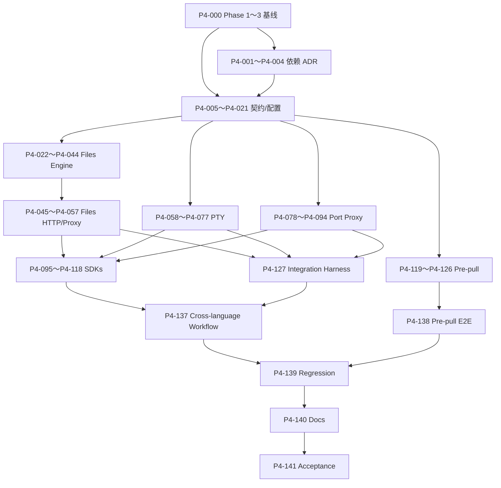

# Phase 4：Agent 体验细粒度开发计划与设计方案

> - 状态：待审查
> - 前置阶段：[Phase 3：可靠性细粒度开发计划](./phase-3-reliability-development-plan.md)
> - 上位设计：[全 Go Agent Sandbox Runtime 设计](./all-go-agent-sandbox-runtime-design.md)
> - 参考分析：[OpenSandbox Sandbox 模块与 Go Runtime 分析](./opensandbox-sandbox-module-and-go-runtime-analysis.md)
> - 阶段定义：本文的“第四阶段”对应上位设计中的 **Phase 4：Agent 体验**

## 1. 文档目的

本文把 Phase 4 拆成可以逐个开发、逐个测试、逐个提交和逐个审查的小任务。

执行规则与前三个阶段相同：

1. 一个任务只增加一个小能力。
2. 一个任务对应一个独立提交。
3. 每个任务先运行聚焦测试，再运行阶段要求的基础检查。
4. 每个任务提交后暂停，等待审查通过再进入下一任务。
5. 公共协议先冻结，再实现 runner、sandboxd 和多语言 SDK。
6. 文件、PTY 和端口代理都必须经过 sandboxd 的固定能力代理，不能演变为任意 runner reverse proxy。
7. 不为 Phase 5 提前加入 Pool、快照、Kubernetes、分布式调度或强隔离 runtime。
8. 发现协议、安全、依赖或兼容语义必须变化时，先修订本文并重新审查。

任务编号只表达推荐依赖顺序，不表达工期。

## 2. Phase 4 的准确边界

### 2.1 强制前置条件

开始 P4-001 前必须满足：

- Phase 1～Phase 3 的全部任务完成；
- 存在通过状态的 `phase1-acceptance.md`、`phase2-acceptance.md` 和 `phase3-acceptance.md`；
- create/execute/TTL/renew/idempotency/crash recovery/orphan/diagnostics 的真实 Docker 回归通过；
- runner protocol、Store schema、lease manifest 和 admin contract 已冻结；
- `sandboxd`、`runnerd`、`sandbox-init` 在 Linux Docker 环境稳定；
- 工作区没有未解释的 cleanup pending、anomaly、残留进程、受管资源或失败测试。

P4-000 专门验证这些前置条件，不实现 Agent 体验功能。

### 2.2 阶段目标

Phase 4 结束时，Agent 调用方应能够：

```text
创建并等待 sandbox ready
  → 查询 runner capabilities
  → 安全上传源码文件到 workspace
  → 分页列目录、读取 metadata、移动和删除文件
  → 流式下载构建产物
  → 打开交互 PTY、发送输入并调整窗口
  → 启动 sandbox 内 HTTP 服务
  → 通过受控 HTTP port proxy 访问服务
  → 使用 Go、TypeScript 或 Python SDK 完成同一工作流
  → 通过配置预拉取常用镜像
  → 删除 sandbox 并清理文件流、PTY 和代理连接
```

### 2.3 阶段验收

Phase 4 必须满足：

- 文件上传/下载保持任意二进制字节一致；
- 所有文件和目录 API 只能访问 `/workspace`；
- `..`、绝对路径、symlink、magic link、rename 和并发替换不能逃逸 workspace；
- 上传在成功前不可见，失败/取消不留下临时文件；
- recursive delete 不跟随 symlink，并受 entries/depth/time 上限约束；
- PTY 支持交互输入、窗口 resize、合并终端输出和唯一终止事件；
- PTY 断开、timeout、runner shutdown 和 sandbox delete 都终止完整进程组/session；
- PTY 慢客户端不会造成 runner 内存无界；
- port proxy 只能连接当前 sandbox 的 loopback TCP port；
- port proxy 不发布 Docker host port，不支持 host network、任意目标、CONNECT、raw TCP 或 UDP；
- 控制面 Authorization、runner token、Cookie 策略外的内部 header 不转发给 sandbox 服务；
- Go/TypeScript/Python SDK 使用同一 contract fixtures；
- 三种 SDK 都能完成 create → wait → upload → execute → download → delete；
- 镜像预拉取复用 Phase 3 pull limiter，不阻塞服务可靠性；
- Phase 1～3 的 lifecycle、execution、TTL、recovery 和安全测试继续通过。

### 2.4 明确不做

以下能力不进入 Phase 4：

- `/workspace` 外任意文件访问；
- host path、Docker socket、device、mount、namespace 或 ownership API；
- tar/zip archive 自动解包、目录整体上传下载和文件同步协议；
- file watch、全文搜索、内容替换、patch、xattr、ACL、chown 和特殊文件创建；
- workspace 总磁盘配额保证；用户命令仍可直接写 volume；
- PTY session 重连、takeover、输出 replay、多人连接和后台持久 PTY；
- Jupyter kernel、语言 code context、REPL 状态管理和 startup process；
- raw TCP、UDP、CONNECT、任意 host、WebSocket 应用代理和公网分享 URL；
- 浏览器 SDK、CORS 开放、Web Console 和把控制面 API token 放入网页；
- registry credential API、镜像缓存淘汰、镜像 GC 和 pull job 持久化；
- SDK 发布到 npm/PyPI 或兼容所有语言版本；
- execution 跨 runner 重启恢复；
- Pool、快照、pause/resume、Kubernetes、gVisor、Kata 和 microVM。

Phase 4 仍然是单机 Docker runtime。体验能力不能成为扩大宿主机或跨 sandbox 权限的理由。

## 3. Phase 3 交付基线与 Phase 4 差距

### 3.1 Phase 4 假定已经提供

- 稳定 lifecycle、execution、renew、admin 和 runner HTTP/SSE 协议；
- sandboxd 到 runnerd 的 Unix Socket、token 和固定 endpoint allowlist；
- runner non-root 身份、进程组 cancel/timeout 和 server shutdown；
- Store/reconcile/TTL/idempotency/crash recovery；
- outbound bridge、严格 Docker security profile 和无 published ports；
- 结构化日志、metrics、diagnostics、request ID 和安全 redaction；
- Go SDK lifecycle/execution 基础；
- Linux Docker integration/security harness。

### 3.2 Phase 4 需要新增

- runner capabilities discovery；
- workspace-relative path contract 和 fd-relative Linux filesystem engine；
- stat/upload/download/list/mkdir/move/delete；
- 原子 upload、流式 download、分页和 recursive-delete budgets；
- 文件 API 的 runner handler、runnerclient、application 和 sandboxd 代理；
- PTY WebSocket 协议、terminal process、resize、背压和清理；
- sandboxd 终止 WebSocket 并通过 Unix Socket 建立 typed runner connection；
- sandbox loopback HTTP port proxy、header policy 和流式限制；
- Go SDK 的 files/PTY/port/capabilities；
- Node.js TypeScript SDK；
- Python SDK；
- 配置驱动的 image pre-pull；
- 跨语言 conformance 和完整 Agent workflow 验收。

## 4. 实施前审查门

### G1：Phase 1～3 验收门

P4-000 必须重新执行前三阶段的核心 smoke 并读取三个验收报告。Phase 4 不负责用更宽的文件或网络能力绕过旧缺陷。

### G2：Linux 文件系统依赖与内核能力

安全文件 API 推荐使用：

- root directory fd 固定指向 `/workspace`；
- `openat2` + `RESOLVE_BENEATH|RESOLVE_NO_MAGICLINKS`；
- `openat/unlinkat/renameat2/mkdirat/fstatat` 等 fd-relative syscall；
- no-follow、same-filesystem 和明确 symlink policy；
- 不使用“字符串 clean + `os.Open`”作为安全边界。

这通常需要 `golang.org/x/sys/unix`，并要求 Linux 内核支持所需 syscall。P4-001 必须形成依赖/平台 ADR；不支持时 capabilities 返回 files unavailable，不能静默降级为易受 TOCTOU 攻击的实现。

### G3：PTY 与 WebSocket 依赖

标准库不提供完整 WebSocket 和 PTY abstraction。P4-002 必须评估并固定：

- 维护状态和版本；
- close/ping/pong、message limit、context 和 custom Unix Socket transport；
- PTY controlling terminal、resize 和 Linux 支持；
- transitive dependencies、license 和安全维护；
- race/backpressure 测试策略。

未确认前不修改 `go.mod`。不自行实现 RFC 6455。

### G4：文件协议

建议冻结：

- 所有 client path 是 UTF-8、`/` 分隔、workspace-relative；
- `"."` 只表示 workspace root；
- 拒绝 absolute、空 segment、`.`/`..` segment、NUL、控制字符、反斜杠和超限；
- symlink 可以被读取/跟随，但解析必须由 `openat2 RESOLVE_BENEATH` 保证仍在 workspace；
- magic link 永远拒绝；
- mutation 不允许目标为 workspace root；
- single-file upload/download，不支持 archive；
- upload 默认 atomic、默认不覆盖、mode 只允许普通 rwx bits；
- download 只读 regular file，支持 offset/length，不承诺并发写下的快照一致性；
- recursive delete 默认关闭，显式开启后仍有 budgets。

执行 P4-006 前必须确认。

### G5：PTY 协议

建议：

- 外部和内部都使用 WebSocket subprotocol `minisandbox.pty.v1`；
- 一条 WebSocket 创建并拥有一个 PTY session；
- 首个 client text frame 是 start；随后 binary frame 是 stdin，text frame 只用于 resize；
- server binary frame 是合并后的 PTY output，text frame 用于 started/terminal/error；
- PTY 天生合并 stdout/stderr，不伪装为两个 stream；
- 不支持 reconnect、takeover、replay 或多个 client；
- disconnect 等价于 cancel；
- terminal 恰好一次，发送后关闭 WebSocket；
- Ctrl-C 等控制字符作为 stdin bytes 交给终端 line discipline，不提供任意 signal API。

执行 P4-015 前必须确认。

### G6：Port Proxy 安全边界

Phase 4 只提供 authenticated HTTP/1.1 proxy：

- destination 固定为当前 sandbox 内 `127.0.0.1:<validated-port>`，可选 fallback `[::1]`；
- port 必须在服务端 allow range；
- 不允许请求提供 host、scheme、IP 或 Unix Socket；
- 不支持 CONNECT、TRACE、Upgrade、WebSocket、raw TCP、UDP 或 share link；
- 不发布 Docker port，不改变 network mode；
- strip hop-by-hop、Authorization、Proxy-Authorization、Forwarded、X-Forwarded-* 和 `X-MiniSandbox-*`；
- Host 重写为 loopback target；
- request/response bytes、并发、connect/idle/total duration 均有限制。

自动向 sandbox 应用转发控制面凭证是严重泄露，执行 P4-016 前必须确认 header policy。

### G7：SDK 依赖与支持矩阵

Phase 4 推荐：

- Go：与仓库 Go baseline 一致；
- TypeScript：先支持 Node.js LTS，不支持 browser；
- Python：固定一个最低 CPython 版本，先提供 sync client，再提供小型 async facade 或明确延后；
- 三种 SDK 都由同一 OpenAPI/protocol fixtures 验证；
- SSE/WS streaming 使用语言原生 iterator/stream abstraction；
- 不在本阶段发布公共 package registry。

P4-003、P4-004 分别形成 TypeScript/Python ADR 并确认 runtime、HTTP/WS 依赖、生成策略、package layout 和 CI。

### G8：Image Pre-pull

Phase 4 只实现配置驱动预拉取：

- 配置列出固定 image/platform；
- 启动后在后台 seed，默认不阻塞 readiness；
- 复用 image allowlist、Phase 3 pull limiter、retry 和 metrics；
- Docker image cache 是实际事实，内存 job 不是持久化事实；
- 每次重启重新 inspect/seed，成功 image 不重复 pull；
- 不接受 registry credential，不提供 public/admin mutation，不做 GC。

### G9：真实 Linux 与跨语言环境

验收需要：

- 支持 `openat2`、PTY、Unix Socket 和 process group 的真实 Linux；
- Docker daemon；
- Node.js SDK ADR 指定的版本；
- Python SDK ADR 指定的版本；
- 本地 fixture HTTP server 和二进制文件；
- 无公网依赖的 package/build test；
- 测试失败路径清理 PTY、proxy stream、temp file、container 和 volume。

## 5. Phase 4 核心设计

### 5.1 Capabilities

新增：

```text
GET /v1/sandboxes/{sandbox_id}/capabilities
GET /v1/capabilities                     # runner internal
```

响应：

```json
{
  "runner_protocol_version": 2,
  "features": {
    "files": 1,
    "pty": 1,
    "http_port_proxy": 1
  },
  "limits": {
    "max_upload_bytes": 33554432,
    "max_download_bytes": 67108864,
    "max_pty_frame_bytes": 65536
  }
}
```

规则：

- 只报告实际可用能力；
- files 可因内核 syscall 不满足而 unavailable；
- SDK 必须先检查 feature version，再调用可选能力；
- response 不包含 socket path、UID/GID、token、host port 或内部配置路径；
- lifecycle Running 之后 capabilities 成功构成 SDK 的第二级 readiness。

### 5.2 外部文件 API

```text
POST /v1/sandboxes/{id}/files/stat
PUT  /v1/sandboxes/{id}/files/content
GET  /v1/sandboxes/{id}/files/content
POST /v1/sandboxes/{id}/directories/list
POST /v1/sandboxes/{id}/directories
POST /v1/sandboxes/{id}/files/move
POST /v1/sandboxes/{id}/files/delete
```

内部 runner 使用对应的 `/v1/files/**` 和 `/v1/directories/**` 固定 endpoint，不接受 sandbox ID。

Path 是业务数据，不放入 wildcard route。JSON endpoint 使用 body；upload/download 使用 query `path`，避免额外 multipart metadata parser。query 解码后仍走同一 path validator。

### 5.3 Path 与 Workspace Root

runner 降权后打开 `/workspace` directory fd，并在生命周期内持有：

```text
workspaceRootFD
  → validate protocol path
  → openat2(rootFD, path, RESOLVE_BENEATH|RESOLVE_NO_MAGICLINKS)
  → 对 parent/target 使用 fd-relative syscall
```

公共 path：

- `"."` 表示 root；
- 普通例子为 `src/main.go`；
- 不是 `/workspace/src/main.go`；
- 不进行 Unicode normalization；
- 日志只记录 path hash、segment count 和 operation，不记录完整 path。

openat2 不可用时 files capability 不启用。Phase 4 不提供不安全 fallback。

### 5.4 Stat 与 Directory List

Stat request：

```json
{
  "path": "src/main.go",
  "follow_symlinks": true
}
```

response 只包含：

```text
path
type          # regular | directory | symlink | other
size_bytes
mode
modified_at
```

不返回 uid/gid、device、inode、symlink 绝对 target 或 xattr。

List request：

```json
{
  "path": ".",
  "cursor": "",
  "page_size": 100
}
```

response：

```text
entries[]
next_cursor
complete
```

cursor 表示最后返回的 entry name，经 opaque Base64 编码。分页在目录并发变化时是 best effort，不宣称 snapshot。

### 5.5 Atomic Upload

Upload：

```http
PUT /v1/sandboxes/{id}/files/content?path=src/main.go&overwrite=false&create_parents=false&mode=0644
Content-Type: application/octet-stream
```

流程：

```text
validate path/mode/content length
  → open safe parent dirfd
  → create random temp file in same directory
  → bounded stream copy
  → fsync temp
  → chmod regular rwx bits
  → renameat2 publish
  → fsync parent
```

默认不覆盖。`overwrite=true` 使用原子 replace，但不能替换 directory。取消、超限和失败删除 temp。上传不能创建 symlink、device、FIFO 或 socket。

### 5.6 Download

Download：

```http
GET /v1/sandboxes/{id}/files/content?path=bin/app&offset=0&length=1048576
```

规则：

- 只下载 regular file；
- offset/length 为非负整数并受最大值限制；
- length 缺失时最多读取 `max_download_bytes`，文件更大返回明确错误而不是静默截断；
- 从已安全打开的 fd 流式读取；
- sandboxd 不缓存完整 body；
- client 断开关闭 runner response 和 file fd；
- 不支持 HTTP Range 多段和目录 archive。

### 5.7 Directory Mutation

Mkdir：

```json
{
  "path": "src/generated",
  "parents": true,
  "mode": "0755"
}
```

Move：

```json
{
  "source": "tmp/result",
  "destination": "bin/result",
  "overwrite": false
}
```

Delete：

```json
{
  "path": "tmp/build",
  "recursive": true
}
```

约束：

- workspace root 永不允许 move/delete；
- move 只在同一 workspace volume 内；
- recursive delete 使用 fd-relative walker，不跟随 symlink；
- entries、depth 和 duration 任一超限即停止并返回可重试错误；
- recursive delete 可能部分完成，重复请求必须安全；
- 文件可被 execution 并发修改，因此只承诺单 syscall/atomic publish 的原子性，不承诺跨 API transaction。

### 5.8 File Operation Concurrency

runner 使用固定 semaphore 限制文件操作。上传/download 占用 stream slot 到结束；stat/list/mkdir/move/delete 占普通 operation slot。

不对 path 建无限 lock map。API mutation 与用户命令可能竞争，依赖 fd-relative syscall 和 atomic rename 保证不逃逸；业务层不承诺 last-writer 顺序。

### 5.9 PTY WebSocket Protocol

Endpoint：

```text
GET /v1/sandboxes/{id}/pty
GET /v1/pty                         # runner internal
Sec-WebSocket-Protocol: minisandbox.pty.v1
```

Client 第一条 text frame：

```json
{
  "type": "start",
  "argv": ["/bin/bash"],
  "cwd": ".",
  "env": {},
  "cols": 120,
  "rows": 40,
  "timeout_seconds": 3600
}
```

`argv` 缺失时使用 Phase 2 固定 shell 探测并启动交互 shell。后续：

- client binary：stdin bytes；
- client text：`{"type":"resize","cols":120,"rows":40}`；
- server text：started、terminal、error；
- server binary：PTY output bytes；
- RFC 6455 ping/pong：连接保活，不进入业务 sequence。

PTY output 天生合并 stdout/stderr。server 只有一个 writer goroutine。慢客户端超过 output queue/write deadline 时关闭连接并取消 PTY，不丢弃任意量输出继续运行。

### 5.10 PTY Process Lifecycle

```text
validate start
  → open PTY master/slave
  → child setsid + controlling terminal
  → start command
  → close runner-side slave
  → pumps stdin/output/resize
  → wait
  → terminal arbiter
  → close PTY/WebSocket
```

disconnect、timeout、idle timeout、runner shutdown 和 sandbox delete 复用：

```text
SIGHUP/TERM session/process group
  → termination grace
  → SIGKILL
  → wait child + close fds
  → unique terminal decision
```

不允许任意 PID/signal。PTY manager 只管理当前 sandbox，受 `max_concurrent_sessions` 限制。

### 5.11 HTTP Port Proxy

外部 endpoint：

```text
ANY /v1/sandboxes/{id}/ports/{port}/http/{path...}
```

内部 runner endpoint：

```text
ANY /v1/ports/{port}/http/{path...}
```

该 wildcard 只存在于明确的 port proxy prefix 下，application/runnerclient 仍是 typed method，不能传任意 runner URL。

链路：

```text
client authenticated request
  → sandboxd validates sandbox Running/port/method
  → strips control and hop-by-hop headers
  → RunnerClient over current sandbox Unix Socket
  → runner validates again
  → dial 127.0.0.1:port inside sandbox
  → HTTP/1.1 request/response stream
```

不使用 Docker published port，不返回 runner token，不让用户提供 destination host。

### 5.12 Port Header Policy

请求删除：

```text
Authorization
Proxy-Authorization
Connection
Proxy-Connection
Keep-Alive
TE
Trailer
Transfer-Encoding
Upgrade
Forwarded
X-Forwarded-*
X-MiniSandbox-*
```

`Host` 固定为 loopback target。response 同样删除 hop-by-hop 和内部 header。应用 Cookie/Set-Cookie 可以透传，但日志不能记录值；控制面认证不使用 Cookie。

### 5.13 SDK 设计

三种 SDK 共享概念：

```text
Client
  → Sandboxes
      → Create/Get/Delete/Renew/WaitReady
      → Execute
      → Files
      → PTY
      → PortHTTP
```

语言原生类型：

- Go：`context.Context`、`time.Duration`、`io.Reader/io.ReadCloser`；
- TypeScript：`AbortSignal`、`AsyncIterable`、Node `Readable`/`Uint8Array`；
- Python：`datetime/timedelta`、iterator/async iterator、binary file-like object。

SDK 不允许用户设置 runner URL/token/socket。WaitReady 先等待 lifecycle Running，再查询 capabilities。

### 5.14 Image Pre-pull

配置：

```yaml
runtime:
  prepull_images:
    - image: "golang:1.26"
      platform: "linux/amd64"
```

启动后：

```text
normalize + allowlist validate
  → Docker image inspect
  → 已存在则 success
  → 不存在则进入 bounded background pull
  → 复用 pull semaphore/retry/metrics
```

pre-pull 默认不阻止 readiness；状态通过 metrics/diagnostics 可见。进程重启重新从配置 seed，Docker cache 是事实源。

### 5.15 安全与可观测性

新增日志/metric 只记录：

```text
file_operation
path_hash
bytes
result
pty_result
pty_duration
port
proxy_method
proxy_result
prepull_result
```

禁止记录：

- path 全文；
- 上传/下载内容；
- PTY stdin/output；
- HTTP proxy header/body/query；
- Cookie/Authorization；
- image registry credential；
- runner token 或 socket path。

port 可以作为 metric label 的前提是配置固定小范围；默认只记录为日志数值，不作为 metric label。

## 6. Phase 4 配置

建议增加：

```yaml
files:
  enabled: true
  max_path_bytes: 4096
  max_segment_bytes: 255
  max_upload_bytes: 33554432
  max_download_bytes: 67108864
  max_concurrent_operations: 8
  max_concurrent_streams: 4
  max_list_page_size: 200
  max_recursive_entries: 10000
  max_recursive_depth: 64
  recursive_timeout: "30s"

pty:
  enabled: true
  max_concurrent_sessions: 2
  max_frame_bytes: 65536
  max_output_queue_bytes: 1048576
  handshake_timeout: "5s"
  write_timeout: "10s"
  idle_timeout: "30m"
  max_duration: "4h"
  termination_grace: "2s"
  min_cols: 1
  max_cols: 500
  min_rows: 1
  max_rows: 300

port_proxy:
  enabled: true
  min_port: 1024
  max_port: 65535
  max_concurrent_requests: 8
  max_request_bytes: 8388608
  max_response_bytes: 67108864
  connect_timeout: "2s"
  idle_timeout: "30s"
  max_duration: "10m"

runtime:
  prepull_images: []
  prepull_max_attempts: 3
```

所有配置在 sandboxd 启动时验证并把 runner 需要的 limits 写入安全 bootstrap config。普通请求不能扩大任何上限。

## 7. 每个任务的完成标准

除任务自身验收项外，每个代码任务都必须：

- 保持中文模块和导出 API 注释同步；
- 运行受影响包聚焦测试；
- 运行 `gofmt`、`go test ./...` 和 `go vet ./...`；
- 涉及并发、stream、WebSocket、fd 或 manager 时运行 `go test -race`；
- 涉及 openat2、PTY、Unix Socket 或 process group 时运行真实 Linux 测试；
- 涉及 public/internal API 时同步 OpenAPI、protocol、SDK、fixtures 和 handler；
- 验证 body/frame/path/entries/depth/duration/concurrency limits；
- 验证 disconnect、cancel、timeout 和 shutdown 释放 fd、temp file、goroutine 和进程；
- 验证日志、错误、metrics、diagnostics 和测试输出不包含内容或凭据；
- 验证 sandboxd 没有通过宿主机文件或 `os/exec` 实现用户能力；
- 提交只包含当前任务的小功能。

每个审查包应提供：

```text
任务 ID
目标
设计决定
文件列表
测试结果
race/Linux/Docker/Node/Python 结果
安全边界证据
明确未做
commit SHA
```

## 8. 任务总览

| 分组 | 任务 | 结果 |
|---|---:|---|
| A. 契约、依赖与配置 | P4-000～P4-021 | 冻结 capabilities/files/PTY/port/pre-pull 与依赖 |
| B. 安全 Workspace 文件引擎 | P4-022～P4-044 | fd-relative path、原子 upload、download、目录 mutation |
| C. 文件 HTTP 与控制面代理 | P4-045～P4-057 | runner handlers、runnerclient、sandboxd files API |
| D. PTY | P4-058～P4-077 | WebSocket、terminal lifecycle、背压和删除清理 |
| E. HTTP Port Proxy | P4-078～P4-094 | loopback-only HTTP forwarding 与 header/limit 安全 |
| F. Go/TypeScript/Python SDK | P4-095～P4-118 | 三种语言统一 Agent workflow |
| G. Image Pre-pull | P4-119～P4-126 | 配置 seed、dedupe、pull/retry、状态和 metrics |
| H. Linux/Docker/跨语言验收 | P4-127～P4-141 | 文件逃逸、PTY、proxy、SDK、回归、文档和最终报告 |

## 9. 详细任务

### A. 契约、依赖与配置

### P4-000：验证 Phase 1～3 验收基线

- **依赖**：G1。
- **唯一目标**：确认前三阶段报告、协议版本、schema、Docker 资源和真实回归满足 Phase 4 前置条件。
- **设计**：记录 commit、环境、已知限制、active anomaly 和 capability baseline；缺口返回原阶段独立修复。
- **修改范围**：Phase 4 kickoff checklist，不修改生产代码。
- **测试**：重跑 lifecycle/execution/TTL/crash/security 核心 smoke。
- **验收**：没有未解释失败、资源残留或兼容漂移。
- **本任务不做**：不增加 files、PTY、proxy 或 SDK。

### P4-001：确定 Linux 文件 syscall 依赖

- **依赖**：P4-000、G2。
- **唯一目标**：用 ADR 固定 openat2/fd-relative syscall 实现、内核要求和 unsupported 行为。
- **设计**：评估 `x/sys/unix` 版本、license、syscall flags、测试内核；files 不可用时显式 capability=false。
- **修改范围**：依赖 ADR，不修改 `go.mod`。
- **测试**：核对最小内核、构建 tag 和 fallback 决策。
- **验收**：不采用字符串 path check 作为最终安全边界。
- **本任务不做**：不安装依赖，不实现 path resolver。

### P4-002：确定 WebSocket 与 PTY 依赖

- **依赖**：P4-000、G3。
- **唯一目标**：用 ADR 固定维护中的 WebSocket 和 PTY 库及版本策略。
- **设计**：验证 Unix Socket dial、subprotocol、limits、ping/pong、context、controlling terminal 和 resize。
- **修改范围**：依赖 ADR，不修改 `go.mod`。
- **测试**：最小 spike 结果写入 ADR，不进入生产包。
- **验收**：依赖支持 Linux/race，且不要求 privileged/capability。
- **本任务不做**：不实现 WS endpoint 或 PTY process。

### P4-003：确定 TypeScript SDK 工具链

- **依赖**：P4-000、G7。
- **唯一目标**：固定 Node.js baseline、package manager、HTTP/WS、生成策略和 CI 命令。
- **设计**：Node-only ESM；不支持 browser/CORS；lockfile 必须提交；依赖和 license 明确。
- **修改范围**：TypeScript SDK ADR。
- **测试**：空 package build/test/publish dry-run 方案评审。
- **验收**：版本矩阵和不支持项可执行、无模糊“最新版本”。
- **本任务不做**：不创建 SDK package，不安装依赖。

### P4-004：确定 Python SDK 工具链

- **依赖**：P4-000、G7。
- **唯一目标**：固定 CPython baseline、HTTP/SSE/WS 依赖、类型和打包策略。
- **设计**：先 sync client；async 范围明确；使用 lock/constraints；不强制大型 runtime framework。
- **修改范围**：Python SDK ADR。
- **测试**：空 wheel/sdist 和 test matrix 方案评审。
- **验收**：最低 Python、依赖版本和支持 API 明确。
- **本任务不做**：不创建 package，不发布 PyPI。

### P4-005：冻结 capabilities 契约

- **依赖**：P4-000。
- **唯一目标**：定义公共/runner capabilities endpoint、feature version 和安全 limits。
- **设计**：未启用能力省略或明确 unavailable；runner protocol 精确匹配；无内部 path/identity。
- **修改范围**：两个 OpenAPI、`pkg/protocol`、Go SDK model 和 fixtures。
- **测试**：全可用、部分可用、版本 mismatch、JSON round trip。
- **验收**：SDK 可只凭响应决定是否调用 files/PTY/port。
- **本任务不做**：不实现 endpoint。

### P4-006：冻结 workspace path 契约

- **依赖**：P4-001、G4。
- **唯一目标**：固定相对 path 字符、root、segment 和 symlink 语义。
- **设计**：遵循第 5.3 节；path error 不回显全文；wire path 统一 UTF-8 string。
- **修改范围**：files OpenAPI schema、protocol path types 和 fixtures。
- **测试**：合法 Unicode/空格、absolute、dot、dotdot、slash、反斜杠、NUL/控制字符和 limits。
- **验收**：外部/内部/SDK 使用同一规则。
- **本任务不做**：不访问文件系统。

### P4-007：冻结 file stat 契约

- **依赖**：P4-005、P4-006。
- **唯一目标**：定义单 path stat request 和 allowlist metadata response。
- **设计**：follow_symlinks 默认 true；type enum 固定；mode 为四位 octal string；time RFC3339 UTC。
- **修改范围**：外部/runner OpenAPI、protocol、fixtures。
- **测试**：各 type、not found、symlink、非法 mode/time。
- **验收**：schema 不暴露 uid/gid/inode/device/target。
- **本任务不做**：不实现 handler。

### P4-008：冻结 atomic upload 契约

- **依赖**：P4-006。
- **唯一目标**：定义 raw binary upload query、overwrite、parents、mode 和成功响应。
- **设计**：Content-Type octet-stream；成功 201/204 区分 create/replace；长度可未知但流受限。
- **修改范围**：外部/runner OpenAPI、protocol errors、fixtures。
- **测试**：create/replace/conflict、mode、超限、cancel fixture。
- **验收**：协议不接受 host path、owner/group 或特殊文件类型。
- **本任务不做**：不实现 multipart/archive。

### P4-009：冻结 streaming download 契约

- **依赖**：P4-006。
- **唯一目标**：定义 single regular file 的 offset/length 流式响应。
- **设计**：octet-stream；安全 metadata headers；文件过大为明确 413；不静默截断。
- **修改范围**：外部/runner OpenAPI、SDK stream contract、fixtures。
- **测试**：full/partial/empty、offset beyond EOF、directory、too large。
- **验收**：sandboxd 不需要知道文件内容。
- **本任务不做**：不支持 archive 或 multipart Range。

### P4-010：冻结 directory list 契约

- **依赖**：P4-006、P4-007。
- **唯一目标**：定义单层、cursor/page-size 目录分页。
- **设计**：opaque cursor；entry metadata allowlist；并发 mutation 明确 best effort。
- **修改范围**：外部/runner OpenAPI、protocol、fixtures。
- **测试**：空、多页、非法 cursor/limit、各 entry type。
- **验收**：不承诺 snapshot，不支持递归 list。
- **本任务不做**：不实现 scanner。

### P4-011：冻结 mkdir 契约

- **依赖**：P4-006。
- **唯一目标**：定义 path、parents、mode 和幂等目录创建语义。
- **设计**：已存在同类型成功；已存在非目录 conflict；root no-op 仅在明确允许的 stat/list，不由 mkdir 创建。
- **修改范围**：外部/runner OpenAPI、protocol、fixtures。
- **测试**：single/parents/existing/conflict/mode。
- **验收**：不接受 owner/group、absolute path。
- **本任务不做**：不实现 chmod。

### P4-012：冻结 delete 契约

- **依赖**：P4-006。
- **唯一目标**：定义 file/empty-directory/recursive delete 的幂等和 partial 语义。
- **设计**：missing 返回 204；root 拒绝；budget 超限返回 retryable error；recursive 可部分完成。
- **修改范围**：外部/runner OpenAPI、protocol、fixtures。
- **测试**：file/dir/missing/root/recursive/budget。
- **验收**：协议不提供 follow_symlinks 开关。
- **本任务不做**：不实现 trash/undo。

### P4-013：冻结 move 契约

- **依赖**：P4-006。
- **唯一目标**：定义 workspace 内 rename 和 overwrite 语义。
- **设计**：source/destination 都是相对 path；默认不覆盖；禁止 root；跨 filesystem 明确失败。
- **修改范围**：外部/runner OpenAPI、protocol、fixtures。
- **测试**：file/dir、conflict、overwrite、missing/root。
- **验收**：不能通过 destination 选择其他 mount。
- **本任务不做**：不实现 copy。

### P4-014：冻结 files 错误模型

- **依赖**：P4-006～P4-013。
- **唯一目标**：固定 INVALID_PATH、NOT_FOUND、TYPE_MISMATCH、CONFLICT、LIMIT、UNSUPPORTED 和 IO error mapping。
- **设计**：errno 通过 typed classifier；公共 message 固定；retryable 只用于 transient/partial。
- **修改范围**：protocol errors、OpenAPI responses、error mapper contract。
- **测试**：error/HTTP/retryable matrix。
- **验收**：错误不含 path、errno raw text 或 host/container absolute path。
- **本任务不做**：不实现 syscall classifier。

### P4-015：冻结 PTY WebSocket 协议

- **依赖**：P4-002、G5。
- **唯一目标**：固定 handshake、subprotocol、frame、terminal 和 close code。
- **设计**：第 5.9 节为 source；JSON control strict；binary bytes opaque；terminal exactly once。
- **修改范围**：OpenAPI upgrade 描述、`pkg/protocol` PTY frames、contract fixtures。
- **测试**：frame/close code、unknown type、oversize、double terminal。
- **验收**：PTY 明确合并 stdout/stderr 且 disconnect cancels。
- **本任务不做**：不实现 WebSocket。

### P4-016：冻结 HTTP port proxy 契约

- **依赖**：G6。
- **唯一目标**：固定 path prefix、method、port、header 和 response/error 语义。
- **设计**：仅 HTTP/1.1；CONNECT/TRACE/Upgrade 拒绝；connection refused/timeout/limit 明确映射。
- **修改范围**：lifecycle/runner OpenAPI 描述、protocol policy、fixtures。
- **测试**：methods、port bounds、wildcard path、headers、errors。
- **验收**：contract 中没有 destination host/scheme/socket。
- **本任务不做**：不实现代理。

### P4-017：冻结 pre-pull 状态契约

- **依赖**：G8。
- **唯一目标**：定义配置 image model、diagnostics summary 和 metric result enum。
- **设计**：状态只在 admin diagnostics/metrics；不增加 mutation endpoint；image credential 不属于 model。
- **修改范围**：config schema、admin protocol、metric contract、fixtures。
- **测试**：pending/pulling/succeeded/failed/skipped。
- **验收**：公共 lifecycle API 不暴露 pre-pull job。
- **本任务不做**：不拉取镜像。

### P4-018：增加 files 配置模型

- **依赖**：P4-006～P4-014。
- **唯一目标**：增加第 6 节 files limits 与安全默认值。
- **设计**：bytes/count/depth/duration 强类型；enabled 显式；默认不允许无限 stream。
- **修改范围**：config model、defaults、example YAML。
- **测试**：默认和 round trip。
- **验收**：旧配置获得安全默认值。
- **本任务不做**：不验证组合。

### P4-019：增加 PTY 配置模型

- **依赖**：P4-015。
- **唯一目标**：增加 session/frame/queue/time/dimension limits。
- **设计**：所有 timeout 有界；enabled 可关闭；不暴露 shell path。
- **修改范围**：config model、defaults、example YAML。
- **测试**：默认和 round trip。
- **验收**：无零值表示无限。
- **本任务不做**：不启动 PTY。

### P4-020：增加 port proxy 与 pre-pull 配置

- **依赖**：P4-016、P4-017。
- **唯一目标**：增加 port range/stream limits 和固定 pre-pull images。
- **设计**：不允许 host target；images 使用现有 platform/image model；列表有数量上限。
- **修改范围**：config model、defaults、example YAML。
- **测试**：默认、round trip、secret dump。
- **验收**：没有 published-port、host-network 或 credential 字段。
- **本任务不做**：不验证/装配。

### P4-021：验证配置并建立 Phase 4 contract matrix

- **依赖**：P4-005～P4-020。
- **唯一目标**：拒绝矛盾配置并以统一 fixtures 锁定全部 Phase 4 contract。
- **设计**：校验所有 bounds/组合/loopback policy/image count；OpenAPI/protocol/SDK fixtures 共用 golden。
- **修改范围**：config validator、`tests/contract`。
- **测试**：每条配置规则和每个 request/response/frame fixture。
- **验收**：字段、单位、enum、limit 或 error 漂移会失败。
- **本任务不做**：不启动 runner、Docker、Node 或 Python。

### B. 安全 Workspace 文件引擎

### P4-022：探测 openat2 capability

- **依赖**：P4-001。
- **唯一目标**：runner bootstrap 安全探测所需 Linux syscall/flags。
- **设计**：对临时 workspace root 做真实 probe；ENOSYS/EINVAL 映射 unsupported；其他错误为 bootstrap diagnostic。
- **修改范围**：Linux files capability probe。
- **测试**：支持、模拟不支持、权限错误。
- **验收**：不支持时 files=false，runner 其他能力仍可用。
- **本任务不做**：不打开生产 workspace root。

### P4-023：持有并关闭 workspace root fd

- **依赖**：P4-022。
- **唯一目标**：降权后以 directory/no-follow flags 打开固定 `/workspace` 并管理生命周期。
- **设计**：验证 mount root 是 directory；fd 不泄漏给 child；shutdown 关闭；path 不来自请求。
- **修改范围**：runner filesystem service bootstrap。
- **测试**：正常、symlink root、非目录、重复 close、child fd inheritance。
- **验收**：所有后续操作只接收 root fd。
- **本任务不做**：不解析相对 path。

### P4-024：实现协议 path 纯校验

- **依赖**：P4-006、P4-018。
- **唯一目标**：在 syscall 前拒绝非法 path/segment/长度。
- **设计**：保留字节精确 UTF-8；`.` 仅 root；拒绝反斜杠、控制字符、空/dot/dotdot segment。
- **修改范围**：filesystem path validator。
- **测试**：P4-006 全矩阵和 fuzz。
- **验收**：返回 safe typed error，不回显 path。
- **本任务不做**：不检查文件存在或 symlink。

### P4-025：实现 beneath-safe target open

- **依赖**：P4-023、P4-024。
- **唯一目标**：用 openat2 在 root fd 下打开目标且不能越界/magic-link。
- **设计**：flags/mode 按用途显式；绝不 fallback 到 os.Open；errno typed mapping。
- **修改范围**：Linux fd resolver。
- **测试**：regular/dir、内外 symlink、proc magic link、rename race、fuzz helper。
- **验收**：任何 race 都只成功打开 workspace 内对象或失败。
- **本任务不做**：不打开 parent 或 mutation。

### P4-026：实现 beneath-safe parent dir open

- **依赖**：P4-025。
- **唯一目标**：把 mutation path 分为安全 parent dirfd 与 final basename。
- **设计**：basename 再校验；parent `.` 使用 dup root fd；禁止 root mutation。
- **修改范围**：parent resolver。
- **测试**：single/nested、parent symlink/race、root、missing。
- **验收**：返回 fd 的所有权/close 规则明确。
- **本任务不做**：不创建 parent。

### P4-027：实现 stat

- **依赖**：P4-007、P4-025。
- **唯一目标**：安全读取 allowlist metadata 并显式支持 follow/no-follow final symlink。
- **设计**：fd/fstatat；time UTC；type/mode 映射；other 不进一步识别 device。
- **修改范围**：filesystem stat service。
- **测试**：file/dir/symlink/other/not found/race。
- **验收**：不返回禁止 metadata。
- **本任务不做**：不读取内容。

### P4-028：实现有界 directory iterator

- **依赖**：P4-010、P4-025。
- **唯一目标**：以 O(page-size) 内存生成字典序下一页。
- **设计**：遍历 dirents，筛选 cursor 后最小 N；opaque cursor；entry 使用 no-follow metadata。
- **修改范围**：directory list engine。
- **测试**：空、多页、Unicode、mutation、巨大目录、无效 cursor。
- **验收**：内存不随目录总项数线性增长。
- **本任务不做**：不递归、不承诺 snapshot。

### P4-029：实现单层 mkdir

- **依赖**：P4-011、P4-026。
- **唯一目标**：用 mkdirat 创建一个目录并处理幂等 existing。
- **设计**：mode 过滤 special bits；同类型 existing 成功；symlink/non-dir conflict。
- **修改范围**：mkdir engine。
- **测试**：create/existing/conflict/mode/race。
- **验收**：不跟随 final symlink。
- **本任务不做**：不创建 parents。

### P4-030：实现 parents mkdir

- **依赖**：P4-029。
- **唯一目标**：逐 segment fd-relative 创建缺失父目录。
- **设计**：每层 openat2 beneath；existing 必须 directory；取消立即停止；重复幂等。
- **修改范围**：mkdir parents helper。
- **测试**：多层、部分存在、symlink、中途失败、并发。
- **验收**：无法越界或把 symlink 当目录。
- **本任务不做**：不回滚已创建父目录。

### P4-031：创建安全 upload 临时文件

- **依赖**：P4-026、P4-030。
- **唯一目标**：在目标 parent 中创建不可预测、exclusive、不可被 symlink 替换的 temp。
- **设计**：crypto random name；openat O_EXCL|O_NOFOLLOW；mode 0600；仅保存 basename。
- **修改范围**：upload temp helper。
- **测试**：collision、随机失败、预置 symlink、cancel cleanup。
- **验收**：temp 与目标同目录/文件系统。
- **本任务不做**：不写 request body。

### P4-032：有界流式写 upload

- **依赖**：P4-018、P4-031。
- **唯一目标**：把 request stream 写入 temp 并严格执行 max bytes/context。
- **设计**：读到 limit+1 判超限；处理 short write；统计 bytes；失败 close+unlink。
- **修改范围**：upload copy engine。
- **测试**：binary/empty/unknown length/limit/short write/cancel。
- **验收**：不把完整文件缓存在内存，失败无 temp。
- **本任务不做**：不发布目标。

### P4-033：原子发布不覆盖 upload

- **依赖**：P4-031、P4-032。
- **唯一目标**：fsync temp 后用 no-replace rename 原子创建目标。
- **设计**：renameat2 NOREPLACE；chmod ordinary bits；fsync file+parent；conflict 删除 temp。
- **修改范围**：upload publish create branch。
- **测试**：成功、existing、fsync/rename failure、crash boundary。
- **验收**：成功前目标不可见，existing 内容不改变。
- **本任务不做**：不覆盖。

### P4-034：原子发布覆盖 upload

- **依赖**：P4-033。
- **唯一目标**：overwrite=true 时原子替换 regular file/symlink target entry。
- **设计**：final lstat 禁止 directory；rename replace；不先 truncate；父 fsync。
- **修改范围**：upload overwrite branch。
- **测试**：regular/symlink/dir、reader concurrent、rename failure。
- **验收**：观察者只看到完整旧文件或完整新文件。
- **本任务不做**：不保留 backup。

### P4-035：实现 download fd 与范围校验

- **依赖**：P4-009、P4-025。
- **唯一目标**：打开 regular file 并从 fstat 计算安全 offset/length。
- **设计**：拒绝 directory/other；overflow 安全；缺失 length 时文件必须 <= max。
- **修改范围**：download prepare helper。
- **测试**：empty/full/partial/EOF/overflow/too large/symlink。
- **验收**：返回固定 fd snapshot metadata，不重复按 path open。
- **本任务不做**：不写 HTTP。

### P4-036：实现流式 download reader

- **依赖**：P4-035。
- **唯一目标**：从已打开 fd 的 section reader 按 context 流式读取并正确关闭。
- **设计**：不缓存；bytes 统计；client cancel 关闭 fd；并发 truncate 返回实际 IO error。
- **修改范围**：download stream。
- **测试**：binary、slow consumer、cancel、truncate、fd leak。
- **验收**：读取不超过批准 length/max。
- **本任务不做**：不保证并发写 snapshot。

### P4-037：实现 workspace 内 move

- **依赖**：P4-013、P4-026。
- **唯一目标**：用两个安全 parent dirfd 执行 rename/no-replace。
- **设计**：禁止 root；overwrite false NOREPLACE；overwrite true 禁止覆盖 directory/type 危险组合。
- **修改范围**：move engine。
- **测试**：file/dir、nested、conflict、symlink parents、race、EXDEV。
- **验收**：source/destination 始终在同一 workspace。
- **本任务不做**：不 copy fallback。

### P4-038：实现 file 与 empty-directory delete

- **依赖**：P4-012、P4-026。
- **唯一目标**：non-recursive delete 用 unlinkat 删除 final entry。
- **设计**：missing success；symlink 只删 link；dir 使用 AT_REMOVEDIR 且必须 empty；root 拒绝。
- **修改范围**：delete non-recursive engine。
- **测试**：file/symlink/empty/nonempty/missing/root/race。
- **验收**：不跟随 final symlink。
- **本任务不做**：不递归。

### P4-039：实现 fd-relative recursive walker

- **依赖**：P4-025、P4-038。
- **唯一目标**：深度优先遍历 directory tree 且永不跟随 symlink。
- **设计**：每层 dirfd；计数/depth；symlink 当叶子；不持有无界 fd。
- **修改范围**：recursive walker。
- **测试**：树、symlink cycle、deep/wide、rename race、fd limit。
- **验收**：访问对象均由 workspace root fd 约束。
- **本任务不做**：不删除，仅读取遍历 action。

### P4-040：执行有界 recursive delete

- **依赖**：P4-018、P4-039。
- **唯一目标**：按 walker 顺序删除叶子并处理 entries/depth/time/context limits。
- **设计**：部分成功可重试；超限 typed retryable error；root 永拒绝。
- **修改范围**：recursive delete engine。
- **测试**：正常、各 limit、cancel、并发创建、重复。
- **验收**：不越界、不无限运行、不承诺 rollback。
- **本任务不做**：不实现 trash。

### P4-041：限制文件操作并发

- **依赖**：P4-018、P4-027～P4-040。
- **唯一目标**：普通 op 和 stream 使用独立 bounded semaphore。
- **设计**：等待可取消；stream slot 生命周期覆盖 body；未取得返回 limit/timeout。
- **修改范围**：filesystem service gate。
- **测试**：两类 limit、取消、panic/close release、race。
- **验收**：实际峰值不超过配置且 slot 不泄漏。
- **本任务不做**：不做 path lock。

### P4-042：统一 syscall error 分类

- **依赖**：P4-014、P4-027～P4-040。
- **唯一目标**：把 errno/partial 状态映射为稳定 files error。
- **设计**：errors.Is/As；不解析文本；EIO/ENOSPC 等 message 固定。
- **修改范围**：filesystem error classifier。
- **测试**：主要 errno、wrapped、unknown、redaction。
- **验收**：raw path/errno string 不外泄。
- **本任务不做**：不记录日志。

### P4-043：增加 files 安全日志与 metrics

- **依赖**：P4-041、P4-042、Phase 3 observability。
- **唯一目标**：记录 operation/path hash/bytes/result 和 bounded metrics。
- **设计**：不记录 path/content；hash 使用进程内安全摘要；metric 无 path label。
- **修改范围**：filesystem observability decorator。
- **测试**：各 op、secret/path sentinel、cardinality。
- **验收**：可统计体验而不能还原文件名/content。
- **本任务不做**：不实现 HTTP。

### P4-044：关闭 filesystem service

- **依赖**：P4-023、P4-041。
- **唯一目标**：runner shutdown 时拒绝新 op、取消 stream、清 temp 并关闭 root fd。
- **设计**：draining→cancel→wait grace→close；重复调用幂等。
- **修改范围**：filesystem service lifecycle。
- **测试**：active upload/download/delete、timeout、repeat、fd/temp leak。
- **验收**：shutdown 返回后无活跃 op/temp/root fd。
- **本任务不做**：不处理 HTTP server shutdown。

### C. 文件 HTTP 与控制面代理

### P4-045：注册 runner files 固定路由

- **依赖**：P4-021、P4-044。
- **唯一目标**：在鉴权 mux 中精确注册 files/directories endpoint。
- **设计**：无 wildcard path/任意 proxy；capability disabled 返回明确 unsupported。
- **修改范围**：runner router。
- **测试**：route/method/auth/unknown path。
- **验收**：request 不能选择 sandbox ID、root path 或 handler。
- **本任务不做**：不实现业务 handler。

### P4-046：实现 runner stat handler

- **依赖**：P4-027、P4-042、P4-045。
- **唯一目标**：strict JSON decode 并映射 stat response/error。
- **设计**：body limit、unknown field、single value；handler 只调用 service。
- **修改范围**：runner stat transport。
- **测试**：types/errors/body/auth。
- **验收**：符合 P4-007 fixtures。
- **本任务不做**：不实现 list。

### P4-047：实现 runner list handler

- **依赖**：P4-028、P4-042、P4-045。
- **唯一目标**：提供有界 directory page。
- **设计**：page size 不能超过 config；opaque cursor；response byte limit。
- **修改范围**：runner list transport。
- **测试**：pages/errors/oversize。
- **验收**：符合 P4-010 fixtures。
- **本任务不做**：不实现 recursive。

### P4-048：实现 runner mkdir/move/delete handlers

- **依赖**：P4-029～P4-040、P4-042、P4-045。
- **唯一目标**：为三个 mutation 分别建立轻薄 handler。
- **设计**：共享 strict decoder/error mapper；每个 route 只调用对应 typed method。
- **修改范围**：runner mutation transports。
- **测试**：每个 contract branch、body/method。
- **验收**：不存在通用 filesystem action endpoint。
- **本任务不做**：不实现 upload/download。

### P4-049：实现 runner streaming upload handler

- **依赖**：P4-031～P4-034、P4-041、P4-045。
- **唯一目标**：query 校验后把受限 request body 直接交给 upload service。
- **设计**：Content-Length 预检但不信任；MaxBytes；client cancel 清 temp；响应在 publish 后提交。
- **修改范围**：runner upload transport。
- **测试**：create/replace/chunked/limit/disconnect。
- **验收**：transport 不缓存完整 body。
- **本任务不做**：不代理 sandboxd。

### P4-050：实现 runner streaming download handler

- **依赖**：P4-035、P4-036、P4-041、P4-045。
- **唯一目标**：准备 fd 后设置安全 headers 并流式 copy。
- **设计**：write deadline/flush；断开关闭 reader；错误发生在 header 前返回 JSON。
- **修改范围**：runner download transport。
- **测试**：full/partial/slow/disconnect/error timing。
- **验收**：不缓存完整 response。
- **本任务不做**：不做 Range。

### P4-051：实现 RunnerClient files 方法

- **依赖**：P4-046～P4-050。
- **唯一目标**：通过当前 sandbox Unix Socket 调用七个固定方法。
- **设计**：typed request/path query；upload io.Reader；download io.ReadCloser；body/response limit。
- **修改范围**：`internal/runnerclient`。
- **测试**：fake Unix server、paths/status/cancel/close。
- **验收**：调用方不能传 URL/socket/任意 path。
- **本任务不做**：不检查 sandbox state。

### P4-052：建立 files application service

- **依赖**：P4-005、P4-051。
- **唯一目标**：仅对 Running 且 files capability 可用的 sandbox 调用 RunnerClient。
- **设计**：复用 Store/capability gate；typed methods；不解释 filesystem path。
- **修改范围**：`internal/application` files service。
- **测试**：not found/not running/unsupported/runner error/success。
- **验收**：不 import Docker、syscall、HTTP 或 os filesystem。
- **本任务不做**：不实现 handler。

### P4-053：实现公共 stat/list/mutation handlers

- **依赖**：P4-046～P4-048、P4-052。
- **唯一目标**：公共 JSON endpoints 映射 application methods。
- **设计**：严格 decode/path/sandbox ID；统一 request ID/error；轻薄 handler。
- **修改范围**：sandboxd files handlers/router。
- **测试**：全部 contract/status/redaction。
- **验收**：无任意 runner proxy。
- **本任务不做**：不处理 stream。

### P4-054：实现公共 upload 流式代理

- **依赖**：P4-049、P4-051、P4-052。
- **唯一目标**：sandboxd 将 client body 直接传到 RunnerClient。
- **设计**：双层 limits；context 断开传播；不重试已开始 stream；control auth 不转发。
- **修改范围**：sandboxd upload handler。
- **测试**：chunked/limit/disconnect/runner error。
- **验收**：宿主机不创建用户文件或 temp。
- **本任务不做**：不做 buffering/resume。

### P4-055：实现公共 download 流式代理

- **依赖**：P4-050～P4-052。
- **唯一目标**：sandboxd 流式复制 runner response 到 client。
- **设计**：只转发 allowlist metadata header；write deadline；close propagation。
- **修改范围**：sandboxd download handler。
- **测试**：binary/headers/slow/disconnect/oversize。
- **验收**：宿主机不保存文件内容。
- **本任务不做**：不缓存或重试。

### P4-056：实现 capabilities runner 与公共 endpoint

- **依赖**：P4-005、P4-022、P4-045、P4-051。
- **唯一目标**：报告实际 capability versions/limits 并由 sandboxd 代理。
- **设计**：runner bootstrap snapshot 不可由 request 修改；public 先检查 Running。
- **修改范围**：runner handler、runnerclient、application、public handler。
- **测试**：全/部分 capability、version mismatch、redaction。
- **验收**：files unsupported 不影响 execute capability。
- **本任务不做**：不实现 SDK WaitReady。

### P4-057：装配 filesystem 到 runner shutdown

- **依赖**：P4-044～P4-056。
- **唯一目标**：按 bootstrap/serve/drain 顺序装配 root fd、service 和 handlers。
- **设计**：身份切换后 probe/open；shutdown 先关 HTTP intake 再关 service。
- **修改范围**：runner composition root。
- **测试**：supported/unsupported、启动失败、shutdown active streams。
- **验收**：无 fd/goroutine/temp leak。
- **本任务不做**：不增加 PTY 或 proxy。

### D. PTY

### P4-058：引入已确认 WebSocket/PTY 依赖

- **依赖**：P4-002、P4-021。
- **唯一目标**：按 ADR 固定版本加入依赖并建立最小 Linux build test。
- **设计**：只添加必要 modules；记录 checksum/license；Windows 使用 explicit unsupported stub。
- **修改范围**：`go.mod/go.sum`、build smoke。
- **测试**：Linux/Windows compile、dependency audit 命令。
- **验收**：没有未审查 transitive server/framework。
- **本任务不做**：不创建 session。

### P4-059：校验 PTY start request

- **依赖**：P4-015、P4-019、Phase 2 env/cwd。
- **唯一目标**：复用安全 env/cwd 并校验 argv、dimensions、timeout。
- **设计**：argv 缺失选固定 shell；不接受 shell source/UID/signal；cwd 仍 workspace-safe。
- **修改范围**：PTY validator。
- **测试**：default shell、argv、env 过滤、cwd、dims/time limits。
- **验收**：runner secret 不进入 child env。
- **本任务不做**：不启动 PTY。

### P4-060：定义 PTY session model 与 ID

- **依赖**：P4-015、P4-059。
- **唯一目标**：表示 Pending/Running/terminal、session ID 和唯一 owner connection。
- **设计**：不可预测 ID；不支持 attach/replay；terminal 不可逆。
- **修改范围**：runner PTY domain model。
- **测试**：ID/state transitions/double terminal。
- **验收**：model 不依赖 WebSocket library。
- **本任务不做**：不建 manager/process。

### P4-061：打开 PTY 并启动 controlling-terminal child

- **依赖**：P4-058～P4-060。
- **唯一目标**：创建 master/slave、setsid/setctty 并启动 child。
- **设计**：使用 ADR library；runner 关闭 slave；确认 session/pgid；start 失败清 fd。
- **修改范围**：Linux PTY process starter。
- **测试**：shell/argv、controlling tty、start failure、fd inheritance。
- **验收**：child 看到 isatty，拥有独立 session。
- **本任务不做**：不 pump IO。

### P4-062：实现 PTY resize

- **依赖**：P4-061。
- **唯一目标**：验证 rows/cols 后对 master 执行窗口 resize。
- **设计**：运行中才允许；重复值幂等；terminal 后 no-op/error contract 固定。
- **修改范围**：PTY resize helper。
- **测试**：initial/update/bounds/race/closed fd。
- **验收**：child 可观察 SIGWINCH/新尺寸。
- **本任务不做**：不读 WS frame。

### P4-063：实现 PTY stdin pump

- **依赖**：P4-061。
- **唯一目标**：把 bounded binary input 写到 master 并处理 partial write。
- **设计**：单 reader；frame size limit；context cancel；EOF 不自动 detach process。
- **修改范围**：PTY input pump。
- **测试**：binary/control bytes/partial/oversize/cancel。
- **验收**：不缓存无界 stdin。
- **本任务不做**：不解析 signal。

### P4-064：实现 PTY output pump

- **依赖**：P4-019、P4-061。
- **唯一目标**：从 master 持续读取合并 output 并写入 bounded queue。
- **设计**：复制 buffer；EOF 正常；queue 满报告 slow client cause。
- **修改范围**：PTY output pump/queue。
- **测试**：binary/large/EOF/queue full/cancel/race。
- **验收**：内存 <= configured queue+buffer。
- **本任务不做**：不写 WebSocket。

### P4-065：实现单一 WebSocket writer

- **依赖**：P4-015、P4-058、P4-064。
- **唯一目标**：串行写 started/binary output/terminal/error/ping。
- **设计**：只有一个 writer goroutine；write deadline；terminal 后拒绝数据。
- **修改范围**：PTY WS writer abstraction。
- **测试**：ordering、slow/failure、ping、double terminal、race。
- **验收**：满足 WS library single-writer 约束。
- **本任务不做**：不读 client。

### P4-066：实现 PTY terminal arbiter

- **依赖**：P4-060～P4-065。
- **唯一目标**：wait/disconnect/timeout/idle/shutdown/internal error 只选一个终态。
- **设计**：复用 Phase 2 原则；等待 output pump 收尾后发布 terminal。
- **修改范围**：PTY supervisor。
- **测试**：原因两两竞态、nonzero exit、signal、race。
- **验收**：恰好一个 terminal 且最后。
- **本任务不做**：不发送终止 signal。

### P4-067：终止 PTY session 与进程组

- **依赖**：P4-061、P4-066。
- **唯一目标**：SIGHUP/TERM→grace→KILL 终止完整 session/process group。
- **设计**：验证 pgid/session；ESRCH 成功；wait 唯一；关闭 master 解除阻塞。
- **修改范围**：Linux PTY terminator。
- **测试**：child/grandchild、ignore signals、repeat、PID guard。
- **验收**：取消后无后代/zombie/fd。
- **本任务不做**：不接 WS disconnect。

### P4-068：实现 timeout 与 idle timeout

- **依赖**：P4-019、P4-067、P3-028。
- **唯一目标**：用注入 clock 跟踪总时长和双向活动 idle。
- **设计**：stdin/output 更新 activity；resize 不算；到期提交对应 cancel cause。
- **修改范围**：PTY timers。
- **测试**：active/idle/max duration、timer reset/race。
- **验收**：无每 frame goroutine/timer leak。
- **本任务不做**：不定义 public terminal type 新增。

### P4-069：实现 PTY manager 与并发限制

- **依赖**：P4-019、P4-060、P4-066。
- **唯一目标**：当前 sandbox 注册、查询内部、完成和 CancelAll sessions。
- **设计**：max sessions 原子；terminal 移除；不保留 replay/history。
- **修改范围**：runner PTY manager。
- **测试**：limit、register/start failure、complete/shutdown、race。
- **验收**：active map 有界。
- **本任务不做**：不暴露 list/get API。

### P4-070：实现 runner WebSocket handshake

- **依赖**：P4-015、P4-058、P4-069。
- **唯一目标**：鉴权、subprotocol、origin 策略、start-frame deadline 后才创建 session。
- **设计**：Unix Socket internal；拒绝错误 protocol/oversize/非 start；upgrade 前可返回 HTTP error。
- **修改范围**：runner PTY handler handshake。
- **测试**：auth/protocol/start timeout/frame errors。
- **验收**：失败 handshake 不占 session slot。
- **本任务不做**：不运行 frame loop。

### P4-071：实现 runner PTY WebSocket frame loop

- **依赖**：P4-062～P4-070。
- **唯一目标**：路由 binary stdin、text resize 和 close 到 session。
- **设计**：一个 reader；unknown text 关闭；ping/pong 由 library；disconnect cancel。
- **修改范围**：runner PTY handler loop。
- **测试**：interactive/resize/unknown/close/slow output。
- **验收**：断开最终杀完整进程组。
- **本任务不做**：不支持 attach/takeover。

### P4-072：实现 RunnerClient Unix Socket WebSocket

- **依赖**：P4-058、P4-070、P4-071。
- **唯一目标**：以 custom transport 和 runner token 建立 typed internal PTY connection。
- **设计**：固定 path/subprotocol；不能传 URL/socket；limits/close code 验证。
- **修改范围**：runnerclient PTY connector。
- **测试**：fake Unix WS、auth、frames、cancel、protocol mismatch。
- **验收**：token 只在 internal handshake。
- **本任务不做**：不连接外部 client。

### P4-073：实现 sandboxd 外部 PTY handshake

- **依赖**：P4-005、P4-015、P4-056、P4-072。
- **唯一目标**：仅对 Running/PTY-capable sandbox 接受外部 WS。
- **设计**：公共 auth/origin/subprotocol 先校验；建立 internal connection 后完成 typed bridge。
- **修改范围**：application gate、sandboxd PTY handler。
- **测试**：not running/unsupported/auth/protocol/runner down。
- **验收**：客户端不知道 runner token/socket。
- **本任务不做**：不透明字节复制 control frame。

### P4-074：实现 PTY typed 双向 bridge

- **依赖**：P4-073。
- **唯一目标**：验证并转发允许 frames，传播 close/cancel 且每方向单 writer。
- **设计**：双向 pump+single close coordinator；frame limits 两层；internal terminal 映射外部。
- **修改范围**：sandboxd PTY bridge。
- **测试**：input/output/resize/terminal/两侧断开/race。
- **验收**：control 面不记录 payload。
- **本任务不做**：不 buffer replay。

### P4-075：sandbox delete/shutdown 取消 PTY

- **依赖**：P4-067、P4-069、Phase 3 delete。
- **唯一目标**：runner shutdown 和 sandbox 删除调用 PTY CancelAll 并等待有界收尾。
- **设计**：拒绝新 session→cancel→grace；Docker stop 最终兜底。
- **修改范围**：runner lifecycle/delete integration。
- **测试**：active multiple、ignore signal、runner unreachable、repeat。
- **验收**：delete 后无 PTY child/session/socket。
- **本任务不做**：不持久化终态。

### P4-076：增加 PTY 安全日志与 metrics

- **依赖**：P4-066、P4-069、Phase 3 observability。
- **唯一目标**：记录 session count/duration/result/bytes，不记录内容。
- **设计**：terminal 唯一计数；session ID 仅日志关联，不作 metric label。
- **修改范围**：PTY observability。
- **测试**：每终态、double 防护、payload sentinel。
- **验收**：stdin/output 不可见。
- **本任务不做**：不做审计。

### P4-077：建立 PTY Linux 聚焦测试

- **依赖**：P4-058～P4-076。
- **唯一目标**：真实验证 TTY、resize、Ctrl-C、disconnect 和后代清理。
- **设计**：helper 程序使用 termios/winsize/process tree；条件同步。
- **修改范围**：runner Linux integration tests。
- **测试**：本任务矩阵。
- **验收**：无 zombie/fd/goroutine，terminal 唯一。
- **本任务不做**：不启动完整 Docker sandboxd。

### E. HTTP Port Proxy

### P4-078：校验 port 与 method

- **依赖**：P4-016、P4-020。
- **唯一目标**：拒绝范围外端口和 CONNECT/TRACE/Upgrade。
- **设计**：严格十进制、无前导符号/overflow；method allowlist 固定。
- **修改范围**：port proxy validator。
- **测试**：bounds、malformed、all methods/upgrade。
- **验收**：request 不能指定 host/scheme。
- **本任务不做**：不 dial。

### P4-079：清洗 proxy request headers

- **依赖**：P4-016。
- **唯一目标**：删除第 5.12 节 control/hop-by-hop headers 并固定 Host。
- **设计**：先处理 Connection 列出的动态 headers；大小/数量限制；Cookie 保留但不记录。
- **修改范围**：request header sanitizer。
- **测试**：大小写、Connection tokens、Authorization、Forwarded、Cookie。
- **验收**：控制面凭证永不进入结果。
- **本任务不做**：不发送请求。

### P4-080：清洗 proxy response headers

- **依赖**：P4-016。
- **唯一目标**：删除 hop-by-hop/internal response headers 并限制总量。
- **设计**：Set-Cookie 可传；不添加 host/client IP；oversize 安全失败。
- **修改范围**：response header sanitizer。
- **测试**：Connection 动态项、Upgrade、Set-Cookie、oversize。
- **验收**：不泄露 runner/internal headers。
- **本任务不做**：不改 Location/body。

### P4-081：实现 sandbox loopback dialer

- **依赖**：P4-020。
- **唯一目标**：runner 只能按 validated port 连接 127.0.0.1，可配置 fallback ::1。
- **设计**：net.Dialer timeout；地址由代码构造；拒绝 redirect 到其他地址。
- **修改范围**：runner port dialer。
- **测试**：IPv4/IPv6、refused/timeout、malicious input impossible。
- **验收**：API 无法触达 container 其他 IP/Unix socket。
- **本任务不做**：不发送 HTTP。

### P4-082：构造受控 upstream HTTP request

- **依赖**：P4-078、P4-079、P4-081。
- **唯一目标**：从 typed proxy request 创建 loopback HTTP/1.1 request。
- **设计**：preserve escaped path/query；固定 scheme/host；禁止 absolute-form/CONNECT。
- **修改范围**：runner proxy request builder。
- **测试**：path/query/encoding/method/host/header。
- **验收**：目标地址不来自外部 URL。
- **本任务不做**：不执行 RoundTrip。

### P4-083：执行一次 HTTP RoundTrip

- **依赖**：P4-082。
- **唯一目标**：使用禁止环境 proxy、redirect 和 upgrade 的 dedicated Transport 请求服务。
- **设计**：custom DialContext；DisableKeepAlives 策略审查；不跟 redirect（RoundTrip 本身）。
- **修改范围**：runner proxy transport。
- **测试**：local fixture、refused/malformed response/context。
- **验收**：不读取 HTTP_PROXY 等环境变量。
- **本任务不做**：不流式写外部 response。

### P4-084：限制 proxy request body

- **依赖**：P4-020、P4-083。
- **唯一目标**：流式转发 request body 并强制 max bytes/cancel。
- **设计**：Content-Length 预检+limit reader；不 buffer；close propagation。
- **修改范围**：proxy request stream。
- **测试**：empty/chunked/limit/disconnect/slow。
- **验收**：runner 内存有界。
- **本任务不做**：不支持 retry。

### P4-085：限制 proxy response stream

- **依赖**：P4-020、P4-080、P4-083。
- **唯一目标**：流式返回 status/headers/body 并强制 max bytes。
- **设计**：超限终止连接并返回/记录明确 cause；不 buffer 完整 body。
- **修改范围**：proxy response stream。
- **测试**：stream/chunked/limit/slow/cancel。
- **验收**：client 慢不造成无界缓存。
- **本任务不做**：不缓存/重试。

### P4-086：实现 proxy timeout 生命周期

- **依赖**：P4-020、P4-081、P4-084、P4-085。
- **唯一目标**：区分 connect、idle 和 total duration 并释放连接。
- **设计**：activity 更新 idle；context cancel 两侧；timer 使用 Phase3 clock abstraction 可测。
- **修改范围**：proxy coordinator。
- **测试**：三类 timeout、active stream、race/leak。
- **验收**：timeout 后无 activeconn/goroutine。
- **本任务不做**：不映射公共错误。

### P4-087：限制 proxy 并发

- **依赖**：P4-020、P4-086。
- **唯一目标**：每 runner 限制 active HTTP proxy requests。
- **设计**：semaphore 等待可取消；slot 覆盖完整 stream；release 幂等。
- **修改范围**：runner proxy manager。
- **测试**：limit/cancel/panic/slow/race。
- **验收**：峰值不超过配置。
- **本任务不做**：不做 per-port limit。

### P4-088：实现 runner port proxy handler

- **依赖**：P4-078～P4-087。
- **唯一目标**：固定 internal prefix 解析 port/path 并调用 typed proxy service。
- **设计**：runner auth；body/headerlimits；禁止 WS upgrade；安全 error mapping。
- **修改范围**：runner route/handler。
- **测试**：methods/path/auth/errors/stream。
- **验收**：prefix 外无 wildcard proxy。
- **本任务不做**：不实现 runnerclient。

### P4-089：实现 RunnerClient port method

- **依赖**：P4-088。
- **唯一目标**：通过当前 Unix Socket 发送 typed HTTP proxy request/response。
- **设计**：固定 internalpath；strip internal auth from app set；stream close。
- **修改范围**：runnerclient。
- **测试**：fake Unix server、all methods/body/headers/cancel。
- **验收**：调用方不能传 runner URL。
- **本任务不做**：不检查 sandbox。

### P4-090：建立 port proxy application gate

- **依赖**：P4-005、P4-056、P4-089。
- **唯一目标**：只允许 Running 且 http_port_proxy capability 可用的 sandbox。
- **设计**：typed method 携带 port/path/method/headers/body；不接 destination。
- **修改范围**：application proxy service。
- **测试**：state/capability/runner error/success。
- **验收**：application 不 importDocker/net/http reverseproxy。
- **本任务不做**：不写 handler。

### P4-091：实现公共 port proxy handler

- **依赖**：P4-016、P4-079、P4-080、P4-090。
- **唯一目标**：在明确 prefix 下认证、清洗并 stream 转发。
- **设计**：公共 auth 在任何 upgrade 前；requestID；write deadline；不透明 body。
- **修改范围**：sandboxd route/handler。
- **测试**：methods/path/headers/body/errors/disconnect。
- **验收**：Authorization 不出现在 fixture upstream。
- **本任务不做**：不支持 shareURL/WebSocket。

### P4-092：映射 port proxy 错误

- **依赖**：P4-086、P4-088、P4-091。
- **唯一目标**：固定 refused/connect timeout/upstream protocol/body limit/stream abort 语义。
- **设计**：header 提交前 JSON error；提交后 close stream 并安全日志；不回显 upstream text。
- **修改范围**：runner/public error mappers。
- **测试**：每类、nested cause、redaction。
- **验收**：公共错误不含 loopback/internal path/header。
- **本任务不做**：不重试非幂等 request。

### P4-093：删除与 shutdown 取消 proxy

- **依赖**：P4-087、P4-091、Phase3 delete。
- **唯一目标**：drain 时拒绝新 proxy 并取消 active streams。
- **设计**：sandboxd 和 runnercontext 均传播；Docker stop 兜底。
- **修改范围**：proxy lifecycle wiring。
- **测试**：long request/delete/shutdown/repeat。
- **验收**：delete 后无 activeconn/slot/goroutine。
- **本任务不做**：不等待 upstream 业务完成。

### P4-094：增加 proxy 安全日志与 metrics

- **依赖**：P4-092、Phase3 observability。
- **唯一目标**：记录 method/result/duration/bytes，禁止 header/path/query/body。
- **设计**：port 默认不作 metriclabel；control 和 runner 各不重复计数。
- **修改范围**：proxy observability。
- **测试**：success/errors/sentinel/cardinality。
- **验收**：Cookie/Auth/query 不可见。
- **本任务不做**：不记录 access log 全文。

### F. Go/TypeScript/Python SDK

### P4-095：建立跨语言 SDK conformance fixtures

- **依赖**：P4-005～P4-017。
- **唯一目标**：为 lifecycle/execution/files/PTY/proxy/errors 提供语言无关 golden。
- **设计**：JSON/SSE/WS frame/binary hashes；fixture 版本化；不包含真实 secret。
- **修改范围**：`tests/contract/sdk`。
- **测试**：fixture schema 和 hash 自检。
- **验收**：三种 SDK 读取同一事实源。
- **本任务不做**：不实现 SDK。

### P4-096：Go SDK capabilities 与 WaitReady

- **依赖**：P4-005、P4-056。
- **唯一目标**：Running 后查询 capabilities 并支持 context/backoff 等待。
- **设计**：feature version 校验；terminal failure 立即返回；best-effort cleanup 由显式 option。
- **修改范围**：`sdk/go`。
- **测试**：ready/failed/timeout/version。
- **验收**：不访问 runner endpoint。
- **本任务不做**：不实现 files。

### P4-097：Go SDK stat/list/mkdir

- **依赖**：P4-053、P4-095。
- **唯一目标**：提供 typed metadata/page 和 mkdir 方法。
- **设计**：path string 由 server 验证；page iterator 有 context。
- **修改范围**：Go SDK files。
- **测试**：fixtures、pagination/errors。
- **验收**：不拼私有 runner path。
- **本任务不做**：不 stream content。

### P4-098：Go SDK upload

- **依赖**：P4-054、P4-095。
- **唯一目标**：用 io.Reader 流式 upload 并暴露 options。
- **设计**：可选 size 用于 Content-Length；context 取消；reader 不自动重放。
- **修改范围**：Go SDK。
- **测试**：binary/chunked/options/cancel。
- **验收**：不 buffer 完整 content。
- **本任务不做**：不自动 retry。

### P4-099：Go SDK download

- **依赖**：P4-055、P4-095。
- **唯一目标**：返回 io.ReadCloser 和安全 metadata。
- **设计**：调用方负责 close；offset/length typed；error 前关闭 body。
- **修改范围**：Go SDK。
- **测试**：full/partial/close/cancel。
- **验收**：流式读取。
- **本任务不做**：不自动落盘。

### P4-100：Go SDK move/delete

- **依赖**：P4-053、P4-095。
- **唯一目标**：提供 typed move/delete options 和幂等 errors。
- **设计**：recursive/overwrite 显式，不提供任意 action。
- **修改范围**：Go SDK。
- **测试**：fixtures/context/errors。
- **验收**：契约字段完全匹配。
- **本任务不做**：不实现 copy。

### P4-101：Go SDK PTY client

- **依赖**：P4-074、P4-095。
- **唯一目标**：提供 Start/Write/Resize/Read/Close 的 typed PTY connection。
- **设计**：binary output reader；terminal channel；单 writer 保护；Close cancels。
- **修改范围**：Go SDK。
- **测试**：fakeWS、frames/terminal/close/race。
- **验收**：不支持 attach/replay。
- **本任务不做**：不做 terminal UI。

### P4-102：Go SDK PortHTTP

- **依赖**：P4-091、P4-095。
- **唯一目标**：构造公共 proxy request 并返回标准 HTTP response stream。
- **设计**：不允许设置 control Authorization 为 upstream；context/body stream。
- **修改范围**：Go SDK。
- **测试**：methods/path/query/headers/body。
- **验收**：不暴露 runner 目标。
- **本任务不做**：不支持 WS/rawTCP。

### P4-103：Go SDK Agent workflow 示例与回归

- **依赖**：P4-096～P4-102。
- **唯一目标**：用 httptest/fake 完成 create→wait→upload→exec→download→delete。
- **设计**：示例可编译；PTY/proxy 另有短例。
- **修改范围**：Go SDK tests/examples。
- **测试**：本任务。
- **验收**：所有 resource/stream 关闭。
- **本任务不做**：不访问公网。

### P4-104：初始化 TypeScript SDK package

- **依赖**：P4-003、P4-095。
- **唯一目标**：按 ADR 创建 Node-only ESM package、types、lint/test/build。
- **设计**：lockfile；exports 明确；generated 与 handwritten 分目录。
- **修改范围**：`sdk/typescript`。
- **测试**：install/build/test/package dry-run。
- **验收**：无 browser/CORS 承诺。
- **本任务不做**：不实现 API。

### P4-105：TypeScript HTTP core 与错误

- **依赖**：P4-104。
- **唯一目标**：实现 base URL/auth/request ID/AbortSignal/typed error。
- **设计**：native fetch 或 ADR 依赖；body limits；responseclose 语义。
- **修改范围**：TS SDK core。
- **测试**：mock server、errors/cancel。
- **验收**：日志不打印 token。
- **本任务不做**：不实现资源方法。

### P4-106：TypeScript lifecycle/capabilities

- **依赖**：P4-096、P4-105。
- **唯一目标**：实现 create/get/delete/renew/waitReady。
- **设计**：Date/duration 转换；poll backoff；Idempotency-Key option。
- **修改范围**：TS SDK。
- **测试**：shared fixtures。
- **验收**：feature version 校验。
- **本任务不做**：不实现 execution。

### P4-107：TypeScript execution SSE

- **依赖**：P4-105、Phase2 fixtures。
- **唯一目标**：AsyncIterable 严格解析 execution events。
- **设计**：sequence/terminal/base64 校验；AbortSignal 关闭 stream。
- **修改范围**：TS SDK。
- **测试**：split frames/errors/terminal。
- **验收**：唯一 terminal。
- **本任务不做**：不实现 PTY。

### P4-108：TypeScript Files

- **依赖**：P4-097～P4-100、P4-105。
- **唯一目标**：实现 stat/list/mkdir/move/delete 和 Node stream upload/download。
- **设计**：不 buffer 默认；Uint8Array convenience 有 limit。
- **修改范围**：TS SDK。
- **测试**：shared fixtures/binary/cancel。
- **验收**：stream backpressure 正确。
- **本任务不做**：不实现 archive。

### P4-109：TypeScript PTY

- **依赖**：P4-101、P4-104。
- **唯一目标**：实现 ADR WebSocket client 和 typed events。
- **设计**：Node-only；binary Uint8Array；单 writer queue；close cancels。
- **修改范围**：TS SDK。
- **测试**：mockWS/frame/resize/terminal。
- **验收**：不记录 payload/token。
- **本任务不做**：不支持 browser。

### P4-110：TypeScript PortHTTP

- **依赖**：P4-102、P4-105。
- **唯一目标**：返回 Node/fetch response stream 并支持 methods/body。
- **设计**：control auth 内部设置；禁止 Upstream Authorization convenience。
- **修改范围**：TS SDK。
- **测试**：headers/stream/cancel。
- **验收**：不支持 upgrade。
- **本任务不做**：不做 shareURL。

### P4-111：TypeScript conformance 与 package 验收

- **依赖**：P4-106～P4-110。
- **唯一目标**：执行完整 fixtures、typecheck、lint、test、package dry-run。
- **设计**：离线 lock 安装；示例 Agent workflow。
- **修改范围**：TS tests/examples/CI。
- **测试**：本任务命令。
- **验收**：产物不含 token/test fixture absolute path。
- **本任务不做**：不发布 npm。

### P4-112：初始化 Python SDK package

- **依赖**：P4-004、P4-095。
- **唯一目标**：创建 pyproject、typed package、tests/build 和 constraints。
- **设计**：generated/handwritten 分离；同步 client 优先。
- **修改范围**：`sdk/python`。
- **测试**：venv install/test/wheel/sdist。
- **验收**：最低 Python 明确。
- **本任务不做**：不实现 API。

### P4-113：Python HTTP core 与错误

- **依赖**：P4-112。
- **唯一目标**：实现 auth/timeout/request ID/context manager/typed error。
- **设计**：使用 ADR HTTP client；所有 stream 显式 close。
- **修改范围**：Python SDK core。
- **测试**：mock server/errors/timeout/redaction。
- **验收**：token 不进 repr/log。
- **本任务不做**：不实现 resource。

### P4-114：Python lifecycle/capabilities/execution

- **依赖**：P4-113。
- **唯一目标**：实现 create/get/delete/renew/waitReady 和 SSE iterator。
- **设计**：datetime timezone-aware；terminal/sequence 严格。
- **修改范围**：Python SDK。
- **测试**：shared lifecycle/SSE fixtures。
- **验收**：iterator 关闭 response。
- **本任务不做**：不实现 files。

### P4-115：Python Files

- **依赖**：P4-108、P4-113。
- **唯一目标**：实现 metadata/mutation 和 file-like streaming upload/download。
- **设计**：context manager download；不默认 read-all。
- **修改范围**：Python SDK。
- **测试**：fixtures/binary/cancel/close。
- **验收**：large content 内存有界。
- **本任务不做**：不做 archive。

### P4-116：Python PTY

- **依赖**：P4-109、P4-112。
- **唯一目标**：实现 ADR WebSocket 同步 PTY client。
- **设计**：thread/loop 模型在 ADR 固定；single writer；terminal iterable。
- **修改范围**：Python SDK。
- **测试**：mockWS/frames/close。
- **验收**：无后台 thread 泄漏。
- **本任务不做**：不做 reconnect/async 双实现。

### P4-117：Python PortHTTP

- **依赖**：P4-110、P4-113。
- **唯一目标**：提供 streaming request/response proxy helper。
- **设计**：method/path/query/header typed；response context manager。
- **修改范围**：Python SDK。
- **测试**：headers/body/stream/timeout。
- **验收**：不支持 CONNECT/WS。
- **本任务不做**：不提供 browser URL。

### P4-118：Python conformance 与 package 验收

- **依赖**：P4-114～P4-117。
- **唯一目标**：执行 fixtures、typing/lint/test、wheel/sdist 和 Agent workflow。
- **设计**：离线 constraints；多个支持 Python 版本矩阵。
- **修改范围**：Python tests/examples/CI。
- **测试**：本任务命令。
- **验收**：包产物无 secret/本机 path。
- **本任务不做**：不发布 PyPI。

### G. Image Pre-pull

### P4-119：规范化并校验 pre-pull image list

- **依赖**：P4-017、P4-020、Phase3 image allowlist。
- **唯一目标**：启动时把配置解析为去重的 canonical image/platform 列表。
- **设计**：固定数量；拒绝 credential URL/unsupported platform；稳定排序。
- **修改范围**：pre-pull config resolver。
- **测试**：duplicate/tag/digest/allowlist/platform/credential。
- **验收**：不把 credential 写 Store/log。
- **本任务不做**：不 inspect/pull。

### P4-120：检查 Docker image cache

- **依赖**：P4-119、Docker image adapter。
- **唯一目标**：按 canonical reference/platform 判断是否已存在匹配 image。
- **设计**：inspect digest/platform；notfound 才 pull；drift/error typed。
- **修改范围**：runtime image cache port。
- **测试**：present/missing/wrong platform/daemon error。
- **验收**：present 不触发 pull。
- **本任务不做**：不拉取/删除。

### P4-121：建立有界 pre-pull scheduler

- **依赖**：P4-119、P4-120。
- **唯一目标**：为每个配置 image 建立单个内存 job 并去重。
- **设计**：pending/pulling/terminal；同 image 不重复；server lifetime context。
- **修改范围**：pre-pull manager。
- **测试**：seed/dedupe/states/shutdown/race。
- **验收**：job 数量<=配置列表。
- **本任务不做**：不持久化 job。

### P4-122：执行 pre-pull 并复用 limiter

- **依赖**：P4-121、Phase3 pull limiter。
- **唯一目标**：missing image 在 background 受限 pull。
- **设计**：复用 Runtime pull typed method；不阻塞 readiness；context 取消 release。
- **修改范围**：pre-pull worker。
- **测试**：success/failure/cancel/limiter/cached race。
- **验收**：实际 pull 峰值不超过 Phase3 配置。
- **本任务不做**：不传 registry credential。

### P4-123：复用 bounded retry

- **依赖**：P4-020、P4-122、Phase3 backoff。
- **唯一目标**：transient pull 错误最多重试配置次数。
- **设计**：nonretryable 立即 failed；full jitter 可测；重启重新 seed 而非恢复 job。
- **修改范围**：pre-pull retry coordinator。
- **测试**：transient/permanent/max/cancel。
- **验收**：无 hot loop 和无限 retry。
- **本任务不做**：不写 SQLite。

### P4-124：暴露 pre-pull diagnostics

- **依赖**：P4-017、P4-121～P4-123、Phase3 diagnostics。
- **唯一目标**：admin diagnostics 返回 safe image hash/platform/state/error code。
- **设计**：不返回 credential/raw daemon error；snapshot 只读。
- **修改范围**：diagnostics section。
- **测试**：states/redaction/disabled。
- **验收**：调用不触发 pull。
- **本任务不做**：不增加 admin mutation。

### P4-125：增加 pre-pull logs/metrics

- **依赖**：P4-122～P4-124。
- **唯一目标**：记录 result/duration/cache-hit 和 active jobs。
- **设计**：image 不作 label；日志仅 safe hash。
- **修改范围**：observability。
- **测试**：branches/cardinality/sentinel。
- **验收**：registry credential 不可见。
- **本任务不做**：不统计 create 性能收益。

### P4-126：装配 pre-pull lifecycle

- **依赖**：P4-119～P4-125。
- **唯一目标**：Docker ready 后 seed，shutdown 时取消并等待有界结束。
- **设计**：默认不影响 ready；bootstrap failure 只在配置非法时阻止启动。
- **修改范围**：sandboxd bootstrap。
- **测试**：empty/cached/pulling/shutdown/Docker outage。
- **验收**：服务重启后 cache-hit 不重复 pull。
- **本任务不做**：不 GC image。

### H. Linux/Docker/跨语言验收

### P4-127：扩展 Phase 4 integration harness

- **依赖**：P4-057、P4-077、P4-094、P4-126、G9。
- **唯一目标**：支持 binary fixtures、PTY WS、本地 HTTP 服务、Node/Python 和资源清理。
- **设计**：唯一 test labels/data；本地依赖；失败收集 safe fd/process/temp 诊断。
- **修改范围**：`tests/integration` helpers。
- **测试**：harness 自检/中断 cleanup。
- **验收**：失败后无 session/proxy/temp/container。
- **本任务不做**：不写功能场景。

### P4-128：验收 binary upload/stat/download

- **依赖**：P4-127。
- **唯一目标**：端到端验证任意 bytes、mode、metadata 和 partial download。
- **设计**：含 NUL/非 UTF8/大 chunk；hash 比对。
- **修改范围**：files Docker E2E。
- **测试**：create/replace/conflict/offset/length。
- **验收**：bytes/hash 完全一致。
- **本任务不做**：不测攻击 path。

### P4-129：验收 path escape 与 symlink race

- **依赖**：P4-127。
- **唯一目标**：证明 files 所有操作不能逃逸 workspace。
- **设计**：absolute/dotdot/magiclink/内外 symlink/rename swap 并发攻击。
- **修改范围**：files security E2E。
- **测试**：七个 endpoint 全部覆盖。
- **验收**：workspace 外 sentinel 不被读写删改。
- **本任务不做**：不攻击内核漏洞。

### P4-130：验收 upload 原子性与取消清理

- **依赖**：P4-127。
- **唯一目标**：慢/超限/断开/crash 时只见完整旧或新文件且无 temp。
- **设计**：并发 reader 和 failpoints；列目录检查 temp pattern。
- **修改范围**：upload reliability E2E。
- **测试**：各 publish 边界。
- **验收**：无 partial target/temp 残留。
- **本任务不做**：不承诺多文件 transaction。

### P4-131：验收目录分页、move 和 recursive delete

- **依赖**：P4-127。
- **唯一目标**：验证分页重组、atomic move、symlink leaf 和 budgets。
- **设计**：wide/deep tree；并发 mutation 只验安全/有界。
- **修改范围**：directory E2E。
- **测试**：cursor/parents/overwrite/limits/retry。
- **验收**：root 和 workspace 外不受影响。
- **本任务不做**：不要求 mutation snapshot。

### P4-132：验收 PTY 交互与 resize

- **依赖**：P4-127。
- **唯一目标**：真实 Docker 中启动 shell/helper、交互输入、Ctrl-C 和 SIGWINCH。
- **设计**：binary frames/termios helper；terminal 事件检查。
- **修改范围**：PTY E2E。
- **测试**：default shell/argv/resize/nonzero。
- **验收**：输出正确且 terminal 唯一。
- **本任务不做**：不测试 disconnect 后代。

### P4-133：验收 PTY disconnect/timeout/delete 清理

- **依赖**：P4-127、P4-132。
- **唯一目标**：多层 process tree 在三种终止来源后全部消失。
- **设计**：记录 PID；忽略 TERM；轮询/proc 检查。
- **修改范围**：PTY cleanup E2E。
- **测试**：disconnect/idle/max/delete/shutdown。
- **验收**：无后代/zombie/session/fd。
- **本任务不做**：不要求断开 client 收到 terminal。

### P4-134：验收 PTY 背压与 limits

- **依赖**：P4-127。
- **唯一目标**：慢 client/大 frame/session limit 不造成内存无界。
- **设计**：持续 output helper 和不读 WS client；观测 cancel/metrics。
- **修改范围**：PTY limits E2E。
- **测试**：queue/write/frame/concurrency。
- **验收**：有界退出且 runner 仍健康。
- **本任务不做**：不丢输出继续运行。

### P4-135：验收 HTTP Port Proxy

- **依赖**：P4-127。
- **唯一目标**：background 启动本地 fixture 服务并代理 methods/path/query/body/stream。
- **设计**：服务仅 listen127.0.0.1；无 Docker port publish。
- **修改范围**：proxy E2E。
- **测试**：GET/POST/PATCH/delete、chunked、errors。
- **验收**：响应正确，inspect 无 published ports。
- **本任务不做**：不测试安全 headers。

### P4-136：验收 Port Proxy 安全边界

- **依赖**：P4-127、P4-135。
- **唯一目标**：验证凭证 strip、destination 固定、method/upgrade/limits 和 delete cleanup。
- **设计**：upstream 回显收到 header/host；尝试非 loopback/CONNECT/WS。
- **修改范围**：proxy security E2E。
- **测试**：G6 全部规则。
- **验收**：control token/internal headers 不可见，无法访问其他地址。
- **本任务不做**：不提供 share link。

### P4-137：验收三种 SDK Agent workflow

- **依赖**：P4-103、P4-111、P4-118、P4-127。
- **唯一目标**：Go/TS/Python 分别运行同一 create→wait→upload→exec→download→delete 流程。
- **设计**：同一 fixture repo/server；离线 build；比较结果 hash。
- **修改范围**：cross-language E2E。
- **测试**：三语言、cancel/error cleanup。
- **验收**：三种结果一致且无资源泄漏。
- **本任务不做**：不发布 package registry。

### P4-138：验收 image pre-pull

- **依赖**：P4-126、P4-127。
- **唯一目标**：验证 missing 拉取、cache hit、dedupe、limiter 和 failure diagnostics。
- **设计**：本地 registry/fixture image，避免公网；重启再次 seed。
- **修改范围**：pre-pull Docker E2E。
- **测试**：success/cache/failure/restart。
- **验收**：cache hit 不 pull，failure 不阻止 ready。
- **本任务不做**：不测 GC/credential。

### P4-139：回归 Phase 1～3 安全与可靠性

- **依赖**：P4-128～P4-138。
- **唯一目标**：完整确认 files/PTY/proxy 没有破坏旧边界。
- **设计**：运行前三阶段 integration/security/crash 核心 suite 并 inspect 配置。
- **修改范围**：回归 CI 编排。
- **测试**：本任务矩阵。
- **验收**：无 privileged/host network/socket/published port/secret 漂移。
- **本任务不做**：不修复问题；独立任务处理。

### P4-140：编写 Phase 4 用户与运维文档

- **依赖**：P4-128～P4-139。
- **唯一目标**：记录 capabilities/files/PTY/proxy/SDK/pre-pull 使用和限制。
- **设计**：示例可复制；明确 path、disconnect、header strip、Node-only 和无 browser/shareURL。
- **修改范围**：README、docs/getting-started/operations、SDK READMEs。
- **测试**：链接、字段、命令、离线示例。
- **验收**：不会建议 host path、published port 或 token 进网页。
- **本任务不做**：不描述 Phase5 未实现能力。

### P4-141：执行 Phase 4 最终验收并归档证据

- **依赖**：P4-127～P4-140。
- **唯一目标**：运行完整矩阵并形成 `docs/reports/phase4-acceptance.md`。
- **设计**：记录 commit/环境/依赖/内核 capability/全部命令、跳过和限制。
- **修改范围**：验收报告，不改生产代码。
- **测试**：Go 全检查/race/Linux builds、Docker/security、Node、Python、前三阶段回归。
- **验收**：第 2.3 节和 G1～G9 逐项有证据且无残留。
- **本任务不做**：不在报告提交修代码。

## 10. 任务依赖主路径

本文共 142 个任务，编号为 P4-000～P4-141：



默认仍按编号推进。依赖 ADR、protocol fixture 和语言 SDK scaffold 可在条件满足后分别研究，但不能把多项功能合入同一个审查提交。

## 11. 每个分组的审查重点

### 11.1 契约与依赖

- feature version 和 limits 是否可协商；
- WebSocket frame/close/terminal 是否唯一；
- files path 是否只有一种语义；
- port proxy 是否完全没有 destination host；
- 新 Go/Node/Python 依赖是否经过 ADR、锁版本和 license 检查；
- unsupported platform 是否 fail closed。

### 11.2 Files Engine

- 是否始终从 workspace root fd 开始；
- 是否使用 openat2/fd-relative syscall 而非字符串路径；
- symlink/magic-link/rename race 是否安全；
- upload 是否 same-dir temp + fsync + atomic rename；
- failure/cancel 是否清 temp/fd；
- recursive delete 是否 no-follow、有预算且可重试；
- 内容/path 是否不进日志。

### 11.3 Files Transport

- handler 是否轻薄且 endpoint 精确；
- upload/download 是否端到端 streaming；
- sandboxd 是否不创建宿主机文件；
- RunnerClient 是否不能传任意 URL/path；
- capability/state gate 是否一致；
- client disconnect 是否传播 close。

### 11.4 PTY

- controlling terminal/session/pgid 是否正确；
- stdin/output/resize 是否各有单一 owner；
- WS 是否 single writer、frame 有界；
- output queue 满时是否取消而非无界或静默丢弃；
- terminal arbiter 是否唯一；
- disconnect/delete/shutdown 是否杀全进程树；
- 是否完全没有 reconnect/replay/takeover 暗示。

### 11.5 Port Proxy

- dial target 是否代码固定 loopback；
- Docker 是否仍无 published ports/host network；
- control/hop-by-hop headers 是否双层 strip；
- HTTP 环境 proxy/redirect/upgrade 是否禁用；
- body/response/concurrency/time 是否有界；
- error/log 是否不含 upstream 内容；
- wildcard 是否只在明确 prefix。

### 11.6 SDK

- 三语言是否使用同一 fixtures；
- WaitReady 是否执行 lifecycle+capabilities 两级检查；
- stream 是否显式 close/cancel 并有 backpressure；
- SDK 是否隐藏 runner URL/token/socket；
- TS 是否严格 Node-only，Python 版本是否固定；
- package build 是否离线可重复；
- 示例是否清理 sandbox。

### 11.7 Pre-pull 与验收

- image 是否 allowlist/platform 验证和去重；
- 是否复用 pull limiter/retry；
- failure 是否不错误阻止 readiness；
- 是否无 credential、job persistence 和 GC 假承诺；
- E2E 是否使用本地 fixture、不依赖公网；
- 失败是否清理所有 stream/session/temp/resource。

## 12. Phase 4 测试矩阵

| 能力 | Unit/Contract | Race | Linux | Docker E2E | SDK |
|---|---:|---:|---:|---:|---:|
| capabilities/protocol | 必须 | 可选 | - | 必须 | 三语言 |
| path validator/openat2 | 必须+fuzz | 必须 | 必须 | security | - |
| stat/list/mkdir | 必须 | 必须 | 必须 | 必须 | 三语言 |
| atomic upload/download | 必须 | 必须 | 必须 | crash/stream | 三语言 |
| move/delete recursive | 必须 | 必须 | 必须 | security | 三语言 |
| PTY process/resize | 必须 | 必须 | 必须 | 必须 | 三语言 |
| PTY disconnect/limits | 必须 | 必须 | 必须 | security | 三语言 |
| port dial/header policy | 必须 | 必须 | Linux 可选 | 必须 | 三语言 |
| port stream/timeout | 必须 | 必须 | - | 必须 | 三语言 |
| pre-pull | 必须 | 必须 | - | 必须 | - |
| redaction/cardinality | 必须 | 可选 | - | security | package scan |
| Phase 1～3 regression | - | 必须 | 必须 | 必须 | Go baseline |

需要 Linux、Docker、Node 或 Python 的条目不能用 Go fake 代称。无法运行时，对应任务不能标记完成。

## 13. Commit 与审查约定

建议提交格式：

```text
api(files): freeze workspace path contract
runner(files): resolve paths beneath workspace
runner(files): atomically publish uploads
runner(http): stream file downloads
api(pty): define websocket frame protocol
runner(pty): start controlling terminals
api(proxy): strip control-plane headers
runner(proxy): dial sandbox loopback services
sdk(go): stream workspace files
sdk(ts): add lifecycle client
sdk(python): add pty client
runtime(docker): pre-pull configured images
test(security): reject workspace escape races
```

禁止在同一提交中组合：

- dependency ADR 与依赖安装；
- path validator 与文件 mutation；
- upload write 与 atomic publish；
- stat/list/mkdir/move/delete 多层实现；
- runner handler 与 sandboxd handler；
- PTY process、WebSocket 和 bridge；
- proxy dialer、header policy 和 public handler；
- Go/TS/Python SDK；
- pre-pull 与 image GC；
- 多个 E2E 场景；
- 功能修复与最终报告。

如果一个任务仍产生难以一次审查的 diff，应继续拆分并先修订本文。

## 14. Phase 4 完成后的能力与限制

完成后 MiniSandbox 可以：

- 为 coding Agent 安全读写 workspace 文件；
- 流式上传源码、下载构建产物；
- 分页浏览和维护目录；
- 运行真实交互终端；
- 访问 sandbox 内开发 HTTP 服务而不发布宿主机端口；
- 用 Go、Node TypeScript 和 Python 运行同一 Agent workflow；
- 预拉取常用镜像减少首次创建等待；
- 保持 Phase 3 的自恢复、TTL、幂等和诊断能力。

仍然限制：

- Docker 是主要隔离边界；
- 文件 API 仅 `/workspace`，无 archive/sync/watch/search/xattr/ACL/chown；
- 无强制 workspace 总容量配额；
- PTY 不重连、不 replay、不多人共享；
- port proxy 仅 authenticated HTTP/1.1，无 WebSocket/rawTCP/UDP/share URL；
- TypeScript 不支持 browser；
- image pre-pull 无 credential/GC/persistent job；
- 无 Pool、快照、Kubernetes、多节点或更强 RuntimeClass。

Phase 4 的准确定位是“具备完整本地 coding-agent 使用体验的单机 runtime”。按当前路线，后面只剩 Phase 5“集群化/更强隔离”这一可选阶段；如果没有 Kubernetes、多节点、Pool、快照或 gVisor/Kata 需求，可以在 Phase 4 后停止。

## 15. 建议的首次审查顺序

第一次优先确认九个门：

1. Phase 4 是否严格等待 Phase 3 验收。
2. files 是否要求 openat2 且不提供不安全 fallback。
3. path 是否统一 workspace-relative，symlink 只能在 RESOLVE_BENEATH 下解析。
4. upload 是否 single-file、atomic、默认 no-overwrite。
5. PTY 是否“一连接一 session、断开即取消、无重连 replay”。
6. port proxy 是否只做 loopback HTTP/1.1 并严格 strip 凭证。
7. TypeScript 是否 Node-only，Python 是否先 sync。
8. pre-pull 是否仅配置驱动且不阻塞 readiness。
9. 四份依赖 ADR 的评审/确认流程。

确认后从 P4-000 开始；P4-000 通过后只实施 P4-001，测试、提交并暂停。
