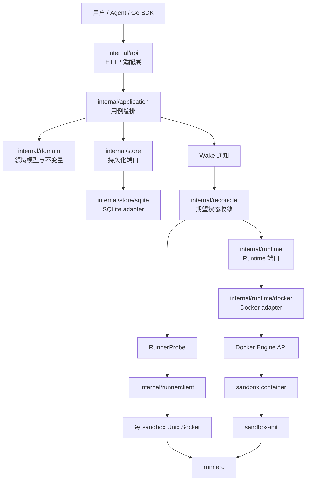
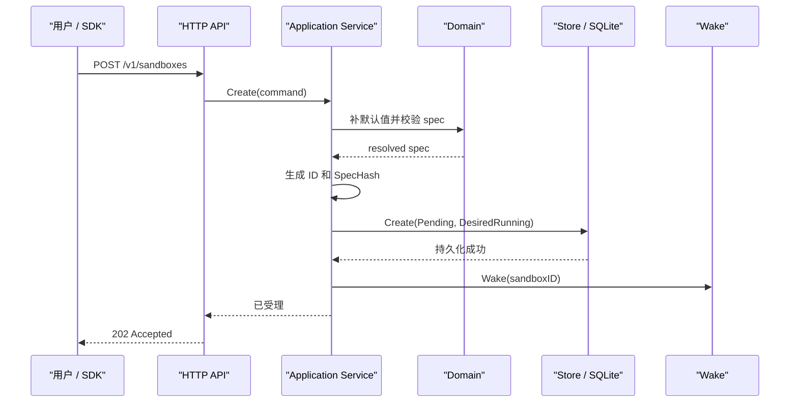

# MiniSandbox 术语、模块与架构关系指南

本文面向第一次接触 MiniSandbox、Docker 或分层架构的读者。读完后，你应该能够回答：

- MiniSandbox 想解决什么问题；
- sandbox、container、runner、runtime、Engine、workspace 分别是什么；
- 谁运行在宿主机，谁运行在容器内；
- 谁包含谁、谁管理谁、谁调用谁；
- 一次创建、启动、探测和删除经过哪些模块；
- 修改某类功能时应该进入哪个目录；
- 当前仓库已经实现到哪里，哪些代码仍是后续任务。

本文解释代码结构与概念关系。更严格的安全约束和设计决策，以
[全 Go Agent Sandbox Runtime 设计](all-go-agent-sandbox-runtime-design.md)
和 [Phase 1 开发计划](phase-1-docker-lifecycle-development-plan.md) 为准。

## 1. 先用一句话理解项目

MiniSandbox 是一个用 Go 编写的 Agent sandbox runtime。

它在宿主机上运行一个控制面进程 `sandboxd`，通过 Docker Engine 为每个逻辑
sandbox 创建一个独立容器，并在容器里运行 `sandbox-init` 和 `runnerd`。将来
AI Agent 的命令只由容器内的 `runnerd` 执行，不由宿主机上的 `sandboxd`
直接执行。

最简化的关系是：

```text
用户或 SDK
   │
   ▼
sandboxd（宿主机控制面）
   │
   ├── SQLite：保存“希望 sandbox 变成什么状态”
   │
   └── Docker Engine：管理“sandbox 现在实际是什么状态”
          │
          ▼
      sandbox 容器
          │
          └── sandbox-init（PID 1）
                  │
                  └── runnerd（容器内数据面）
```

这里最重要的设计是：生命周期管理和命令执行不在同一个进程中。

- `sandboxd` 管理容器的创建、检查和清理，但不执行用户命令；
- `runnerd` 执行当前容器内的命令，但不能访问 Docker socket，也不能管理其他 sandbox。

## 2. 三种不同的“东西”

理解 MiniSandbox 时，可以先把系统中的对象分为三类。

### 2.1 逻辑对象

逻辑对象描述系统“认为存在什么”，主要位于 `internal/domain/`：

- `Sandbox`：一个 sandbox 的领域记录；
- `SandboxSpec`：sandbox 应使用的镜像、资源、workspace、网络和平台；
- `DesiredState`：用户希望它最终达到的状态；
- `SandboxState`：控制面最近观测并持久化的状态；
- `SpecHash`：规格的稳定摘要，用于发现资源漂移。

逻辑对象可以保存在 SQLite 中，即使 `sandboxd` 重启也不会丢失。

### 2.2 Docker 实际资源

Docker Engine 中真正存在的资源包括：

- image：创建容器使用的只读镜像；
- container：sandbox 的隔离和进程边界；
- named volume：保存 `/workspace` 数据；
- labels：附着在 container 和 volume 上的恢复元数据。

Docker 实际资源由 `internal/runtime/docker/` 管理。

### 2.3 运行中的进程和通信资源

每个正在运行的 sandbox 还会涉及：

- 宿主机上的 `sandboxd`；
- 容器 PID 1：`sandbox-init`；
- 容器内服务：`runnerd`；
- 宿主机 runtime directory；
- 每个 sandbox 独立的 Unix Socket；
- Phase 2 开始由 runner 管理的 execution 进程。

逻辑对象、Docker 资源和进程不是同一个概念。一个 SQLite `Sandbox` 记录可能存在，
但对应 container 仍在创建、已经丢失，或者正在等待清理。reconcile 的作用就是处理
这种差异。

## 3. 整体包含关系

### 3.1 从系统到单个 sandbox

```text
一套 MiniSandbox 服务
├── 一个 sandboxd 进程
│   ├── HTTP API
│   ├── application services
│   ├── Store / SQLite
│   ├── Reconciler
│   ├── Docker Runtime adapter
│   └── RunnerClient / RunnerProbe
│
├── 一个 Docker Engine（也可能管理其他非 MiniSandbox 资源）
│   ├── image A
│   ├── image B
│   ├── sandbox container 1
│   ├── sandbox container 2
│   ├── workspace volume 1
│   └── workspace volume 2
│
└── 多个逻辑 Sandbox
    ├── Sandbox 1
    │   ├── 一条 Store 记录
    │   ├── 一个受管 container
    │   ├── 一个 workspace named volume
    │   ├── 一个宿主机 runtime directory
    │   ├── 一个 Unix Socket
    │   └── container 内的一组进程
    │       └── sandbox-init
    │           └── runnerd
    │               └── executions（Phase 2）
    └── Sandbox 2
        └── 同样的一套独立资源
```

通常可以记住“一对一”规则：

| 逻辑 sandbox 对应的对象 | 数量 | 说明 |
|---|---:|---|
| Store 记录 | 1 | 保存期望状态、观测状态、规格和 revision |
| Docker container | 1 | 提供隔离边界 |
| workspace named volume | 1 | 挂载到容器 `/workspace` |
| runtime directory | 1 | 保存当前 sandbox 的通信文件 |
| runner Unix Socket | 1 | `sandboxd` 与当前 `runnerd` 通信 |
| `sandbox-init` | 1 | 容器 PID 1 |
| `runnerd` | 1 | 当前 sandbox 的数据面服务 |
| execution | 0 到多个 | Phase 2 中由 runner 创建和管理 |

### 3.2 调用关系



箭头表示“调用或依赖”，不表示代码目录包含关系。

## 4. 核心术语详解

### 4.1 Sandbox

Sandbox 是 MiniSandbox 对外提供的核心逻辑资源。

它不是单纯的 Docker container，而是一组被控制面共同管理的对象：

```text
Sandbox
= 领域记录
+ resolved spec
+ 期望状态与观测状态
+ Docker container
+ workspace volume
+ runtime directory
+ runner socket
+ container 内的 init/runner 进程
```

为什么不直接把 container 叫 sandbox？

因为 container 只是 sandbox 的一个实现资源。即使 container 暂时不存在，Store 中的
sandbox 创建意图仍可能存在，reconciler 可以重新创建它。未来也可以增加其他 runtime
实现，而不改变公共 sandbox 概念。

### 4.2 SandboxSpec 与 resolved spec

`SandboxSpec` 描述一个 sandbox 应该怎样运行，包括：

- `Image`：使用哪个容器镜像；
- `Resources`：CPU、内存和 PIDs 限制；
- `Workspace`：工作目录挂载语义；
- `Network`：是否允许出站网络；
- `Platform`：操作系统和 CPU 架构。

resolved spec 表示默认值已经补齐、校验已经完成，可以稳定持久化的完整规格。

公共 API 请求和 `SandboxSpec` 不是同一个类型。API 请求允许省略部分字段，而 resolved
spec 必须完整，这样服务重启后不会因为默认值变化而改变旧 sandbox。

### 4.3 SpecHash

`SpecHash` 是 resolved spec 的 SHA-256 摘要。

container 和 volume labels 会保存这个摘要，而不是保存整个规格。reconciler 再次处理
同一 sandbox 时，会比较 Store 中的 `SpecHash` 和 Docker 资源上的 label：

- 相同：说明可以安全复用；
- 不同：说明发生 spec drift，返回 conflict；
- 缺失或格式错误：说明资源身份不可信，不能接管或删除。

### 4.4 Container

Container 是 Docker 创建的隔离运行实例。

在 MiniSandbox 中，一个 container：

- 来自用户指定或默认 image；
- 使用固定安全配置；
- 使用确定性名称 `minisandbox-<sandboxID>`；
- 带有 `minisandbox.io/*` labels；
- 挂载 workspace named volume；
- bind mount 当前 sandbox 的 runtime directory；
- 不发布 TCP 端口；
- 不挂载 Docker socket；
- 固定由 `sandbox-init` 启动 `runnerd`。

container 包含进程和挂载，但不包含 Store 记录。Store 属于宿主机控制面。

### 4.5 Image

Image 是创建 container 的只读模板，例如 `debian:bookworm-slim`。

image 和 container 的区别类似：

```text
image     = 模板
container = 由模板创建出来的运行实例
```

`internal/runtime/docker/image.go` 负责：

- 校验 image reference；
- inspect 本地镜像；
- 仅在 NotFound 时 pull；
- 完整消费并关闭 pull stream；
- 校验平台必须是 `linux/amd64`。

MiniSandbox 注入自己的 `sandbox-init` 和 `runnerd`，因此用户 image 不需要预装这两个程序。

### 4.6 Workspace

Workspace 是 Agent 代码和文件使用的工作目录。

Phase 1 使用 Docker named volume：

```text
宿主机 Docker volume:
minisandbox-workspace-<sandboxID>
            │
            ▼
容器内:
/workspace
```

为什么使用 named volume，而不是把任意宿主机目录直接 bind mount 进去？

- 避免用户选择宿主机路径；
- 避免意外暴露宿主机文件；
- 名称可以由 sandbox ID 确定性计算；
- 可以通过 labels 验证资源身份；
- 删除流程可以精确控制。

Workspace 不等于 runtime directory。Workspace 保存用户工作数据；runtime directory
只保存控制面与 runner 的通信 socket。

### 4.7 Runtime directory

每个 sandbox 在宿主机上有一个独立目录：

```text
<dataDirectory>/run/<sandboxID>/
└── runner.sock
```

该目录：

- mode 收敛为 `0700`；
- 由 `sandboxd` 计算，API 用户不能指定；
- bind mount 到容器 `/run/minisandbox`；
- 删除时只允许删除精确的 sandbox ID 子目录；
- 不能是 symlink。

runtime directory 中的“runtime”表示运行期通信文件，不是 `Runtime` 接口。二者只是名称
相似。

### 4.8 Unix Socket

Unix Socket 是同一宿主机上进程间通信的一种文件形式。

MiniSandbox 不为 runner 发布 TCP 端口，而是使用：

```text
sandboxd / runnerclient
        │
        │ HTTP over Unix Socket
        ▼
<dataDirectory>/run/<id>/runner.sock
        │ bind mount
        ▼
/run/minisandbox/runner.sock
        │
        ▼
runnerd
```

HTTP 仍然是应用协议，只是底层连接不是 TCP，而是 Unix Socket。

每个 sandbox 使用不同 socket，因此一个 runnerclient 不应该获得其他 sandbox 的路径。
`RunnerProbe` 只接受 sandbox ID，并固定请求 `/healthz`。

### 4.9 Runner 与 runnerd

Runner 是“在 sandbox 内执行任务的数据面角色”；`runnerd` 是承担这个角色的 Go 进程。

`runnerd`：

- 运行在 sandbox container 内；
- 只监听当前 sandbox 的 Unix Socket；
- 提供 `/healthz`；
- Phase 2 负责 execution、输出流、取消和超时；
- 不访问 Docker Engine；
- 不知道其他 sandbox；
- 不决定 container 的创建和删除。

可以把它理解为“容器内的受控命令执行服务”。

### 4.10 runnerclient

`internal/runnerclient/` 是 `sandboxd` 侧的内部客户端。

它和 `runnerd` 是通信双方：

```text
runnerclient（宿主机） ──HTTP/Unix Socket──> runnerd（容器内）
```

runnerclient 负责：

- 构造固定内部请求；
- 通过指定 Unix Socket 建立 HTTP 连接；
- 携带内部 token；
- 探测 `/healthz`；
- 解码 SSE execution events。

它不负责 Docker container 生命周期。

### 4.11 RunnerProbe

`RunnerProbe` 是 reconciler 使用的一个小接口：

```go
Probe(ctx, sandboxID) error
```

它回答的问题只有一个：“这个 sandbox 的 runner 是否已经就绪？”

可能结果包括：

- 成功：runner `/healthz` 返回 200；
- socket missing：runner 尚未创建 socket；
- unhealthy：401、500 或其他连接故障；
- timeout：未在 runner ready timeout 内完成。

Container running 不代表 Runner ready。Docker 只知道容器主进程是否运行，不知道 runner
内部 HTTP 服务是否已经可以工作。

### 4.12 sandbox-init

`sandbox-init` 是 container 中的 PID 1。

容器内 PID 1 与普通进程不同，需要正确处理信号和孤儿进程。它的职责是：

- 启动 `runnerd`；
- 接收 container stop 带来的信号；
- 把信号转发给子进程；
- 回收孤儿进程；
- 用正确退出码结束 container。

它不提供 HTTP API，也不执行生命周期控制。

容器内进程关系是：

```text
sandbox-init（PID 1）
└── runnerd
    └── execution A（Phase 2）
        └── execution A 的子进程
```

### 4.13 Artifact

Artifact 是注入用户 image 的 MiniSandbox 静态二进制：

- `sandbox-init`；
- `runnerd`。

构建流程先生成 `linux/amd64` 静态二进制，再通过 `go:embed` 放入 `sandboxd`。
创建 container 后，Docker adapter 在内存中生成固定 tar stream，并通过 Docker Copy API
复制到：

```text
/opt/minisandbox/sandbox-init
/opt/minisandbox/runnerd
```

调用方不能修改 archive entry 或目标目录。

### 4.14 Runtime

Runtime 是控制面操作 sandbox 实际资源的抽象端口，定义在 `internal/runtime/`：

```go
type Runtime interface {
    Ensure(...)
    Inspect(...)
    Delete(...)
    ListManaged(...)
}
```

四个方法分别表示：

- `Ensure`：保证实际资源达到期望的 running 形态；
- `Inspect`：读取一个 sandbox 的实际状态；
- `Delete`：幂等清理实际资源；
- `ListManaged`：扫描全部受管资源，用于重启恢复。

Runtime 不等于 Docker Engine。Runtime 是 MiniSandbox 自己定义的业务端口；Docker
adapter 是这个端口的一种实现。

### 4.15 Docker Runtime adapter

`internal/runtime/docker/` 是 Runtime 的 Docker 实现。

它把一个高层操作：

```text
Runtime.Ensure(sandbox)
```

转换为多个 Docker 原子操作：

```text
inspect container
→ ensure runtime directory
→ inspect/pull image
→ inspect/create volume
→ inspect/create stopped container
→ copy artifacts
→ start container
→ inspect final state
```

adapter 不负责：

- HTTP 鉴权；
- 租户和配额策略；
- Store 状态更新；
- runner HTTP 协议；
- 执行宿主机 shell。

### 4.16 Engine

`Engine` 是 `internal/runtime/docker` 内部定义的窄接口，表示 Docker adapter 当前真正需要的
Docker Client 能力，例如：

- `ImageInspect`、`ImagePull`；
- `ContainerInspect`、`ContainerCreate`；
- `CopyToContainer`、`ContainerStart`；
- `ContainerStop`、`ContainerRemove`；
- `VolumeInspect`、`VolumeCreate`、`VolumeRemove`。

关系是：

```text
Runtime 接口
   ▲
   │ 实现
Docker Runtime adapter
   │
   │ 通过窄 Engine 接口调用
   ▼
Docker SDK client
   │
   ▼
Docker daemon / Docker Engine
```

为什么还要增加一层 `Engine`，不直接在所有代码中使用完整 Docker client？

- 单元测试可以使用 fake Engine，不需要真实 Docker；
- 明确 adapter 实际拥有的 daemon 能力；
- 每增加一种 Docker 操作都能在代码审查中被看见；
- 避免业务层依赖完整 Docker SDK。

### 4.17 Docker Engine

Docker Engine 是宿主机上真正管理 image、container 和 volume 的外部系统，也常称 Docker
daemon。

MiniSandbox 通过 Docker socket 调用它。只有宿主机控制面拥有这项能力：

```text
sandboxd → Docker socket → Docker Engine
runnerd  ✕ Docker socket
```

Docker Engine 可能还管理其他应用的 container 和 volume。因此 MiniSandbox 删除资源前
必须同时验证确定性名称和 labels，不能只因为名称相同就删除。

### 4.18 Labels

Labels 是写在 Docker container 和 volume 上的安全键值元数据。

当前受管 labels 包括：

- `minisandbox.io/managed`；
- `minisandbox.io/id`；
- `minisandbox.io/schema-version`；
- `minisandbox.io/spec-hash`；
- `minisandbox.io/expires-at`；
- `minisandbox.io/workspace`。

Labels 用于：

- 判断资源是否属于 MiniSandbox；
- 把 Docker 资源关联回 sandbox ID；
- 检测 spec drift；
- 支持 `sandboxd` 重启恢复；
- 删除前验证资源身份。

Labels 不能保存：

- runner token；
- 用户环境变量；
- 命令和输出；
- registry credential；
- 宿主机秘密路径。

### 4.19 Store

Store 是控制面持久化 sandbox 记录的接口，定义在 `internal/store/`。

它保存的是控制面事实，而不是 Docker 对象：

- sandbox ID；
- resolved spec；
- desired state；
- observed state；
- reason 和安全 message；
- runtime ID；
- revision；
- 创建和更新时间。

`internal/store/sqlite/` 是 Store 的 SQLite adapter。

### 4.20 Desired state 与 observed state

MiniSandbox 不要求 HTTP 请求同步完成全部 Docker 操作，而是先保存“意图”：

```text
desired state  = 用户希望最终变成什么
observed state = 控制面最近确认它现在是什么
actual state   = Runtime 此刻从 Docker 看到什么
```

例如创建刚受理时：

```text
desired  = Running
observed = Pending
actual   = Missing
```

reconcile 完成后：

```text
desired  = Running
observed = Running
actual   = Running
```

删除过程中可能是：

```text
desired  = Terminated
observed = Stopping
actual   = Running 或 Stopped
```

这三个状态不能混为一谈。

### 4.21 Reconcile 与 Reconciler

Reconcile 是“不断比较期望与实际，并执行必要操作直到二者一致”的过程。

Reconciler 位于 `internal/reconcile/`。它读取 Store，通过 Runtime 改变 Docker 实际资源，
通过 RunnerProbe 判断数据面是否就绪，最后使用 CAS 更新 Store 的 observed state。

概念流程是：

```text
读取 Store
→ 获取当前 sandbox 的 keyed lock
→ 再次读取最新 revision
→ 根据 desired state 调用 Runtime.Ensure 或 Runtime.Delete
→ 必要时调用 RunnerProbe
→ CAS 更新 observed state
→ 释放 keyed lock
```

Reconcile 必须幂等，因为：

- API 请求可能重试；
- worker 可能重复收到 wake；
- `sandboxd` 可能在任意一步崩溃；
- Docker 操作成功后，Store 更新可能失败；
- 服务重启后需要从实际状态继续。

### 4.22 Wake、WakeQueue、Scheduler 与 keyed lock

这些术语都属于 reconcile 调度，但职责不同：

- **Wake**：提示后台“某个 sandbox 可能需要尽快 reconcile”；
- **WakeQueue**：保存或合并待处理 sandbox ID 的内存通知；
- **Scheduler/Worker**：从队列取 ID，调用一次 Reconcile；
- **keyed lock**：保证同一个 sandbox ID 不被并发 reconcile；
- **周期扫描**：即使内存 wake 丢失，也能从 Store 再发现未收敛记录。

Store 才是事实源，WakeQueue 不是。进程崩溃后，内存通知可以丢失，但持久化意图不能丢失。

### 4.23 Application service

`internal/application/` 保存用例编排，例如创建、查询和删除 sandbox。

它位于 HTTP 和领域/持久化之间：

```text
HTTP handler
→ application service
→ domain + Store + Wake
```

创建用例只负责：

- 合并请求与默认值；
- 校验并生成 resolved spec；
- 生成 sandbox ID 和 spec hash；
- 写入 Store；
- 发出 Wake；
- 返回已受理结果。

它不会在 HTTP 请求线程中同步创建 Docker container。

### 4.24 API handler

`internal/api/` 是 HTTP 适配层。

handler 负责：

- decode HTTP 请求；
- 调用 application service；
- 把领域结果转换为 wire response；
- 把内部错误映射为稳定公共错误；
- 设置 request ID 等 HTTP 元数据。

handler 不应该直接调用 Docker adapter 或 SQLite adapter，也不应该包含生命周期业务规则。

### 4.25 Domain

`internal/domain/` 是核心规则层。

它定义：

- Sandbox、SandboxSpec；
- 资源限制与平台；
- desired/observed 状态；
- 领域错误；
- 状态转换和校验不变量；
- spec hash。

Domain 不依赖：

- HTTP；
- Docker SDK；
- SQLite driver；
- runner transport。

因此领域规则可以在不启动服务器、不连接 Docker 和数据库的情况下测试。

### 4.26 Protocol、wire model 与 DTO

`pkg/protocol/` 保存 HTTP/SSE 边界上传输的数据结构，也称 wire model 或 DTO。

它和 domain model 的区别是：

```text
protocol / DTO = 对外传输格式，重视字段兼容性
domain model   = 内部业务含义，重视不变量
```

不能直接把 domain 对象当 API response。二者通过显式映射转换，避免内部字段意外暴露。

### 4.27 SDK

`sdk/go/` 是用户调用 MiniSandbox 公共 HTTP API 的 Go 客户端。

调用方向是：

```text
用户程序
→ Go SDK
→ sandboxd 公共 HTTP API
→ application
```

SDK 不直接访问 Docker，也不直接连接 runner Unix Socket。

### 4.28 Execution

Execution 表示 runner 在当前 sandbox 内执行的一次命令任务。

它属于 runner 数据面，不属于 Docker container 生命周期。一个 sandbox 可以顺序或并发包含
多个 execution。

Phase 2 将进一步实现：

- argv 或 shell 请求；
- execution ID；
- stdout/stderr SSE；
- timeout 和 cancel；
- 进程组终止；
- 后台 execution。

### 4.29 SSE

SSE 是 Server-Sent Events，一种基于 HTTP 的单向事件流。

Runner 可以使用 SSE 把 execution 事件持续发送给控制面或 SDK，例如：

```text
started
stdout
stderr
exit
```

SSE 是协议流，不是进程或队列。`internal/runnerclient/stream.go` 负责解码它。

### 4.30 Control plane 与 data plane

控制面负责“管理”：

- API；
- 持久化；
- reconcile；
- Docker 生命周期；
- 状态和恢复。

数据面负责“执行”：

- 接受当前 sandbox 的内部请求；
- 创建 execution；
- 传输输出；
- 取消进程；
- 维护进程组。

在 MiniSandbox 中：

```text
control plane = sandboxd
data plane    = runnerd
```

两者通过每个 sandbox 独立的 Unix Socket 和稳定 HTTP/SSE 协议解耦。

## 5. 仓库目录与层级

### 5.1 入口层

| 目录 | 作用 |
|---|---|
| `cmd/sandboxd/` | 构建宿主机控制面进程 |
| `cmd/runnerd/` | 构建容器内 runner 数据面进程 |
| `cmd/sandbox-init/` | 构建容器 PID 1 |

`main.go` 只负责装配和启动，不应该承载业务逻辑。

### 5.2 契约层

| 目录 | 作用 |
|---|---|
| `api/` | OpenAPI 契约，公共和内部 HTTP API 的 source of truth |
| `pkg/protocol/` | Go 形式的稳定 HTTP/SSE wire model |
| `sdk/go/` | 面向用户的 Go SDK |

### 5.3 控制面分层

| 目录 | 层级 | 主要职责 |
|---|---|---|
| `internal/api/` | transport adapter | HTTP decode、middleware、错误映射 |
| `internal/application/` | use case | 创建、查询、删除等用例编排 |
| `internal/domain/` | core domain | 状态、规格、不变量、领域错误 |
| `internal/reconcile/` | lifecycle orchestration | 期望状态收敛、调度和锁 |

### 5.4 基础设施端口与 adapter

| 目录 | 类型 | 说明 |
|---|---|---|
| `internal/runtime/` | port | 容器运行时抽象 |
| `internal/runtime/docker/` | adapter | Runtime 的 Docker 实现 |
| `internal/store/` | port | 持久化抽象 |
| `internal/store/sqlite/` | adapter | Store 的 SQLite 实现 |
| `internal/runnerclient/` | adapter/client | sandboxd 到 runnerd 的内部客户端 |

Port 是上层需要的能力接口；adapter 是对具体技术的实现。

### 5.5 容器内数据面

| 目录 | 作用 |
|---|---|
| `internal/runner/` | runner HTTP 服务、鉴权、execution 管理、进程控制 |
| `internal/embedded/` | 提供嵌入 `sandboxd` 的 runner/init 构建产物 |

### 5.6 配置、测试与文档

| 目录 | 作用 |
|---|---|
| `internal/config/` | 配置模型、默认值、加载与校验 |
| `internal/datadir/` | 数据目录初始化和权限检查 |
| `internal/testutil/` | Store、Runtime 等测试 fake |
| `configs/` | 示例配置 |
| `tests/contract/` | API 与协议契约测试 |
| `tests/integration/` | 真实组件组合测试 |
| `tests/security/` | 安全边界验证 |
| `docs/` | 架构、分析与分阶段开发计划 |
| `OpenSandbox/` | 只读参考项目，不属于 MiniSandbox 提交内容 |

## 6. 依赖方向

推荐把依赖方向理解为“外层可以依赖内层，内层不知道外层”：

```text
HTTP/API
   │
   ▼
Application
   │
   ├──────────────► Store port ─────► SQLite adapter
   │
   ├──────────────► Runtime port ───► Docker adapter ───► Docker Engine
   │
   ▼
Domain
```

关键限制：

- Domain 不 import HTTP、Docker 或 SQLite；
- handler 不直接 import Docker/SQLite adapter；
- Docker adapter 不决定鉴权、租户或公共错误码；
- runner 不 import Docker SDK、Store 或控制面 service；
- protocol 不依赖 `internal/**`；
- runnerclient 只实现固定内部协议，不做任意反向代理。

## 7. 一次创建是怎样发生的

### 7.1 提交创建意图



此时返回成功只表示创建意图已经持久化，不表示 container 或 runner 已经就绪。

### 7.2 Runtime.Ensure

后台 reconcile 调用 `Runtime.Ensure`：

```text
1. 校验 sandbox spec 和 embedded artifacts
2. inspect 已有 container
3. ensure runtime directory
4. inspect 或 pull image
5. inspect 或 create workspace volume
6. inspect 或 create stopped container
7. 对所有未运行 container 重新注入 artifacts
8. start container
9. inspect 并返回 ActualSandbox
```

如果第二步发现 container 已经 running，且 labels、spec hash、workspace 都匹配，可以直接复用。

如果发现 stopped container，会重新复制 artifacts。这可以修复“container 已创建，但
`sandboxd` 在复制完成前崩溃”的中间状态。

### 7.3 Runner ready

Runtime 返回 Running 只代表 Docker container 已运行。随后 reconciler 调用
`RunnerProbe`：

```text
container Running
→ 计算当前 sandbox socket path
→ GET /healthz
→ 200 OK
→ observed state 更新为 Running
```

## 8. 一次删除是怎样发生的

公共 DELETE 请求只把 desired state 改为 Terminated，并发送 Wake。

实际清理顺序是：

```text
container
→ workspace volume
→ runtime directory
```

顺序不能颠倒：

- container 可能仍在使用 volume；
- runner 可能仍在使用 socket；
- 先删 volume 会得到 in-use；
- 先删通信目录可能让仍运行的 runner 进入异常状态。

每一步都必须幂等：

- 资源不存在视为成功；
- 名称相同但 labels 不匹配时拒绝删除；
- container 先 stop，必要时 force remove；
- volume 永远不 force 删除未验证或仍占用的资源；
- directory 只能删除精确 ID 子目录。

P1-053～P1-055 已实现三个删除原子能力；将三者编排成 `Runtime.Delete` 属于 P1-056。

## 9. 三组容易混淆的对比

### 9.1 Sandbox、container 与 runner

| 名称 | 是什么 | 管理谁 | 在哪里 |
|---|---|---|---|
| Sandbox | 逻辑资源及其全部关联对象 | container、volume、状态等 | 控制面概念 |
| Container | Docker 隔离实例 | 容器内进程和挂载 | Docker Engine |
| Runner | 容器内执行服务角色 | executions | sandbox container 内 |

关系是：Sandbox 使用一个 container；container 内运行一个 runner。

### 9.2 Runtime、Docker adapter 与 Engine

| 名称 | 是什么 |
|---|---|
| Runtime | MiniSandbox 定义的高层端口 |
| Docker Runtime adapter | Runtime 的 Docker 实现 |
| Engine interface | Docker adapter 使用的窄 Docker Client 接口 |
| Docker Engine | 宿主机上真实的 Docker daemon |

调用链：

```text
Reconciler
→ Runtime
→ Docker Runtime adapter
→ Engine interface
→ Docker SDK
→ Docker Engine
```

### 9.3 Workspace、runtime directory 与 artifact directory

| 路径或资源 | 用途 | 数据类型 |
|---|---|---|
| `/workspace` | Agent 工作文件 | Docker named volume |
| `/run/minisandbox` | runner socket | 宿主机 runtime directory 的 bind mount |
| `/opt/minisandbox` | `runnerd` 和 `sandbox-init` | Docker Copy 注入的静态二进制 |

三者用途完全不同。

## 10. 当前实现进度

本文编写时，Phase 1 已完成到 P1-055。需要区分“原子能力已实现”和“完整服务已经接线”：

### 已具备的关键能力

- 领域模型、spec 校验和 spec hash；
- SQLite Store 的主要能力；
- 创建、查询、删除 application 用例；
- Docker image inspect/pull 与平台校验；
- 确定性名称和安全 labels；
- runtime directory 创建；
- workspace volume 创建和复用；
- stopped container 创建；
- artifact tar 和 Docker Copy；
- container 启动；
- `Runtime.Inspect`；
- `Runtime.Ensure` 原子编排；
- RunnerProbe；
- container、volume 和 runtime directory 的删除原子操作。

### 尚未形成完整闭环的部分

- `Runtime.Delete` 的三步删除编排（P1-056）；
- `Runtime.ListManaged` 和重启恢复；
- reconciler 的完整状态机；
- wake queue 和 worker 的最终装配；
- `sandboxd` 对 Store、Runtime、Reconciler 的生产装配；
- Phase 2 的真实命令执行和输出流；
- 完整 Docker integration/security 验收。

因此“某个 helper 已实现”不等于“公共 API 已经可以完成完整 sandbox 生命周期”。

## 11. 新手阅读代码的推荐顺序

建议按下面顺序阅读：

1. 本文，先建立名词和关系；
2. `internal/domain/sandbox.go` 与 `sandbox_spec.go`；
3. `internal/runtime/runtime.go` 与 `types.go`；
4. `internal/store/store.go`；
5. `internal/application/sandbox_service.go`；
6. `internal/runtime/docker/naming.go` 和 `labels.go`；
7. `internal/runtime/docker/ensure.go`；
8. `internal/runtime/docker/inspect.go`、`create.go`、`workspace.go`；
9. `internal/runnerclient/probe.go`；
10. `internal/reconcile/reconciler.go`；
11. `cmd/sandboxd/`、`cmd/runnerd/`、`cmd/sandbox-init/`；
12. 总体设计文档和对应 Phase 开发计划。

阅读测试通常比只读实现更容易理解边界。比如：

- `ensure_test.go` 展示完整 Docker 调用顺序；
- `create_test.go` 展示容器安全配置；
- `workspace_delete_test.go` 展示目录删除边界；
- `probe_unix_test.go` 展示真实 Unix Socket 探测。

## 12. 修改功能时去哪里

| 想修改的内容 | 优先查看 |
|---|---|
| Sandbox 状态或规格规则 | `internal/domain/` |
| 公共 HTTP 字段或错误 | `api/`、`pkg/protocol/`、`internal/api/` |
| 创建/删除用例 | `internal/application/` |
| 期望状态收敛 | `internal/reconcile/` |
| Docker image/container/volume | `internal/runtime/docker/` |
| SQLite 持久化 | `internal/store/sqlite/` |
| runner 内部 HTTP 服务 | `internal/runner/` |
| sandboxd 到 runnerd 通信 | `internal/runnerclient/` |
| 用户 Go 客户端 | `sdk/go/` |
| 三个可执行程序装配 | `cmd/` |

跨层修改时，应保持契约、实现、测试和文档同步。

## 13. 常见误解

### “sandbox 就是 container”

不完全正确。Container 是 sandbox 的一个实际资源；sandbox 还包含 Store 记录、规格、状态、
volume、socket 和 runner。

### “Runtime 就是 runnerd”

错误。Runtime 是控制面管理 container/volume 的端口；runnerd 是容器内命令执行服务。

### “Engine 是 MiniSandbox 的主进程”

错误。Engine 指 Docker Engine 能力。MiniSandbox 主控制面进程是 `sandboxd`。

### “container Running 就表示 Agent 已经可用”

错误。还需要 RunnerProbe 确认 `/healthz`。

### “workspace 是宿主机项目目录”

错误。Phase 1 workspace 是受管 Docker named volume，用户不能指定任意宿主机路径。

### “Unix Socket 不是 HTTP”

错误。Unix Socket 是连接方式；其上仍然可以传输 HTTP 和 SSE。

### “API 创建请求会同步等到 Docker 完成”

错误。API 先持久化 desired state 并返回 202，后台 reconcile 完成实际创建。

### “删除时按名称找到资源就可以删”

错误。确定性名称和完整 labels 必须同时验证，防止删除同名非受管资源。

### “runnerd 可以调用 Docker 创建更多 sandbox”

错误。runnerd 不能访问 Docker socket，也没有其他 sandbox 的管理接口。

## 14. 最终心智模型

可以用下面这段话总结整个项目：

> MiniSandbox 把一个 Agent sandbox 表示为持久化的逻辑记录和一组受管运行时资源。
> sandboxd 接收生命周期意图，Store 保存期望状态，Reconciler 通过 Runtime 驱动
> Docker Engine 创建或清理 container、workspace 和通信目录。Container 内由
> sandbox-init 管理 runnerd，sandboxd 再通过每 sandbox 独立的 Unix Socket 调用
> runner。控制面只管理生命周期，数据面只执行当前 sandbox 的任务，二者通过稳定协议
> 解耦，并共同遵守幂等、可恢复和最小权限原则。
